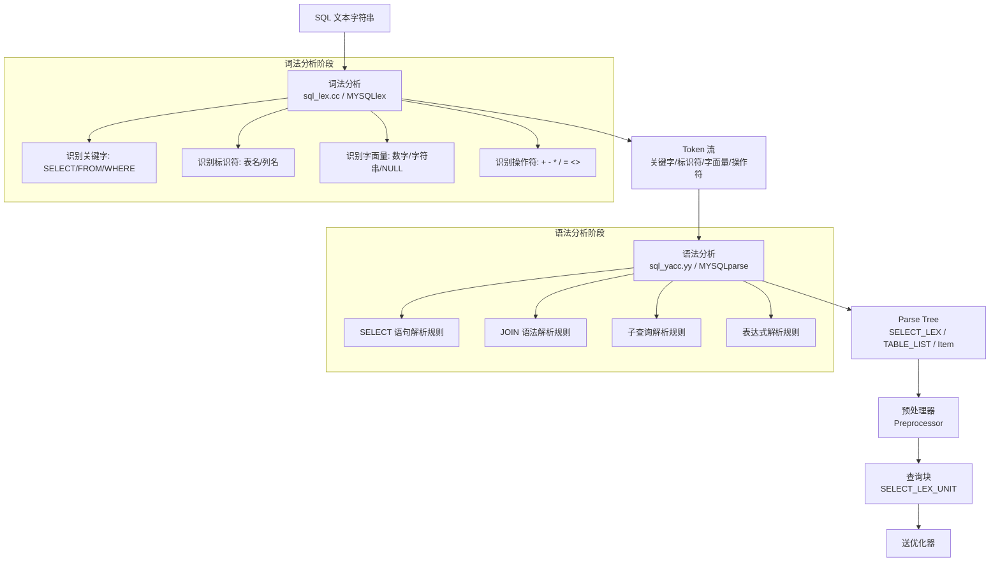
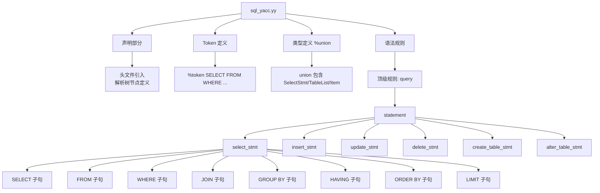
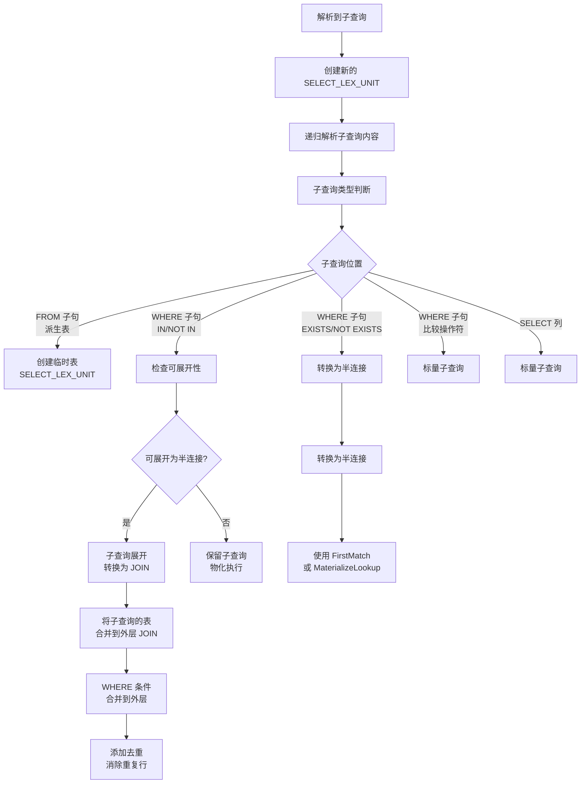
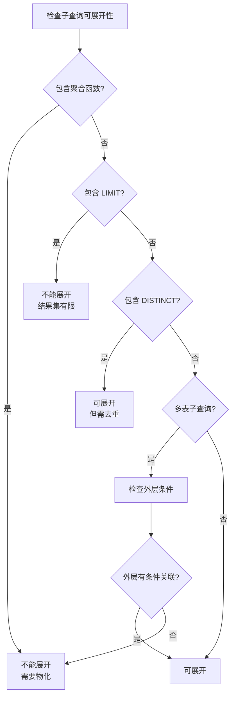
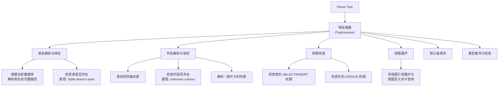
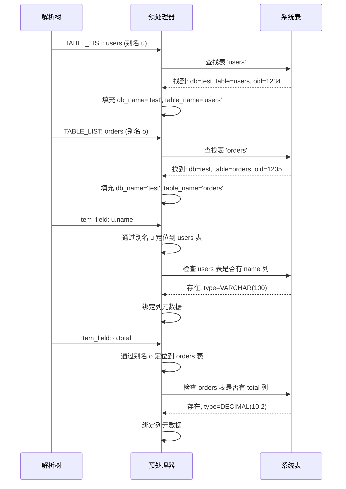
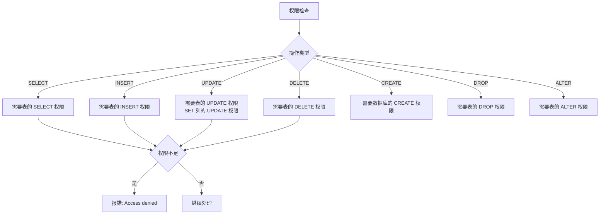
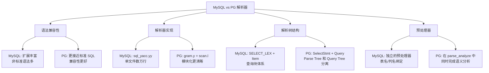

# Parser SQL 解析器

## 学习目标

- 理解 MySQL SQL 解析器的实现架构（词法分析 -> 语法分析 -> 解析树 -> 查询块）
- 掌握 sql_yacc.yy（bison）和 sql_lex.cc（flex）的工作方式
- 了解 MySQL 对标准 SQL 的扩展语法（LIMIT、ON DUPLICATE KEY UPDATE、REPLACE INTO）
- 掌握预处理器阶段的表名解析、列名绑定和权限检查

## 核心概念

- **Scanner（词法分析器）**：sql_lex.cc 实现，将 SQL 文本切分成 Token 流
- **Parser（语法分析器）**：sql_yacc.yy（bison 输入文件）构建解析树（Parse Tree）
- **Parse Tree（解析树）**：SELECT_LEX、TABLE_LIST、Item 等结构体构成的树
- **Query Block（查询块）**：SELECT_LEX_UNIT 包含多个 SELECT_LEX，处理 UNION 和子查询
- **Preprocessor（预处理器）**：解析表名、列名绑定、权限检查、视图展开
- **Item（表达式项）**：MySQL 的表达式基类，所有条件、列引用、函数调用都继承自 Item

## SQL 解析全流程



## Scanner 词法分析

MySQL 的词法分析器由 `sql_lex.cc` 实现，通过 `MYSQLlex()` 函数逐字符扫描 SQL 文本，生成 Token 流。

### Token 类型

```mermaid
graph LR
    A[MYSQLlex 词法分析器] --> B[Token 流]
    
    subgraph "Token 分类"
        C1[KEYWORD<br/>SELECT/FROM/WHERE/INSERT]
        C2[IDENTIFIER<br/>表名/列名/别名]
        C3[LITERAL<br/>数字/字符串/NULL/TRUE/FALSE]
        C4[OPERATOR<br/>+ - * / = < > <> <= >=]
        C5[PUNCTUATION<br/>; ( ) , .]
    end
    
    B --> C1
    B --> C2
    B --> C3
    B --> C4
    B --> C5
```

### 关键字识别策略

MySQL 的词法分析器采用"最长匹配 + 关键字优先"策略：

```
输入: "SELECT * FROM users WHERE id = 1"

Token 序列:
SELECT   -> KEYWORD (SELECT)
*        -> OPERATOR (MUL)
FROM     -> KEYWORD (FROM)
users    -> IDENTIFIER (表名)
WHERE    -> KEYWORD (WHERE)
id       -> IDENTIFIER (列名)
=        -> OPERATOR (EQ)
1        -> LITERAL (数字)
```

**特殊处理**：

1. **关键字可作为标识符**：MySQL 允许关键字作为表名或列名（需加反引号）
   ```sql
   -- `select` 是表名，不是关键字
   SELECT * FROM `select` WHERE `from` = 1;
   ```

2. **上下文敏感关键字**：同一个词在不同位置含义不同
   ```sql
   -- JOIN 是关键字
   SELECT * FROM t1 JOIN t2 ON t1.id = t2.id;
   -- JOIN 作为表名（需要反引号）
   SELECT * FROM `join`;
   ```

3. **解析模式切换**：解析 DDL 时切换到不同的词法规则集
   ```sql
   -- CREATE TABLE 内部的 DEFAULT、COMMENT 被识别为关键字
   CREATE TABLE t (a INT DEFAULT 0 COMMENT '字段a');
   ```

## Parser 语法分析

MySQL 的语法分析器基于 **bison**（YACC 变体），输入文件为 `sql_yacc.yy`，这是 MySQL 源码中最庞大的文件之一（数万行规则）。

### 语法规则结构



### SELECT 语句的解析规则

```
simple_select:
    SELECT_SYM select_option_list select_item_list
    into_clause from_clause where_clause
    group_clause having_clause window_clause
    order_clause limit_clause
    {
        $$ = NEW_PTN PT_select($1, $3, $5, $6, $7, $8, $9, $10, $11, $12);
    }
    ;
```

### MySQL 对 SELECT 语句的解析树结构

```mermaid
graph TD
    A[SELECT_LEX<br/>查询块] --> B[table_list: TABLE_LIST<br/>FROM 子句中的表]
    A --> C[item_list: List of Item<br/>SELECT 列列表]
    A --> D[where_cond: Item<br/>WHERE 条件]
    A --> E[join_list: List of TABLE_LIST<br/>JOIN 列表]
    A --> F[group_list: ORDER<br/>GROUP BY 子句]
    A --> G[having_cond: Item<br/>HAVING 条件]
    A --> H[order_list: ORDER<br/>ORDER BY 子句]
    A --> I[select_limit: Item<br/>LIMIT 行数]
    A --> J[offset_limit: Item<br/>OFFSET 偏移量]
    A --> K[distinct: bool<br/>是否 DISTINCT]
    A --> L[olap: enum<br/>ROLLUP/CUBE]

    B --> M[db: 数据库名]
    B --> N[table_name: 表名]
    B --> O[alias: 表别名]
    B --> P[on_expr: Item<br/>JOIN ON 条件]
    B --> Q[used_fields: 引用列集合]

    C --> R[Item_field<br/>列引用]
    C --> S[Item_func<br/>函数调用]
    C --> T[Item_sum<br/>聚合函数]
    C --> U[Item_subselect<br/>子查询]

    D --> V[Item_cond_and<br/>AND 连接]
    D --> W[Item_cond_or<br/>OR 连接]
    D --> X[Item_func_eq<br/>等值比较]
    D --> Y[Item_func_lt/gt<br/>大小比较]
```



### JOIN 语法的特殊处理

MySQL 支持多种 JOIN 语法，解析器需要统一处理：

```mermaid
flowchart TD
    A[JOIN 语法解析] --> B{JOIN 类型}
    
    B -->|INNER JOIN / JOIN / CROSS JOIN| C[TABLE_LIST<br/>join_type = INNER_JOIN]
    B -->|LEFT [OUTER] JOIN| D[TABLE_LIST<br/>join_type = LEFT_JOIN]
    B -->|RIGHT [OUTER] JOIN| E[TABLE_LIST<br/>join_type = RIGHT_JOIN]
    B -->|STRAIGHT_JOIN| F[TABLE_LIST<br/>join_type = INNER_JOIN<br/>force join order]
    B -->|NATURAL JOIN| G[自动推导 ON 条件<br/>基于同名列]
    B -->|逗号分隔表| H[隐式 INNER JOIN<br/>无 ON 条件]
    B -->|LEFT JOIN ... ON| I[ON 表达式存入<br/>on_expr 字段]

    C --> J[解析 ON/USING 条件]
    D --> J
    E --> J
    F --> J
    G --> K[自动生成等值条件]
    H --> L[等价于 WHERE 连接]
```

**MySQL 的 JOIN 解析特殊点**：

1. **STRAIGHT_JOIN**：强制左表为驱动表，不参与优化器的 Join 重排序
2. **逗号连接的优先级低于 JOIN 关键字**：`FROM t1, t2 JOIN t3 ON t2.id = t3.id` 中，t2 JOIN t3 优先组合
3. **NATURAL JOIN** 自动推导同名列的等值条件

## 子查询的解析与展开

子查询是 MySQL 解析器的关键难点，MySQL 使用**查询块（Query Block）** 和 **子查询展开（Subquery Unrolling）** 机制。

### 子查询展开的处理流程



### 子查询展开示例

```sql
-- 原始查询
SELECT * FROM users
WHERE id IN (SELECT user_id FROM orders WHERE amount > 100);

-- 展开后（转换为半连接）
SELECT users.*
FROM users
SEMI JOIN orders ON users.id = orders.user_id
WHERE orders.amount > 100;
```

### 子查询不能展开的情况



## MySQL 对 SQL 语法的扩展

MySQL 在标准 SQL 基础上做了大量扩展，解析器需要专门处理这些语法。

### LIMIT 子句

MySQL 的 LIMIT 是 MySQL 最著名的语法扩展，PG 使用 `LIMIT`（从 MySQL 借鉴），但 MySQL 支持更丰富的写法：

```sql
-- 基本语法
SELECT * FROM users LIMIT 10;
SELECT * FROM users LIMIT 10 OFFSET 20;

-- MySQL 简化语法（偏移量, 行数）
SELECT * FROM users LIMIT 20, 10;

-- 带占位符的 PREPARE
PREPARE stmt FROM 'SELECT * FROM users LIMIT ? OFFSET ?';

-- LIMIT 子查询（MySQL 8.0.21+）
SELECT * FROM users WHERE id IN (SELECT id FROM users LIMIT 5);
```

**解析器处理**：LIMIT 子句在 `sql_yacc.yy` 中单独定义规则，解析后存入 `SELECT_LEX::select_limit` 和 `SELECT_LEX::offset_limit`。

### INSERT ... ON DUPLICATE KEY UPDATE

MySQL 特有的 UPSERT 语法：

```sql
INSERT INTO users (id, name, email)
VALUES (1, 'Alice', 'alice@example.com')
ON DUPLICATE KEY UPDATE
    name = VALUES(name),
    email = VALUES(email);
```

**解析器处理**：
- 解析 `INSERT` 子句：表名、列列表、VALUES 列表
- 解析 `ON DUPLICATE KEY UPDATE` 子句：UPDATE 列和表达式
- 存储到 `Sql_cmd_insert` 结构体的 `update_list` 和 `value_list` 字段
- 执行时：尝试插入 -> 主键冲突 -> 执行 UPDATE 部分

### REPLACE INTO

MySQL 的 REPLACE 是另一种 UPSERT：

```sql
REPLACE INTO users (id, name, email)
VALUES (1, 'Bob', 'bob@example.com');
```

**解析器处理**：
- 解析语法与 INSERT 几乎相同
- 标记 `Sql_cmd_insert::duplicate_handling` 为 `DUP_REPLACE`
- 执行时：尝试插入 -> 主键冲突 -> DELETE 旧行 -> INSERT 新行（不是 UPDATE！）

### 其他 MySQL 扩展语法

```sql
-- INSERT IGNORE（忽略冲突）
INSERT IGNORE INTO users (id, name) VALUES (1, 'Alice');

-- SELECT ... FOR UPDATE（行锁）
SELECT * FROM users WHERE id = 1 FOR UPDATE;
SELECT * FROM users WHERE id = 1 LOCK IN SHARE MODE;

-- GROUP BY 扩展（允许 SELECT 列不在 GROUP BY 中）
SELECT name, age FROM users GROUP BY name;
-- 如果 sql_mode 不包含 ONLY_FULL_GROUP_BY

-- 分区表语法
CREATE TABLE t (id INT) PARTITION BY RANGE (id) (
    PARTITION p0 VALUES LESS THAN (100),
    PARTITION p1 VALUES LESS THAN (200)
);

-- 全文检索
SELECT * FROM articles WHERE MATCH(title, body) AGAINST('keyword');

-- 窗口函数（MySQL 8.0+）
SELECT *, ROW_NUMBER() OVER (PARTITION BY dept ORDER BY salary DESC) AS rn
FROM employees;
```

## 预处理器（Preprocessor）阶段

解析器生成解析树后，MySQL 进入**预处理器**阶段，这是 PostgreSQL 没有的独立阶段。

### 预处理器职责



### 表名解析过程

```sql
SELECT u.name, o.total FROM users u JOIN orders o ON u.id = o.user_id;
```

解析过程：



### 权限检查

MySQL 的权限检查在预处理器阶段进行，而不是在执行阶段：



## 与 PostgreSQL 解析器的对比



### 关键差异对比表

| 维度 | MySQL | PostgreSQL |
|------|-------|------------|
| 词法分析器 | sql_lex.cc（手写） | scan.l（flex 生成） |
| 语法分析器 | sql_yacc.yy（bison） | gram.y（bison） |
| 解析树节点 | SELECT_LEX / TABLE_LIST / Item | SelectStmt / RangeVar / Node |
| 语义分析 | 独立预处理器阶段 | parse_analyze 统一完成 |
| 子查询处理 | 查询块 + 子查询展开 | Query Tree + SubLink |
| 视图展开 | 预处理器中展开 | Rewrite 阶段展开 |
| 权限检查 | 预处理器中检查 | 执行阶段检查 |
| 标准 SQL 兼容性 | 较弱，大量扩展语法 | 较强，更接近标准 |
| 解析器文件规模 | sql_yacc.yy 数万行 | gram.y 约 2 万行 |
| 解析结果缓存 | Query Cache（已废弃） | Plan Cache |

### MySQL 解析器的特点总结

1. **语法扩展丰富**：LIMIT、ON DUPLICATE KEY UPDATE、REPLACE INTO 等 MySQL 特有的语法使解析器更复杂
2. **子查询展开**：将符合条件的 IN/EXISTS 子查询展开为半连接，显著提升性能
3. **查询块体系**：使用 SELECT_LEX_UNIT 和 SELECT_LEX 的层次结构处理 UNION 和子查询
4. **预处理器独立**：表名绑定、列名解析、权限检查在独立阶段完成，与 PG 的做法不同
5. **标准兼容性较弱**：对标准 SQL 的支持不如 PG 严格，但提供了更多灵活性

## 要点总结

- MySQL 解析器使用 **sql_lex.cc（手写词法分析器）** + **sql_yacc.yy（bison 语法分析器）**
- 词法分析阶段将 SQL 文本转换为 Token 流，支持关键字、标识符、字面量、操作符
- 语法分析阶段将 Token 流转换为 **Parse Tree**，核心结构是 SELECT_LEX、TABLE_LIST、Item
- **预处理器阶段**是 MySQL 的特色，在此完成表名绑定、列名解析、权限检查、视图展开
- **子查询展开**将符合条件的子查询转换为半连接（SEMI JOIN），避免物化子查询的开销
- MySQL 对标准 SQL 做了大量扩展（LIMIT、ON DUPLICATE KEY UPDATE、REPLACE INTO），解析器需要专门处理
- 与 PG 相比，MySQL 的语法兼容性较弱但扩展更丰富，解析器模块化不如 PG 清晰

## 思考题

1. MySQL 的 LIMIT 20, 10 语法为什么被认为是"反直觉"的设计？这种语法在解析器中如何处理？
2. ON DUPLICATE KEY UPDATE 和 REPLACE INTO 的行为差异是什么？分别适用于什么场景？
3. MySQL 的预处理器在表名解析时如何处理"多数据库"场景（如跨库 JOIN）？
4. 为什么 MySQL 选择将权限检查放在预处理器阶段，而 PG 放在执行阶段？各有什么优劣？