# Planner 查询优化器

## 学习目标

- 理解 MySQL 基于成本的优化器（CBO）的工作方式，与 PG 的穷举搜索对比
- 掌握 MySQL 的逻辑优化、基于规则的优化（RBO）和基于成本的优化（CBO）三个阶段
- 熟悉 MySQL 的单表访问方式：const、ref、range、index、ALL
- 理解 MySQL 只支持 Nested Loop Join 的历史背景和演进（8.0.18 引入 Hash Join）

## 核心概念

- **CBO（Cost-Based Optimizer）**：基于成本的优化器，根据统计信息估算执行代价
- **RBO（Rule-Based Optimizer）**：基于规则的优化器，应用固定变换规则
- **访问方式（Access Method）**：单表扫描的路径，如 const、ref、range、index、ALL
- **Nested Loop Join**：MySQL 最传统的 Join 实现方式，包含 Simple、Index、Block 三种变体
- **Hash Join**：MySQL 8.0.18 引入的 Join 方式，适用于大表等值连接
- **Join Buffer**：用于 Block Nested Loop Join 的内存缓冲区
- **统计信息**：存储在 `mysql.innodb_table_stats` 和 `mysql.innodb_index_stats` 中

## MySQL 优化器的工作流程

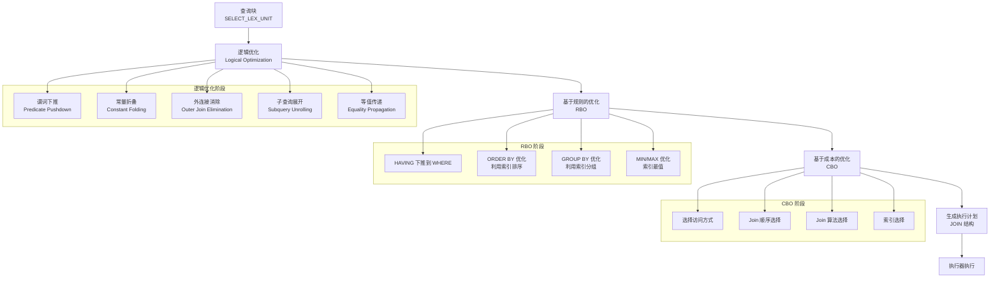

## 逻辑优化阶段

逻辑优化与具体存储引擎无关，只对查询逻辑进行等价变换。

### 谓词下推（Predicate Pushdown）

将 WHERE 条件尽可能下推到靠近数据源的位置，减少上层处理的数据量。

```sql
-- 优化前
SELECT * FROM (
    SELECT * FROM users WHERE status = 'active'
) AS active_users
WHERE active_users.age > 18;

-- 优化后
SELECT * FROM (
    SELECT * FROM users WHERE status = 'active' AND age > 18
) AS active_users;
```

### 外连接消除（Outer Join Elimination）

当 LEFT JOIN 的右表列在 WHERE 条件中被约束为非 NULL 时，LEFT JOIN 可以转换为 INNER JOIN。

```sql
-- 优化前
SELECT * FROM users u
LEFT JOIN orders o ON u.id = o.user_id
WHERE o.amount > 100;

-- 优化后
SELECT * FROM users u
INNER JOIN orders o ON u.id = o.user_id
WHERE o.amount > 100;
```

### 等值传递（Equality Propagation）

```sql
-- 优化前
SELECT * FROM t1, t2 WHERE t1.id = t2.id AND t1.id = 100;

-- 优化后
SELECT * FROM t1, t2 WHERE t1.id = 100 AND t2.id = 100;
-- 多表场景下，等值传递可以推导出 t2.id = 100，使 t2 也可以使用索引
```

## 基于规则的优化（RBO）阶段

RBO 应用固定的变换规则，不依赖统计信息。

### HAVING 下推到 WHERE

```sql
-- 优化前
SELECT name, COUNT(*) FROM users
GROUP BY name
HAVING name LIKE 'A%';

-- 优化后
SELECT name, COUNT(*) FROM users
WHERE name LIKE 'A%'
GROUP BY name;
```

### ORDER BY 优化

MySQL 会检查 ORDER BY 子句是否能利用索引来避免排序（filesort）：

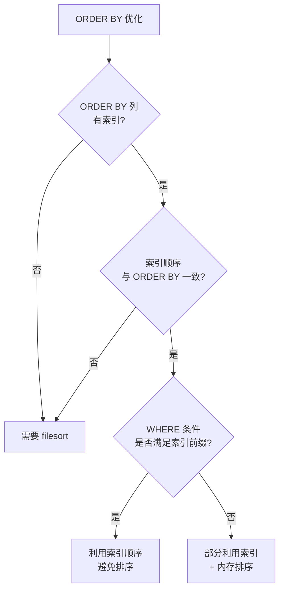

### GROUP BY 优化

MySQL 对 GROUP BY 的优化包括：

1. **利用索引进行松散索引扫描（Loose Index Scan）**：只扫描每个分组的第一行
2. **利用索引进行紧凑索引扫描（Tight Index Scan）**：扫描分组内的所有行
3. **MIN/MAX 优化**：当 GROUP BY 中使用 MIN/MAX 时，MySQL 可以利用索引直接定位最值

```sql
-- 松散索引扫描示例
-- 假设有索引 (type, created_at)
SELECT type, MAX(created_at) FROM logs GROUP BY type;
-- 扫描每个 type 的第一个叶子节点
```

## 基于成本的优化（CBO）阶段

CBO 是 MySQL 优化器的核心，它根据统计信息估算每种执行方式的代价，选择最优方案。

### 单表访问方式

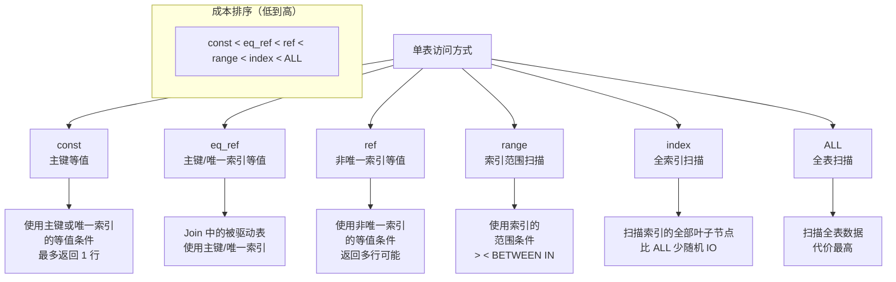

#### const

```sql
-- 主键等值查询 -> const
EXPLAIN SELECT * FROM users WHERE id = 100;
-- type: const, rows: 1

-- 唯一索引等值查询 -> const
EXPLAIN SELECT * FROM users WHERE email = 'alice@example.com';
-- type: const, rows: 1
```

#### eq_ref

```sql
-- JOIN 中被驱动表使用主键 -> eq_ref
EXPLAIN SELECT * FROM users u JOIN orders o ON u.id = o.user_id;
-- 驱动表: type=ALL, 被驱动表: type=eq_ref
```

#### ref

```sql
-- 非唯一索引等值查询 -> ref
-- 假设 idx_name 是普通索引（非唯一）
EXPLAIN SELECT * FROM users WHERE name = 'Alice';
-- type: ref, rows: 5
```

#### range

```sql
-- 索引范围查询 -> range
EXPLAIN SELECT * FROM users WHERE id > 100 AND id < 200;
EXPLAIN SELECT * FROM users WHERE id IN (1, 2, 3);
EXPLAIN SELECT * FROM users WHERE name LIKE 'A%';
-- type: range
```

#### index

```sql
-- 全索引扫描 -> index
-- 查询的所有列都在索引中
EXPLAIN SELECT id, name FROM users WHERE name IS NOT NULL;
-- type: index
```

#### ALL

```sql
-- 全表扫描 -> ALL
EXPLAIN SELECT * FROM users WHERE status = 'active';
-- 如果 status 没有索引，type: ALL
```

### 单表访问方式的成本排序

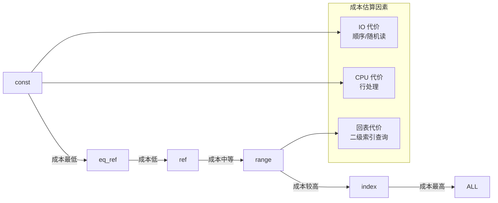

### 成本估算公式

MySQL 的成本估算公式：

```
总成本 = IO 成本 + CPU 成本

IO 成本:
  顺序读取: pages * seq_page_cost (默认 1.0)
  随机读取: pages * random_page_cost (默认 1.0)

CPU 成本:
  行扫描: rows * cpu_tuple_cost (默认 0.1)
  索引读取: index_rows * cpu_index_tuple_cost (默认 0.1)
  条件评估: rows * cpu_operator_cost (默认 0.001)
```

**注意**：MySQL 的 `random_page_cost` 默认值为 1.0（PG 默认 4.0），这是因为 MySQL 认为 SSD 已普及，随机 IO 和顺序 IO 的差距较小。

### 统计信息

MySQL 使用 `ANALYZE TABLE` 更新统计信息，存储在 InnoDB 系统表中：

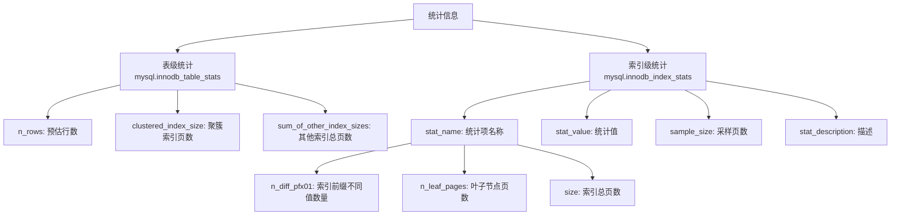

**统计信息更新方式**：

```sql
-- 手动更新统计信息
ANALYZE TABLE users;

-- 查看统计信息
SELECT * FROM mysql.innodb_table_stats WHERE database_name = 'test' AND table_name = 'users';
SELECT * FROM mysql.innodb_index_stats WHERE database_name = 'test' AND table_name = 'users';
```

**统计信息采样**：InnoDB 通过随机采样部分页面来估算统计信息，采样比例由 `innodb_stats_persistent_sample_pages` 控制（默认 20 页）。

## Join 执行

MySQL 在 Join 执行方面与 PG 有显著差异——直到 MySQL 8.0.18，MySQL 只支持 **Nested Loop Join** 及其变体。

### 三种 Nested Loop Join 的对比

```mermaid
graph TD
    A[Nested Loop Join 变体] --> B[Simple Nested Loop Join<br/>SNLJ]
    A --> C[Index Nested Loop Join<br/>INLJ]
    A --> D[Block Nested Loop Join<br/>BNLJ]
    
    B --> E[驱动表每行<br/>扫描全表内表<br/>O(N × M)]
    B --> F[内表无索引时使用<br/>性能最差]
    
    C --> G[驱动表每行<br/>利用索引查内表<br/>O(N × log M)]
    C --> H[内表有索引时使用<br/>性能最优]
    
    D --> I[驱动表批量读取<br/>到 Join Buffer<br/>内表每行匹配 Buffer]
    D --> J[内表无索引时<br/>优于 SNLJ<br/>减少内表扫描次数]
```

### Simple Nested Loop Join

```sql
-- 两表无索引时的 Join
SELECT * FROM t1, t2 WHERE t1.a = t2.b;
-- 假设 t1 有 100 行，t2 有 1000 行
-- 需要扫描 t1 100 次，每次扫描 t2 1000 行
-- 总扫描行数: 100 * 1000 = 100,000 行
```

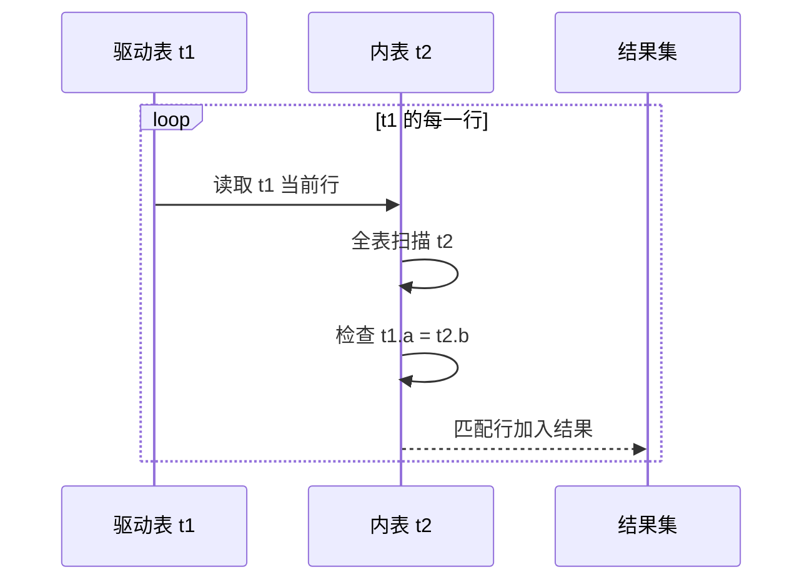

### Index Nested Loop Join

```sql
-- t2.b 有索引
SELECT * FROM t1, t2 WHERE t1.a = t2.b;
-- 假设 t1 有 100 行，t2 有 1000 行
-- 每次通过索引查找匹配行，复杂度 O(log n)
-- 总扫描行数: 100 * log(1000) ≈ 100 * 10 = 1000 行
```

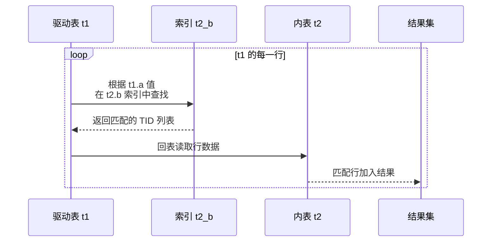

### Block Nested Loop Join

```sql
-- 内表无索引，但使用 Join Buffer
SELECT * FROM t1, t2 WHERE t1.a = t2.b;
-- Join Buffer 大小由 join_buffer_size 控制（默认 256KB）
-- 驱动表被分批读取到 Buffer 中
-- 内表每行与 Buffer 中的所有行匹配
```

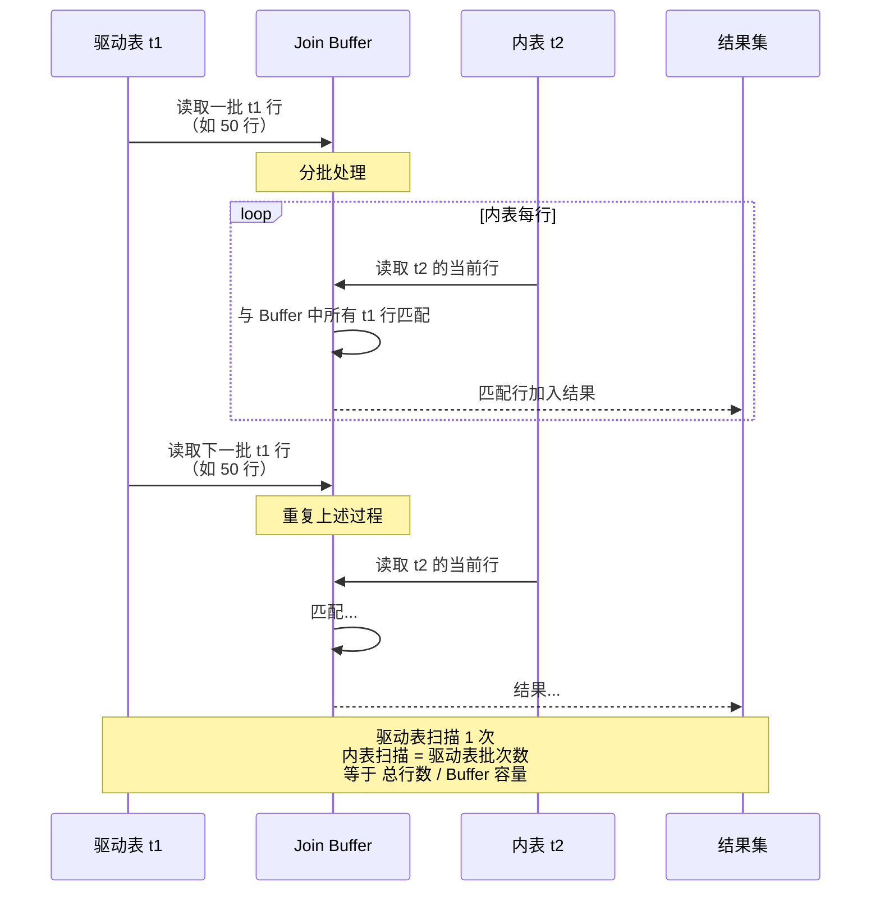

### 三种 Join 的复杂度对比

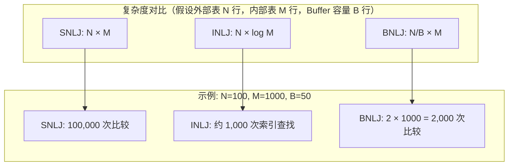

### Hash Join（MySQL 8.0.18+）

MySQL 8.0.18 开始支持 Hash Join，主要用于大表等值连接：

```sql
-- 等值连接，内表无索引
SELECT * FROM t1, t2 WHERE t1.a = t2.b;
-- MySQL 8.0.18+ 使用 Hash Join
-- 构建阶段: 内表构建哈希表（选择较小表作为内表）
-- 探测阶段: 外表探测哈希表
```

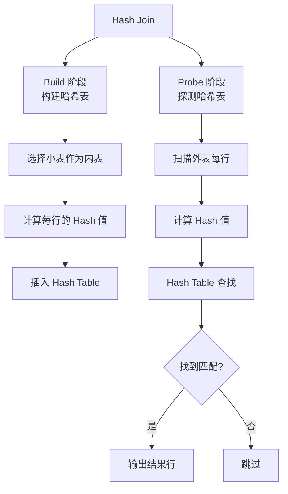

**Hash Join 与 BNLJ 的关系**：MySQL 8.0.18+ 中，Hash Join 替代了 BNLJ 的大部分场景。BNLJ 主要用于内表无索引且无法使用 Hash Join 的情况（如非等值连接）。

## 索引选择

MySQL 优化器根据统计信息选择索引，但有时也会选错。这时可以通过优化器提示干预。

### 索引选择流程

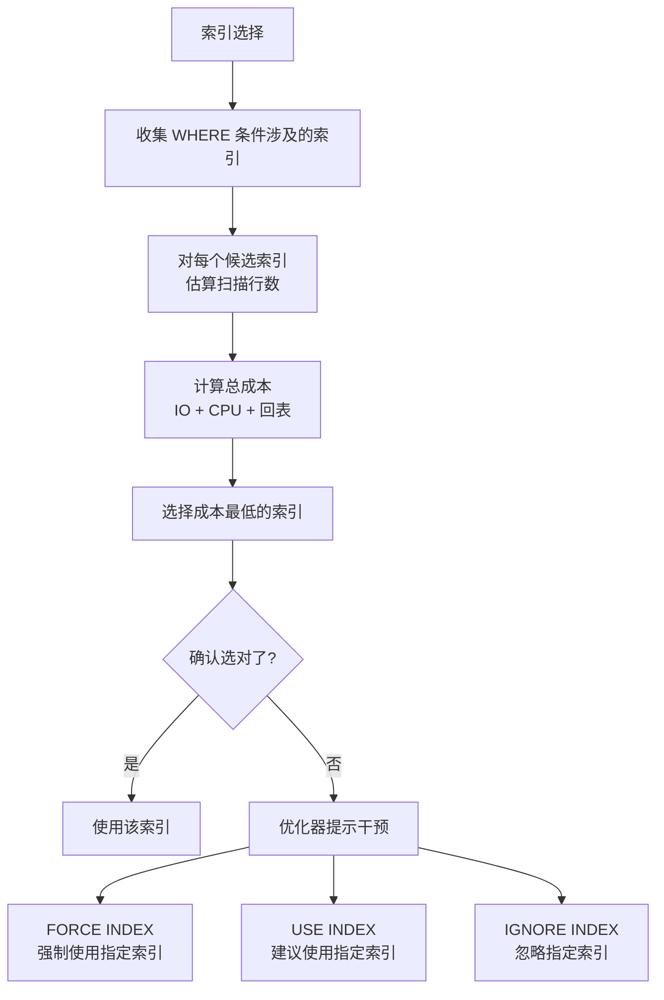

### 索引选择错误的场景

```sql
-- 场景：复合索引的前缀列选择性低
-- 索引: idx_status_created (status, created_at)
-- 查询: SELECT * FROM orders WHERE status = 'pending' AND created_at > '2024-01-01';

-- 如果 status = 'pending' 的行数占比很大（如 80%）
-- 优化器可能认为全表扫描比索引扫描更优
-- 因为通过二级索引回表需要大量随机 IO
```

### 优化器提示

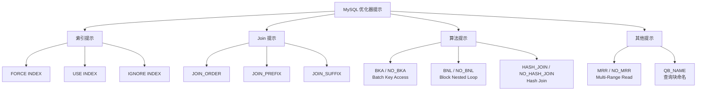

**索引提示示例**：

```sql
-- FORCE INDEX: 强制使用指定索引
EXPLAIN SELECT * FROM orders FORCE INDEX (idx_status_created)
WHERE status = 'pending' AND created_at > '2024-01-01';

-- USE INDEX: 建议使用，但优化器可能不采纳
EXPLAIN SELECT * FROM orders USE INDEX (idx_status_created)
WHERE status = 'pending' AND created_at > '2024-01-01';

-- IGNORE INDEX: 忽略指定索引
EXPLAIN SELECT * FROM orders IGNORE INDEX (idx_status_created)
WHERE status = 'pending' AND created_at > '2024-01-01';
```

**注释式提示（MySQL 8.0+）**：

```sql
-- 索引提示
SELECT /*+ INDEX(orders idx_status_created) */ *
FROM orders WHERE status = 'pending' AND created_at > '2024-01-01';

-- Join 顺序提示
SELECT /*+ JOIN_ORDER(o, u) */ *
FROM orders o JOIN users u ON o.user_id = u.id;

-- 禁用 Hash Join
SELECT /*+ NO_HASH_JOIN(o, u) */ *
FROM orders o JOIN users u ON o.user_id = u.id;

-- 启用 BKA
SELECT /*+ BKA(u) */ *
FROM orders o JOIN users u ON o.user_id = u.id;
```

## 执行计划查看

使用 `EXPLAIN` 和 `EXPLAIN ANALYZE` 查看优化器的决策结果：

```sql
-- 传统 EXPLAIN
EXPLAIN SELECT * FROM users u JOIN orders o ON u.id = o.user_id\G
*************************** 1. row ***************************
           id: 1
  select_type: SIMPLE
        table: u
         type: ALL
possible_keys: PRIMARY
          key: NULL
      key_len: NULL
          ref: NULL
         rows: 1000
     filtered: 100.00
        Extra: NULL
*************************** 2. row ***************************
           id: 1
  select_type: SIMPLE
        table: o
         type: ref
possible_keys: idx_user_id
          key: idx_user_id
      key_len: 4
          ref: test.u.id
         rows: 5
     filtered: 100.00
        Extra: NULL

-- EXPLAIN ANALYZE（MySQL 8.0.18+）
EXPLAIN ANALYZE SELECT * FROM users u JOIN orders o ON u.id = o.user_id;
```

### EXPLAIN 输出字段含义

| 字段 | 说明 | 常见值 |
|------|------|--------|
| id | 查询块的序号 | 1, 2, 3 |
| select_type | 查询类型 | SIMPLE, PRIMARY, SUBQUERY, DERIVED |
| table | 表名 | 表名或别名 |
| type | 访问方式 | const, eq_ref, ref, range, index, ALL |
| possible_keys | 可能使用的索引 | 索引名列表 |
| key | 实际使用的索引 | 索引名 |
| key_len | 使用的索引长度 | 字节数 |
| ref | 与索引比较的列 | 常量或列名 |
| rows | 预估扫描行数 | 数字 |
| filtered | 过滤后的行占比 | 百分比 |
| Extra | 额外信息 | Using index, Using filesort, Using temporary |

## MySQL 与 PG 优化器对比

| 维度 | MySQL | PostgreSQL |
|------|-------|------------|
| 优化器类型 | CBO（搜索空间有限） | CBO（穷举所有路径） |
| Join 算法 | NLJ 系列 + Hash Join (8.0.18+) | NLJ + Hash Join + Merge Join |
| 多表 Join 优化 | 贪心搜索（有限组合） | 动态规划 + GEQO |
| 子查询处理 | 子查询展开 + 物化 | SubPlan + InitPlan |
| 并行查询 | 8.0.17+ 支持（有限） | 9.6+ 支持（丰富） |
| 统计信息 | 采样估算 | 全量统计 |
| 优化器提示 | 原生支持（Hint 语法） | 需扩展 pg_hint_plan |
| 查询重写 | 有限的规则重写 | 丰富的规则重写 |

## 要点总结

- MySQL 优化器分三个阶段：**逻辑优化 -> RBO -> CBO**
- 单表访问方式按成本排序：**const < eq_ref < ref < range < index < ALL**
- MySQL 历史上只支持 **Nested Loop Join** 三种变体（SNLJ、INLJ、BNLJ），8.0.18 引入 **Hash Join**
- **Join Buffer** 减少 BNLJ 中内表的扫描次数，大小由 `join_buffer_size` 控制
- 索引选择基于统计信息，但可能选错，可通过 **FORCE INDEX / USE INDEX / 优化器提示** 干预
- 统计信息存储在 `mysql.innodb_table_stats` 和 `mysql.innodb_index_stats`，通过 `ANALYZE TABLE` 更新
- MySQL 优化器的搜索空间比 PG 小，不采用穷举策略，而是**贪心算法**选择 Join 顺序

## 思考题

1. MySQL 为什么长期只支持 Nested Loop Join？引入 Hash Join 对哪些场景有显著改善？
2. Join Buffer 的大小 `join_buffer_size` 设置过大或过小各有什么影响？如何选择合适的大小？
3. 优化器选择错误的索引时，应该优先使用 FORCE INDEX 修复还是通过调整统计信息解决？为什么？
4. MySQL 的贪心 Join 优化与 PG 的动态规划相比，在什么情况下会产生次优计划？