# B+Tree 索引

## 学习目标

- 理解 InnoDB B+Tree 索引的完整结构，包括聚簇索引和二级索引的差异
- 掌握聚簇索引的物理存储方式（叶子节点存储完整行数据）
- 理解二级索引的回表过程和覆盖索引的优化原理
- 熟悉 B+Tree 的 Page Split 和 Page Merge 机制
- 掌握索引组织表（IOT）与 Heap 表的本质区别

## 核心概念

- **聚簇索引（Clustered Index）**：主键就是聚簇索引，叶子节点存储完整行数据
- **二级索引（Secondary Index）**：叶子节点存储索引列值 + 主键值，需要回表
- **覆盖索引（Covering Index）**：索引包含查询所需的所有列，无需回表
- **Page Split**：插入导致页面满时分裂为两个页面
- **Page Merge**：删除导致页面利用率过低时与兄弟页面合并
- **索引组织表（Index Organized Table）**：InnoDB 的表就是聚簇索引，数据按主键排序

## 聚簇索引 B+Tree 结构

InnoDB 使用 B+Tree 作为索引结构，**数据即索引**——表数据存储在聚簇索引的叶子节点中。

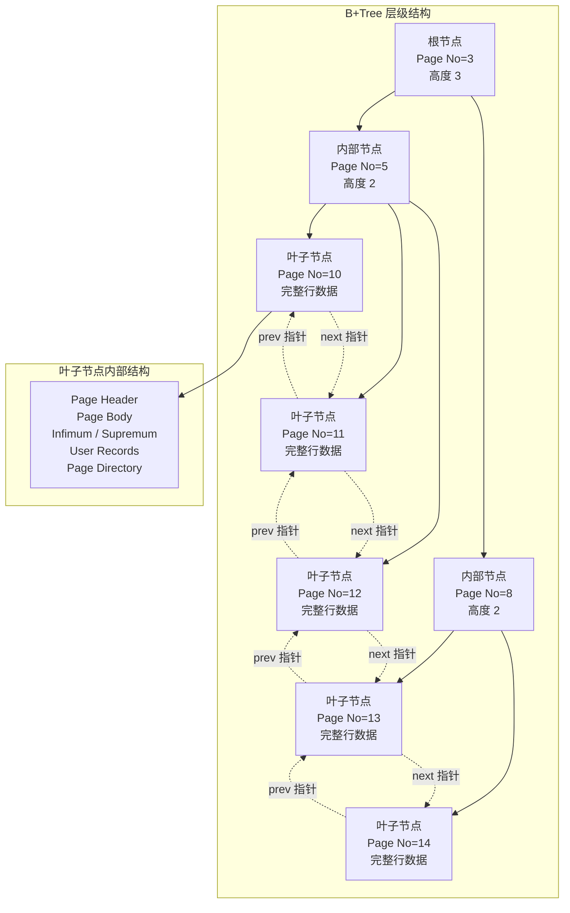

### 叶子节点页面结构

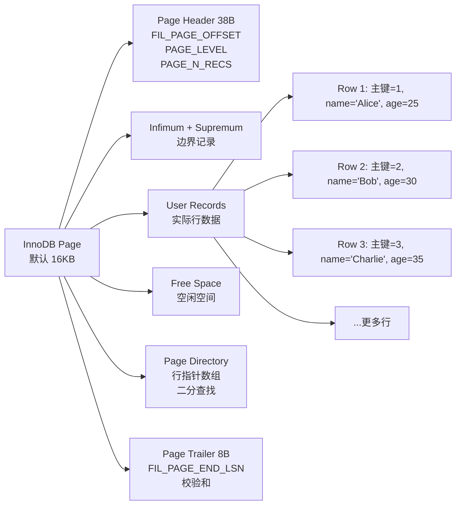

### 聚簇索引的存储特点

1. **数据即索引**：表数据就是聚簇索引的叶子节点，不需要独立的 Heap 区域
2. **按主键排序**：行数据按主键顺序存储在叶子节点中，形成双向链表
3. **主键查找快**：B+Tree 查找主键值，一次定位到行数据
4. **插入顺序影响**：按主键顺序插入最高效，随机插入可能导致频繁 Page Split

```sql
-- 主键查找：B+Tree 路径
SELECT * FROM users WHERE id = 100;
-- 1. 从根节点开始
-- 2. 比较 100 与内部节点中的分隔键
-- 3. 进入对应的子节点
-- 4. 到达叶子节点，读取行数据
-- 典型高度: 2-4 层
```

## 没有主键时 InnoDB 的处理

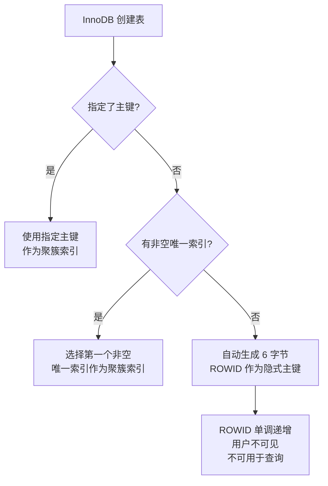

## 二级索引的回表过程

二级索引的叶子节点存储的是**索引列值 + 主键值**，而不是行数据的直接指针。查询时需要先通过二级索引找到主键，再通过主键回表查找聚簇索引。

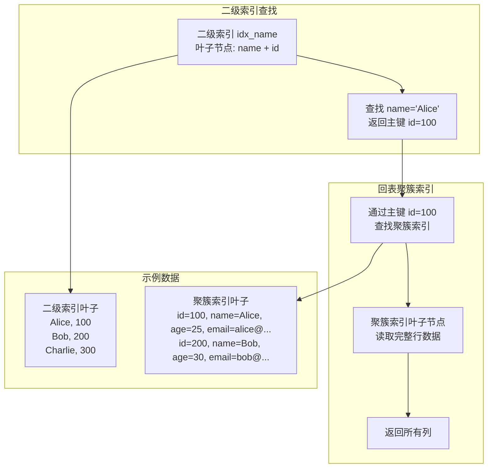

### 回表路径分解

```sql
-- 查询: 通过 name 索引查找用户
SELECT * FROM users WHERE name = 'Alice';
-- 假设: 主键 id, 二级索引 idx_name(name)

-- 步骤 1: 二级索引查找
-- idx_name 的 B+Tree 查找 'Alice'
-- 叶子节点返回: ('Alice', 100)

-- 步骤 2: 回表
-- 通过主键 100 查找聚簇索引
-- 聚簇索引 B+Tree 查找 100
-- 叶子节点返回完整行: (100, 'Alice', 25, 'alice@example.com')

-- 步骤 3: 返回结果
-- id=100, name='Alice', age=25, email='alice@example.com'
```

### 二级索引回表的代价

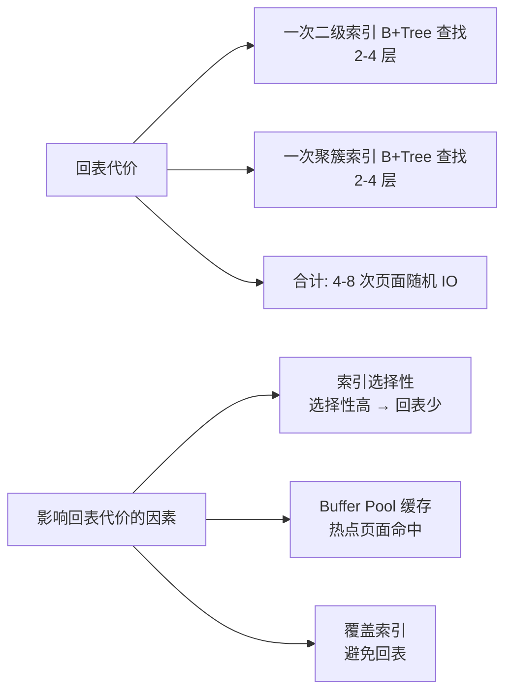

## 覆盖索引（Covering Index）

当索引包含查询所需的所有列时，无需回表，这就是覆盖索引。

### 覆盖索引 vs 非覆盖索引的查询路径对比

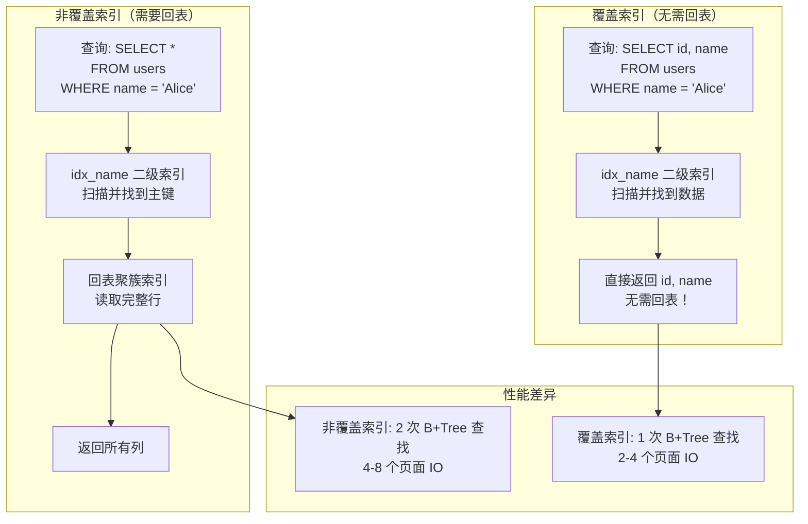

### 覆盖索引设计

```sql
-- 常见查询模式
SELECT id, name, status FROM users WHERE status = 'active';

-- 创建覆盖索引
CREATE INDEX idx_status_covering ON users(status, name, id);
-- 或更简洁的
CREATE INDEX idx_status_covering ON users(status, name);

-- 查询时 Extra 显示: Using index（表示覆盖索引）
EXPLAIN SELECT id, name FROM users WHERE status = 'active'\G
-- Extra: Using index
```

## B+Tree 结构细节

### 非叶子节点结构

非叶子节点只存储**键值 + 子节点 Page No**，不存储行数据，因此一个页面可以容纳大量键值，使 B+Tree 保持低高度。

```mermaid
graph TD
    A[内部节点 Page<br/>16KB] --> B[键值 1 → 子节点 Page No=5]
    A --> C[键值 2 → 子节点 Page No=8]
    A --> D[键值 3 → 子节点 Page No=12]
    A --> E[键值 4 → 子节点 Page No=15]
    A --> F[...更多键值对]

    G[一个 16KB 页面<br/>可存储约 1000 个键值对] --> H[B+Tree 高度公式]
    H --> I[高度 = log_1000(行数)]

    J[行数估算] --> K[100 万行: 高度 = 2<br/>1000 万行: 高度 = 3<br/>10 亿行: 高度 = 4]
```

### 叶子节点双向链表

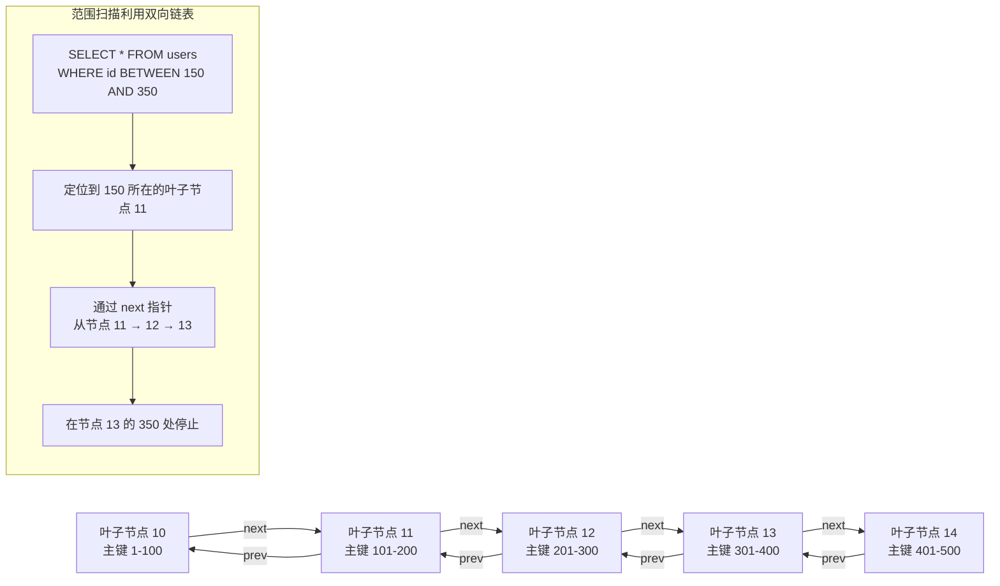

## Page Split

当插入导致页面满时，InnoDB 触发 Page Split，将页面分裂为两个，并把分隔键提升到父节点。

### Page Split 流程

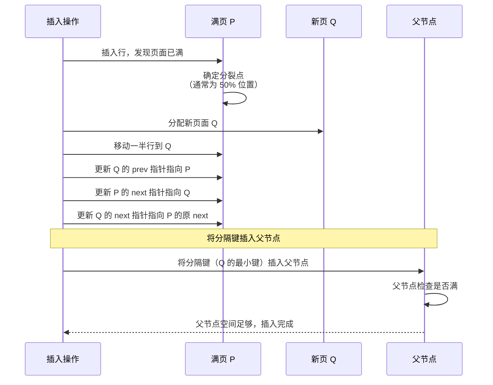

### Page Split 前后状态

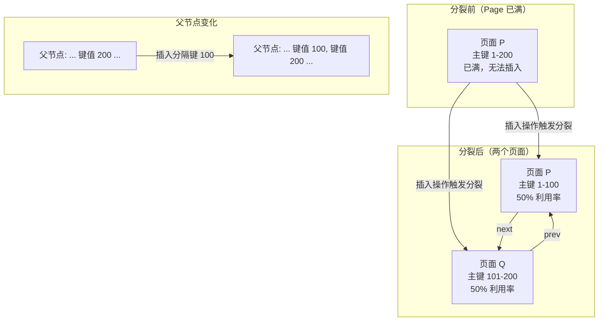

## Page Merge

当页面的利用率低于 50%（通常由大量删除操作引起）时，InnoDB 会尝试与相邻页面合并。

### Page Merge 流程

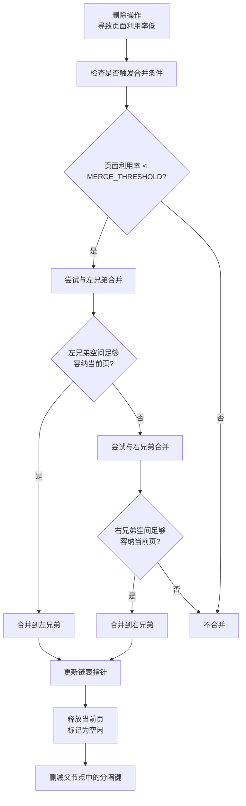

**MERGE_THRESHOLD**：MySQL 8.0 引入，通过 `INDEX_MERGE_THRESHOLD` 参数控制（默认 50%）。

## 索引组织表 vs Heap 表

InnoDB 是**索引组织表（Index Organized Table, IOT）**，数据按主键顺序存储在聚簇索引中。这与 PostgreSQL 的 Heap 表有本质区别。

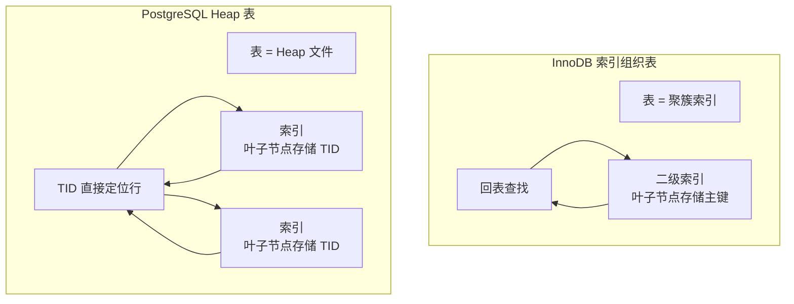

### 对比表

| 维度 | InnoDB 索引组织表 | PostgreSQL Heap 表 |
|------|------------------|-------------------|
| 数据存储 | 聚簇索引叶子节点 | Heap 文件（独立堆） |
| 主键索引 | 聚簇索引（存完整行） | B+Tree（存 TID） |
| 二级索引 | 存主键值，需回表 | 存 TID，直接定位 |
| 行顺序 | 按主键排序 | 无序（插入顺序或空位） |
| 主键变更 | 代价极高（重写整行） | 代价低（更新索引项） |
| 空间利用率 | 高（无独立 Heap） | 中（有 Heap 元组头） |
| 范围扫描 | 主键范围扫描极快 | 需要索引扫描 + 回表 |
| 插入性能 | 主键顺序插入快，随机插入慢 | 插入位置无关 |

### 索引组织表的优势

```sql
-- 1. 主键范围扫描快
SELECT * FROM users WHERE id BETWEEN 100 AND 200;
-- 定位到 100 的叶子节点，通过 next 指针遍历到 200
-- 无需回表，所有数据就在叶子节点上

-- 2. 无额外 Heap 存储
-- 表数据就是聚簇索引，不需要独立的文件存储行数据

-- 3. 聚簇索引本身就是主键索引
-- 主键查询一步到位，不需要索引 + 回表两阶段
```

### 索引组织表的劣势

```sql
-- 1. 二级索引占用空间大（包含主键值）
-- 主键越大，所有二级索引越大
-- 建议使用自增整数主键，避免 UUID 或长字符串

-- 2. 随机主键插入导致 Page Split
-- UUID 主键随机插入，频繁 Page Split
INSERT INTO users (id, name) VALUES (UUID(), 'Alice');  -- 性能差

-- 3. 主键修改代价高
UPDATE users SET id = 200 WHERE id = 100;
-- 需要删除旧行 + 插入新行 + 更新所有二级索引
```

## 主键选择建议

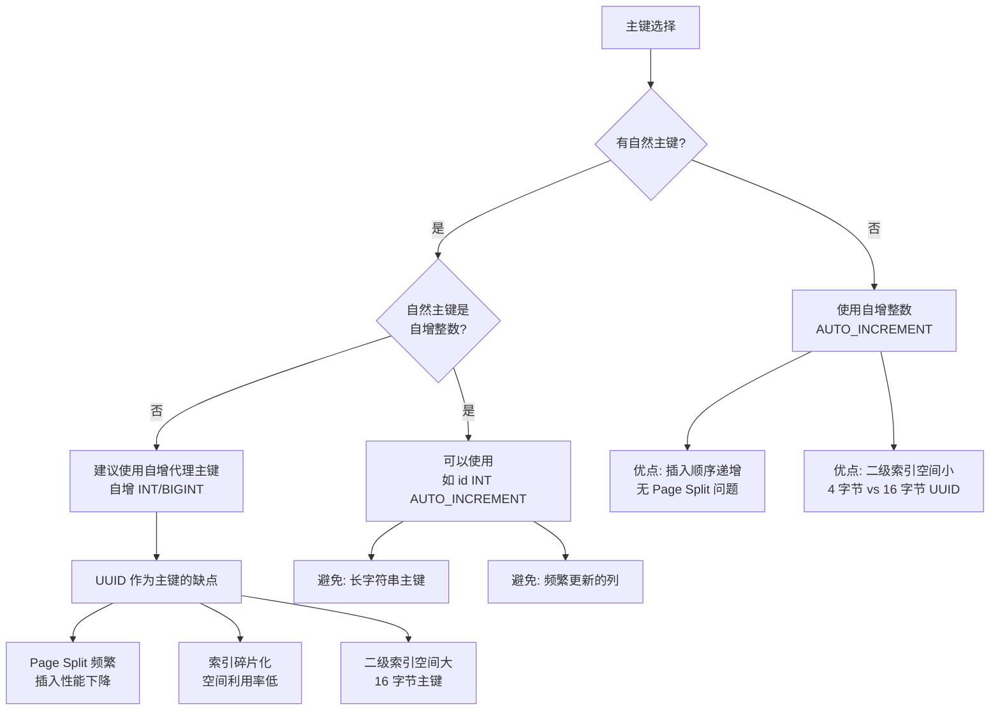

## 要点总结

- InnoDB 使用 **B+Tree**（不是 B-Tree），叶子节点形成双向链表，支持高效范围扫描
- **聚簇索引**：主键就是聚簇索引，叶子节点存储完整行数据，数据即索引
- **二级索引**：叶子节点存储索引列 + 主键值，查询需要回表（通过主键查找聚簇索引）
- **覆盖索引**：索引包含所有查询列，不需要回表，Extra 显示 `Using index`
- **Page Split**：插入导致页面满时分裂为两个页面，可能影响插入性能
- **Page Merge**：删除导致页面利用率低于 50% 时尝试合并
- **索引组织表 vs Heap 表**：InnoDB 存储行数据在聚簇索引中，PG 存储在独立的 Heap 中
- 主键建议使用 **自增整数**，避免 UUID 或长字符串

## 思考题

1. 为什么 InnoDB 选择 B+Tree 而不是 B-Tree？B+Tree 的叶子节点双向链表对范围扫描有什么意义？
2. 二级索引存储主键值（而不是行指针）的设计决策带来了什么利弊？与 PG 的 TID 方案相比哪个更好？
3. 如果一张表的主键是 UUID，插入性能会严重下降。除了使用自增整数外，还有哪些优化方案？
4. InnoDB 的 Page Split 通常是 50% 分裂，但 MySQL 8.0 引入了批量分裂优化。解释批量分裂的原理和优势。