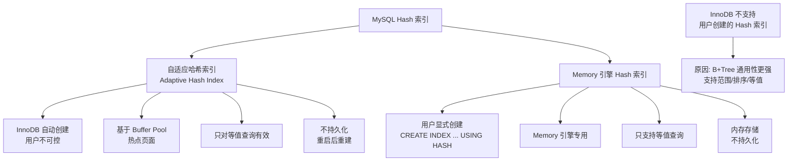
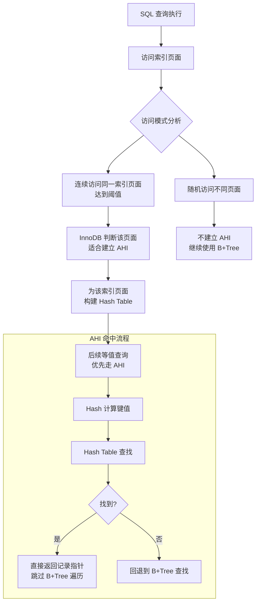
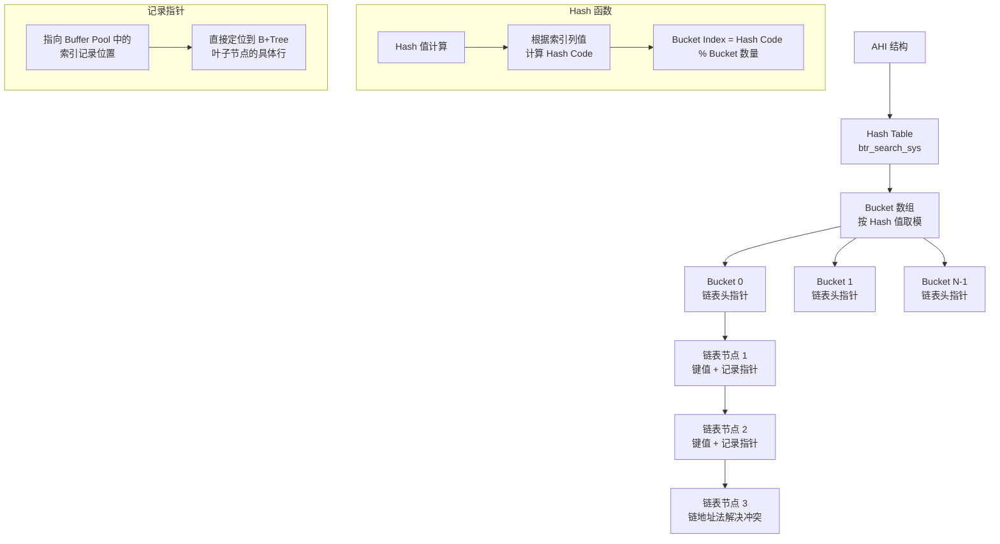
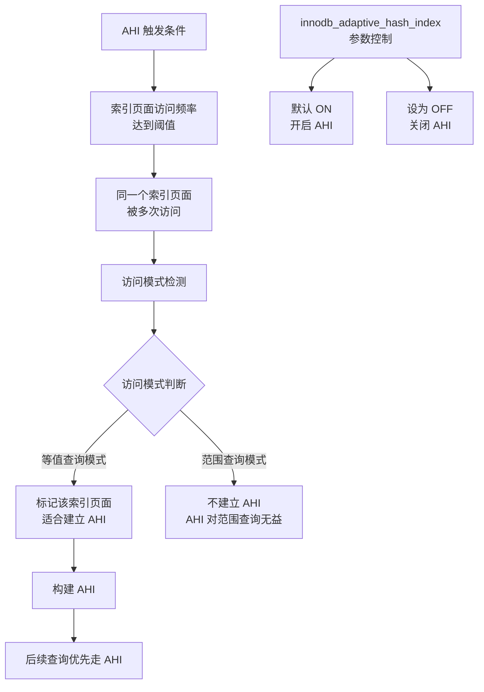
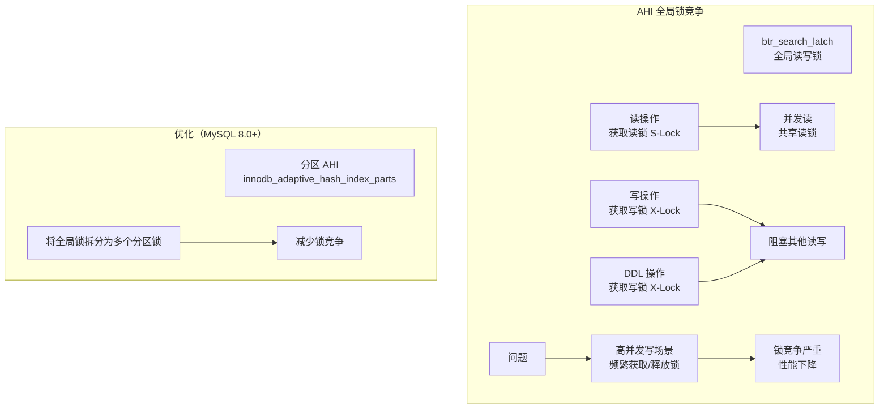
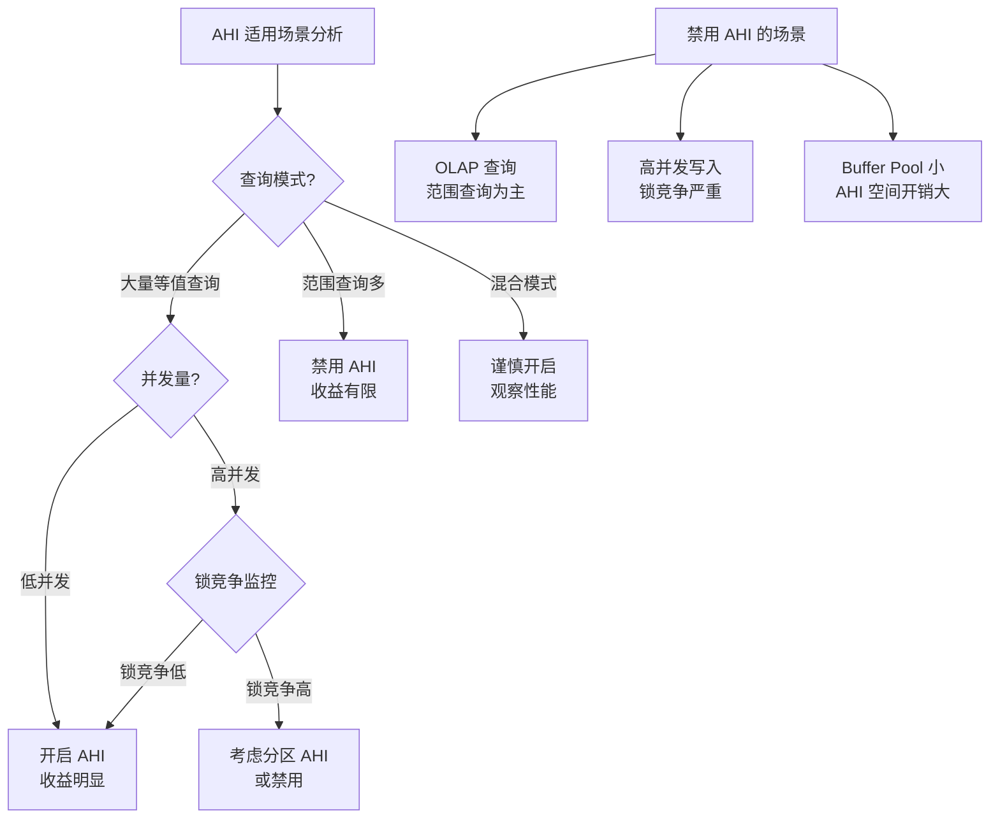
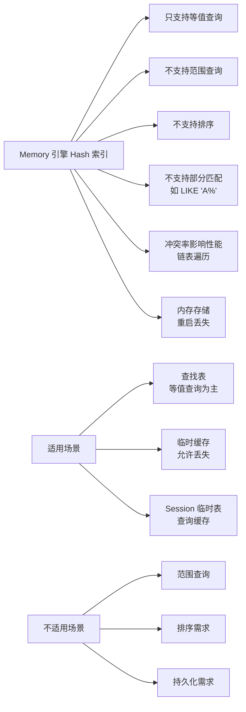
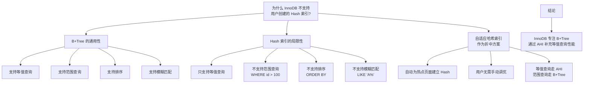
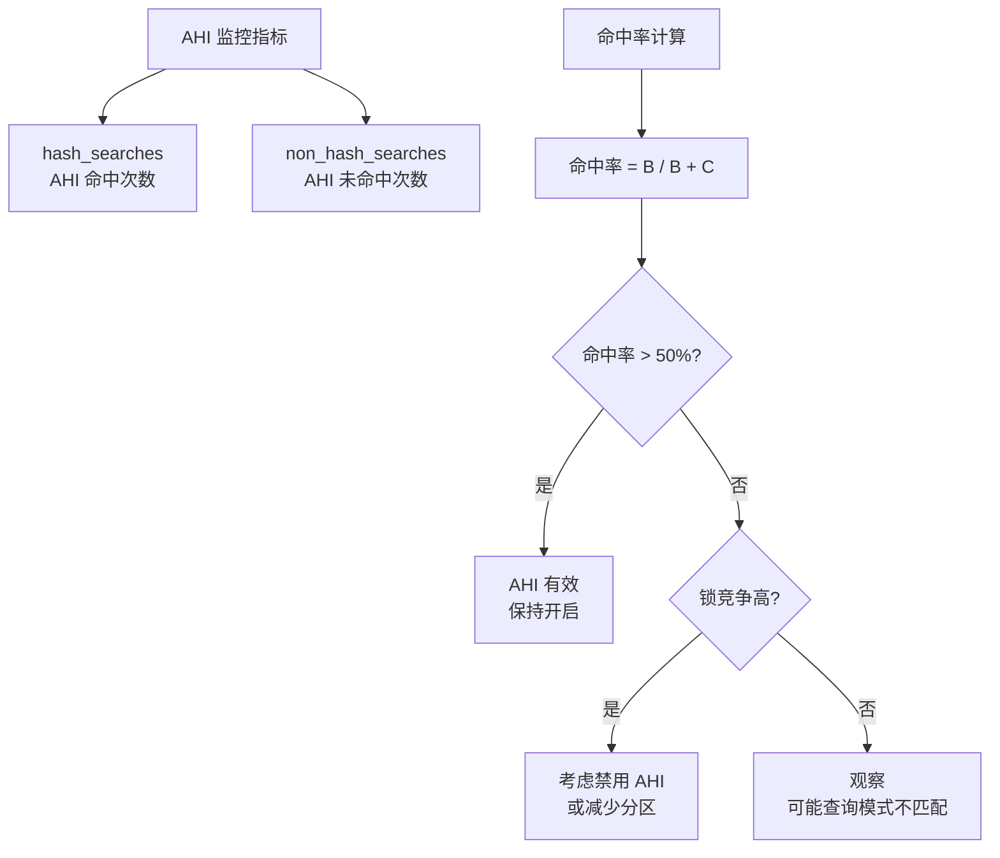

# Hash 索引

## 学习目标

- 理解 MySQL 中 Hash 索引的两种形式：自适应哈希索引（AHI）和 Memory 引擎的 Hash 索引
- 掌握自适应哈希索引的工作原理、触发条件和全局锁竞争问题
- 熟悉 Memory 引擎 Hash 索引的实现方式和局限性
- 理解 InnoDB 为什么不直接支持用户创建的 Hash 索引

## 核心概念

- **自适应哈希索引（Adaptive Hash Index, AHI）**：InnoDB 自动为频繁访问的索引页创建哈希索引
- **Memory 引擎 Hash 索引**：Memory 存储引擎支持的显式 Hash 索引类型
- **等值查询优化**：Hash 索引只对 `=`、`IN`、`<=>` 等值查询有效
- **全局锁竞争**：AHI 使用全局 `btr_search_latch` 读写锁，高并发下可能成为瓶颈
- **链地址法**：Hash 冲突解决方法，将冲突键值链接到同一个桶

## Hash 索引在 MySQL 中的两种形式



## 自适应哈希索引（AHI）

AHI 是 InnoDB 的自动优化机制，为频繁访问的索引页面构建哈希索引，加速等值查询。

### 自适应哈希索引的工作流程



### AHI 的内部结构



### AHI 触发条件



**触发条件详解**：

1. **访问频率**：同一个索引页面被频繁访问
2. **访问模式**：等值查询为主（`=`、`IN`、`<=>`），而非范围查询
3. **页面在 Buffer Pool 中**：AHI 只对缓存中的页面建立索引
4. **索引记录数**：页面中的记录数达到一定阈值

### AHI 全局锁竞争示意图

AHI 使用全局读写锁 `btr_search_latch`，在高并发场景下可能成为瓶颈。



**MySQL 8.0 分区 AHI**：

```sql
-- MySQL 8.0 将 AHI 分为多个分区，每个分区有自己的锁
-- 默认 8 个分区
SET GLOBAL innodb_adaptive_hash_index_parts = 8;

-- 这样，不同分区的查询可以并行进行
-- 只有访问同一分区的查询才会竞争锁
```

### AHI 的适用场景与禁用场景



**AHI 配置参数**：

| 参数 | 默认值 | 说明 |
|------|--------|------|
| `innodb_adaptive_hash_index` | ON | 是否开启 AHI |
| `innodb_adaptive_hash_index_parts` | 8 (MySQL 8.0) | AHI 分区数 |
| `innodb_adaptive_hash_index_ratio` | 内部参数 | 建立 AHI 的阈值比例 |

## Memory 引擎的 Hash 索引

Memory 引擎（原 Heap 引擎）支持用户显式创建 Hash 索引，数据存储在内存中。

### Memory 引擎 Hash 索引的链地址法冲突解决

```mermaid
graph TD
    A[Memory 引擎 Hash 索引] --> B[Hash Table<br/>Bucket 数组]
    
    B --> C[Bucket 0]
    B --> D[Bucket 1]
    B --> E[Bucket 2]
    B --> F[Bucket 3]
    B --> G[Bucket N-1]
    
    D --> H[链表头: 'Alice'<br/>指向行数据]
    H --> I['Amy'<br/>指向行数据]
    I --> J['Aaron'<br/>指向行数据]
    
    subgraph "冲突解决"
        K[Hash('Alice') % N = 1]
        L[Hash('Amy') % N = 1]
        M[Hash('Aaron') % N = 1]
        K --> D
        L --> D
        M --> D
    end
    
    subgraph "行数据结构"
        N[Memory 引擎行<br/>定长/变长格式<br/>存储在内存中]
    end
    
    I --> N
```

### Memory 引擎 Hash 索引的特性



### Memory 引擎 Hash 索引 vs B+Tree 索引

Memory 引擎同时支持 Hash 索引和 B+Tree 索引（默认 Hash）：

```sql
-- 创建 Hash 索引（Memory 引擎默认）
CREATE TABLE lookup (
    id INT PRIMARY KEY,
    name VARCHAR(50),
    INDEX USING HASH (name)
) ENGINE = MEMORY;

-- 创建 B+Tree 索引
CREATE TABLE ordered_data (
    id INT PRIMARY KEY,
    value INT,
    INDEX USING BTREE (value)
) ENGINE = MEMORY;
```

| 维度 | Hash 索引 | B+Tree 索引 |
|------|-----------|-------------|
| 等值查询 | O(1) 平均 | O(log n) |
| 范围查询 | 不支持 | 支持 |
| 排序输出 | 不支持 | 支持 |
| 空间开销 | 较大（冲突链表） | 较小 |
| 创建速度 | 较快 | 较慢 |
| 适用场景 | 等值查找表 | 范围查询/排序 |

## InnoDB 为什么不直接支持 Hash 索引？



### Hash 索引与 B+Tree 的查询能力对比

```mermaid
graph TD
    A[查询类型] --> B[等值查询<br/>id = 100]
    A --> C[范围查询<br/>id > 100 AND id < 200]
    A --> D[排序查询<br/>ORDER BY id]
    A --> E[模糊匹配<br/>LIKE 'Ali%']
    A --> F[多列联合<br/>name = 'Alice' AND age > 25]
    
    B --> G[Hash: O(1) 平均]
    B --> H[B+Tree: O(log n)]
    
    C --> I[Hash: 不支持<br/>需要全表扫描]
    C --> J[B+Tree: 支持<br/>范围扫描]
    
    D --> K[Hash: 不支持<br/>需要额外排序]
    D --> L[B+Tree: 支持<br/>索引有序]
    
    E --> M[Hash: 不支持<br/>无法利用索引]
    E --> N[B+Tree: 支持<br/>前缀匹配]
    
    F --> O[Hash: 部分支持<br/>需等值列在前]
    F --> P[B+Tree: 支持<br/>最左前缀原则]
```

## AHI 与 Memory 引擎 Hash 索引对比

| 维度 | 自适应哈希索引（AHI） | Memory 引擎 Hash 索引 |
|------|----------------------|----------------------|
| 存储引擎 | InnoDB | Memory |
| 创建方式 | 自动创建 | 用户显式创建 |
| 持久化 | 不持久化（基于 Buffer Pool） | 不持久化（内存存储） |
| 控制参数 | `innodb_adaptive_hash_index` | `USING HASH` 语法 |
| 适用查询 | 等值查询 | 等值查询 |
| 冲突处理 | 链地址法 | 链地址法 |
| 锁竞争 | 全局 `btr_search_latch` | 无全局锁 |
| 分区支持 | MySQL 8.0+ 支持 | 不支持 |
| 适用场景 | InnoDB 热点页面优化 | Memory 临时表查找 |

## AHI 性能监控

```sql
-- 查看 AHI 状态
SHOW ENGINE INNODB STATUS\G
-- 在 INSERT BUFFER AND ADAPTIVE HASH INDEX 部分

-- 查看 AHI 相关指标
SELECT * FROM performance_schema.global_status
WHERE VARIABLE_NAME LIKE '%adaptive_hash%';

-- innodb_adaptive_hash_hash_searches: AHI 命中次数
-- innodb_adaptive_hash_non_hash_searches: AHI 未命中次数

-- 计算命中率
-- AHI 命中率 = hash_searches / (hash_searches + non_hash_searches)
```

**监控指标解读**：



## 要点总结

- MySQL 的 Hash 索引分为 **自适应哈希索引（AHI）** 和 **Memory 引擎 Hash 索引** 两种
- **AHI** 是 InnoDB 自动为热点页面建立的哈希索引，只对等值查询有效，不持久化
- **AHI 的全局锁 `btr_search_latch`** 在高并发下可能成为瓶颈，MySQL 8.0 通过分区 AHI 缓解
- **Memory 引擎 Hash 索引** 用户可显式创建，但只支持等值查询，不支持范围/排序
- **InnoDB 不支持用户创建的 Hash 索引**，原因是 B+Tree 通用性更强，支持范围查询和排序
- AHI 是 InnoDB 的自动优化机制，用户无法控制具体哪些页面建立 AHI
- 对于纯等值查询场景，Memory 引擎 + Hash 索引比 InnoDB + AHI 更合适

## 思考题

1. AHI 的"自适应"体现在哪里？InnoDB 如何判断一个索引页面是否值得建立 AHI？
2. 为什么 AHI 使用全局锁 `btr_search_latch` 而不是页面级锁？这样设计有什么问题？
3. Memory 引擎的 Hash 索引在高冲突率场景下性能如何？如何优化 Hash 索引的设计以减少冲突？
4. 如果要在 InnoDB 中支持用户创建的 Hash 索引，需要解决哪些技术挑战？