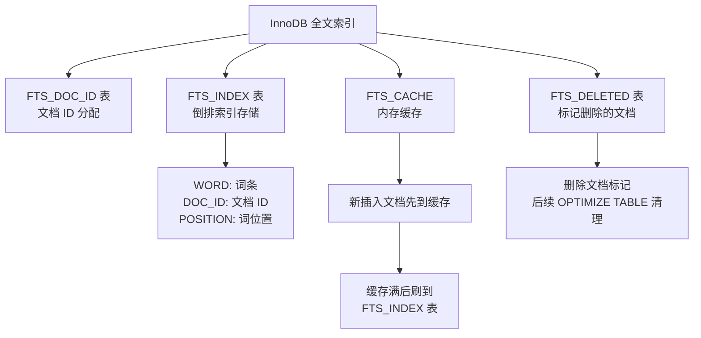
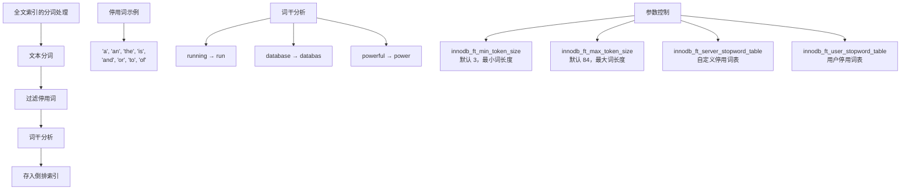
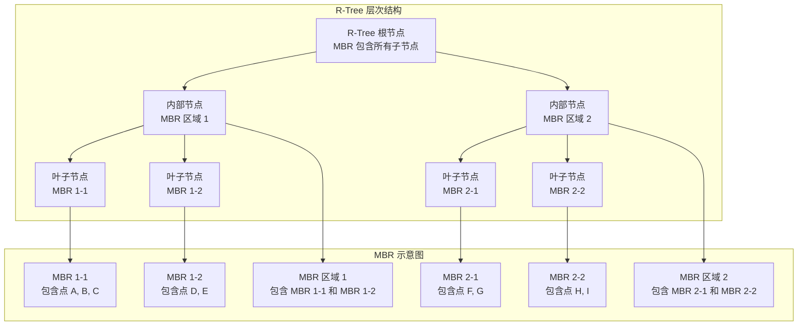
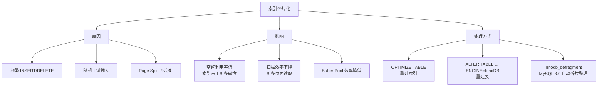

# 其他索引类型

## 学习目标

- 理解 InnoDB 全文索引的倒排索引结构和工作原理
- 掌握 MySQL 空间索引的 R-Tree 实现与 PostGIS GiST 的区别
- 了解 MySQL 8.0 新增的函数索引和倒序索引
- 熟悉索引统计信息的维护和索引碎片化处理

## 核心概念

- **FULLTEXT Index（全文索引）**：基于倒排索引，使用 `MATCH ... AGAINST` 进行全文搜索
- **Spatial Index（空间索引）**：基于 R-Tree，支持 GIS 数据类型
- **函数索引（Functional Index, MySQL 8.0.13+）**：对表达式创建索引
- **倒序索引（Descending Index, MySQL 8.0+）**：允许索引列降序存储
- **索引碎片化**：频繁 DML 导致索引页利用率低，影响性能

## 全文索引（FULLTEXT Index）

InnoDB 从 MySQL 5.6 开始支持全文索引，基于倒排索引（Inverted Index）实现。

### InnoDB 全文索引的倒排索引结构

```mermaid
graph TD
    subgraph "原始文档"
        Doc1[文档 1: MySQL is a database]
        Doc2[文档 2: Database is powerful]
        Doc3[文档 3: MySQL is open source]
    end

    subgraph "分词处理"
        T1[MySQL, is, a, database]
        T2[database, is, powerful]
        T3[MySQL, is, open, source]
    end

    subgraph "倒排索引结构"
        Dict["词条词典<br/>(Entry Tree)"]
        Dict --> Entry1[MySQL → 文档列表]
        Dict --> Entry2[database → 文档列表]
        Dict --> Entry3[is → 文档列表]
        Dict --> Entry4[powerful → 文档列表]
        Dict --> Entry5[open → 文档列表]
        Dict --> Entry6[source → 文档列表]
        Dict --> Entry7[a → 停用词<br/>不建索引]
        
        Entry1 --> PL1[Posting List<br/>(文档1, 文档3)]
        Entry2 --> PL2[Posting List<br/>(文档1, 文档2)]
        Entry3 --> PL3[Posting List<br/>(文档1, 文档2, 文档3)]
        Entry4 --> PL4[Posting List<br/>(文档2)]
        Entry5 --> PL5[Posting List<br/>(文档3)]
        Entry6 --> PL6[Posting List<br/>(文档3)]
    end

    subgraph "InnoDB 全文索引表结构"
        FTS_DOC_ID[FTS_DOC_ID 表<br/>文档 ID 映射]
        FTS_INDEX[FTS_INDEX 表<br/>词条 → 文档位置]
        FTS_DELETED[FTS_DELETED 表<br/>已删除文档]
        FTS_CACHE[FTS 内存缓存<br/>缓存新插入的文档]
    end

    T1 --> PL1
    T1 --> PL2
    T1 --> PL3
    T2 --> PL2
    T2 --> PL3
    T2 --> PL4
    T3 --> PL1
    T3 --> PL3
    T3 --> PL5
    T3 --> PL6
```

### InnoDB 全文索引的存储结构

InnoDB 使用多张辅助表来实现全文索引：



### 全文检索查询

```sql
-- 创建全文索引
CREATE TABLE articles (
    id INT AUTO_INCREMENT PRIMARY KEY,
    title VARCHAR(200),
    body TEXT,
    FULLTEXT INDEX ft_idx (title, body)
) ENGINE=InnoDB;

-- 插入数据
INSERT INTO articles (title, body) VALUES
('MySQL Tutorial', 'MySQL is a relational database management system'),
('Database Guide', 'Database is powerful and widely used'),
('Open Source', 'MySQL is open source database');

-- 自然语言模式
SELECT * FROM articles
WHERE MATCH(title, body) AGAINST('database');
-- 按相关性排序，匹配 "database" 的文档

-- 布尔模式
SELECT * FROM articles
WHERE MATCH(title, body) AGAINST('+MySQL -Oracle' IN BOOLEAN MODE);
-- + 表示必须包含，- 表示排除

-- 查询扩展模式
SELECT * FROM articles
WHERE MATCH(title, body) AGAINST('database' WITH QUERY EXPANSION);
-- 先搜索匹配词，再从结果中提取相关词二次搜索
```

### 全文搜索模式对比

| 模式 | 语法 | 说明 | 适用场景 |
|------|------|------|----------|
| 自然语言模式 | `AGAINST('keyword')` | 按相关性排序 | 普通搜索 |
| 布尔模式 | `AGAINST('+word -word' IN BOOLEAN MODE)` | 支持逻辑操作符 | 精确控制搜索 |
| 查询扩展模式 | `AGAINST('word' WITH QUERY EXPANSION)` | 自动扩展搜索词 | 模糊搜索 |

### 停用词和词干分析



## 空间索引（Spatial Index）

MySQL 的空间索引基于 **R-Tree**（不是 PG 的 GiST），支持 GIS 数据类型和空间查询。

### R-Tree 空间索引的分层包围盒结构



### 空间查询

```sql
-- 创建空间表
CREATE TABLE locations (
    id INT AUTO_INCREMENT PRIMARY KEY,
    name VARCHAR(100),
    location POINT NOT NULL SRID 4326,
    area POLYGON,
    SPATIAL INDEX sp_idx (location)
) ENGINE=InnoDB;

-- 插入空间数据
INSERT INTO locations (name, location) VALUES
('北京', ST_GeomFromText('POINT(116.40 39.90)', 4326)),
('上海', ST_GeomFromText('POINT(121.47 31.23)', 4326));

-- 空间查询
-- 查找在矩形区域内的点
SELECT name FROM locations
WHERE MBRContains(
    ST_GeomFromText('POLYGON((110 30, 130 30, 130 40, 110 40, 110 30))', 4326),
    location
);

-- 计算距离
SELECT name,
    ST_Distance(location, ST_GeomFromText('POINT(116.40 39.90)', 4326)) AS distance
FROM locations;
```

### MySQL 空间索引 vs PostGIS GiST

| 维度 | MySQL R-Tree | PostgreSQL GiST |
|------|-------------|-----------------|
| 索引结构 | R-Tree | GiST（可扩展） |
| 空间函数 | 有限（MBR 为主） | 丰富（PostGIS） |
| SRID 支持 | MySQL 8.0+ | 原生支持 |
| 地理计算 | 基础 | 高级 |
| 投影支持 | 有限 | 丰富 |
| 性能 | 中等 | 优秀 |
| 生态系统 | 弱（无 PostGIS 生态） | 强（PostGIS 生态） |

## 函数索引（Functional Key Parts, MySQL 8.0.13+）

函数索引允许对表达式创建索引，解决了传统索引无法索引计算结果的限制。

### 函数索引的工作方式

```mermaid
graph TD
    subgraph "函数索引的存储与查找"
        A[创建函数索引] --> B[索引定义: (col1 + col2)]
        B --> C[插入/更新时<br/>计算表达式值]
        C --> D[将表达式值<br/>存储在索引中]
        D --> E[查询时<br/>计算表达式值]
        E --> F[在索引中查找<br/>匹配的表达式值]
    end

    subgraph "示例"
        G[CREATE INDEX idx_expr ON t<br/>((col1 + col2))]
        H[插入: col1=10, col2=20<br/>索引存储: 30]
        I[查询: WHERE col1 + col2 = 30<br/>索引查找: 30]
        G --> H
        G --> I
    end
```

### 函数索引示例

```sql
-- 基本函数索引
CREATE TABLE t (
    a INT,
    b INT,
    c VARCHAR(100),
    json_data JSON
);

-- 对表达式创建索引
CREATE INDEX idx_expr ON t ((a + b));

-- 对 JSON 字段创建索引
CREATE INDEX idx_json ON t ((CAST(json_data->>'$.name' AS CHAR(30))));

-- 对字符串函数创建索引
CREATE INDEX idx_upper ON t ((UPPER(c)));

-- 查询时利用函数索引
SELECT * FROM t WHERE a + b > 100;  -- 使用 idx_expr
SELECT * FROM t WHERE CAST(json_data->>'$.name' AS CHAR(30)) = 'Alice';  -- 使用 idx_json
SELECT * FROM t WHERE UPPER(c) = 'HELLO';  -- 使用 idx_upper
```

### 函数索引的限制

1. 表达式必须使用括号包裹：`((a + b))` 而不是 `(a + b)`
2. 不能使用 `*` 或函数索引作为主键
3. 不能与外键约束关联
4. 函数索引列不能用于索引条件下推（ICP）
5. 支持内置函数和确定性的存储函数

## 倒序索引（Descending Index, MySQL 8.0+）

倒序索引允许索引列降序存储，解决多列排序的升降序问题。

### 倒序索引的工作原理

```mermaid
graph TD
    subgraph "MySQL 8.0 之前的处理"
        Before[CREATE INDEX idx ON t (a ASC, b DESC)]
        Before_A[实际存储: a 升序, b 升序]
        Before_B[ORDER BY a ASC, b DESC<br/>需要 filesort 排序]
        Before --> Before_A
        Before_A --> Before_B
    end

    subgraph "MySQL 8.0+ 的倒序索引"
        After[CREATE INDEX idx ON t (a ASC, b DESC)]
        After_A[实际存储: a 升序, b 降序]
        After_B[ORDER BY a ASC, b DESC<br/>利用索引顺序，无需排序]
        After --> After_A
        After_A --> After_B
    end
```

### 倒序索引示例

```sql
-- 创建倒序索引
CREATE TABLE orders (
    id INT PRIMARY KEY,
    user_id INT,
    created_at DATETIME,
    amount DECIMAL(10,2),
    INDEX idx_user_time (user_id ASC, created_at DESC)
);

-- 查询：按用户分组，按时间降序排列
SELECT user_id, created_at, amount
FROM orders
WHERE user_id = 100
ORDER BY created_at DESC;
-- MySQL 8.0+ 利用倒序索引，避免 filesort

-- 多列混合排序
SELECT * FROM orders
WHERE user_id > 1000
ORDER BY user_id ASC, created_at DESC, amount ASC;
-- 需要创建复合索引: (user_id ASC, created_at DESC, amount ASC)
```

## 索引统计与维护

### ANALYZE TABLE

```sql
-- 更新索引统计信息
ANALYZE TABLE users;

-- 查看统计信息
SHOW INDEX FROM users;
SELECT * FROM mysql.innodb_table_stats WHERE table_name = 'users';
SELECT * FROM mysql.innodb_index_stats WHERE table_name = 'users';
```

### OPTIMIZE TABLE

```sql
-- 重建表和索引
OPTIMIZE TABLE users;

-- InnoDB 中 OPTIMIZE 等价于:
-- 1. 创建新表（使用当前表的 DDL）
-- 2. 插入旧表数据到新表
-- 3. 删除旧表
-- 4. 重命名新表为旧表名
```

### 索引碎片化



### 碎片化检测

```sql
-- 检查索引碎片化程度
SELECT
    table_name,
    index_name,
    stat_value AS pages,
    stat_description
FROM mysql.innodb_index_stats
WHERE table_name = 'users'
  AND stat_name = 'size';

-- 检查表的数据和索引页数
SELECT
    table_name,
    clustered_index_size AS 聚簇索引页数,
    sum_of_other_index_sizes AS 其他索引页数
FROM mysql.innodb_table_stats
WHERE table_name = 'users';
```

## 各种索引的对比

```mermaid
graph TD
    A[MySQL 索引类型对比] --> B[B+Tree 索引<br/>默认索引]
    A --> C[Hash 索引<br/>AHI / Memory]
    A --> D[全文索引<br/>FULLTEXT]
    A --> E[空间索引<br/>SPATIAL]
    A --> F[函数索引<br/>Functional]
    A --> G[倒序索引<br/>Descending]
    
    B --> B1[适用: 所有查询类型<br/>等值/范围/排序]
    B --> B2[限制: 无特殊限制]
    B --> B3[存储: B+Tree]
    
    C --> C1[适用: 等值查询]
    C --> C2[限制: 不支持范围/排序]
    C --> C3[存储: Hash Table]
    
    D --> D1[适用: 文本搜索<br/>MATCH AGAINST]
    D --> D2[限制: 字符集限制<br/>最小词长度]
    D --> D3[存储: 倒排索引]
    
    E --> E1[适用: GIS 空间查询]
    E --> E2[限制: 仅 MyISAM/InnoDB<br/>函数有限]
    E --> E3[存储: R-Tree]
    
    F --> F1[适用: 表达式查询]
    F --> F2[限制: MySQL 8.0.13+<br/>确定函数]
    F --> F3[存储: B+Tree]
    
    G --> G1[适用: 多列混合排序]
    G --> G2[限制: MySQL 8.0+]
    G --> G3[存储: B+Tree 倒序]
```



### 综合对比表

| 索引类型 | 适用场景 | 查询类型 | 存储结构 | 版本支持 | 空间开销 | 写入开销 |
|----------|----------|----------|----------|----------|----------|----------|
| **B+Tree** | 通用 | 等值/范围/排序/前缀 | B+Tree | 所有版本 | 中等 | 中等 |
| **Hash (AHI)** | 热点页等值查询 | 等值 | Hash Table | 所有版本 | 中等 | 低（自动） |
| **Hash (Memory)** | 内存查找表 | 等值 | Hash Table | 所有版本 | 较大 | 低 |
| **FULLTEXT** | 全文搜索 | 文本匹配 | 倒排索引 | 5.6+ | 大 | 高 |
| **SPATIAL** | GIS 空间查询 | 空间包含/相交 | R-Tree | 5.7+ | 中等 | 高 |
| **函数索引** | 表达式查询 | 等值/范围 | B+Tree | 8.0.13+ | 中等 | 高 |
| **倒序索引** | 混合排序 | 排序 | B+Tree 倒序 | 8.0+ | 中等 | 中等 |

## 要点总结

- **全文索引（FULLTEXT）** 基于倒排索引，支持 `MATCH ... AGAINST` 的自然语言模式和布尔模式
- **空间索引（SPATIAL）** 基于 R-Tree，使用 MBR 相关函数进行空间查询，能力远弱于 PostGIS
- **函数索引（MySQL 8.0.13+）** 允许对表达式创建索引，包括 JSON 字段表达式
- **倒序索引（MySQL 8.0+）** 支持索引列降序存储，解决多列升降序混合排序的性能问题
- 索引维护通过 `ANALYZE TABLE`（更新统计信息）和 `OPTIMIZE TABLE`（重建索引）进行
- **索引碎片化** 影响性能，MySQL 8.0 的 `innodb_defragment` 提供自动碎片整理

## 思考题

1. InnoDB 的全文索引使用多张辅助表实现（FTS_DOC_ID、FTS_INDEX、FTS_DELETED、FTS_CACHE），这种设计与 MyISAM 的全文索引有什么不同？为什么 InnoDB 采用更复杂的方案？
2. MySQL 的空间索引基于 R-Tree 而非 GiST，这与 PG 的选择有什么不同？为什么 MySQL 不采用 GiST？
3. 函数索引中表达式必须用双层括号包裹（`((expr))`），这个语法设计的目的是什么？
4. 倒序索引解决了 `ORDER BY a ASC, b DESC` 的排序问题，但如果查询是 `ORDER BY a DESC, b ASC`，现有的倒序索引能否利用？