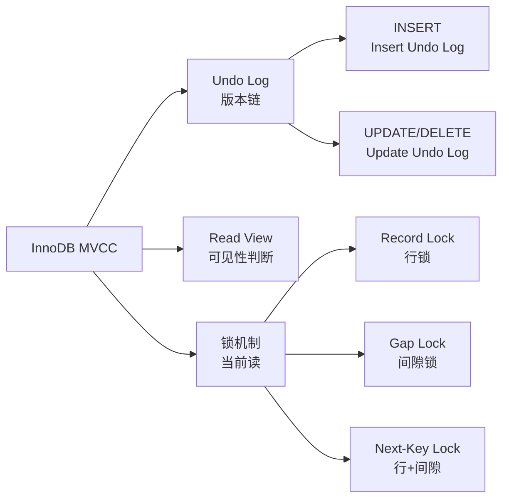
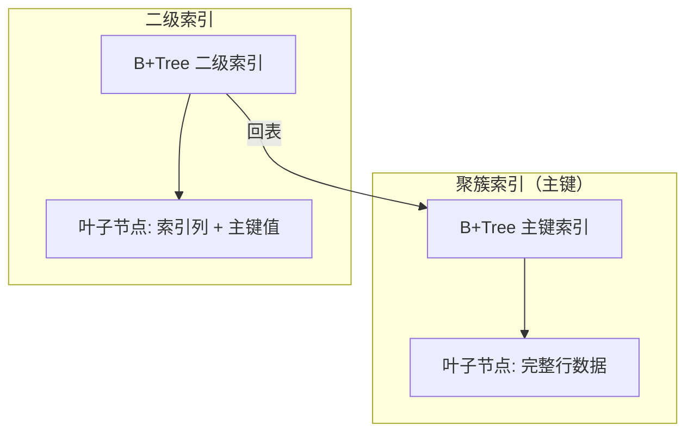
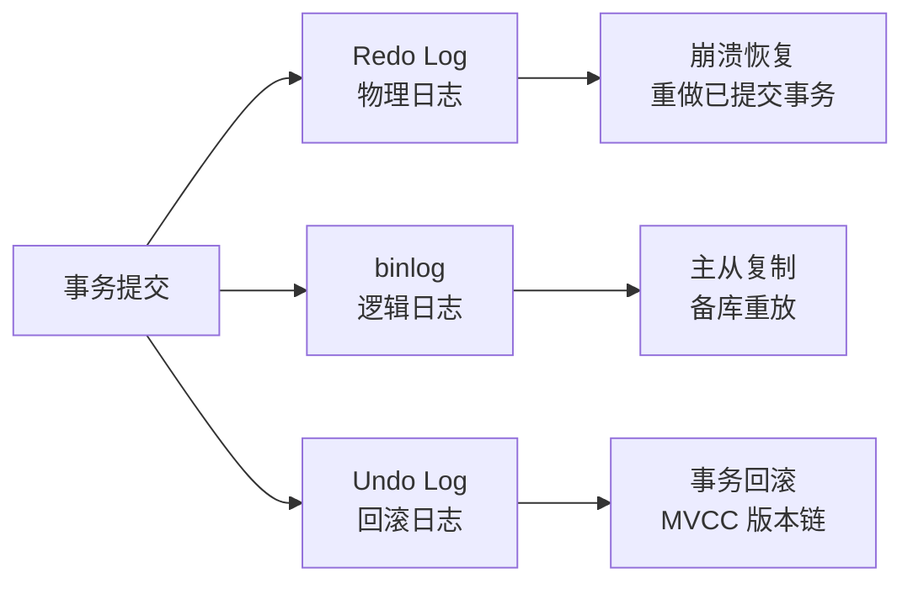
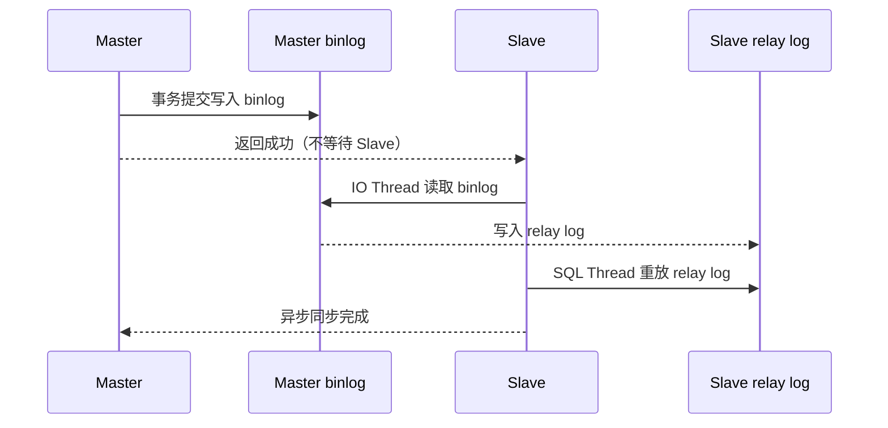
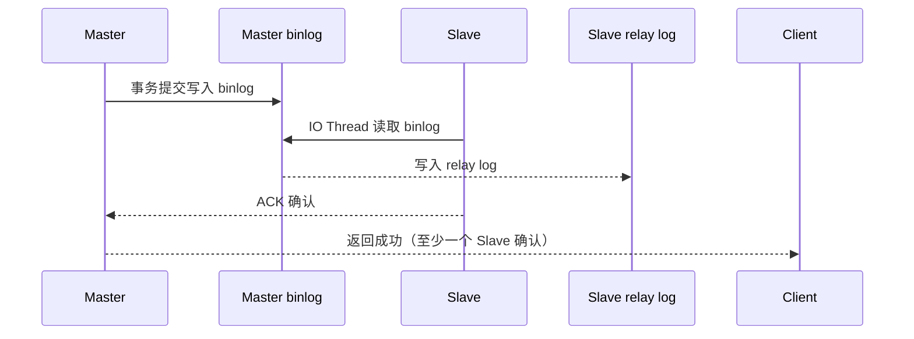
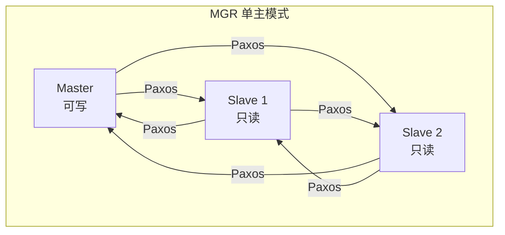
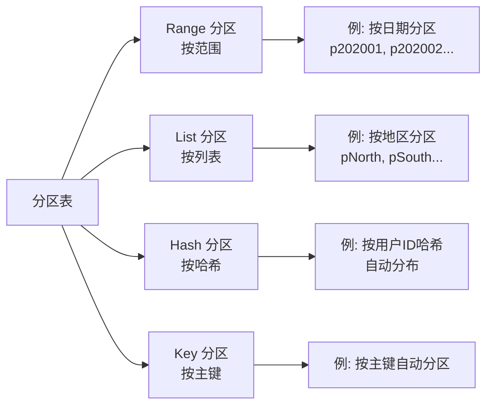
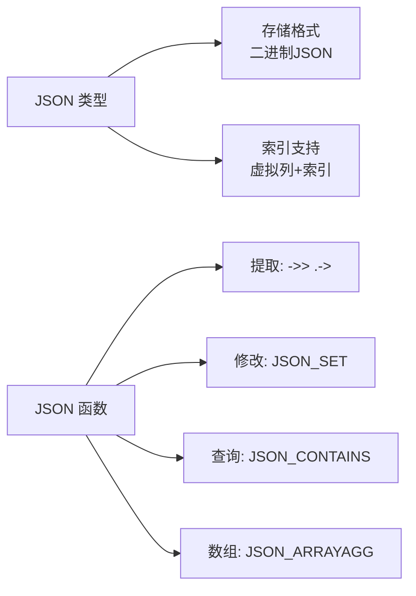
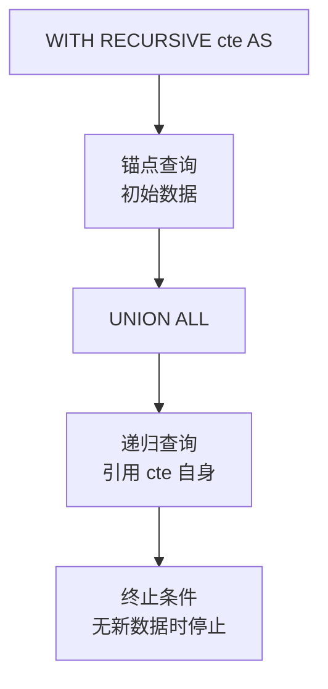
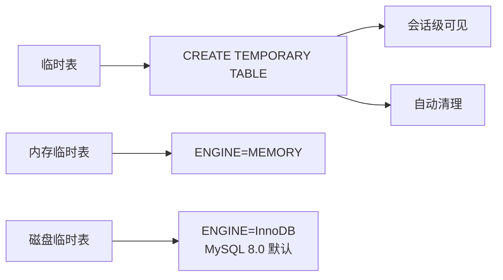

# MySQL 关键特性

## 学习目标

- 理解 MySQL 的核心特性与 InnoDB 引擎的能力
- 掌握主从复制、读写分离、高可用架构的实现方式
- 了解 MySQL 在不同场景下的特性组合应用

## 核心概念

- **MVCC**：InnoDB 通过 Undo Log 实现多版本并发控制
- **聚簇索引**：InnoDB 的默认索引组织方式，数据即主键索引
- **主从复制**：基于 binlog 的异步/半同步复制
- **组复制（MGR）**：MySQL Group Replication，基于 Paxos 的多主复制
- **分区表**：水平分区（Range/List/Hash/Key），简化大表管理
- **JSON 支持**：MySQL 5.7+ 支持 JSON 类型和 JSON 函数
- **窗口函数**：MySQL 8.0+ 支持 SQL 标准窗口函数
- **CTE（Common Table Expression）**：MySQL 8.0+ 支持 WITH 子句和递归 CTE

## InnoDB 核心特性

### MVCC + 锁机制



**关键点**：

- MVCC 通过 Undo Log 实现快照读，不阻塞写操作
- 当前读（SELECT FOR UPDATE）使用锁机制，保证一致性
- RR 级别通过 Next-Key Lock 防止幻读，RC 级别只使用 Record Lock

### 聚簇索引与二级索引



**关键点**：

- 主键即聚簇索引，数据按主键顺序存储
- 二级索引叶子节点存储主键值，需要回表查询完整数据
- 覆盖索引（Covering Index）可以避免回表

### Redo Log + Undo Log + binlog



**两阶段提交保证一致性**：

1. Redo Log Prepare 阶段（InnoDB 层）
2. binlog 写入（Server 层）
3. Redo Log Commit 阶段（InnoDB 层）

## 主从复制架构

### 异步复制（Asynchronous Replication）



**特点**：

- 主库提交后立即返回，不等待备库确认
- 延迟取决于网络、备库性能、负载
- 存在数据丢失风险（主库崩溃时）

### 半同步复制（Semi-Synchronous Replication）



**特点**：

- 主库等待至少一个备库确认收到 binlog
- `rpl_semi_sync_master_wait_for_slave_count` 控制等待备库数量
- 延迟比异步复制高，但数据安全性更好

### 组复制（MySQL Group Replication, MGR）



**特点**：

- 基于 Paxos 协议，保证强一致性
- 支持单主模式（Single-Primary）和多主模式（Multi-Primary）
- 自动故障检测和主库切换
- 需要至少 3 个节点

## 分区表（Partitioning）

### 分区类型



**使用场景**：

- 大表（TB 级）按时间或业务维度分区
- 历史数据归档（删除分区比 DELETE 快）
- 分区裁剪（Partition Pruning）减少扫描范围

**限制**：

- 分区键必须是主键的一部分
- 分区表不支持外键
- 分区数上限 8192

## JSON 支持

### JSON 类型与函数



**关键特性**：

- MySQL 5.7+ 支持 JSON 类型，不是文本类型
- 存储为二进制格式，支持部分更新（不是完整重写）
- 通过虚拟列（Virtual Column）对 JSON 字段建索引

```sql
-- 对 JSON 字段建立索引
CREATE TABLE t (
    id INT PRIMARY KEY,
    json_col JSON,
    name VARCHAR(30) AS (json_col->>'$.name') STORED,
    INDEX idx_name (name)
);
```

### 与 PostgreSQL JSONB 对比

| 维度 | MySQL JSON | PostgreSQL JSONB |
|------|-----------|------------------|
| 存储格式 | 二进制（部分优化） | 二进制（完全结构化） |
| 索引支持 | 需要虚拟列 | 原生支持 GIN 索引 |
| 操作符 | `->` `->>` | `->` `->>` `#>` `#>>` |
| 函数数量 | 较少 | 丰富 |
| 路径查询 | JSONPath（MySQL 8.0.17+） | JSONPath |

## 窗口函数（MySQL 8.0+）

### 窗口函数语法

```sql
SELECT
    order_id,
    customer_id,
    order_date,
    amount,
    ROW_NUMBER() OVER (PARTITION BY customer_id ORDER BY order_date) AS row_num,
    SUM(amount) OVER (PARTITION BY customer_id) AS total_amount,
    RANK() OVER (ORDER BY amount DESC) AS rank
FROM orders;
```

**支持的窗口函数**：

- 排名函数：`ROW_NUMBER`、`RANK`、`DENSE_RANK`、`NTILE`
- 聚合函数：`SUM`、`AVG`、`COUNT`、`MAX`、`MIN`
- 值函数：`LAG`、`LEAD`、`FIRST_VALUE`、`LAST_VALUE`
- 分布函数：`PERCENT_RANK`、`CUME_DIST`

### 与 PostgreSQL 对比

- MySQL 8.0 才支持窗口函数（PG 早就支持）
- MySQL 8.0.14+ 支持 `JSON_TABLE`，PG 支持 `jsonb_to_record`
- MySQL 缺失的窗口函数：`PERCENTILE_CONT`、`PERCENTILE_DISC`（PG 有）

## CTE 与递归查询（MySQL 8.0+）

### 非递归 CTE

```sql
WITH monthly_sales AS (
    SELECT
        DATE_FORMAT(order_date, '%Y-%m') AS month,
        SUM(amount) AS total
    FROM orders
    GROUP BY month
)
SELECT * FROM monthly_sales WHERE total > 10000;
```

### 递归 CTE



```sql
-- 查询组织层级
WITH RECURSIVE org_tree AS (
    SELECT id, name, parent_id, 1 AS level
    FROM employees WHERE parent_id IS NULL

    UNION ALL

    SELECT e.id, e.name, e.parent_id, ot.level + 1
    FROM employees e
    JOIN org_tree ot ON e.parent_id = ot.id
)
SELECT * FROM org_tree;
```

## 其他特性

### 临时表（Temporary Table）



### 存储过程与触发器

- MySQL 5.0+ 支持存储过程、函数、触发器
- 使用 SQL 语句编写，语法类似 PL/SQL（但不完全兼容）
- 触发器支持 BEFORE/AFTER + INSERT/UPDATE/DELETE

### 虚拟列（Generated Column）

```sql
CREATE TABLE t (
    id INT PRIMARY KEY,
    a INT,
    b INT,
    c INT GENERATED ALWAYS AS (a + b) STORED
);
```

- 虚拟列自动计算，不能手动插入值
- `STORED` 物理存储，`VIRTUAL` 不存储（MySQL 默认 VIRTUAL）
- 可以对虚拟列建索引

## 要点总结

- InnoDB 的聚簇索引是 MySQL 最核心的存储特征，数据即主键索引
- MVCC 通过 Undo Log 实现，与 PostgreSQL 的 xmin/xmax 方案完全不同
- 主从复制基于 binlog（逻辑日志），支持异步、半同步、组复制
- MySQL 8.0+ 才支持窗口函数、CTE、递归查询，功能逐步完善
- JSON 支持在 5.7+ 引入，但索引能力弱于 PostgreSQL JSONB
- 分区表适用于大表管理，但限制较多（分区键必须是主键一部分）

## 思考题

1. MySQL 的主从复制基于 binlog（逻辑日志），而 PostgreSQL 的流复制基于 WAL（物理日志）。两者的优缺点是什么？
2. 为什么 MySQL 默认隔离级别是 RR（可重复读），而 PostgreSQL 是 RC（读已提交）？这与两者的 MVCC 实现有何关系？
3. InnoDB 的聚簇索引在什么场景下优势明显？在什么场景下会成为劣势？
4. MySQL 8.0 才支持窗口函数和 CTE，而 PostgreSQL 早就支持。这反映了什么设计哲学差异？