# MySQL 使用场景与选型

## 学习目标

- 了解 MySQL 在不同业务场景下的适用性
- 掌握 MySQL 与其他数据库（PostgreSQL、MongoDB、Redis、ES）的选型对比
- 理解 MySQL 的读写分离架构与高可用方案

## 核心概念

- **OLTP 场景**：MySQL 的核心战场，适合高并发短查询
- **读写分离**：主库写、从库读，通过中间件（ProxySQL/MyCat）路由
- **分库分表**：水平扩展的解决方案，ShardingSphere/MyCat 实现
- **高可用架构**：MHA/MGR/Orchestrator 实现自动故障切换
- **云数据库**：RDS/Aurora/PolarDB/TiDB 等兼容 MySQL 协议的云服务

## 典型应用场景

### 互联网 OLTP 系统

MySQL 是互联网公司最常用的关系型数据库，适合以下业务：

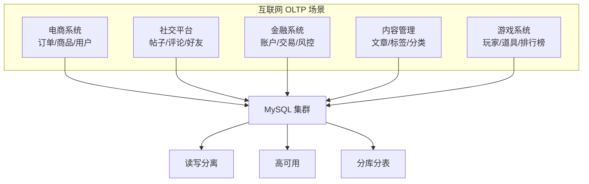

**典型架构**：

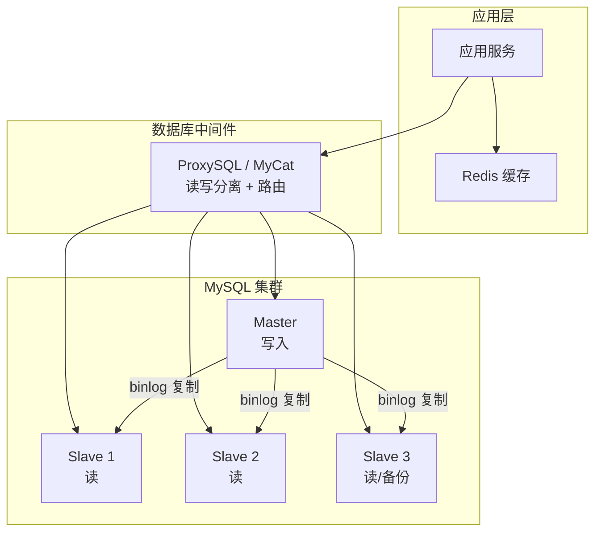

**关键技术**：

- 读写分离：主库处理写操作，从库处理读操作
- 连接池：Druid/HikariCP 减少连接创建开销
- 缓存层：Redis 缓存热点数据，减少数据库压力
- 分库分表：ShardingSphere 实现水平扩展

### 电商系统

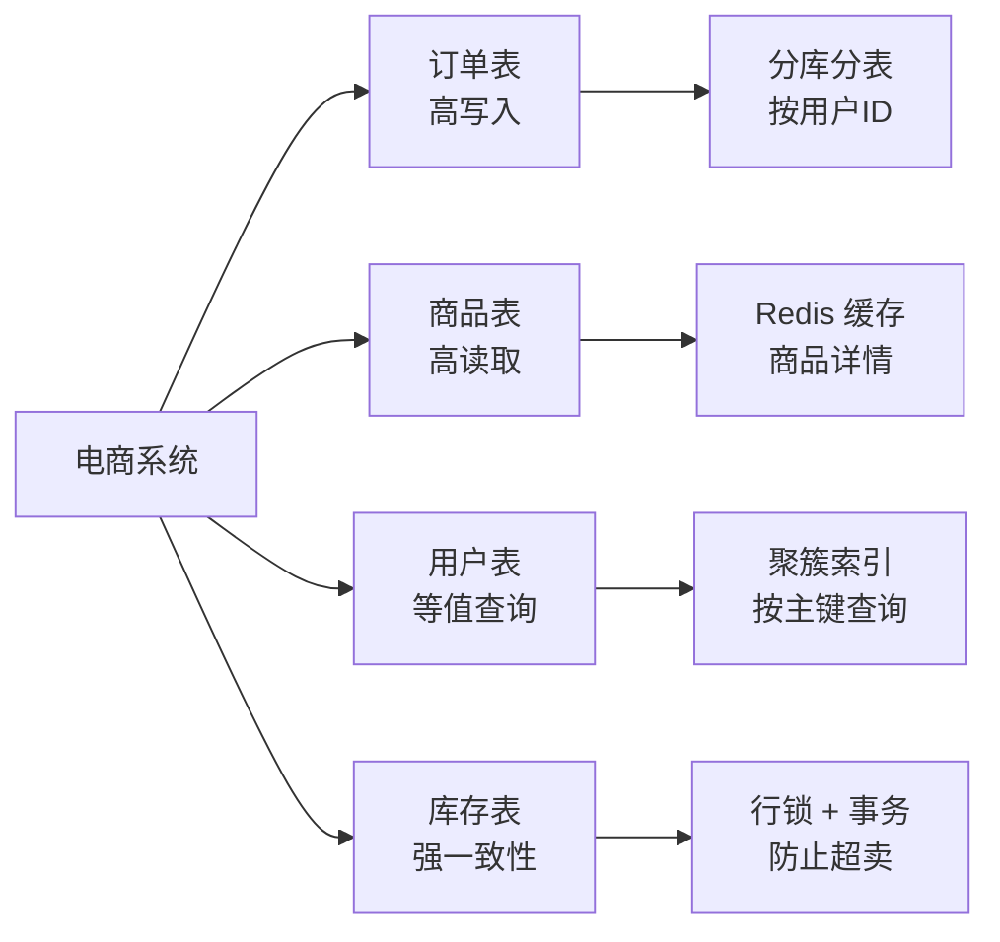

**MySQL 的优势**：

- 聚簇索引在等值查询和范围扫描上性能优异
- InnoDB 行锁支持高并发写入
- 主从复制架构降低查询延迟
- 事务支持保证订单和库存的一致性

### 金融系统

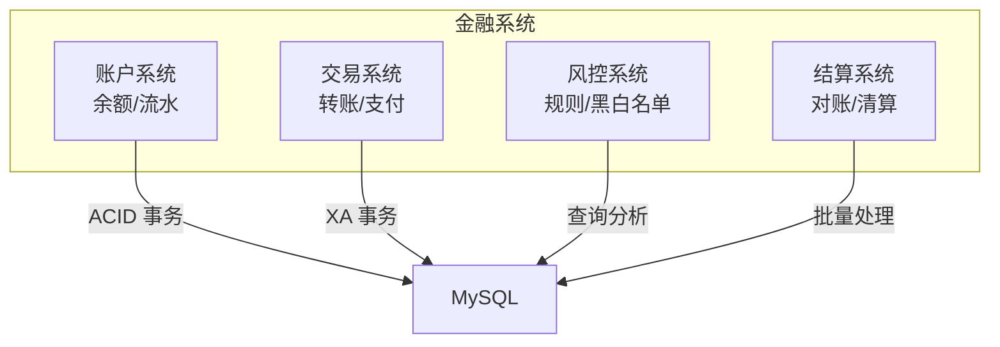

**优势**：

- InnoDB 的 ACID 事务保证资金安全
- 行锁在并发转账时避免死锁
- 两阶段提交保证分布式事务一致性
- 审计日志通过 binlog 实现

### 内容管理系统（CMS）

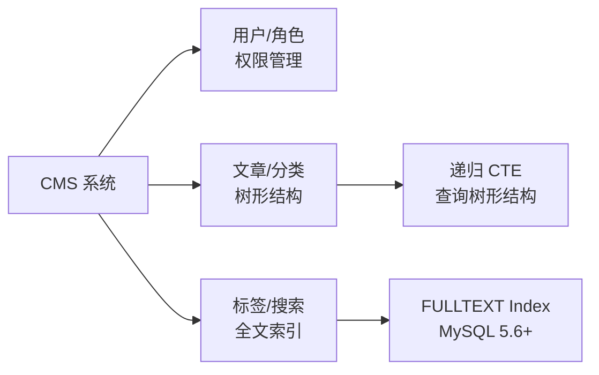

**MySQL 8.0+ 的优势**：

- 递归 CTE 支持树形结构查询（分类、菜单）
- 全文索引支持文章搜索
- JSON 类型支持灵活的内容结构

## 选型对比

### MySQL vs PostgreSQL

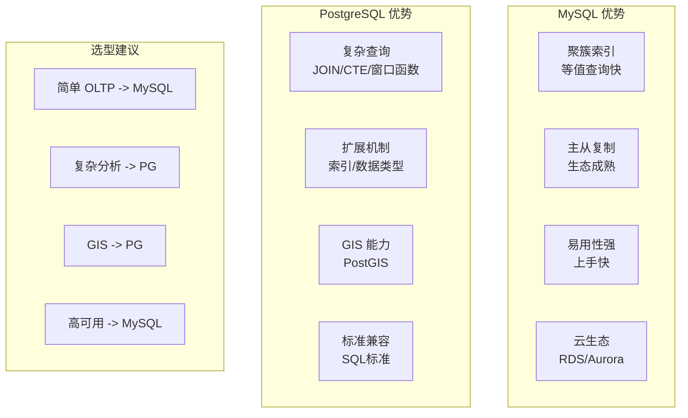

| 维度 | MySQL | PostgreSQL |
|------|-------|-----------|
| 存储架构 | 聚簇索引（IOT） | Heap 表 |
| 隔离级别默认 | RR | RC |
| 复制方式 | binlog 逻辑复制 | WAL 物理流复制 |
| 复杂查询 | 较弱 | 强 |
| JSON 支持 | 虚拟列+索引 | JSONB GIN 索引 |
| GIS | 基本 R-Tree | 强大的 PostGIS |
| 扩展性 | 可插拔引擎 | 可扩展访问方法 |
| 运维成本 | 低 | 中 |
| 云服务 | 最丰富（RDS/Aurora/PolarDB） | 丰富（RDS/AlloyDB/CockroachDB） |

### MySQL vs MongoDB

| 维度 | MySQL | MongoDB |
|------|-------|---------|
| 数据模型 | 关系型（表+行+列） | 文档型（JSON/BSON） |
| 事务 | 强 ACID | 4.0+ 支持多文档事务 |
| 扩展性 | 分库分表（复杂） | 原生分片（auto-sharding） |
| Schema 变更 | 需要 ALTER TABLE | 无 Schema 约束 |
| Join 能力 | 强 | 弱（$lookup 性能差） |
| 场景 | 结构化数据 | 半结构化/快速原型 |

### MySQL vs Redis

| 维度 | MySQL | Redis |
|------|-------|-------|
| 存储 | 磁盘持久化 | 内存+可选的持久化 |
| 模型 | 关系型 | KV / 多种数据结构 |
| 查询 | SQL 复杂查询 | 简单键值操作 |
| 延迟 | 毫秒级 | 微秒级 |
| 场景 | 持久化存储 | 缓存/会话/计数器 |

### MySQL vs Elasticsearch

| 维度 | MySQL | Elasticsearch |
|------|-------|--------------|
| 核心能力 | 数据存储/事务 | 全文搜索/分析 |
| 查询方式 | SQL | DSL（JSON） |
| 索引 | B+Tree | 倒排索引 |
| 实时性 | 强一致性 | 近实时（NRT） |
| 场景 | 在线事务 | 日志搜索/全文检索 |

## 读写分离架构

### 基于中间件的读写分离

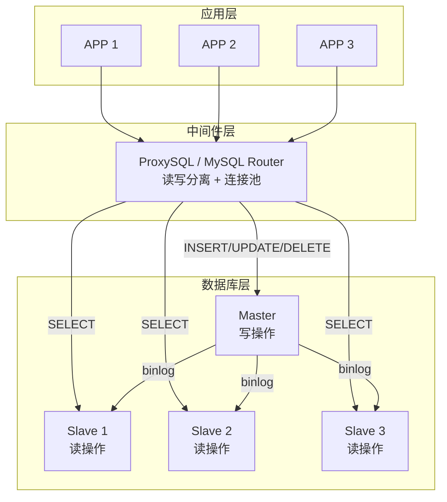

**中间件选择**：

| 中间件 | 特点 | 适用场景 |
|--------|------|---------|
| ProxySQL | 高性能、丰富的路由规则、连接池 | 生产环境首选 |
| MySQL Router | Oracle 官方、轻量 | 简单读写分离 |
| MyCat | 分库分表 + 读写分离 | 需要分库分表 |
| ShardingSphere | 分库分表 + 读写分离 + 分布式事务 | 复杂分片场景 |

## 高可用架构

### MHA（Master High Availability）

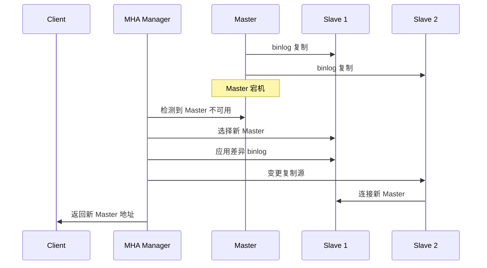

### 组复制（MGR）

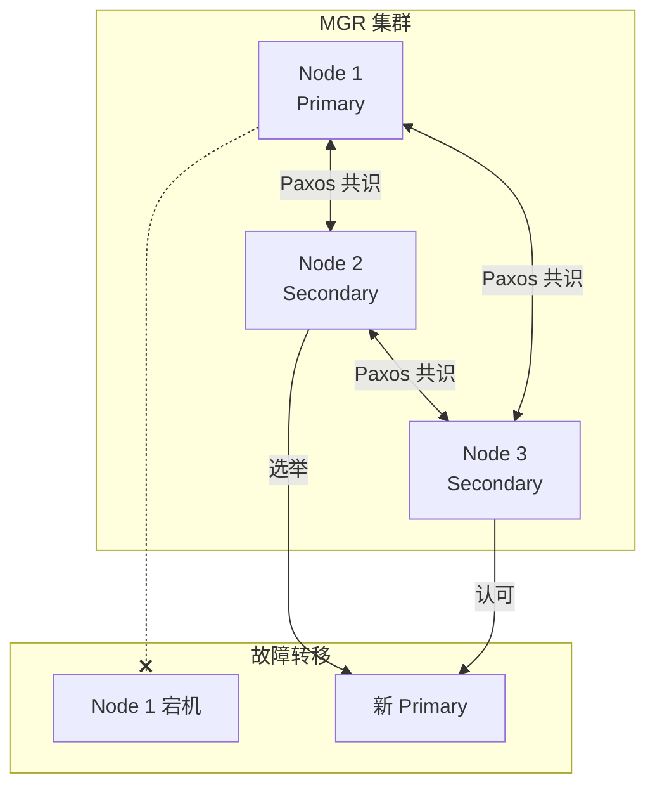

## 云数据库方案

### AWS RDS for MySQL

- 托管服务，自动备份、自动故障切换
- 支持 Multi-AZ 部署，跨可用区高可用
- 只读副本（Read Replica）最多 15 个
- 支持自动扩缩容

### AWS Aurora MySQL

- 兼容 MySQL 5.7/8.0 协议
- 存储与计算分离，6 副本跨 3 AZ
- 写入吞吐量是标准 MySQL 的 5x
- 故障切换秒级完成

### 阿里云 PolarDB MySQL

- 兼容 MySQL 8.0
- 计算与存储分离，共享存储
- 一写多读，最多 16 个只读节点
- 存储自动扩容，最大 100TB

## 分库分表

### 垂直分库

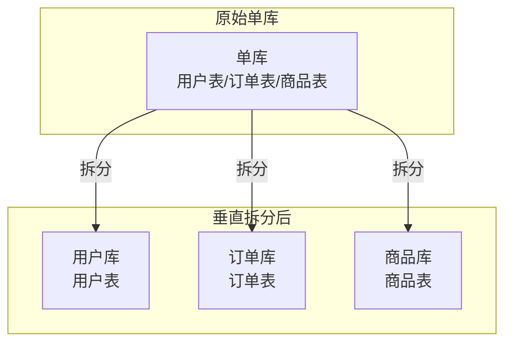

### 水平分表

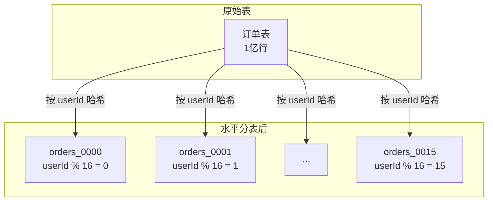

**分片策略**：

| 策略 | 说明 | 适用场景 |
|------|------|---------|
| 范围分片 | 按时间/ID 范围分片 | 日志、时序数据 |
| 哈希分片 | 按用户 ID 哈希分片 | 用户数据 |
| 列表分片 | 按地区/业务线分片 | 多租户系统 |
| 一致性哈希 | 减少分片变更时的数据迁移 | 动态扩容 |

## 要点总结

- MySQL 的核心战场是 OLTP 场景，高并发读写、简单查询为主
- 读写分离 + 主从复制是互联网公司最常用的架构模式
- 分库分表是 MySQL 水平扩展的主要手段，但增加了复杂度
- 云数据库（RDS/Aurora/PolarDB）降低了运维复杂度，是当前主流选择
- 在复杂分析、GIS、全文检索等场景，MySQL 不如 PostgreSQL 和专用数据库
- 选型时应根据业务场景选择最合适的数据库，而不是一味使用 MySQL

## 思考题

1. 在什么场景下，MySQL 的读写分离架构会引入一致性问题？如何解决？
2. 分库分表后，跨分片的查询和事务如何处理？
3. 为什么许多互联网公司从 MySQL 迁移到 TiDB/CockroachDB？MySQL 的分布式扩展遇到了什么瓶颈？
4. 如果你的项目使用 MySQL 作为存储，InnoDB 的哪些特性可以借鉴到你的存储引擎中？