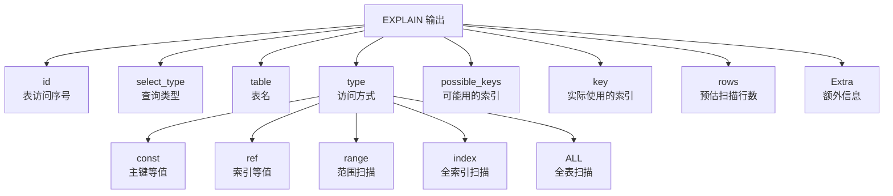
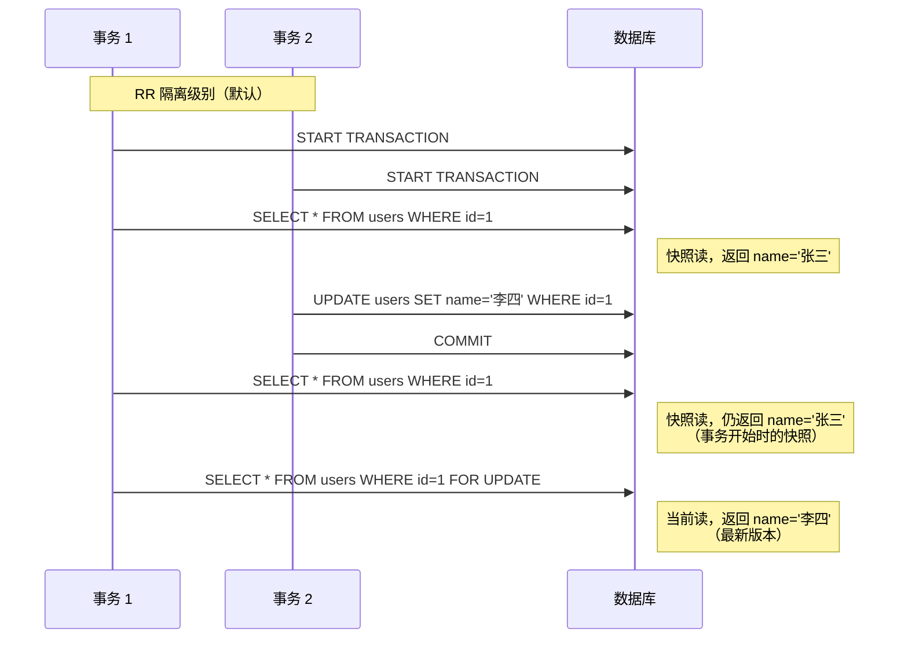

# MySQL 动手实验

## 学习目标

- 掌握 MySQL 的基本安装、配置与使用
- 理解 InnoDB 的关键特性（MVCC、锁、索引）的实验验证方法
- 学会使用 EXPLAIN 分析查询执行计划
- 了解性能监控与调优的基本方法

## 核心概念

- **Docker 部署**：使用官方 MySQL Docker 镜像快速启动实例
- **CRUD 实验**：基本的 INSERT/SELECT/UPDATE/DELETE 操作
- **EXPLAIN 分析**：理解 MySQL 执行计划的解读方法
- **锁与 MVCC 实验**：通过实验验证 InnoDB 的并发控制机制
- **性能监控**：`SHOW ENGINE INNODB STATUS`、Performance Schema、sys 库

## Docker 部署 MySQL

### 启动 MySQL 容器

```bash
# 拉取官方镜像
docker pull mysql:8.4

# 启动容器
docker run -d \
  --name mysql-lab \
  -e MYSQL_ROOT_PASSWORD=yourpassword \
  -e MYSQL_DATABASE=testdb \
  -p 3306:3306 \
  mysql:8.4

# 进入 MySQL 命令行
docker exec -it mysql-lab mysql -uroot -pyourpassword testdb
```

### 基本配置（my.cnf）

```ini
[mysqld]
# InnoDB 配置
innodb_buffer_pool_size = 1G        # 物理内存的 60-80%
innodb_log_file_size = 256M         # Redo Log 大小
innodb_flush_log_at_trx_commit = 1  # 每次提交刷盘
innodb_flush_method = O_DIRECT      # 避免 OS Cache

# 日志配置
log_error = /var/log/mysql/error.log
slow_query_log = 1
slow_query_log_file = /var/log/mysql/slow.log
long_query_time = 2

# 隔离级别
transaction_isolation = REPEATABLE-READ
```

## CRUD 基本操作

### 创建表与插入数据

```sql
-- 创建用户表
CREATE TABLE users (
    id INT AUTO_INCREMENT PRIMARY KEY,
    name VARCHAR(50) NOT NULL,
    email VARCHAR(100),
    created_at TIMESTAMP DEFAULT CURRENT_TIMESTAMP,
    INDEX idx_email (email)
) ENGINE=InnoDB;

-- 插入数据
INSERT INTO users (name, email) VALUES
    ('张三', 'zhangsan@example.com'),
    ('李四', 'lisi@example.com'),
    ('王五', 'wangwu@example.com');

-- 查询
SELECT * FROM users WHERE id = 1;

-- 更新
UPDATE users SET email = 'newemail@example.com' WHERE id = 1;

-- 删除
DELETE FROM users WHERE id = 3;
```

### 查看 InnoDB 行格式

```sql
-- 查看表的行格式
SHOW TABLE STATUS LIKE 'users';

-- 查看表结构
SHOW CREATE TABLE users\G

-- 查看数据目录
SHOW VARIABLES LIKE 'datadir';
-- 输出：/var/lib/mysql/
-- InnoDB 表空间文件：testdb/users.ibd
```

## EXPLAIN 执行计划分析

### EXPLAIN 基本使用

```sql
-- 创建测试表
CREATE TABLE orders (
    id INT AUTO_INCREMENT PRIMARY KEY,
    user_id INT NOT NULL,
    amount DECIMAL(10,2),
    order_date DATE,
    INDEX idx_user_id (user_id),
    INDEX idx_date (order_date)
);

-- 插入测试数据
INSERT INTO orders (user_id, amount, order_date)
SELECT
    FLOOR(1 + RAND() * 100),
    RAND() * 1000,
    DATE_ADD('2024-01-01', INTERVAL FLOOR(RAND() * 365) DAY)
FROM information_schema.columns
LIMIT 10000;

-- 全表扫描
EXPLAIN SELECT * FROM orders\G
-- type: ALL（全表扫描）

-- 索引查找
EXPLAIN SELECT * FROM orders WHERE user_id = 10\G
-- type: ref（索引查找）
-- key: idx_user_id

-- 范围扫描
EXPLAIN SELECT * FROM orders WHERE user_id > 10 AND user_id < 20\G
-- type: range（范围扫描）

-- 索引覆盖（Covering Index）
EXPLAIN SELECT user_id FROM orders WHERE user_id = 10\G
-- Extra: Using index（索引覆盖，不需要回表）
```

### EXPLAIN 输出解读



**type 字段（从快到慢）**：

| type | 说明 | 性能 |
|------|------|------|
| system / const | 主键等值查询 | 最快 |
| eq_ref | JOIN 使用主键 | 快 |
| ref | 非唯一索引等值 | 较快 |
| range | 范围扫描 | 中等 |
| index | 全索引扫描 | 较慢 |
| ALL | 全表扫描 | 最慢 |

**Extra 字段关键信息**：

- `Using index`：索引覆盖，不需要回表
- `Using where`：WHERE 条件过滤
- `Using filesort`：需要排序（可能使用临时文件）
- `Using temporary`：使用临时表（GROUP BY / DISTINCT）
- `Using join buffer`：Join 使用缓冲区

## 锁与 MVCC 实验

### 行锁实验

```sql
-- 会话 1：开启事务，锁定一行
START TRANSACTION;
SELECT * FROM users WHERE id = 1 FOR UPDATE;

-- 会话 2：尝试修改同一行（会被阻塞）
START TRANSACTION;
UPDATE users SET email = 'blocked@example.com' WHERE id = 1;
-- 等待会话 1 提交或回滚

-- 会话 1：提交事务
COMMIT;
-- 会话 2 的 UPDATE 执行成功
```

**查看锁信息**：

```sql
-- MySQL 8.0+
SELECT * FROM performance_schema.data_locks
WHERE OBJECT_NAME = 'users'\G

-- 输出：
-- LOCK_TYPE: RECORD（行锁）
-- LOCK_MODE: X（排他锁）
-- LOCK_DATA: 1（锁定的主键值）
```

### MVCC 实验



**实验步骤**：

```sql
-- 会话 1：开启事务，查看数据
START TRANSACTION;
SELECT * FROM users WHERE id = 1;
-- 输出：张三

-- 会话 2：更新数据并提交
START TRANSACTION;
UPDATE users SET name = '李四' WHERE id = 1;
COMMIT;

-- 会话 1：再次查询（快照读）
SELECT * FROM users WHERE id = 1;
-- 输出：张三（事务开始时的快照，不变）

-- 会话 1：当前读
SELECT * FROM users WHERE id = 1 FOR UPDATE;
-- 输出：李四（最新版本）
```

### Next-Key Lock 实验

```sql
-- 创建测试表（RR 隔离级别）
CREATE TABLE t (
    id INT PRIMARY KEY,
    c INT,
    INDEX idx_c (c)
) ENGINE=InnoDB;

INSERT INTO t VALUES (1, 10), (3, 20), (5, 30), (7, 40);

-- 会话 1：范围查询（会加 Next-Key Lock）
START TRANSACTION;
SELECT * FROM t WHERE c BETWEEN 20 AND 30 FOR UPDATE;

-- 会话 2：尝试插入 c=25（会被阻塞，因为间隙被锁）
INSERT INTO t VALUES (4, 25);
-- 阻塞等待

-- 会话 1：提交
COMMIT;
-- 会话 2 的 INSERT 执行成功
```

**查看锁定的范围**：

```sql
SELECT * FROM performance_schema.data_locks
WHERE OBJECT_NAME = 't' AND LOCK_TYPE = 'RECORD'\G

-- 输出：
-- LOCK_MODE: X,REC_NOT_GAP（记录锁）
-- LOCK_MODE: X,GAP（间隙锁）
-- LOCK_MODE: X（Next-Key Lock = 记录 + 间隙）
```

## 性能监控

### SHOW ENGINE INNODB STATUS

```sql
SHOW ENGINE INNODB STATUS\G

-- 关键输出：
-- 1. BACKGROUND THREAD：后台线程信息
-- 2. SEMAPHORES：信号量等待
-- 3. LATEST DETECTED DEADLOCK：最近检测到的死锁
-- 4. TRANSACTIONS：活跃事务
-- 5. FILE I/O：IO 操作统计
-- 6. BUFFER POOL AND MEMORY：Buffer Pool 状态
-- 7. ROW OPERATIONS：行操作统计
```

### Performance Schema

```sql
-- 查看等待事件
SELECT * FROM performance_schema.events_waits_summary_global_by_event_name
ORDER BY COUNT_STAR DESC
LIMIT 10;

-- 查看文件 IO
SELECT * FROM performance_schema.file_summary_by_instance
WHERE FILE_NAME LIKE '%ibd%'
ORDER BY COUNT_READ DESC
LIMIT 10;

-- 查看 SQL 执行统计
SELECT DIGEST_TEXT, COUNT_STAR, SUM_TIMER_WAIT/1000000000 AS latency_ms
FROM performance_schema.events_statements_summary_by_digest
ORDER BY SUM_TIMER_WAIT DESC
LIMIT 10;
```

### sys 库（MySQL 8.0+）

```sql
-- 查看慢查询
SELECT * FROM sys.statements_with_runtimes_in_95th_percentile
LIMIT 10;

-- 查看 InnoDB Buffer Pool 状态
SELECT * FROM sys.innodb_buffer_stats_by_table
ORDER BY pages
LIMIT 10;

-- 查看冗余索引
SELECT * FROM sys.schema_unused_indexes;
```

## 性能调优建议

### 索引优化

```sql
-- 查看表的索引使用情况
SELECT
    TABLE_NAME,
    INDEX_NAME,
    CARDINALITY,
    SEQ_IN_INDEX
FROM information_schema.STATISTICS
WHERE TABLE_SCHEMA = 'testdb'
ORDER BY TABLE_NAME, INDEX_NAME;

-- 查找未被使用的索引（MySQL 8.0+）
SELECT * FROM sys.schema_unused_indexes
WHERE object_schema = 'testdb';

-- 强制使用索引（测试用）
SELECT * FROM users FORCE INDEX (idx_email) WHERE email = 'test@example.com';

-- 禁用索引（测试全表扫描性能）
ALTER TABLE users DISABLE KEYS;
-- 批量插入数据
ALTER TABLE users ENABLE KEYS;
```

### 查询优化

```sql
-- 开启慢查询日志
SET GLOBAL slow_query_log = ON;
SET GLOBAL long_query_time = 2;

-- 查看 EXPLAIN FORMAT=JSON（详细信息）
EXPLAIN FORMAT=JSON SELECT * FROM users WHERE email = 'test@example.com'\G

-- 查看优化器追踪（MySQL 8.0+）
SET optimizer_trace = 'enabled=on';
SELECT * FROM users WHERE email = 'test@example.com';
SELECT * FROM information_schema.OPTIMIZER_TRACE\G
SET optimizer_trace = 'enabled=off';
```

### InnoDB 配置调优

| 参数 | 推荐值 | 说明 |
|------|--------|------|
| `innodb_buffer_pool_size` | 物理内存 60-80% | Buffer Pool 大小 |
| `innodb_log_file_size` | 256M-1G | Redo Log 大小 |
| `innodb_flush_log_at_trx_commit` | 1 | 每次 commit 刷盘 |
| `innodb_flush_method` | O_DIRECT | 避免 OS Cache |
| `innodb_io_capacity` | 2000 (SSD) | IO 能力估计 |
| `innodb_io_capacity_max` | 4000 (SSD) | 最大 IO 能力 |

## 要点总结

- Docker 部署 MySQL 是最快的实验方式，适合学习环境
- EXPLAIN 是理解 MySQL 执行计划的核心工具，重点关注 type、key、rows、Extra 字段
- 通过锁实验和 MVCC 实验可以深入理解 InnoDB 的并发控制机制
- Performance Schema 和 sys 库是 MySQL 8.0+ 的性能监控利器
- 索引优化和查询优化是性能调优的重点，应避免全表扫描和无用索引

## 思考题

1. 在锁实验中，为什么 `SELECT ... FOR UPDATE` 会阻塞其他事务的 UPDATE？
2. MVCC 实验中，为什么 RR 级别下的快照读返回旧数据，而当前读返回新数据？
3. 如何判断一个索引是否应该被删除？（提示：使用 sys 库）
4. 如果 `EXPLAIN` 显示 `type: ALL`（全表扫描），应该从哪些方面优化？