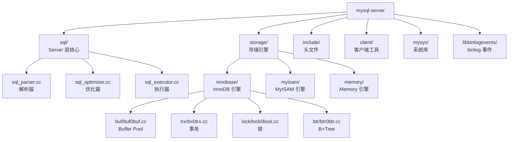
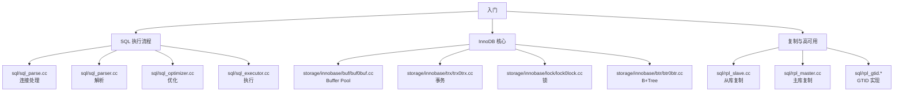
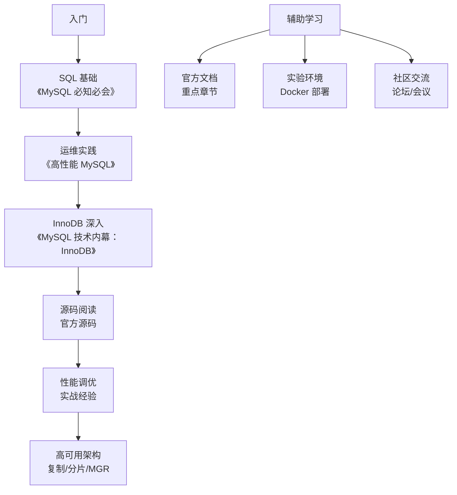

# MySQL 学习资源

## 学习目标

- 了解 MySQL 的官方文档、书籍、论文等学习资源
- 掌握 MySQL 源码阅读的路径与关键模块
- 熟悉 MySQL 社区生态与工具链

## 核心概念

- **官方文档**：MySQL 官方参考手册是最权威的学习资料
- **源码结构**：MySQL 源码的目录组织与关键文件
- **书籍推荐**：从入门到进阶的经典书籍
- **论文参考**：InnoDB、Group Replication 等核心技术的学术论文
- **社区生态**：Percona、MariaDB、MySQL 社区资源

## 官方文档

### MySQL 官方参考手册

- **网址**：[https://dev.mysql.com/doc/refman/8.4/en/](https://dev.mysql.com/doc/refman/8.4/en/)
- **主要内容**：
  - SQL 语法参考
  - 存储引擎（InnoDB、MyISAM、Memory 等）
  - 复制与高可用
  - 性能优化
  - 管理与维护

**关键章节推荐**：

1. **Chapter 1 General Information**：MySQL 历史、许可证、版本策略
2. **Chapter 5 Server Administration**：服务器配置、日志、权限管理
3. **Chapter 8 Optimization**：查询优化、索引优化、配置优化
4. **Chapter 14 InnoDB Storage Engine**：InnoDB 架构、MVCC、锁、事务
5. **Chapter 16 Replication**：主从复制、GTID、半同步复制、组复制
6. **Chapter 22 Performance Schema**：Performance Schema 使用指南
7. **Chapter 24 MySQL Internals**：MySQL 内部实现（文件格式、日志格式等）

### MySQL Workbench 文档

- **网址**：[https://dev.mysql.com/doc/workbench/en/](https://dev.mysql.com/doc/workbench/en/)
- **用途**：可视化管理工具、数据建模、SQL 开发

## 源码阅读

### MySQL 源码结构

**关键源码文件**：

| 模块 | 文件路径 | 说明 |
|------|---------|------|
| SQL 解析器 | `sql/sql_parser.cc` / `sql/sql_yacc.yy` | 词法与语法分析 |
| 查询优化器 | `sql/sql_optimizer.cc` | 逻辑优化 + 物理优化 |
| 查询执行器 | `sql/sql_executor.cc` | 执行计划执行 |
| InnoDB Buffer Pool | `storage/innobase/buf/buf0buf.cc` | Buffer Pool 实现 |
| InnoDB 事务 | `storage/innobase/trx/trx0trx.cc` | 事务管理 |
| InnoDB 锁 | `storage/innobase/lock/lock0lock.cc` | 锁管理 |
| InnoDB B+Tree | `storage/innobase/btr/btr0btr.cc` | B+Tree 索引 |
| InnoDB Redo Log | `storage/innobase/log/log0log.cc` | Redo Log |
| InnoDB Undo Log | `storage/innobase/trx/trx0undo.cc` | Undo Log |

### 源码阅读路径

## 书籍推荐

### 入门级

| 书名 | 作者 | 特点 |
|------|------|------|
| 《MySQL 必知必会》 | Ben Forta | SQL 入门经典，适合初学者 |
| 《MySQL 技术内幕：SQL 编程》 | 姜尧 | SQL 深入讲解，适合进阶 |
| 《高性能 MySQL》（第 4 版） | Baron Schwartz 等 | 性能优化圣经，必读 |

### 进阶级

| 书名 | 作者 | 特点 |
|------|------|------|
| 《MySQL 技术内幕：InnoDB 存储引擎》 | 姜尧 | InnoDB 深入剖析，国内经典 |
| 《MySQL 运维内参》 | 周彦伟等 | 运维实践，生产经验 |
| 《MySQL 内核：InnoDB 存储引擎》 | 姜尧 | 源码分析，适合深入研究 |
| 《Database System Concepts》 | Abraham Silberschatz | 数据库理论经典 |

### 英文经典

| 书名 | 作者 | 特点 |
|------|------|------|
| *High Performance MySQL* | Baron Schwartz et al. | 性能优化权威指南 |
| *MySQL 8 Cookbook* | Karthik Appigatla | MySQL 8.0 实战 |
| *Learning MySQL* | Vinicius M. Grippa | 系统学习 MySQL |

## 论文参考

### InnoDB 相关论文

MySQL/InnoDB 并没有像 PostgreSQL 那样发表大量学术论文，但以下论文对理解 InnoDB 有帮助：

1. **"The InnoDB Storage Engine"**（MySQL 官方文档）
   - InnoDB 的官方设计文档
   - 解释了 Buffer Pool、Redo Log、Undo Log 的设计

2. **"MySQL Plugin Storage Engines"**（MySQL 官方白皮书）
   - 可插拔存储引擎的设计理念

### B+Tree 索引论文

1. **"The B-Tree and the B+Tree"**（Rudolf Bayer, Edward M. McCreight, 1972）
   - B-Tree 的原始论文
   - InnoDB 使用 B+Tree（叶子节点形成链表）

2. **"The Ubiquitous B-Tree"**（Douglas Comer, 1979）
   - B-Tree 在数据库系统中的应用

### MVCC 论文

1. **"MVCC: Multiversion Concurrency Control"**（David P. Reed, 1983）
   - MVCC 的理论基础
   - InnoDB 的 Undo Log MVCC 实现参考了此文

### 复制与高可用论文

1. **"MySQL Group Replication: A New Horizon"**（MySQL 官方白皮书）
   - 组复制的设计原理（基于 Paxos）

2. **"Paxos Made Simple"**（Leslie Lamport, 2001）
   - Paxos 协议的经典论文
   - MGR 基于 Paxos 实现共识

### 性能优化论文

1. **"Query Optimization"**（Graefe, 1993）
   - 查询优化的经典综述
   - MySQL 优化器的设计参考

## 社区生态

### Percona

- **网址**：[https://www.percona.com/](https://www.percona.com/)
- **主要产品**：
  - Percona Server for MySQL：增强版 MySQL
  - Percona XtraBackup：热备份工具
  - Percona Toolkit：运维工具集
  - PMM（Percona Monitoring and Management）：监控平台

### MariaDB

- **网址**：[https://mariadb.org/](https://mariadb.org/)
- **特点**：
  - MySQL 的分支，由 Monty（MySQL 创始人）创建
  - 完全开源，社区驱动
  - 新特性迭代更快（例如 ColumnStore、Spider 引擎）

### MySQL 社区

- **官方网站**：[https://www.mysql.com/](https://www.mysql.com/)
- **论坛**：[https://forums.mysql.com/](https://forums.mysql.com/)
- **GitHub**：[https://github.com/mysql/mysql-server](https://github.com/mysql/mysql-server)
- **Bug 提交**：[https://bugs.mysql.com/](https://bugs.mysql.com/)

### 中文社区

- **MySQL 中文社区**：[http://www.mysql.com.cn/](http://www.mysql.com.cn/)
- **知数堂**：[https://www.zhishutang.com/](https://www.zhishutang.com/)
- **爱可生开源社区**：[https://www.actionsky.com/](https://www.actionsky.com/)

## 工具链

### 运维工具

| 工具 | 用途 | 说明 |
|------|------|------|
| mysqldump | 逻辑备份 | 官方工具 |
| mysqlpump | 并行逻辑备份 | MySQL 5.7+ |
| Percona XtraBackup | 物理热备份 | 开源，生产推荐 |
| MyDumper | 并行逻辑备份 | 第三方，速度快 |
| pt-online-schema-change | 在线 DDL | Percona Toolkit |
| Orchestrator | 拓扑管理 | 自动故障切换 |
| ProxySQL | 中间件 | 读写分离 + 连接池 |

### 监控工具

| 工具 | 用途 | 说明 |
|------|------|------|
| PMM（Percona Monitoring and Management） | 监控平台 | 基于 Prometheus + Grafana |
| Prometheus + mysqld_exporter | 监控指标采集 | 开源监控方案 |
| Grafana | 可视化 | 配合 Prometheus |
| Zabbix | 监控平台 | 企业级监控 |

### 开发工具

| 工具 | 用途 | 说明 |
|------|------|------|
| MySQL Workbench | 可视化管理 | 官方工具 |
| DBeaver | 数据库客户端 | 开源，支持多种数据库 |
| Navicat | 数据库客户端 | 商业软件 |
| phpMyAdmin | Web 管理界面 | LAMP 栈常用 |

## 学习路径建议

**推荐学习顺序**：

1. **第 1-2 周**：阅读《MySQL 必知必会》，掌握 SQL 基础
2. **第 3-4 周**：搭建实验环境（Docker），实践 CRUD 操作
3. **第 5-8 周**：阅读《高性能 MySQL》前 6 章，理解架构与优化
4. **第 9-12 周**：阅读《MySQL 技术内幕：InnoDB》，深入存储引擎
5. **第 13-16 周**：阅读官方文档关键章节（InnoDB、Replication、Performance Schema）
6. **第 17-20 周**：源码阅读（Buffer Pool、事务、锁、B+Tree）
7. **第 21-24 周**：性能调优实战、高可用架构设计

## 要点总结

- MySQL 官方文档是最权威的学习资料，应重点关注 InnoDB、Replication、Performance Schema 章节
- 源码阅读应从 Server 层的 SQL 执行流程和 InnoDB 的核心模块开始
- 《高性能 MySQL》和《MySQL 技术内幕：InnoDB》是必读经典书籍
- Percona、MariaDB 提供了丰富的开源工具和社区资源
- 学习路径应从 SQL 基础 -> 架构理解 -> InnoDB 深入 -> 源码阅读 -> 性能调优

## 思考题

1. MySQL 的源码结构与 PostgreSQL 相比，有哪些差异？（提示：Server/Engine 分离 vs 单引擎）
2. 为什么 MySQL 的学术论文较少？这反映了什么设计哲学？
3. Percona XtraBackup 实现热备份的原理是什么？为什么 mysqldump 无法做到？
4. 如果要深入学习 InnoDB 的 MVCC 实现，应该阅读哪些源码文件？