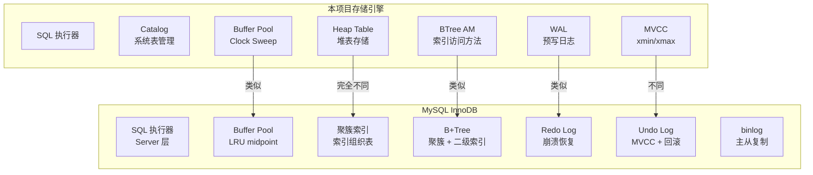
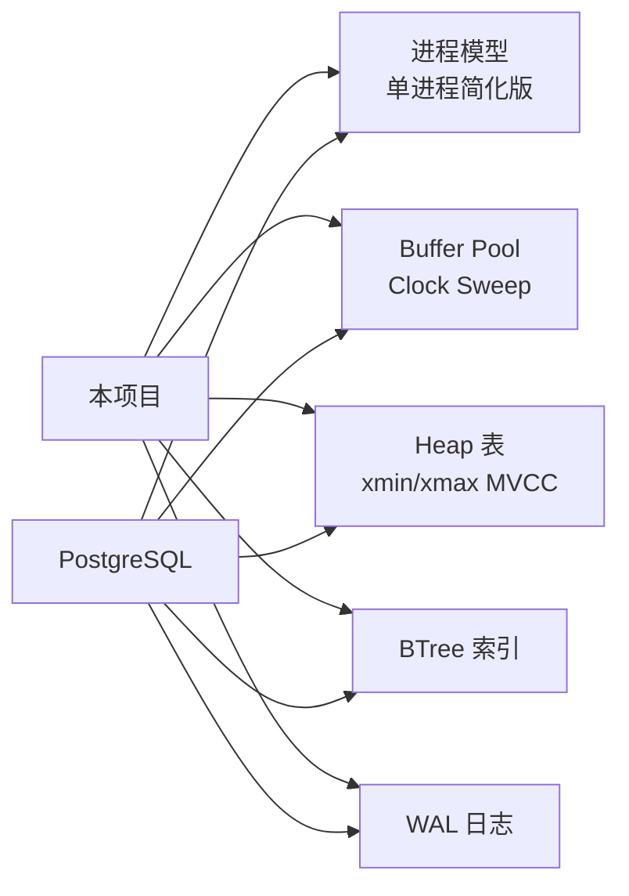
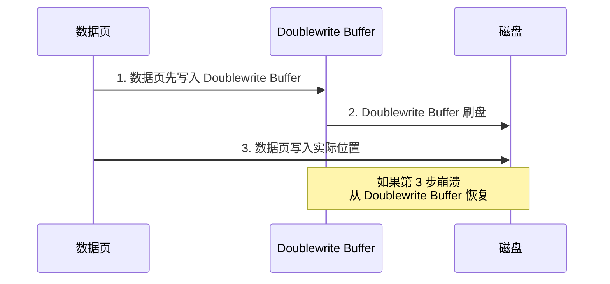
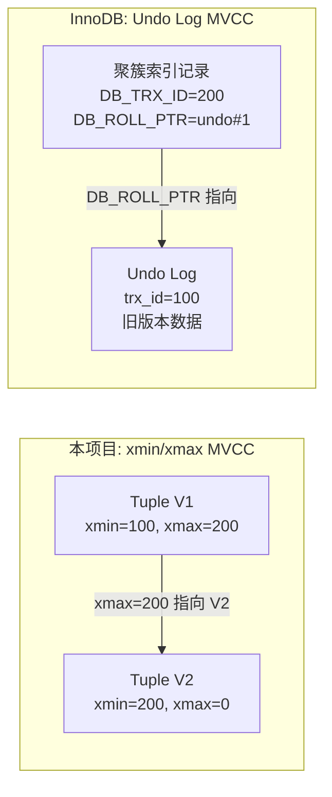
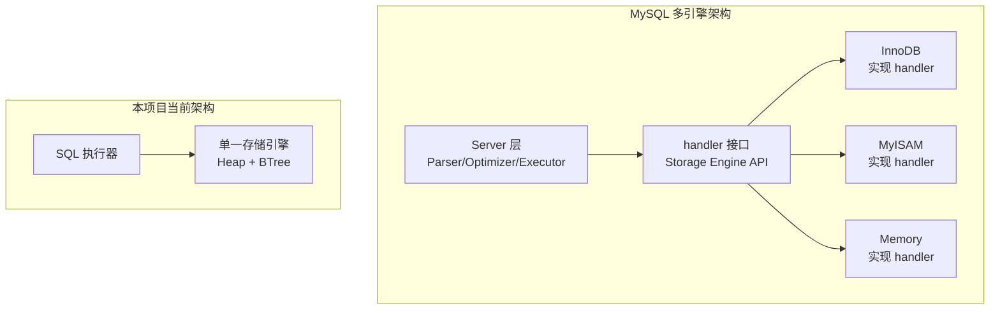

# MySQL 与项目关联

## 学习目标

- 理解本项目存储引擎与 MySQL InnoDB 的架构对应关系
- 掌握 MySQL 的设计理念对本项目开发的有益借鉴
- 明确本项目已经实现的模块和可以继续学习的方向

## 核心概念

- **本项目存储引擎**：基于 PostgreSQL 风格实现的简易存储引擎，但 MySQL 的设计也有重要参考价值
- **InnoDB 借鉴点**：聚簇索引、Change Buffer、Doublewrite、Undo Log MVCC 等设计
- **差异点**：本项目是 Heap 表（PG 风格），InnoDB 是索引组织表（IOT）
- **可以扩展的方向**：从 InnoDB 借鉴的设计模式

## 架构对比

### 整体架构映射

### 模块对应关系

| 模块 | 本项目 | MySQL InnoDB | 对比说明 |
|------|--------|-------------|---------|
| Buffer Pool | Clock Sweep（usage_count） | LRU 变体（midpoint insertion） | 算法不同，功能类似 |
| 表存储 | Heap 表（堆表 + 独立索引） | 聚簇索引（索引组织表） | 架构完全不同 |
| 页面 | 8KB 固定大小 | 16KB 默认（可配置） | 页面大小不同 |
| 索引 | BTree（B+Tree 变体） | B+Tree（聚簇 + 二级） | 索引结构类似 |
| 事务日志 | WAL（XLog） | Redo Log + Undo Log | 日志体系不同 |
| MVCC | xmin/xmax（版本号） | Undo Log（回滚段） | 实现机制不同 |
| 锁 | Spinlock + LWLock + Lock Manager | 行锁 + 间隙锁 + 意向锁 | 锁体系不同 |
| 复制 | 未实现 | binlog 主从复制 | 本项目未实现复制 |

## 本项目的 PostgreSQL 风格

### 当前实现

本项目目前的存储引擎实现遵循 PostgreSQL 风格：

| 模块 | 实现文件 | 说明 |
|------|---------|------|
| Catalog | `catalog.h/c` | 系统表管理，OID 分配 |
| Buffer Pool | `bufmgr.h/c` | Clock Sweep 淘汰算法 |
| Heap Table | `heapam.h/c` | 堆表存储，Tuple 管理 |
| BTree Index | `btreeam.h/c` | BTree 索引 |
| WAL | `wal.h/c` | 预写日志 |
| Lock | `lock.h/c` | 锁管理 |
| MVCC | 通过 xmin/xmax 实现 | 版本链 |

### 与 PostgreSQL 的相似度

## MySQL InnoDB 的可借鉴设计

### 1. 聚簇索引（Clustered Index）

InnoDB 的聚簇索引设计是它最核心的特征。虽然本项目使用 Heap 表，但可以借鉴：

**InnoDB 的做法**：

- 主键即聚簇索引，叶子节点存储完整行数据
- 二级索引叶子节点存储主键值（不是行指针）
- 数据按主键顺序物理存储，范围扫描效率高

**对本项目的启示**：

- 如果本项目要支持"索引组织表"，可以新增一个 `iot.c` 模块
- 在 Catalog 中增加 `relkind` 字段区分 Heap 表和 IOT 表
- 聚簇索引在等值查询和范围扫描上性能更好

### 2. Change Buffer（变更缓冲）

InnoDB 的 Change Buffer 是一个有趣的设计，本项目的 Heap 表没有二级索引变更缓冲问题，但可以考虑：

**InnoDB 的做法**：

- 修改非唯一二级索引时，不直接写入索引页
- 先写入 Change Buffer，等索引页被读入 Buffer Pool 时再合并
- 减少随机 IO，提高写入性能

**对本项目的启示**：

- 本项目如果实现二级索引，可以参考 Change Buffer 的设计
- 在 `btreeam.c` 中增加延迟插入功能

### 3. Doublewrite Buffer（双写缓冲）

InnoDB 的 Doublewrite Buffer 解决了"页损坏"问题：

**InnoDB 的做法**：

- 在写入数据页之前，先将整页内容写入 Doublewrite Buffer
- 如果写入过程中发生崩溃，可以从 Doublewrite Buffer 恢复
- 防止"部分写入"（Partial Write）导致的数据损坏

**对本项目的启示**：

- 本项目的 WAL 日志记录的是变更记录，不是整页
- 如果要实现类似功能，可以参考 Doublewrite 的"写前备份"思路
- 在 `page.c` 中增加写前校验和验证

### 4. Undo Log MVCC（回滚段版本链）

InnoDB 的 MVCC 实现基于 Undo Log，与 PostgreSQL 的 xmin/xmax 方案不同：

**InnoDB 的做法**：

- 每个行记录在聚簇索引中维护 DB_TRX_ID 和 DB_ROLL_PTR
- DB_ROLL_PTR 指向 Undo Log 中的旧版本
- Read View 通过 Undo Log 版本链获取可见版本

**对本项目的启示**：

- 本项目目前使用 xmin/xmax 实现 MVCC（PG 风格）
- 可以在 XXX 系统表中增加 Undo Log 表，实现 InnoDB 风格的 MVCC 作为对比实验

### 5. 自适应哈希索引（Adaptive Hash Index）

InnoDB 自动为热点页建立哈希索引，加速等值查询：

**InnoDB 的做法**：

- 监控索引页的访问模式
- 当某个页的等值查询频繁命中时，自动建立哈希索引
- 哈希索引存储在 Buffer Pool 中，不持久化

**对本项目的启示**：

- 本项目可以在 Buffer Pool 中增加自适应哈希索引功能
- 在 `bufmgr.c` 中增加访问次数统计，自动建立哈希索引

### 6. 可插拔引擎架构

MySQL 最独特的特性——Server 层与 Engine 层分离：

**InnoDB 的做法**：

- `handler` 接口定义存储引擎的通用 API
- 不同引擎实现不同的 `handler` 子类
- 用户可以在表级别指定引擎

**对本项目的启示**：

- 本项目目前只有一个存储引擎（Heap + BTree）
- 可以从方法表（Method Table）开始设计引擎接口
- 参考 `rel.h` 中的 Relation 抽象，扩展为多引擎支持

## 本项目可以学习的 MySQL 特性

### 基础功能层

| 可学习特性 | 难度 | 说明 |
|-----------|------|------|
| 聚簇索引 | 高 | 需要重构存储引擎，新增 IOT 表类型 |
| Change Buffer | 中 | 在 Buffer Pool 中增加变更缓存 |
| Doublewrite | 中 | 在 WAL 中增加页备份机制 |
| Undo Log MVCC | 高 | 新增 Undo Log 表空间和版本链 |
| 自适应哈希 | 中 | 在 Buffer Pool 中增加 AHI 功能 |

### 测试与实验

| 实验项目 | 说明 |
|---------|------|
| Buffer Pool 算法对比 | 对比 Clock Sweep vs LRU midpoint 的命中率 |
| MVCC 实现对比 | 对比 xmin/xmax vs Undo Log 的性能差异 |
| 页面大小对比 | 对比 8KB vs 16KB 页面在不同场景下的性能 |
| 双层架构设计 | 参考 MySQL 的 Server/Engine 分离，设计本项目的引擎接口 |

## 扩展建议

### 短期（1-2 周）

1. **Buffer Pool 算法实验**：在 `bufmgr.c` 中增加 LRU 实现，对比 Clock Sweep 的命中率
2. **页面大小可配置**：参考 InnoDB 的 `innodb_page_size`，支持页面大小可配置

### 中期（1-2 个月）

1. **聚簇索引实验**：新增 `iot.c` 实现索引组织表，对比 Heap 表的性能差异
2. **Change Buffer 实验**：在 Buffer Pool 中增加变更缓冲，延迟写入二级索引

### 长期（3-6 个月）

1. **多引擎架构**：参考 MySQL 的 `handler` 接口，设计本项目的存储引擎 API
2. **Undo Log MVCC 对比**：实现 Undo Log 风格的 MVCC，对比 xmin/xmax 风格

## 要点总结

- 本项目当前基于 PostgreSQL 风格实现存储引擎（Heap 表、Clock Sweep、xmin/xmax MVCC）
- MySQL InnoDB 与 PostgreSQL 在存储架构、MVCC 实现、日志体系上差异显著
- InnoDB 的聚簇索引、Change Buffer、Doublewrite 等设计对本项目有借鉴价值
- 本项目可以通过实验对比两种风格的设计差异，加深对数据库存储引擎的理解
- 学习 InnoDB 的设计不是为了照搬，而是理解不同设计权衡背后的原因

## 思考题

1. 本项目使用 Heap 表（PG 风格），如果改为聚簇索引（InnoDB 风格），哪些模块需要修改？
2. Change Buffer 在什么场景下收益最大？在本项目实现二级索引后，是否值得实现 Change Buffer？
3. Doublewrite Buffer 解决了"部分写入"问题，本项目当前的 WAL 机制是否能防止部分写入？
4. MySQL 的 Server/Engine 分离架构与 PG 的单引擎架构，哪种更适合本项目？为什么？
5. 如果本项目要实现多引擎支持，应该从哪些模块开始设计？