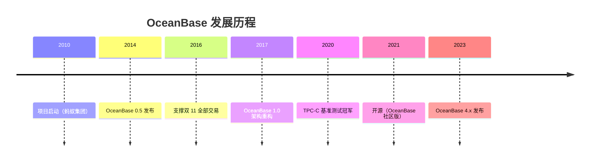
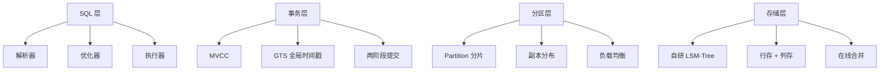

# OceanBase 学习 Wiki — 概述

## 学习目标

- 了解 OceanBase 的历史地位和设计哲学
- 掌握 OceanBase 的四层架构
- 理解 OceanBase 与 TiDB、CockroachDB 的核心差异

## OceanBase 概述

OceanBase 是蚂蚁集团自研的分布式关系型数据库，经历了"双 11"等极端场景验证，目前已开源（OceanBase 社区版）。

### 历史演进

### 核心设计理念

1. **对等架构**：每个 OBServer 既做计算也做存储，无单点瓶颈
2. **Paxos 共识**：自研 Multi-Paxos 协议，强同步复制
3. **自研存储引擎**：自研 LSM-Tree 引擎，支持行存 + 列存
4. **MySQL 兼容**：兼容 MySQL 协议，迁移成本低

## 四层架构

## 与 TiDB / CockroachDB 对比

| 特性 | OceanBase | TiDB | CockroachDB |
|------|-----------|------|-------------|
| 架构 | 对等（计算+存储合一） | 计算存储分离 | 对等 |
| 共识协议 | Multi-Paxos | Raft | Raft |
| 分片单位 | Partition（分区表） | Region（96MB） | Range（512MB） |
| 存储引擎 | 自研 LSM-Tree | RocksDB | RocksDB |
| SQL 兼容 | MySQL | MySQL | PostgreSQL |
| 事务 | MVCC + GTS + 2PC | Percolator | HLC + Write Intent |
| 列存 | 行存+列存混合（自研） | TiFlash（列存扩展） | 仅行存 |
| 开源 | 是（社区版） | 是（Apache 2.0） | 是（BSL） |

## 与 PostgreSQL 对比

| 维度 | OceanBase | PostgreSQL |
|------|-----------|------------|
| 架构 | 分布式对等 | 单体 |
| 存储引擎 | 自研 LSM-Tree | 堆表（Heap） |
| 事务模型 | MVCC + GTS | MVCC（本地时钟） |
| 复制协议 | Multi-Paxos | 流复制（主从） |
| 水平扩展 | 支持 | 不支持 |
| SQL 兼容 | MySQL 协议 | PostgreSQL 原生 |

## 学习路径

1. **架构**：先理解四层架构设计
2. **存储**：自研 LSM-Tree 引擎是核心
3. **事务**：Paxos + GTS + 2PC 实现分布式事务
4. **查询**：SQL 层如何实现分布式执行
5. **索引**：分区表索引设计
6. **实践**：部署和实验

## 思考题

1. OceanBase 为什么选择对等架构（计算+存储合一）而不是 TiDB 的计算存储分离？
2. OceanBase 自研 LSM-Tree 相比 RocksDB 的优势是什么？
3. OceanBase 的 MySQL 兼容性在迁移场景下比 CockroachDB 的 PostgreSQL 兼容性更友好吗？