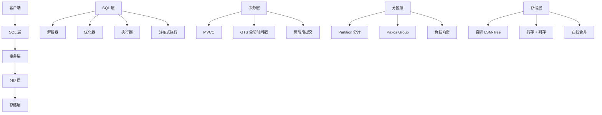
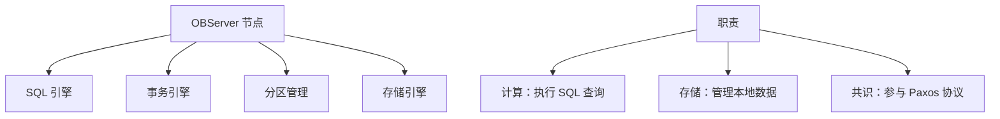
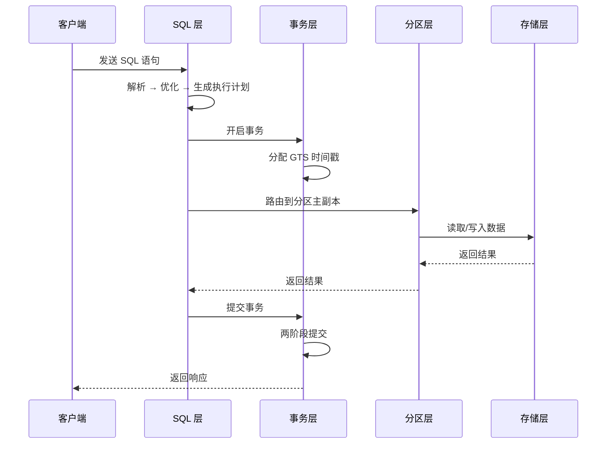

# OceanBase 架构详解

## 学习目标

- 掌握 OceanBase 的四层架构设计
- 理解 OBServer 节点的角色和职责
- 对比 OceanBase 与 TiDB、CockroachDB 的架构差异

## 四层架构

## OBServer 节点

每个 OBServer 是一个独立的进程，包含所有四层功能。

### OBServer 角色

- **主副本（Leader）**：承担读写请求
- **从副本（Follower）**：只读，参与 Paxos 投票
- **学习者（Learner）**：只读，不投票（可选）

## 请求流程

## 与 TiDB 架构对比

| 维度 | OceanBase | TiDB |
|------|-----------|------|
| 节点角色 | OBServer（计算+存储合一） | TiDB Server（计算） + TiKV（存储） |
| 架构模式 | 对等架构 | 计算存储分离 |
| 调度器 | 内置（无独立组件） | PD（Placement Driver） |
| 存储引擎 | 自研 LSM-Tree | RocksDB |
| 列存 | 内置（行存+列存混合） | TiFlash（独立组件） |

## 与 CockroachDB 架构对比

| 维度 | OceanBase | CockroachDB |
|------|-----------|------------|
| 节点角色 | OBServer（对等） | CockroachDB Node（对等） |
| 共识协议 | Multi-Paxos | Raft |
| 分片单位 | Partition（分区表） | Range（512MB） |
| 存储引擎 | 自研 LSM-Tree | RocksDB |
| 列存 | 支持 | 不支持 |

## 与 PostgreSQL 架构对比

| 维度 | OceanBase | PostgreSQL |
|------|-----------|------------|
| 节点角色 | 分布式节点 | 单体进程 |
| 共识协议 | Multi-Paxos | 无（流复制） |
| 水平扩展 | 支持 | 不支持 |
| 存储引擎 | LSM-Tree | 堆表（Heap） |

## 要点总结

- OceanBase 采用四层架构：SQL、事务、分区、存储
- 每个 OBServer 既做计算也做存储，无单点瓶颈
- 与 TiDB 相比：对等架构 vs 计算存储分离
- 与 CockroachDB 相比：Paxos vs Raft，自研引擎 vs RocksDB
- 与 PostgreSQL 相比：分布式 vs 单体

## 思考题

1. OceanBase 的对等架构在运维和扩展上有何优劣势？
2. OBServer 的角色（Leader/Follower/Learner）如何影响负载均衡？
3. 如果一个 OBServer 节点宕机，Paxos 如何保证数据一致性？