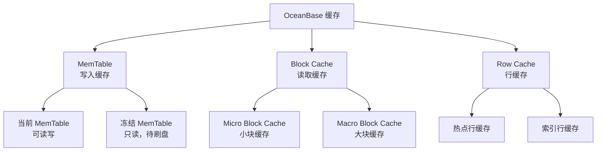
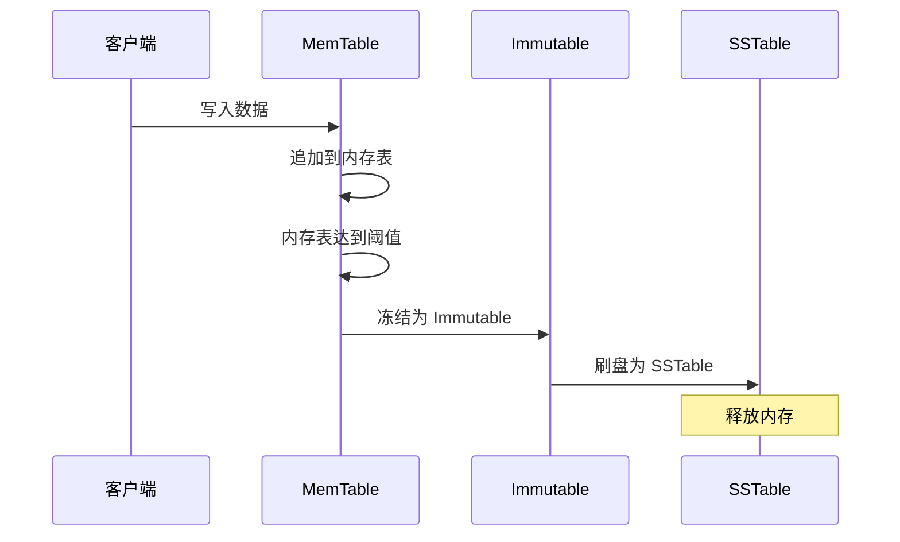

# OceanBase 存储引擎 — Buffer Pool

## 学习目标

- 掌握 OceanBase 的 Buffer Pool 设计
- 理解 OceanBase 的缓存管理策略
- 对比 OceanBase 与 TiDB、CockroachDB 的缓存差异

## OceanBase 的缓存架构

OceanBase 使用自研的 LSM-Tree 引擎，缓存机制与 RocksDB 不同。

## MemTable 写入缓存

## Block Cache 读取缓存

### 缓存粒度

| 缓存类型 | 粒度 | 说明 |
|---------|------|------|
| Micro Block Cache | 16KB～64KB | 小数据块缓存 |
| Macro Block Cache | 2MB～4MB | 大数据块缓存 |
| Row Cache | 行级 | 热点行缓存 |

### 缓存策略

- **LRU 淘汰**：最近最少使用
- **分区缓存**：按 Partition 分区
- **优先级**：Row Cache > Micro Block > Macro Block

## 与 TiDB 缓存对比

| 维度 | OceanBase | TiDB |
|------|-----------|------|
| 缓存引擎 | 自研 | RocksDB Block Cache |
| 写入缓存 | MemTable | MemTable |
| 读取缓存 | Micro/Macro Block Cache | Block Cache（LRU 分片） |
| 行缓存 | 支持 | 不支持 |
| 缓存分区 | 按 Partition | 按 Region |
| 淘汰策略 | LRU | LRU 分片 |

## 与 CockroachDB 缓存对比

| 维度 | OceanBase | CockroachDB |
|------|-----------|------------|
| 缓存引擎 | 自研 | RocksDB Block Cache |
| 写入缓存 | MemTable | MemTable |
| 读取缓存 | Micro/Macro Block Cache | Block Cache |
| 行缓存 | 支持 | 不支持 |
| 淘汰策略 | LRU | LRU |

## 与 PostgreSQL 缓存对比

| 维度 | OceanBase | PostgreSQL |
|------|-----------|------------|
| 缓存引擎 | 自研 LSM-Tree | 共享缓冲区 |
| 写入缓存 | MemTable | 共享缓冲区 |
| 读取缓存 | Block Cache | 共享缓冲区 |
| 缓冲池大小 | 可配置 | shared_buffers |
| 淘汰策略 | LRU | Clock-Sweep |

## 要点总结

- OceanBase 使用自研的 LSM-Tree 缓存机制
- 写入缓存：MemTable → Immutable → SSTable
- 读取缓存：Micro Block Cache + Macro Block Cache
- 行缓存：支持热点行缓存
- 与 TiDB/CockroachDB 相比：自研引擎 vs RocksDB
- 与 PostgreSQL 相比：LSM-Tree vs 共享缓冲区

## 思考题

1. OceanBase 的 MemTable 冻结阈值如何决定？冻结过程中如何保证写入不中断？
2. Micro Block Cache 和 Macro Block Cache 的粒度差异对缓存命中率有何影响？
3. OceanBase 的行缓存相比 TiDB 的 Row Cache 实现有何差异？