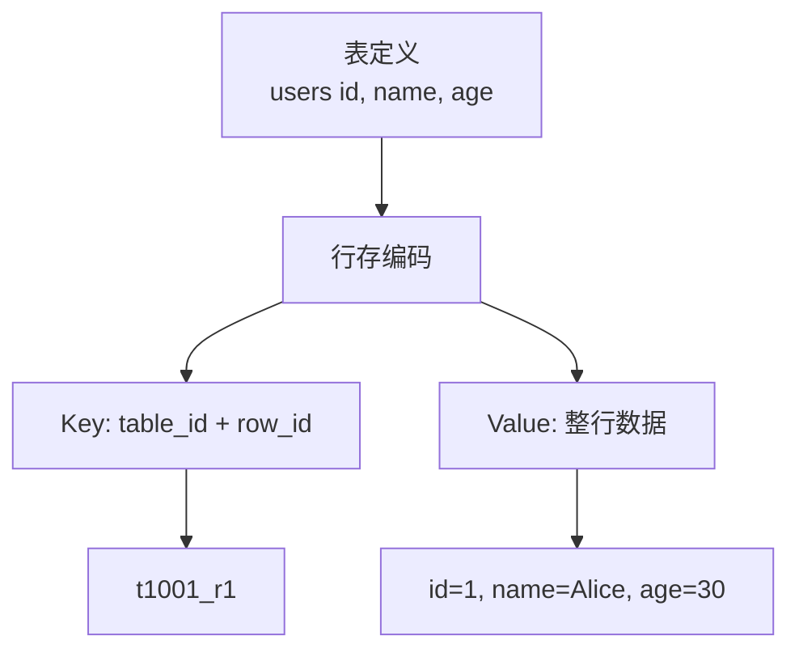
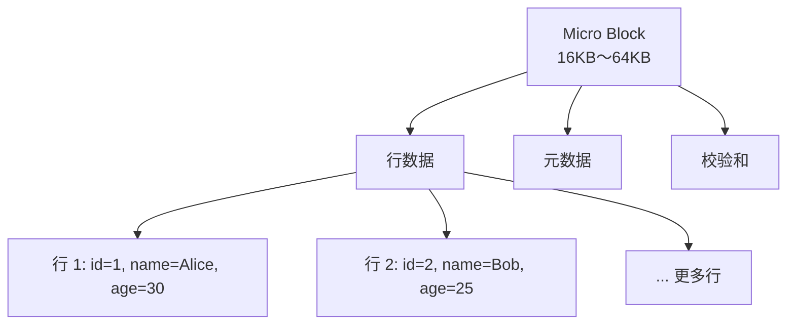

# OceanBase 存储引擎 — 堆表（行存）

## 学习目标

- 掌握 OceanBase 的行存存储结构
- 理解 OceanBase 的 SQL 表到 KV 映射
- 对比 OceanBase 与 TiDB、CockroachDB 的存储差异

## 行存结构

OceanBase 支持行存和列存两种模式。

### 行存模式（默认）



### SQL 表到 KV 映射

```sql
CREATE TABLE users (
    id INT PRIMARY KEY,
    name VARCHAR(100),
    age INT
);
```

**行存映射**：

```
Key: t1001_p1_r1
Value: {id=1, name=Alice, age=30}

Key: t1001_p1_r2
Value: {id=2, name=Bob, age=25}
```

## Micro Block 结构

Micro Block 是 OceanBase 的最小存储单元。



## 与 TiDB 存储对比

| 维度 | OceanBase | TiDB |
|------|-----------|------|
| 存储引擎 | 自研 LSM-Tree | RocksDB |
| 行存模式 | 原生支持 | 默认行存 |
| 存储单元 | Micro Block（16KB～64KB） | SSTable Block |
| KV 编码 | table_id + partition_id + row_id | t<table_id>_r<row_id> |
| 分区 | 按 Partition | 按 Region |
| 主键映射 | 表内唯一 | 表内唯一 |

## 与 CockroachDB 存储对比

| 维度 | OceanBase | CockroachDB |
|------|-----------|------------|
| 存储引擎 | 自研 LSM-Tree | RocksDB |
| 行存模式 | 原生支持 | 默认行存 |
| 存储单元 | Micro Block | SSTable Block |
| KV 编码 | table_id + partition_id + row_id | /table/<id>/<pk> |

## 与 PostgreSQL 存储对比

| 维度 | OceanBase | PostgreSQL |
|------|-----------|------------|
| 存储引擎 | LSM-Tree | 堆表（Heap） |
| 行存模式 | Micro Block | Page（8KB） |
| 元组存储 | 追加写 | 堆表插入 |
| 更新方式 | 追加新版本 | 原地更新 |
| 删除方式 | 追加删除标记 | 标记删除 |

## 要点总结

- OceanBase 使用自研 LSM-Tree 引擎存储行存数据
- 最小存储单元是 Micro Block（16KB～64KB）
- KV 编码格式：table_id + partition_id + row_id
- 与 TiDB 相比：自研引擎 vs RocksDB，Micro Block vs SSTable Block
- 与 PostgreSQL 相比：LSM-Tree 追加写 vs 堆表原地更新

## 思考题

1. OceanBase 的 Micro Block 大小（16KB～64KB）对读写性能有何影响？
2. OceanBase 的追加写模式与 PostgreSQL 的原地更新相比，在写放大和垃圾回收上有何差异？
3. 在 LSM-Tree 中，如何实现高效的点查（Point Query）？