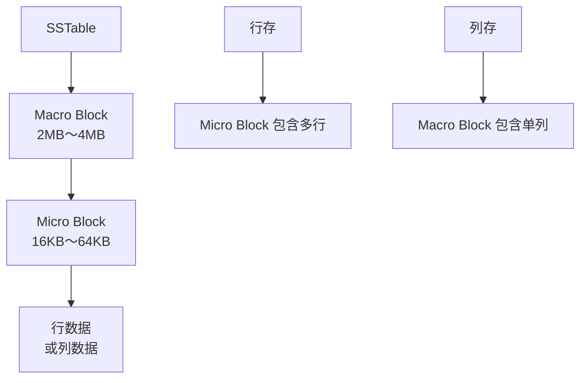
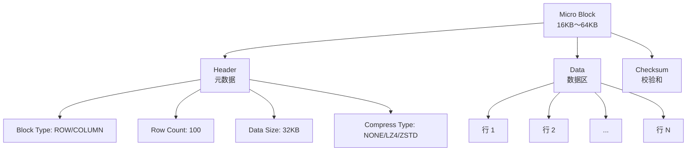
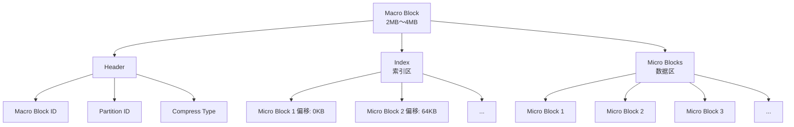
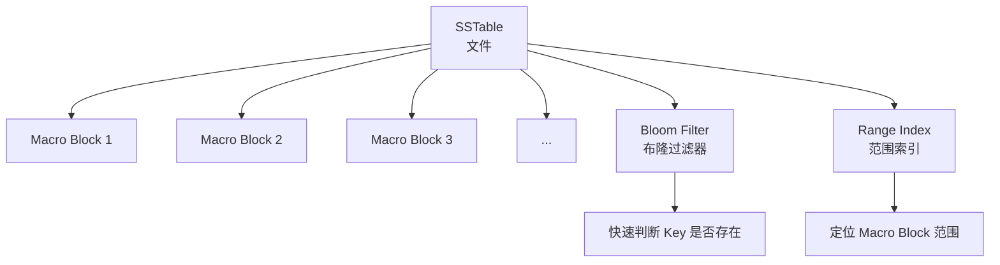
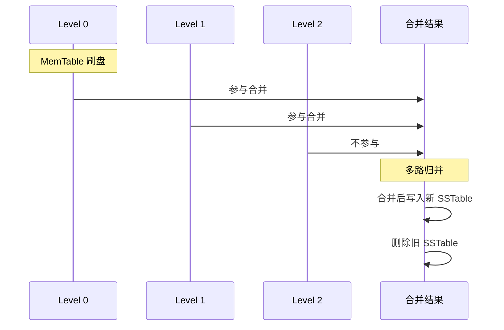

# OceanBase 页面布局

## 学习目标

- 掌握 OceanBase 的 Micro Block 和 Macro Block 结构
- 理解 OceanBase 的 LSM-Tree 存储层次
- 对比 OceanBase 与 TiDB、CockroachDB 的页面布局差异

## 存储层次



## Micro Block 结构



## Macro Block 结构



## SSTable 结构



## 合并（Compaction）流程



## 布隆过滤器

```c
// 简化版布隆过滤器
typedef struct bloom_filter_s {
    int num_hashes;       // 哈希函数数量
    int bit_array_size;   // 位数组大小
    unsigned char *bits;  // 位数组
} bloom_filter_t;
```

## 与 TiDB 页面布局对比

| 维度 | OceanBase | TiDB |
|------|-----------|------|
| 存储单元 | Micro Block（16KB～64KB） | SSTable Block（4KB～64KB） |
| 大块结构 | Macro Block（2MB～4MB） | SSTable 文件 |
| 布隆过滤器 | 支持 | 支持 |
| 索引结构 | Range Index | Data Block Index |
| 压缩 | LZ4/ZSTD | LZ4/ZSTD |
| 合并策略 | 在线合并（Major Compaction） | 全量合并 |

## 与 CockroachDB 页面布局对比

| 维度 | OceanBase | CockroachDB |
|------|-----------|------------|
| 存储单元 | Micro Block | SSTable Block |
| 大块结构 | Macro Block | SSTable 文件 |
| 布隆过滤器 | 支持 | 支持 |
| 压缩 | LZ4/ZSTD | Snappy/LZ4/ZSTD |

## 与 PostgreSQL 页面布局对比

| 维度 | OceanBase | PostgreSQL |
|------|-----------|------------|
| 页面大小 | Micro Block（16KB～64KB） | Page（8KB） |
| 存储结构 | LSM-Tree | 堆表 |
| 压缩 | 支持（LZ4/ZSTD） | TOAST |
| 布隆过滤器 | 支持 | 不支持 |

## 要点总结

- OceanBase 的存储层次：SSTable → Macro Block → Micro Block
- Micro Block 是最小存储单元（16KB～64KB）
- Macro Block 是大块结构（2MB～4MB）
- 支持布隆过滤器和范围索引加速查询
- 合并策略：在线合并（Major Compaction）
- 与 TiDB/CockroachDB 相比：自研 Micro/Macro Block vs RocksDB SSTable Block

## 思考题

1. OceanBase 的 Macro Block 设计相比 RocksDB 的 SSTable 文件，在大数据块缓存上有何优势？
2. 在线合并（Major Compaction）相比全量合并，在写放大和查询性能上有何差异？
3. 布隆过滤器的假阳性率如何影响 OceanBase 的点查性能？