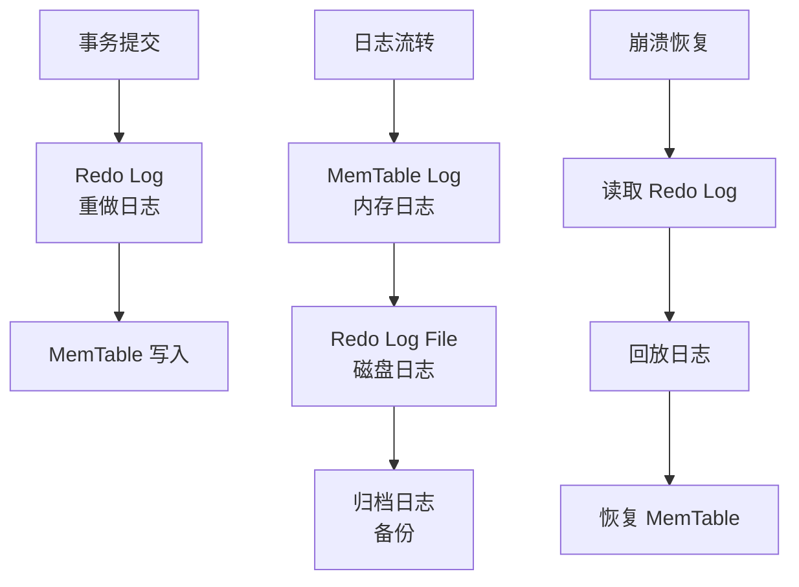
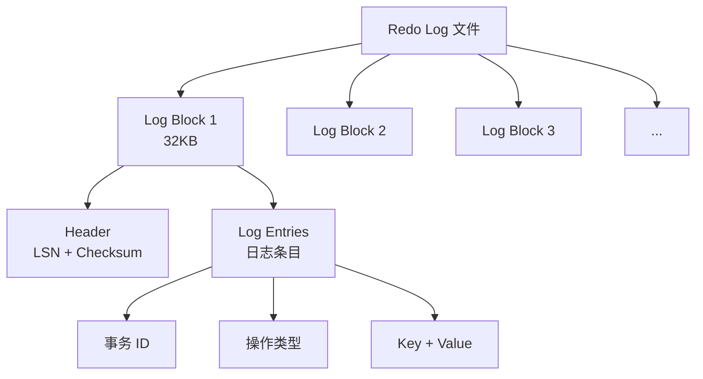
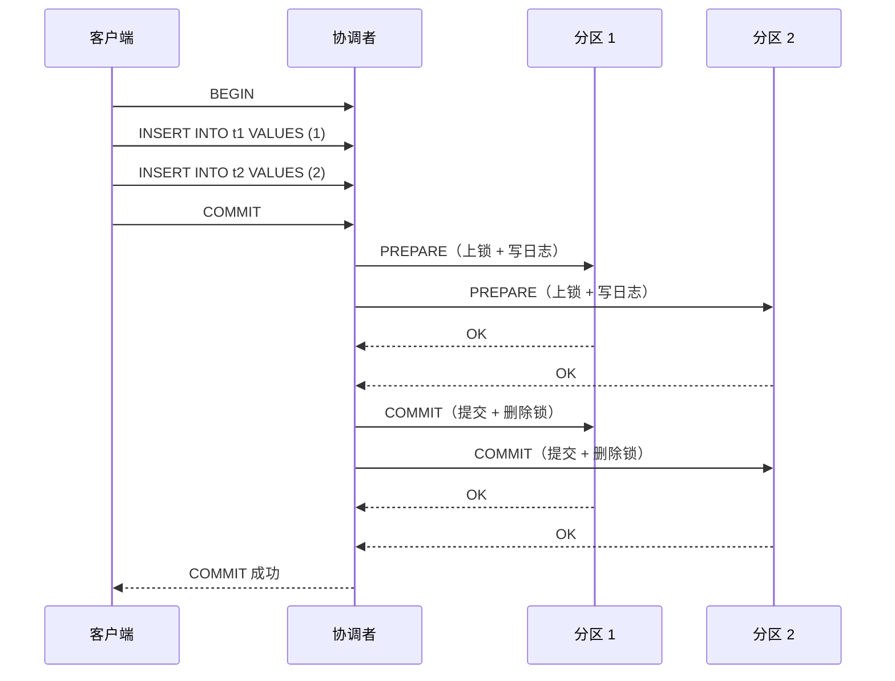
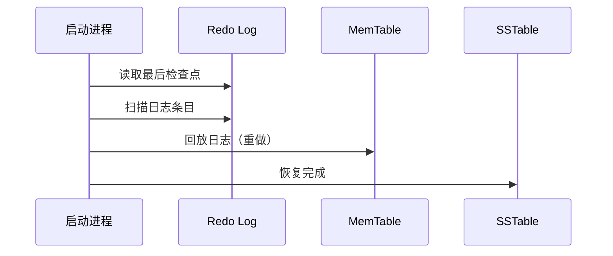

# OceanBase 存储引擎 — WAL（写前日志）

## 学习目标

- 掌握 OceanBase 的 WAL 机制
- 理解 OceanBase 的双层日志设计
- 对比 OceanBase 与 TiDB、CockroachDB 的 WAL 差异

## WAL 架构

## Redo Log 结构

## 两阶段提交

## 崩溃恢复

## 与 TiDB WAL 对比

| 维度 | OceanBase | TiDB |
|------|-----------|------|
| 日志类型 | Redo Log | Raft Log + RocksDB WAL |
| 日志协议 | 自研 | Raft 协议 |
| 两阶段提交 | 支持 | Percolator 两阶段 |
| 崩溃恢复 | 重做日志回放 | Raft Log 回放 |
| 日志归档 | 支持 | 不支持 |

## 与 CockroachDB WAL 对比

| 维度 | OceanBase | CockroachDB |
|------|-----------|------------|
| 日志类型 | Redo Log | Raft Log + RocksDB WAL |
| 日志协议 | 自研 | Raft 协议 |
| 两阶段提交 | 支持 | Write Intent 两阶段 |
| 崩溃恢复 | 重做日志回放 | Raft Log 回放 |

## 与 PostgreSQL WAL 对比

| 维度 | OceanBase | PostgreSQL |
|------|-----------|------------|
| 日志类型 | Redo Log | WAL（Write-Ahead Log） |
| 日志结构 | Log Block | WAL Segment |
| 两阶段提交 | 支持 | 支持（PREPARE TRANSACTION） |
| 崩溃恢复 | 重做日志回放 | WAL 回放 |
| 归档日志 | 支持 | 支持（archive_mode） |

## 要点总结

- OceanBase 使用 Redo Log 作为写前日志
- 日志结构：Log Block（32KB）+ Log Entries
- 支持两阶段提交和崩溃恢复
- 与 TiDB/CockroachDB 相比：Redo Log vs Raft Log
- 与 PostgreSQL 相比：自研 Redo Log vs WAL

## 思考题

1. OceanBase 的 Redo Log 与 Raft Log 相比，在日志复制和故障恢复上有何差异？
2. OceanBase 的两阶段提交如何保证跨分区事务的原子性？
3. OceanBase 的崩溃恢复过程中，如何处理未完成的事务？