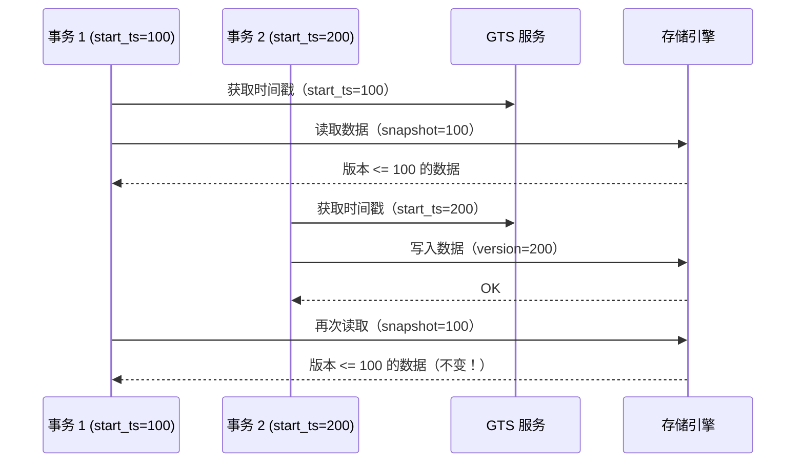
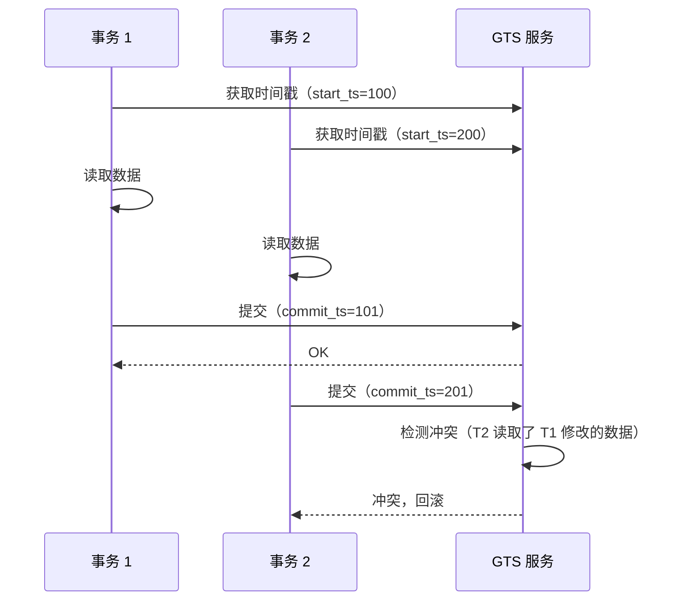

# OceanBase 事务隔离级别

## 学习目标

- 掌握 OceanBase 的事务隔离级别
- 理解 OceanBase 的 SI（Snapshot Isolation）实现
- 对比 OceanBase 与 TiDB、CockroachDB 的隔离级别差异

## 隔离级别

OceanBase 支持以下隔离级别：

| 级别 | 说明 | 脏读 | 不可重复读 | 幻读 | 写偏斜 |
|------|------|------|------------|------|--------|
| Read Committed | 读取已提交数据 | 无 | 有 | 有 | 有 |
| Repeatable Read | 可重复读（SI） | 无 | 无 | 无 | 有 |
| Serializable | 可串行化 | 无 | 无 | 无 | 无 |

### 默认隔离级别

OceanBase 默认使用 **Repeatable Read**（SI）。

```sql
-- 查看当前隔离级别
SHOW VARIABLES LIKE 'transaction_isolation';

-- 设置隔离级别
SET SESSION TRANSACTION ISOLATION LEVEL READ COMMITTED;
SET SESSION TRANSACTION ISOLATION LEVEL REPEATABLE READ;
SET SESSION TRANSACTION ISOLATION LEVEL SERIALIZABLE;
```

## Snapshot Isolation（SI）

### 工作原理



### Serializable 模式

OceanBase 支持 Serializable 隔离级别，通过 GTS 和冲突检测实现。



## 隔离级别对比

| 维度 | OceanBase | TiDB | CockroachDB |
|------|-----------|------|-------------|
| 默认级别 | Repeatable Read（SI） | Repeatable Read（SI） | Serializable |
| 可选级别 | RC / RR / Serializable | RC / RR | Serializable（唯一） |
| Serializable | 支持 | 不支持 | 默认 |
| 写偏斜 | SI 下有 | SI 下有 | 无 |
| 实现方式 | GTS + 冲突检测 | Percolator | HLC + Write Intent |

## 与 PostgreSQL 隔离级别对比

| 维度 | OceanBase | PostgreSQL |
|------|-----------|------------|
| 默认级别 | Repeatable Read（SI） | Read Committed |
| 可选级别 | RC / RR / Serializable | RC / RR / Serializable |
| Serializable | 支持 | 支持（SSI） |
| 写偏斜 | SI 下有 | Serializable 下无 |

## 要点总结

- OceanBase 支持 RC、RR（SI）、Serializable 三种隔离级别
- 默认使用 Repeatable Read（SI）
- Serializable 通过 GTS + 冲突检测实现
- 与 TiDB 相比：支持 Serializable
- 与 CockroachDB 相比：默认 SI vs 默认 Serializable
- 与 PostgreSQL 相比：默认 SI vs 默认 RC

## 思考题

1. OceanBase 的 Serializable 实现与 PostgreSQL 的 SSI（Serializable Snapshot Isolation）相比有何差异？
2. 在 SI 隔离级别下，写偏斜问题如何避免？OceanBase 提供了哪些工具？
3. Read Committed 和 Repeatable Read 在 OceanBase 中的性能差异有多大？