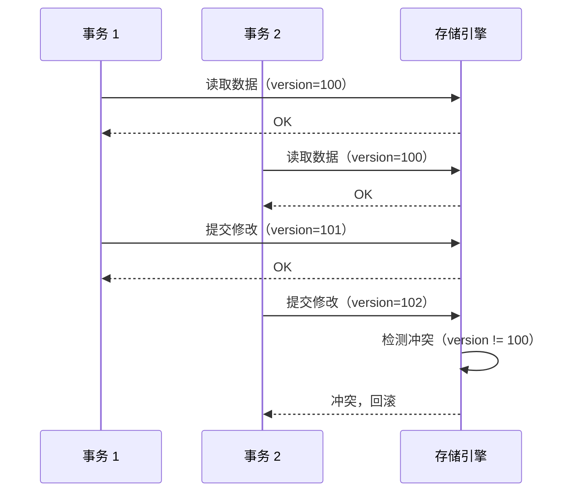
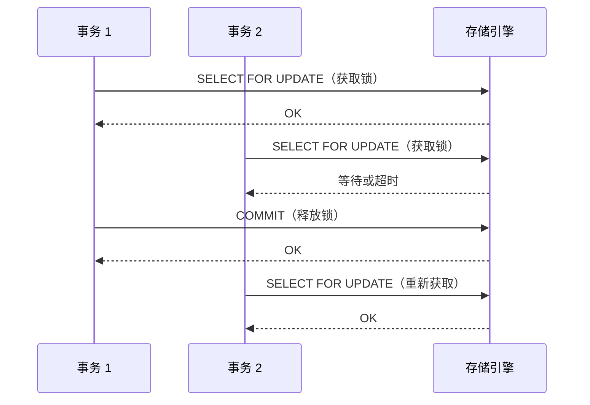
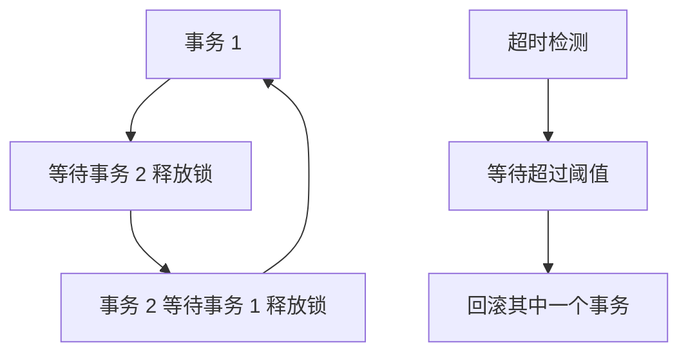

# OceanBase 锁机制

## 学习目标

- 掌握 OceanBase 的行级锁机制
- 理解 OceanBase 的乐观锁和悲观锁模式
- 对比 OceanBase 与 TiDB、CockroachDB 的锁机制差异

## 行级锁机制

OceanBase 支持行级锁，包括乐观锁和悲观锁两种模式。

### 乐观锁（默认）



### 悲观锁

```sql
-- 开启悲观事务
SET SESSION ob_trx_lock_timeout = 10000000; -- 10 秒超时

BEGIN;
SELECT * FROM users WHERE id = 1 FOR UPDATE;
-- 立即获取行锁
UPDATE users SET age = 31 WHERE id = 1;
COMMIT;
```



## 死锁检测

OceanBase 使用超时机制检测死锁。



## 与 TiDB 锁机制对比

| 维度 | OceanBase | TiDB |
|------|-----------|------|
| 乐观锁 | 支持（默认） | 支持（默认） |
| 悲观锁 | 支持 | 支持（可选） |
| 锁粒度 | 行级锁 | 行级锁 |
| 死锁检测 | 超时检测 | 超时检测 |
| 锁实现 | 自研 | Percolator Lock CF |

## 与 CockroachDB 锁机制对比

| 维度 | OceanBase | CockroachDB |
|------|-----------|------------|
| 乐观锁 | 支持 | 不支持 |
| 悲观锁 | 支持 | 默认模式 |
| 锁粒度 | 行级锁 | 行级锁 |
| 死锁检测 | 超时检测 | 无死锁（Write Intent） |
| 锁实现 | 自研 | Write Intent |

## 与 PostgreSQL 锁机制对比

| 维度 | OceanBase | PostgreSQL |
|------|-----------|------------|
| 乐观锁 | 支持 | 不支持 |
| 悲观锁 | 支持 | 默认模式 |
| 锁粒度 | 行级锁 | 行级锁 + 表级锁 |
| 死锁检测 | 超时检测 | 超时检测 + 死锁图 |
| 分布式事务 | 支持 | 不支持 |

## 要点总结

- OceanBase 支持乐观锁（默认）和悲观锁两种模式
- 行级锁粒度，支持 SELECT FOR UPDATE
- 死锁检测使用超时机制
- 与 TiDB 类似：都支持乐观锁和悲观锁
- 与 CockroachDB 不同：乐观锁 vs Write Intent
- 与 PostgreSQL 相比：支持乐观锁，支持分布式事务

## 思考题

1. OceanBase 的乐观锁在高冲突场景下（如秒杀）的性能如何？应该使用乐观锁还是悲观锁？
2. OceanBase 的死锁检测超时机制与 PostgreSQL 的死锁图相比，有何优劣？
3. 在分布式环境下，OceanBase 如何保证跨分区事务的行锁一致性？