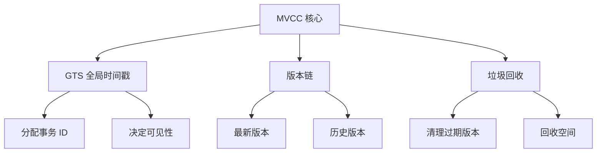
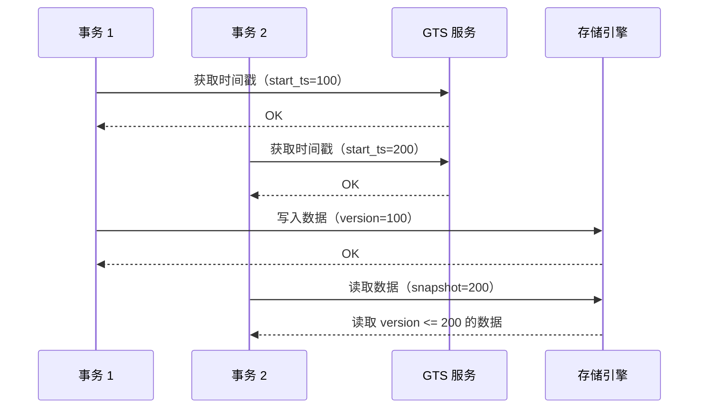
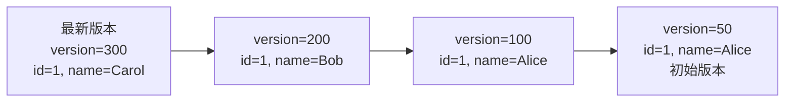
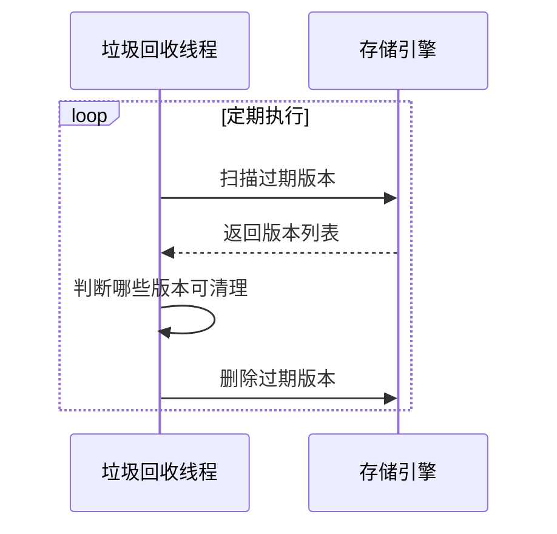

# OceanBase MVCC（多版本并发控制）

## 学习目标

- 掌握 OceanBase 的 MVCC 实现机制
- 理解 OceanBase 的 GTS（全局时间戳）方案
- 对比 OceanBase 与 TiDB、CockroachDB 的 MVCC 差异

## MVCC 架构



## GTS 全局时间戳

OceanBase 使用 GTS（Global Timestamp Service）分配全局时间戳。



## 版本链



### 可见性判断

```
当前事务 start_ts = 150

可见版本：
- version=100（<=150，已提交）
- version=50（<=150，已提交）

不可见版本：
- version=200（>150，未开始）
- version=300（>150，未开始）
```

## 垃圾回收



## 与 TiDB MVCC 对比

| 维度 | OceanBase | TiDB |
|------|-----------|------|
| 时间戳方案 | GTS（全局时间戳服务） | TSO（Timestamp Oracle） |
| 时间戳来源 | 自研 | PD（Placement Driver） |
| 可见性判断 | start_ts 比较 | start_ts 比较 |
| 版本链存储 | 自研 LSM-Tree | Percolator（Default/Write/Lock CF） |
| 垃圾回收 | 后台线程 | GC Worker |
| 快照读 | 支持（GTS 快照） | 支持（TSO 快照） |

## 与 CockroachDB MVCC 对比

| 维度 | OceanBase | CockroachDB |
|------|-----------|------------|
| 时间戳方案 | GTS | HLC（Hybrid Logical Clock） |
| 时间戳来源 | 集中式 | 分布式（无需协调） |
| 可见性判断 | start_ts 比较 | HLC 时间戳比较 |
| 版本链存储 | 自研 LSM-Tree | RocksDB 多版本 |
| 垃圾回收 | 后台线程 | GC 策略 |

## 与 PostgreSQL MVCC 对比

| 维度 | OceanBase | PostgreSQL |
|------|-----------|------------|
| 时间戳方案 | GTS | XID（事务 ID） |
| 时间戳来源 | 全局 | 本地 |
| 可见性判断 | start_ts 比较 | XID 比较 |
| 版本链存储 | LSM-Tree 多版本 | 堆表多版本 |
| 垃圾回收 | 后台线程 | VACUUM |

## 要点总结

- OceanBase 使用 GTS（全局时间戳）实现 MVCC
- 版本链：最新版本 → 历史版本 → 初始版本
- 可见性判断基于 start_ts 比较
- 垃圾回收后台线程清理过期版本
- 与 TiDB 类似：GTS vs TSO（都是集中式）
- 与 CockroachDB 不同：集中式 GTS vs 分布式 HLC

## 思考题

1. OceanBase 的 GTS 与 TiDB 的 TSO 在实现上有何差异？GTS 的瓶颈在哪里？
2. OceanBase 的版本链存储在 LSM-Tree 中，与 PostgreSQL 的堆表版本链相比有何优势？
3. 垃圾回收策略如何避免影响在线查询性能？