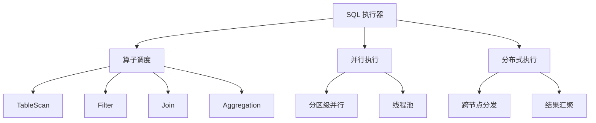
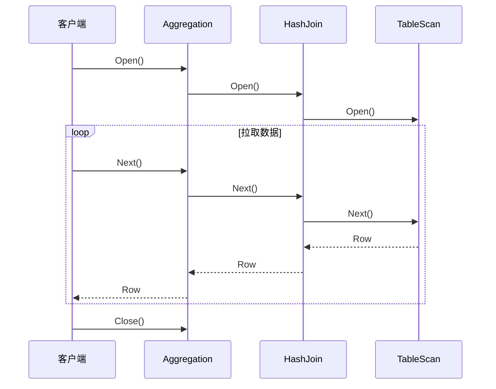
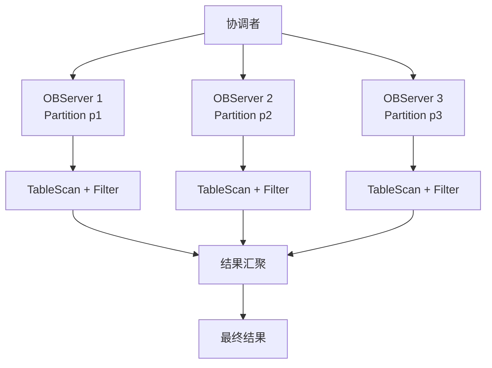

# OceanBase 查询执行器

## 学习目标

- 掌握 OceanBase 的查询执行器架构
- 理解 OceanBase 的分布式执行框架
- 对比 OceanBase 与 TiDB、CockroachDB 的执行器差异

## 执行器架构

OceanBase 使用火山模型（Volcano Model）执行器。



## 火山模型



## 分布式执行



### 并行执行

```sql
-- 并行查询
SELECT /*+ PARALLEL(4) */ * FROM orders;
-- 4 个线程并行扫描
```

## 执行算子

| 算子 | 说明 | 分布式支持 |
|------|------|-----------|
| TableScan | 全表扫描 | 支持（分区级并行） |
| IndexScan | 索引扫描 | 支持 |
| Filter | 过滤 | 支持（下推） |
| HashJoin | 哈希连接 | 支持 |
| NestLoop | 嵌套循环连接 | 支持 |
| HashAgg | 哈希聚合 | 支持 |
| Sort | 排序 | 支持 |

## 与 TiDB 执行器对比

| 维度 | OceanBase | TiDB |
|------|-----------|------|
| 执行模型 | 火山模型 | 火山模型 |
| 分布式执行 | 分区级并行 | 下推到 TiKV |
| 并行执行 | 支持（分区级） | 支持（Region 级） |
| 向量化执行 | 支持（列存模式） | TiFlash 支持 |
| 下推算子 | Filter/Aggregation | TableScan/IndexScan/Filter/Agg |

## 与 CockroachDB 执行器对比

| 维度 | OceanBase | CockroachDB |
|------|-----------|------------|
| 执行模型 | 火山模型 | 火山模型 + 向量化 |
| 分布式执行 | 分区级并行 | DistSQL |
| 并行执行 | 支持 | 支持 |
| 向量化执行 | 支持（列存） | 支持 |

## 与 PostgreSQL 执行器对比

| 维度 | OceanBase | PostgreSQL |
|------|-----------|------------|
| 执行模型 | 火山模型 | 火山模型 |
| 分布式执行 | 支持 | 不支持 |
| 并行执行 | 支持 | 支持（并行查询） |
| 向量化执行 | 支持（列存） | 不支持 |
| JIT 编译 | 不支持 | LLVM JIT |

## 要点总结

- OceanBase 使用火山模型执行器，拉取式执行
- 支持分布式执行：分区级并行
- 并行执行通过线程池实现
- 与 TiDB 类似：火山模型 + 分布式下推
- 与 CockroachDB 类似：支持向量化执行
- 与 PostgreSQL 相比：支持分布式执行

## 思考题

1. OceanBase 的分区级并行执行与 TiDB 的 Region 级并行相比，在调度效率和负载均衡上有何差异？
2. OceanBase 的向量化执行在列存模式下如何实现？与行存模式相比性能提升多少？
3. OceanBase 的执行器如何实现跨分区 Join 操作？