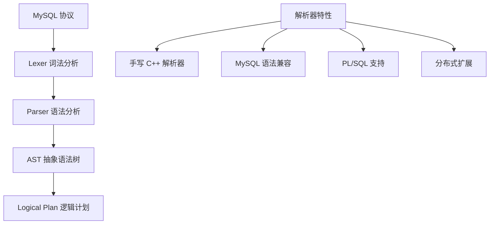
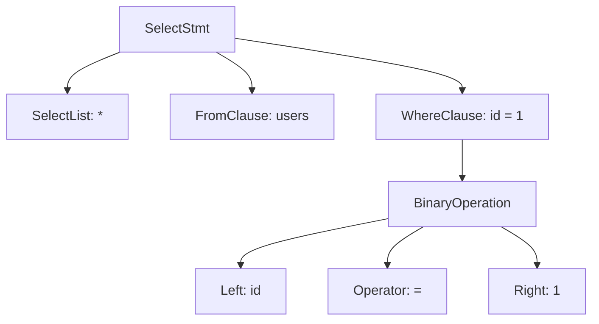

# OceanBase 查询解析器（MySQL 兼容）

## 学习目标

- 掌握 OceanBase 的 SQL 解析器架构
- 理解 OceanBase 的 MySQL 兼容性设计
- 对比 OceanBase 解析器与 TiDB、CockroachDB 的差异

## 解析器架构

OceanBase 使用自研的 C++ 解析器，兼容 MySQL 5.7 协议。



## 词法分析

```
输入：SELECT * FROM users WHERE id = 1

Token 序列：
[SELECT] [*] [FROM] [users] [WHERE] [id] [=] [1]
```

## 语法分析



## MySQL 兼容性

OceanBase 兼容 MySQL 5.7 协议和大部分语法。

### 兼容的 MySQL 特性

- **协议兼容**：MySQL Wire Protocol
- **SQL 语法**：大部分 MySQL 语法
- **数据类型**：INT, VARCHAR, TEXT, BLOB, JSON, DATETIME 等
- **内置函数**：COUNT, SUM, AVG, MAX, MIN, NOW 等
- **DDL 语句**：CREATE TABLE, ALTER TABLE, DROP TABLE 等

### OceanBase 扩展语法

```sql
-- 分区表语法
CREATE TABLE orders (
    id INT PRIMARY KEY
) PARTITION BY HASH(id) PARTITIONS 16;

-- 租户管理
CREATE TENANT tenant1;

-- 资源管理
ALTER SYSTEM SET memory_limit = '16G';
```

## 与 TiDB 解析器对比

| 维度 | OceanBase | TiDB |
|------|-----------|------|
| 实现语言 | C++ | Go |
| 解析器类型 | 手写解析器 | 手写解析器 |
| 兼容协议 | MySQL | MySQL |
| AST 结构 | C++ AST | Go AST |
| 扩展语法 | 分区/租户/资源管理 | TiDB 特有语法 |

## 与 CockroachDB 解析器对比

| 维度 | OceanBase | CockroachDB |
|------|-----------|------------|
| 实现语言 | C++ | Go |
| 解析器类型 | 手写解析器 | 手写解析器 |
| 兼容协议 | MySQL | PostgreSQL |
| AST 结构 | C++ AST | Go AST |

## 与 PostgreSQL 解析器对比

| 维度 | OceanBase | PostgreSQL |
|------|-----------|------------|
| 实现语言 | C++ | C |
| 解析器类型 | 手写解析器 | Bison/Flex 生成 |
| 兼容协议 | MySQL | PostgreSQL |
| AST 结构 | 自研 | PostgreSQL 风格 |

## 要点总结

- OceanBase 使用自研 C++ 解析器，兼容 MySQL 5.7
- 支持大部分 MySQL 协议和语法
- 扩展了分区、租户、资源管理等分布式语法
- 与 TiDB 类似：都兼容 MySQL
- 与 CockroachDB 不同：MySQL vs PostgreSQL
- 与 PostgreSQL 不同：手写解析器 vs Bison/Flex

## 思考题

1. OceanBase 的 C++ 解析器相比 TiDB 的 Go 解析器，在性能和可维护性上有何差异？
2. OceanBase 的分布式扩展语法（分区、租户）如何与 MySQL 语法兼容共存？
3. OceanBase 的 PL/SQL 支持与 MySQL 的存储过程相比有何差异？