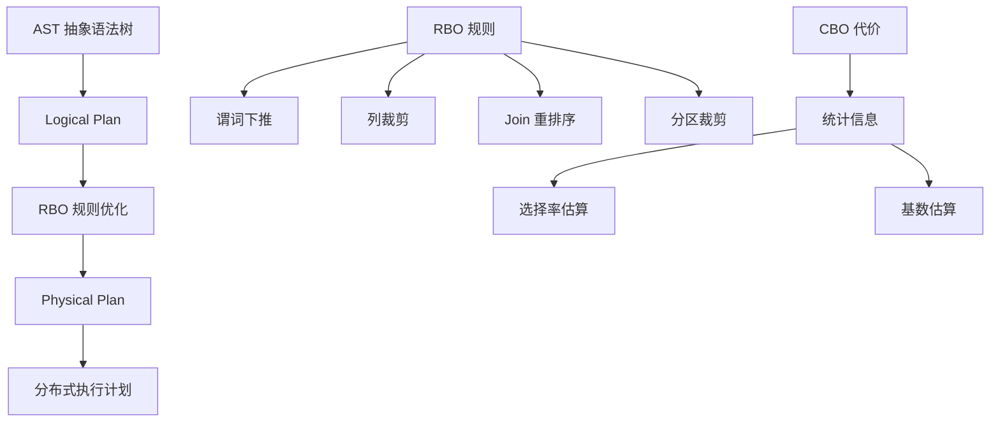
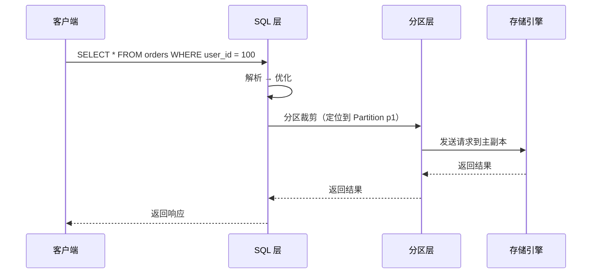

# OceanBase 查询优化器

## 学习目标

- 掌握 OceanBase 的查询优化器架构
- 理解 OceanBase 的分布式查询优化策略
- 对比 OceanBase 与 TiDB、CockroachDB 的优化器差异

## 优化器架构

OceanBase 使用基于代价的优化器（CBO），支持分布式查询优化。



## 分布式查询优化



### 分区裁剪

```sql
-- 分区裁剪：只扫描相关分区
SELECT * FROM orders WHERE user_id = 100;
-- 如果 user_id 是分区键，只扫描一个分区
```

### 下推优化

```sql
-- 谓词下推
SELECT * FROM orders WHERE amount > 100;
-- 下推到存储层执行
```

## 优化规则

| 规则 | 说明 | 效果 |
|------|------|------|
| 谓词下推 | 过滤条件下推到存储层 | 减少数据传输 |
| 列裁剪 | 只读取需要的列 | 减少 IO |
| Join 重排序 | 小表驱动大表 | 减少中间结果 |
| 分区裁剪 | 只扫描相关分区 | 减少扫描范围 |
| 物化视图 | 预计算结果 | 加速查询 |

## 与 TiDB 优化器对比

| 维度 | OceanBase | TiDB |
|------|-----------|------|
| 优化器框架 | CBO（代价优化） | Cascades |
| 优化规则 | RBO + CBO | RBO + CBO |
| 分布式优化 | 分区裁剪 + 下推 | 下推到 TiKV |
| 代价模型 | 基于 CPU/IO | 基于 CPU/IO |
| 统计信息 | 柱状图 + 抽样 | 柱状图 + Count-Min Sketch |

## 与 CockroachDB 优化器对比

| 维度 | OceanBase | CockroachDB |
|------|-----------|------------|
| 优化器框架 | CBO | Cascades |
| 优化规则 | RBO + CBO | RBO + CBO |
| 分布式优化 | 分区裁剪 + 下推 | DistSQL 下推 |
| 代价模型 | 基于 CPU/IO | 基于 CPU/IO/Network |

## 与 PostgreSQL 优化器对比

| 维度 | OceanBase | PostgreSQL |
|------|-----------|------------|
| 优化器框架 | CBO | 动态规划 + GEQO |
| 优化规则 | RBO + CBO | CBO 为主 |
| 分布式优化 | 支持 | 不支持 |
| Join 算法 | Hash Join / Nest Loop | Hash Join / Merge Join / Nest Loop |

## 要点总结

- OceanBase 使用基于代价的优化器（CBO）
- 核心优化规则：谓词下推、列裁剪、Join 重排序、分区裁剪
- 分布式优化：分区裁剪 + 下推
- 与 TiDB 类似：都支持分布式优化
- 与 CockroachDB 类似：都支持代价优化
- 与 PostgreSQL 相比：支持分布式查询优化

## 思考题

1. OceanBase 的分区裁剪优化与 CockroachDB 的 Range 裁剪相比，在分区粒度和裁剪效率上有何差异？
2. OceanBase 的统计信息收集机制（抽样策略）如何影响优化器的选择？
3. 如果 OceanBase 的优化器选择了错误的执行计划，如何通过 Hint 强制指定执行计划？