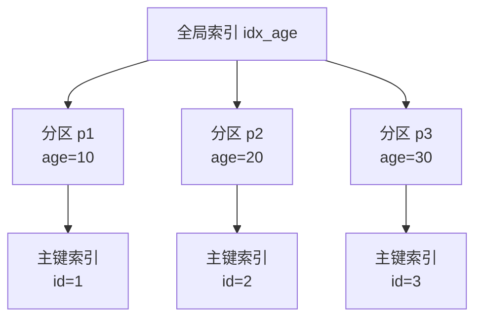
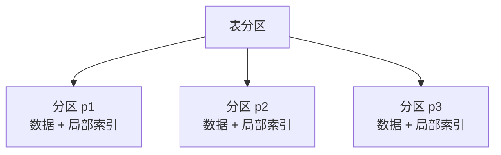
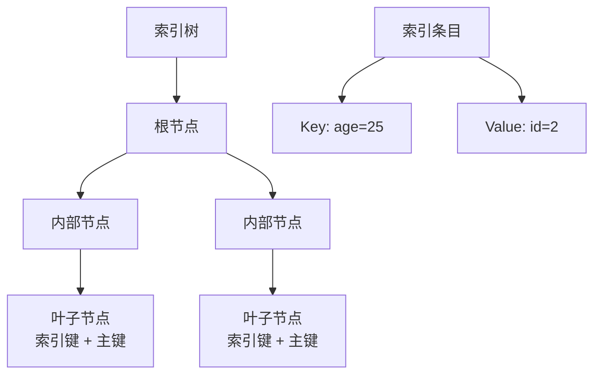

# OceanBase BTree 索引

## 学习目标

- 掌握 OceanBase 的 BTree 索引实现
- 理解 OceanBase 的全局索引和局部索引
- 对比 OceanBase 与 TiDB、CockroachDB 的索引差异

## 索引类型

OceanBase 支持多种索引类型。

### 全局索引

全局索引跨越所有分区，索引数据与表数据分开存储。



### 局部索引

局部索引在每个分区内独立，索引数据与表数据共存在同一分区。



## 索引创建

```sql
-- 创建全局索引
CREATE GLOBAL INDEX idx_age ON users(age);

-- 创建局部索引
CREATE LOCAL INDEX idx_name ON users(name);

-- 创建唯一索引
CREATE UNIQUE INDEX idx_email ON users(email);
```

## 索引结构



## 与 TiDB 索引对比

| 维度 | OceanBase | TiDB |
|------|-----------|------|
| 全局索引 | 支持 | 不支持 |
| 局部索引 | 支持 | 支持（本地索引） |
| 索引编码 | 分区级 | 全局 |
| 唯一索引 | 支持 | 支持 |
| 覆盖索引 | 支持 | 不支持 |

## 与 CockroachDB 索引对比

| 维度 | OceanBase | CockroachDB |
|------|-----------|------------|
| 全局索引 | 支持 | 不支持 |
| 局部索引 | 支持 | 支持 |
| 索引编码 | 分区级 | Range 级 |
| 唯一索引 | 支持 | 支持 |
| 覆盖索引 | 支持 | STORING 子句 |

## 与 PostgreSQL 索引对比

| 维度 | OceanBase | PostgreSQL |
|------|-----------|------------|
| 全局索引 | 支持（跨分区） | 不支持 |
| 局部索引 | 支持（分区内） | 支持（分区索引） |
| 索引类型 | BTree | BTree（默认） |
| 覆盖索引 | 支持 | 支持（Index-Only Scan） |
| 并发创建 | 支持 | 支持（CONCURRENTLY） |

## 要点总结

- OceanBase 支持全局索引和局部索引
- 全局索引跨分区，局部索引在分区内
- 支持唯一索引和覆盖索引
- 与 TiDB 相比：全局索引是重要差异
- 与 CockroachDB 相比：全局索引支持
- 与 PostgreSQL 相比：分布式索引 vs 单体索引

## 思考题

1. OceanBase 的全局索引在跨分区查询时，如何保证一致性和性能？
2. 全局索引和局部索引在查询和写入性能上有何差异？如何选择？
3. OceanBase 的覆盖索引实现与 CockroachDB 的 STORING 子句有何差异？