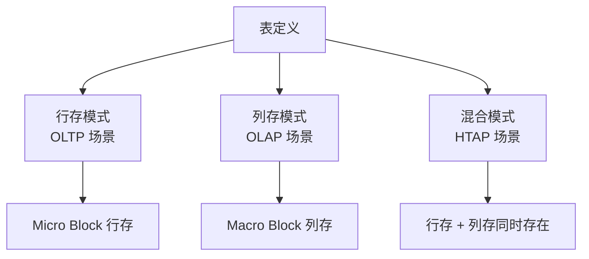

# OceanBase 核心特性

## 学习目标

- 掌握 OceanBase 的核心特性
- 理解 OceanBase 的功能优势
- 对比 OceanBase 与 TiDB、CockroachDB 的特性差异

## 核心特性

### 1. 分布式 SQL

OceanBase 支持完整的分布式 SQL 能力。

```sql
-- 创建分区表
CREATE TABLE orders (
    id INT PRIMARY KEY,
    user_id INT,
    amount DECIMAL(10,2),
    order_date DATE
) PARTITION BY HASH(user_id) PARTITIONS 16;

-- 分布式查询（自动路由）
SELECT * FROM orders WHERE user_id = 123;
```

### 2. Partition 分区

```mermaid
graph TB
    A[Orders 表] --> B[Partition 0<br/>Hash(user_id)=0]
    A --> C[Partition 1<br/>Hash(user_id)=1]
    A --> D[Partition 2<br/>Hash(user_id)=2]
    A --> E[... Partition 15]

    B --> F[主副本<br/>OBServer 1]
    B --> G[从副本<br/>OBServer 2]
    B --> H[从副本<br/>OBServer 3]
```

### 3. Paxos 强同步

所有写操作需要多数派节点确认后才返回成功。

### 4. 混合存储



### 5. 在线 DDL

```sql
-- 在线添加索引
ALTER TABLE users ADD INDEX idx_age(age);

-- 在线修改表结构
ALTER TABLE users ADD COLUMN email VARCHAR(100);
```

### 6. 备份恢复

- 全量备份 + 增量备份
- 日志归档
- 时间点恢复（PITR）

## 特性对比

| 特性 | OceanBase | TiDB | CockroachDB |
|------|-----------|------|-------------|
| 分布式 SQL | 支持 | 支持 | 支持 |
| 分区表 | 支持（Hash/Range/List） | 支持 | 支持 |
| 在线 DDL | 支持 | 支持 | 支持 |
| 备份恢复 | 全量+增量+日志归档 | BR（Backup & Restore） | 快照+增量 |
| 跨地域部署 | 支持 | 支持 | 支持 |
| 资源隔离 | 支持 | 支持 | 不支持 |
| 视图 | 支持 | 支持 | 支持 |
| 存储过程 | 支持 | 部分支持 | 不支持 |
| 触发器 | 支持 | 不支持 | 不支持 |
| 外键 | 支持 | 部分支持 | 支持 |

## 与 PostgreSQL 特性对比

| 特性 | OceanBase | PostgreSQL |
|------|-----------|------------|
| 分布式 SQL | 原生支持 | 不支持（需扩展） |
| 分区表 | 支持 | 支持 |
| 分区策略 | Hash/Range/List | Range/List |
| 在线 DDL | 支持 | 支持（部分操作） |
| 备份恢复 | 分布式备份 | pg_dump/pgBackRest |

## 要点总结

- OceanBase 支持完整的分布式 SQL 能力
- Partition 分区表是核心分片机制
- 混合存储支持行存 + 列存
- 支持在线 DDL、备份恢复、跨地域部署
- 与 TiDB 相比：存储过程、触发器、外键支持更完善
- 与 CockroachDB 相比：资源隔离、存储过程更丰富

## 思考题

1. OceanBase 的 Partition 分片与 CockroachDB 的 Range 分片，在自动分裂和负载均衡上有何差异？
2. OceanBase 的在线 DDL 实现原理是什么？如何保证 DDL 期间的一致性？
3. OceanBase 的资源隔离机制如何实现多租户场景？