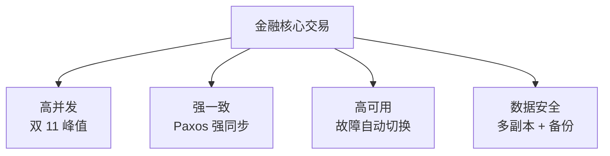
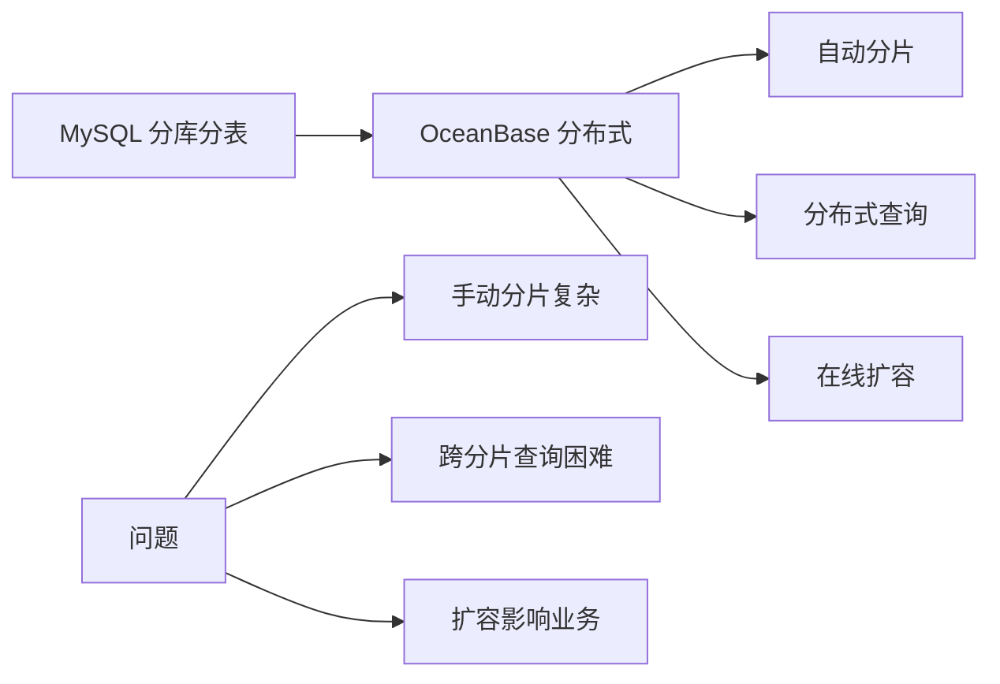
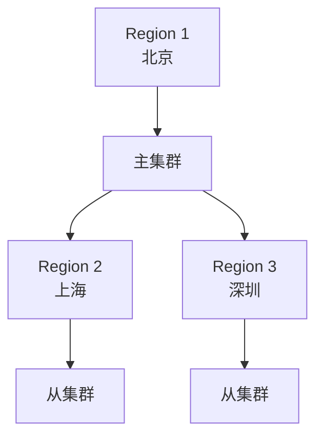
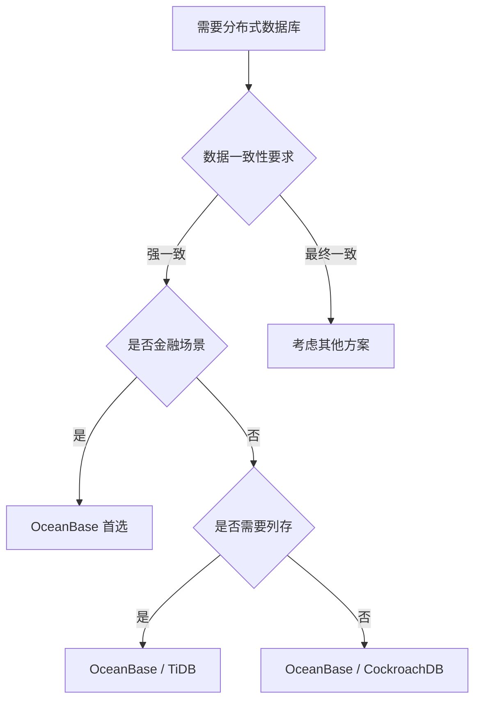

# OceanBase 应用场景

## 学习目标

- 掌握 OceanBase 的典型应用场景
- 理解 OceanBase 的场景选择依据
- 对比 OceanBase 与 TiDB、CockroachDB 的场景差异

## 典型应用场景

### 1. 金融核心交易

OceanBase 最初为蚂蚁集团"双 11"设计，适合金融级 OLTP 场景。



**典型客户**：蚂蚁集团、网商银行、中国人寿

### 2. 分布式数据库替代

替代 MySQL 分库分表方案。



### 3. HTAP 混合负载

同时支持 OLTP 和 OLAP 场景。

```sql
-- OLTP 查询（行存）
SELECT * FROM orders WHERE id = 123;

-- OLAP 查询（列存）
SELECT user_id, SUM(amount) FROM orders
WHERE order_date >= '2024-01-01'
GROUP BY user_id;
```

### 4. 跨地域部署



## 场景选择决策树



## 场景对比

| 场景 | OceanBase | TiDB | CockroachDB |
|------|-----------|------|-------------|
| 金融核心交易 | 首选 | 次选 | 次选 |
| 分库分表替代 | 首选 | 首选 | 次选 |
| HTAP 混合负载 | 首选 | 首选 | 不支持 |
| 跨地域部署 | 支持 | 支持 | 支持 |
| MySQL 迁移 | 原生兼容 | 原生兼容 | 不兼容 |
| PostgreSQL 迁移 | 不兼容 | 不兼容 | 原生兼容 |
| 多租户 SaaS | 支持 | 支持 | 支持 |

## 与 PostgreSQL 场景对比

| 场景 | OceanBase | PostgreSQL |
|------|-----------|------------|
| 金融交易 | 原生支持 | 需扩展 |
| 数据分析 | 内置列存 | 需扩展 |
| 地理空间 | 不支持 | 原生支持 |
| 时序数据 | 可选 | 需扩展 |

## 要点总结

- OceanBase 最适合金融核心交易场景
- 替代 MySQL 分库分表方案
- HTAP 混合负载场景优势明显
- 跨地域部署支持良好
- 与 TiDB 场景重叠度高（MySQL 兼容生态）
- 与 CockroachDB 相比：金融场景首选

## 思考题

1. OceanBase 在金融场景中的核心优势是什么？双 11 场景对数据库提出了哪些挑战？
2. 如果业务是 MySQL 分库分表架构，迁移到 OceanBase 的收益和风险是什么？
3. OceanBase 的 HTAP 能力与 TiDB 的 TiFlash 相比，在性能和易用性上有何差异？