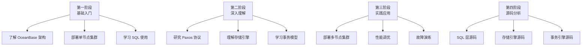

# OceanBase 学习资源

## 学习目标

- 掌握 OceanBase 的学习资源体系
- 了解 OceanBase 的核心论文和源码
- 制定 OceanBase 学习路线

## 官方文档

| 资源 | 地址 | 说明 |
|------|------|------|
| 官方文档 | https://www.oceanbase.com/docs | 完整的产品文档 |
| 开发者中心 | https://developer.oceanbase.com | 开发者资源 |
| 社区版 | https://github.com/oceanbase/oceanbase | 开源社区版 |
| 博客 | https://open.oceanbase.com/blog | 技术博客 |

## 核心论文

| 论文 | 作者 | 说明 |
|------|------|------|
| OceanBase: A Distributed Database System | 阳振坤等 | OceanBase 总体设计 |
| Paxos Made Simple | Leslie Lamport | Paxos 协议基础 |
| The Part-Time Parliament | Leslie Lamport | Paxos 原始论文 |
| The Log-Structured Merge-Tree | Patrick O'Neil et al. | LSM-Tree 基础 |

## 源码阅读

### 源码仓库

```
oceanbase/
├── src/                    # 源码
│   ├── sql/               # SQL 层
│   ├── observer/          # 集群管理
│   ├── storage/           # 存储引擎
│   ├── transaction/       # 事务层
│   └── share/             # 共享模块
├── deps/                   # 依赖库
├── tools/                  # 工具
└── tests/                  # 测试
```

### 关键模块

| 模块 | 路径 | 说明 |
|------|------|------|
| SQL 解析器 | `src/sql/parser/` | MySQL 兼容解析器 |
| 优化器 | `src/sql/optimizer/` | 分布式查询优化 |
| 执行器 | `src/sql/executor/` | 火山模型执行器 |
| 存储引擎 | `src/storage/` | 自研 LSM-Tree |
| 事务引擎 | `src/transaction/` | MVCC + GTS |
| Paxos 协议 | `src/election/` | 选举和复制 |

## 学习路线



## 推荐书籍

| 书名 | 作者 | 说明 |
|------|------|------|
| OceanBase 分布式数据库 | 阳振坤 | 核心设计理念 |
| 数据库系统概论 | 王珊 | 数据库基础理论 |
| 分布式数据库系统 | 杨传辉 | 分布式系统理论 |
| Paxos 协议详解 | 倪超 | Paxos 协议深入 |

## 社区资源

| 资源 | 说明 |
|------|------|
| OceanBase 社区 | 技术问答和交流 |
| GitHub Issues | 问题反馈和讨论 |
| 技术博客 | 深入技术文章 |
| Meetup | 线下技术交流 |

## 要点总结

- OceanBase 提供完整的官方文档和开发者资源
- 核心论文覆盖总体设计、Paxos 协议、LSM-Tree
- 源码仓库包含完整的 SQL 层、存储引擎、事务引擎
- 学习路线从基础入门到源码分析分四阶段
- 与 TiDB 相比：C++ 源码 vs Go 源码，自研引擎 vs RocksDB

## 思考题

1. OceanBase 的 C++ 源码与 TiDB 的 Go 源码相比，在阅读难度和性能优化空间上有何差异？
2. OceanBase 的 Paxos 实现与标准的 Paxos 有何差异？有哪些优化？
3. 从源码角度，OceanBase 的存储引擎与 RocksDB 的实现差异具体体现在哪些方面？