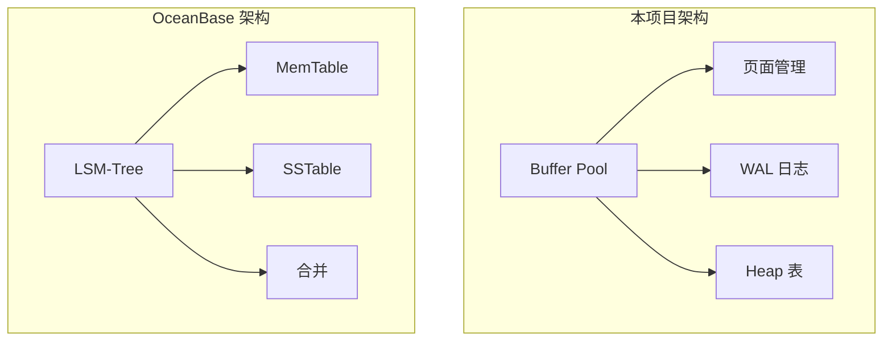

# OceanBase 与项目连接的桥梁

## 学习目标

- 理解 OceanBase 中哪些设计可以借鉴到本项目
- 掌握 OceanBase 设计的简化思路
- 对比 OceanBase 与项目存储引擎的差异

## 可借鉴的设计

### 1. 自研 LSM-Tree 引擎

OceanBase 的自研 LSM-Tree 引擎设计值得借鉴。

**项目中的实现**：

```c
// 当前：基于 Buffer Pool 的页面管理
// 借鉴：LSM-Tree 的层级存储
typedef struct lsmtree_s {
    memtable_t *memtable;      // 当前内存表
    memtable_t *immutable;     // 冻结内存表（等待刷盘）
    sstable_t *levels[LEVELS]; // 各级 SSTable
} lsmtree_t;
```

### 2. Paxos 协议

**项目中简化**：

```c
// 借鉴：Paxos 多数派决策
typedef struct paxos_group_s {
    int node_id;
    int leader_id;
    int proposal_id;
    int accepted_id;
    char accepted_value[256];
} paxos_group_t;
```

### 3. 混合存储（行存 + 列存）

**项目中借鉴**：

```c
// 混合存储模式
typedef enum storage_mode_e {
    STORAGE_ROW,       // 行存
    STORAGE_COLUMN,    // 列存
    STORAGE_HYBRID,    // 混合
} storage_mode_t;
```

## 简化设计

### 1. 简化 Paxos

```c
// 简化版 Paxos：1 个 Leader + 2 个 Follower
typedef struct simple_paxos_s {
    int leader_id;
    int replica_ids[3];
    int log_index;
    char log_entry[1024];
} simple_paxos_t;
```

### 2. 简化分区表

```c
// 简化版分区表
typedef struct partition_s {
    int partition_id;
    int range_start;
    int range_end;
    int leader_id;
    int replica_ids[3];
} partition_t;
```

### 3. 简化 LSM-Tree

```c
// 简化版 LSM-Tree
typedef struct simple_lsmtree_s {
    memtable_t *mem;          // 当前内存表
    sstable_t *level0;        // 第 0 层 SSTable
    sstable_t *level1;        // 第 1 层 SSTable
    sstable_t *level2;        // 第 2 层 SSTable
    int mem_size;             // 当前内存表大小
    int threshold;            // 触发合并阈值
} simple_lsmtree_t;
```

## 存储引擎对比

| 维度 | 本项目 | OceanBase |
|------|--------|-----------|
| 存储引擎 | Buffer Pool + 页面 | LSM-Tree |
| 事务模型 | MVCC + WAL | MVCC + GTS + 2PC |
| 复制协议 | 无 | Multi-Paxos |
| 分片机制 | 无 | Partition 分区表 |
| 列存 | 不支持 | 支持 |
| 分布式 | 不支持 | 原生支持 |

## 借鉴清单

| 层级 | 可借鉴 | 简化程度 | 优先级 |
|------|--------|----------|--------|
| 存储引擎 | LSM-Tree 层级管理 | 简化 | 高 |
| 事务 | MVCC 版本管理 | 简化 | 中 |
| 复制 | Paxos 多数派 | 简化 | 低 |
| 分片 | 分区表 | 简化 | 中 |
| 混合存储 | 行存 + 列存 | 简化 | 低 |

## 与项目架构的差异



## 要点总结

- OceanBase 的自研 LSM-Tree 引擎设计值得借鉴
- Paxos 协议可以简化实现
- 混合存储（行存 + 列存）是未来方向
- 与项目相比：LSM-Tree vs Buffer Pool
- 借鉴优先级：存储引擎 > 分区表 > 事务 > 复制

## 思考题

1. 如果在本项目中实现 LSM-Tree 引擎，需要修改哪些现有模块？
2. OceanBase 的 LSM-Tree 合并策略相比 RocksDB 的合并策略有何优势？
3. 本项目的 Buffer Pool 能否与 LSM-Tree 共存？如何设计一个混合存储引擎？