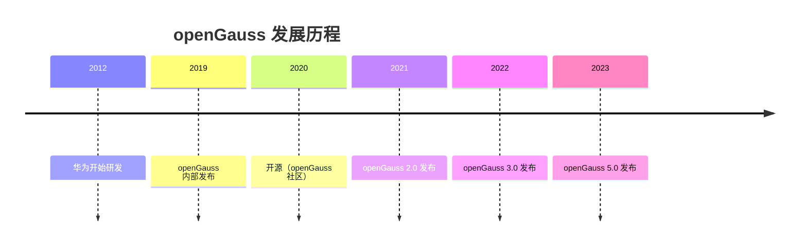
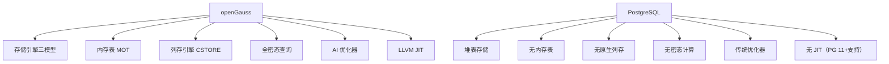

# openGauss 学习 Wiki — 概述

## 学习目标

- 了解 openGauss 的历史背景和定位
- 掌握 openGauss 与 PostgreSQL 的核心差异
- 理解 openGauss 的企业级增强特性

## openGauss 概述

openGauss 是华为开源的关系型数据库，基于 PostgreSQL 9.2 衍生，但做了大量企业级增强。

### 历史演进

### 核心定位

- **企业级数据库**：金融、电信、政务场景
- **Oracle 替换**：部分 Oracle 语法兼容
- **高性能**：LLVM JIT、SMP 并行、内存表
- **安全增强**：全密态数据库、动态脱敏

## 与 PostgreSQL 核心差异

## 存储引擎三模型

| 引擎 | 说明 | 适用场景 |
|------|------|----------|
| ASTORE | 行存（类似 PG heap） | OLTP |
| CSTORE | 列存（自研列式） | OLAP |
| MOT | 内存表（无锁内存引擎） | 高性能 OLTP |

## 企业级增强

| 特性 | 说明 | PG 支持 |
|------|------|---------|
| 全密态数据库 | 客户端加密、服务端密文计算 | 无 |
| AI 优化器 | 慢 SQL 检测、智能索引推荐 | 无 |
| LLVM JIT | 即时编译加速 | PG 11+支持 |
| SMP 并行 | 多核并行执行 | 支持（较弱） |
| 内存表 MOT | 无锁内存引擎 | 无 |
| 列存 CSTORE | 原生列式存储 | 无（需扩展） |
| 动态脱敏 | 数据脱敏策略 | 无 |

## 与 PostgreSQL 对比

| 维度 | openGauss | PostgreSQL |
|------|-----------|------------|
| 基线版本 | PostgreSQL 9.2 | 持续演进（16+） |
| 存储引擎 | ASTORE + CSTORE + MOT | Heap Table |
| JIT 编译 | LLVM JIT（增强） | LLVM JIT（PG 11+） |
| 内存表 | 支持（MOT） | 不支持 |
| 列存 | 支持（CSTORE） | 需扩展（cstore_fdw） |
| 全密态 | 支持 | 不支持 |
| AI 优化 | 支持 | 不支持 |
| Oracle 兼容 | 部分支持 | 不支持 |

## 学习路径

1. **架构**：理解三存储引擎模型
2. **存储**：ASTORE/CSTORE/MOT 实现
3. **事务**：MVCC + MOT 乐观并发控制
4. **查询**：AI 优化器 + LLVM JIT
5. **安全**：全密态数据库实现
6. **实践**：部署和性能调优

## 思考题

1. openGauss 基于 PostgreSQL 9.2，为什么不跟随 PG 的新版本演进？
2. openGauss 的三存储引擎模型（ASTORE/CSTORE/MOT）相比 PostgreSQL 的单一堆表，在运维复杂度和性能优化上有何差异？
3. openGauss 的全密态数据库技术原理是什么？如何保证密文计算的正确性？