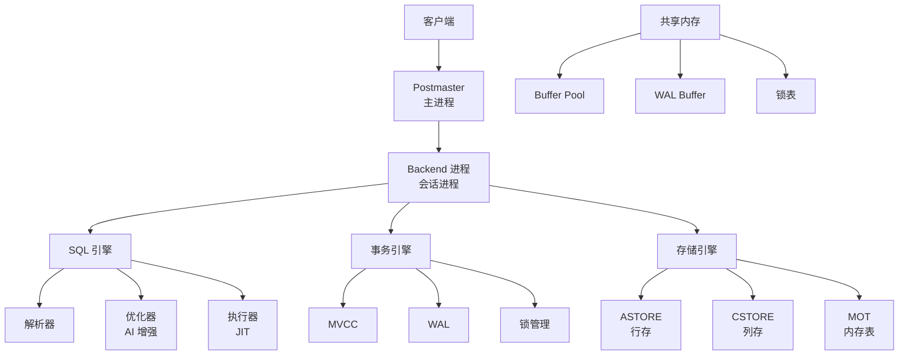
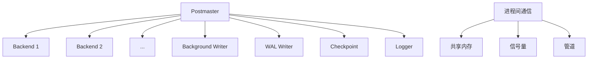
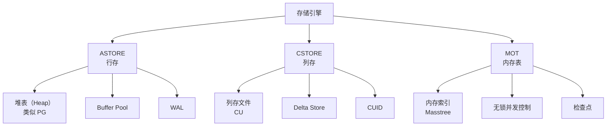
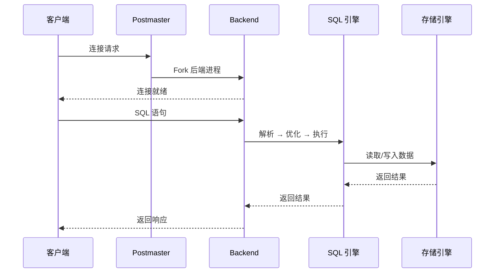

# openGauss 架构详解

## 学习目标

- 掌握 openGauss 的整体架构设计
- 理解 openGauss 的进程模型和内存管理
- 对比 openGauss 与 PostgreSQL 的架构差异

## 整体架构

## 进程模型

openGauss 沿用 PostgreSQL 的进程模型。

### 关键进程

| 进程 | 说明 | PG 对应 |
|------|------|---------|
| Postmaster | 主进程，监听连接 | postmaster |
| Backend | 会话进程，处理 SQL | postgres backend |
| Background Writer | 后台写进程 | bgwriter |
| WAL Writer | WAL 写进程 | walwriter |
| Checkpoint | 检查点进程 | checkpointer |
| Logger | 日志进程 | logger |

## 存储引擎架构

## 请求流程

## 与 PostgreSQL 架构对比

| 维度 | openGauss | PostgreSQL |
|------|-----------|------------|
| 进程模型 | 多进程（类似 PG） | 多进程 |
| 共享内存 | System V / POSIX | System V / POSIX |
| 存储引擎 | 三引擎（ASTORE/CSTORE/MOT） | 单一 Heap |
| JIT 编译 | LLVM JIT（增强） | LLVM JIT（PG 11+） |
| 并行执行 | SMP 并行（增强） | 并行查询 |
| 优化器 | AI 增强 | 传统优化器 |

## 关键组件

### SQL 引擎

- **解析器**：兼容 PG + 部分 Oracle 语法
- **优化器**：AI 增强（慢 SQL 检测、智能索引推荐）
- **执行器**：LLVM JIT 加速

### 事务引擎

- **MVCC**：类似 PG，基于 XID
- **WAL**：类似 PG，支持逻辑复制
- **锁管理**：表锁 + 行锁

### 存储引擎

- **ASTORE**：行存，类似 PG heap
- **CSTORE**：列存，自研列式引擎
- **MOT**：内存表，无锁并发控制

## 要点总结

- openGauss 沿用 PG 的进程模型和共享内存架构
- 存储引擎三模型是核心差异：ASTORE + CSTORE + MOT
- SQL 引擎增强：AI 优化器 + LLVM JIT
- 事务引擎类似 PG：MVCC + WAL + 锁管理
- 与 PG 相比：多引擎支持、性能优化、安全增强

## 思考题

1. openGauss 的进程模型相比 MySQL 的线程模型，在高并发场景下的优劣势是什么？
2. openGauss 的三存储引擎如何协同工作？一个表能否同时使用多种引擎？
3. openGauss 的 AI 优化器相比传统优化器，在查询性能提升上有多少实际效果？