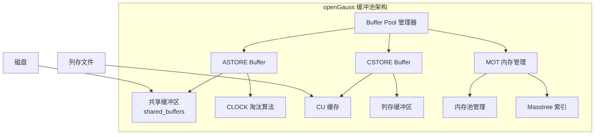
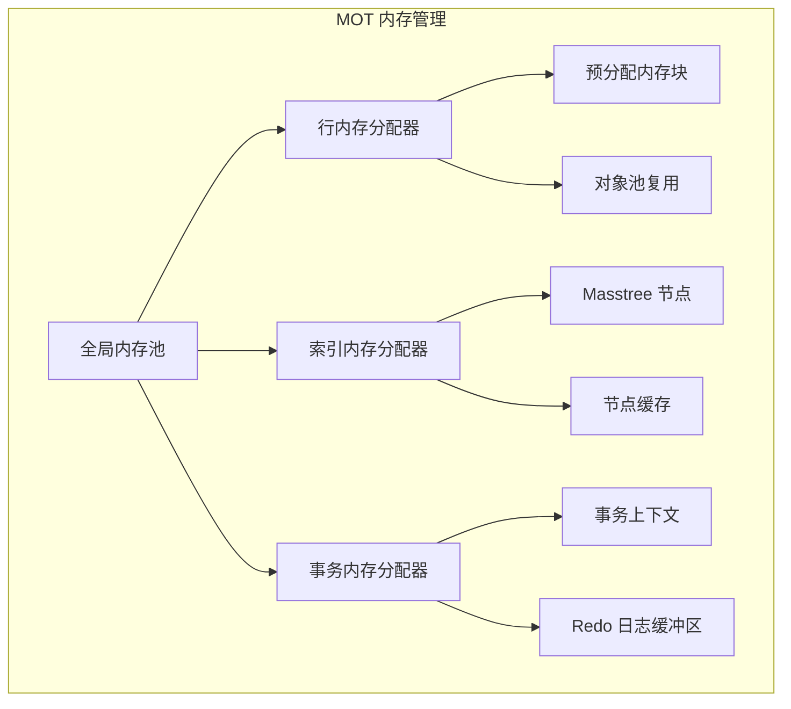

# openGauss 缓冲池管理

## 学习目标

- 掌握 openGauss 缓冲池（Buffer Pool）的核心架构
- 理解 ASTORE、CSTORE、MOT 三种引擎的缓存管理差异
- 对比 openGauss 与 PostgreSQL 缓冲池设计

## 缓冲池架构



## ASTORE 缓冲池

openGauss 的 ASTORE 缓冲池继承自 PostgreSQL 9.2，但做了多项增强。

### 核心结构

```c
// 缓冲区描述符
typedef struct BufferDesc_s {
    BufferTag    tag;           // 缓冲区标签（表空间 + 数据库 + 文件 + 页号）
    int          buf_id;        // 缓冲区 ID
    uint32       state;         // 状态位（脏页/使用中/IO 进行中）
    int          refcount;      // 引用计数
    uint32       usage_count;   // CLOCK 淘汰计数
    LWLock       io_in_progress_lock; // IO 锁
} BufferDesc_t;
```

### CLOCK 淘汰算法

openGauss 使用 CLOCK-Sweep 算法进行页面淘汰，与 PostgreSQL 一致。

```c
// CLOCK 淘汰过程
int clock_sweep(BufferPool *pool) {
    while (true) {
        BufferDesc *desc = &pool->descriptors[pool->next_victim];
        pool->next_victim = (pool->next_victim + 1) % NBuffers;

        if (desc->usage_count > 0) {
            desc->usage_count--;   // 减少计数
            continue;
        }

        if (desc->refcount == 0) {
            if (desc->state & BM_DIRTY) {
                flush_buffer(desc);  // 刷脏页
            }
            return desc->buf_id;     // 选中淘汰
        }
    }
}
```

### 增强特性

| 特性 | PostgreSQL 9.2 | openGauss |
|------|---------------|-----------|
| 淘汰算法 | CLOCK-Sweep | CLOCK-Sweep（增强） |
| 大页支持 | 不支持 | 支持 2MB/1GB HugePage |
| NUMA 感知 | 不支持 | 支持 NUMA 绑定 |
| 异步 IO | 不支持 | 支持 AIO |
| 预取 | 简单预取 | 智能预取（基于学习） |

## CSTORE 列存缓存

CSTORE 引擎使用独立的 CU（Compression Unit）缓存机制。

### CU 缓存结构

```c
// CU 缓存项
typedef struct CUCacheEntry_s {
    uint32    cu_id;           // CU ID
    char      *data;           // 解压后的数据
    uint32    size;            // 数据大小
    uint32    refcount;        // 引用计数
    bool      is_dirty;        // 是否脏
    uint32    access_count;    // 访问计数（淘汰用）
} CUCacheEntry_t;

// CU 缓存管理
typedef struct CUCache_s {
    CUCacheEntry_t *entries;   // 缓存项数组
    uint32         capacity;   // 最大项数
    uint32         count;      // 当前项数
    LWLock        *lock;       // 并发锁
    uint32         hit_count;  // 命中统计
    uint32         miss_count; // 未命中统计
} CUCache_t;
```

### CU 缓存淘汰

CSTORE 使用 LRU 算法淘汰 CU 缓存：

```c
uint32_t cucache_evict(CUCache *cache) {
    uint32_t victim = 0;
    uint32_t min_access = UINT32_MAX;

    for (uint32_t i = 0; i < cache->capacity; i++) {
        if (cache->entries[i].refcount > 0)
            continue;
        if (cache->entries[i].access_count < min_access) {
            min_access = cache->entries[i].access_count;
            victim = i;
        }
    }

    if (cache->entries[victim].is_dirty) {
        // 写回脏 CU
        cstore_write_cu(victim);
    }

    return victim;
}
```

## MOT 内存管理

MOT 引擎不依赖磁盘缓冲池，而是直接管理内存。

### 内存池设计



### 内存分配策略

```c
// MOT 内存分配器
typedef struct MOTAllocator_s {
    char      *blocks[64];     // 预分配内存块
    uint32    block_size;      // 每块大小
    uint32    current_block;   // 当前块索引
    uint32    offset;          // 当前偏移
    pthread_mutex_t lock;      // 分配锁
} MOTAllocator_t;

// 分配一行
void *mot_alloc_row(MOTAllocator *alloc, uint32 size) {
    pthread_mutex_lock(&alloc->lock);

    if (alloc->offset + size > alloc->block_size) {
        // 申请新块
        alloc->current_block++;
        alloc->blocks[alloc->current_block] = malloc(alloc->block_size);
        alloc->offset = 0;
    }

    void *ptr = alloc->blocks[alloc->current_block] + alloc->offset;
    alloc->offset += size;

    pthread_mutex_unlock(&alloc->lock);
    return ptr;
}
```

## 与 PostgreSQL 对比

| 维度 | openGauss | PostgreSQL |
|------|-----------|------------|
| 共享缓冲区 | CLOCK-Sweep | CLOCK-Sweep |
| 列存缓存 | CU 缓存（独立） | 不支持 |
| 内存表管理 | MOT 内存池 | 不支持 |
| HugePage | 支持 2MB/1GB | 支持（PG 增强版） |
| NUMA 感知 | 支持 | 有限支持 |
| 异步 IO | 支持 AIO | 不支持 |

## 性能特性

| 指标 | ASTORE Buffer | CSTORE CU Cache | MOT 内存池 |
|------|--------------|-----------------|------------|
| 缓存命中率 | >99%（OLTP） | >90%（OLAP） | 100%（全内存） |
| 淘汰延迟 | 微秒级 | 毫秒级（CU 大） | 无淘汰 |
| 并发度 | 高（分区锁） | 中（全局锁） | 极高（无锁） |

## 要点总结

- openGauss 有三种独立的缓存机制：ASTORE 缓冲池、CSTORE CU 缓存、MOT 内存池
- ASTORE 缓冲池继承 PostgreSQL 的 CLOCK-Sweep，增加了大页和 NUMA 支持
- CSTORE CU 缓存使用 LRU 淘汰，缓存解压后的列存数据
- MOT 使用预分配内存池，无淘汰机制
- 与 PG 相比：多缓存架构、AIO、NUMA 感知是主要差异

## 思考题

1. openGauss 的三种缓存机制如何共享内存？是否存在内存竞争？
2. 如果同时使用 ASTORE 和 MOT 表，缓冲池和内存池如何协同工作？
3. openGauss 的 CU 缓存大小如何影响列存查询性能？