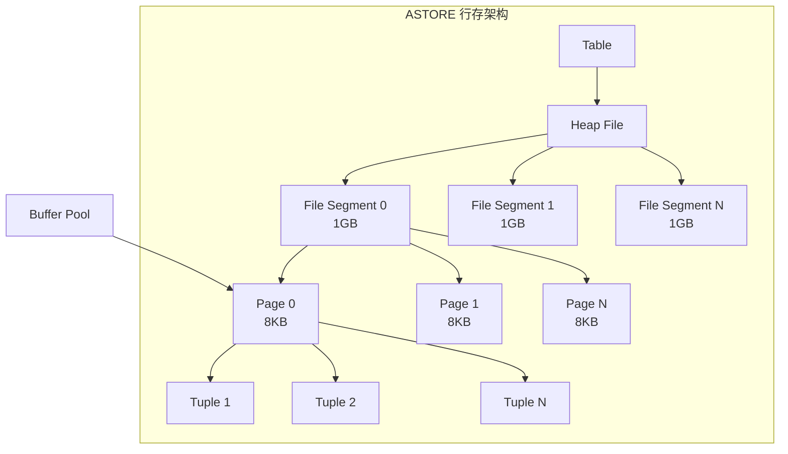

# openGauss 堆表存储（ASTORE）

## 学习目标

- 掌握 openGauss ASTORE 行存引擎的核心设计
- 理解 ASTORE 与 PostgreSQL Heap 的差异
- 对比 ASTORE 与 CSTORE/MOT 的场景选择

## ASTORE 架构



## 堆文件结构

ASTORE 的堆文件结构与 PostgreSQL 类似，采用段（Segment）+ 页（Page）+ 元组（Tuple）的三层结构。

### 段文件

```c
// 段文件结构
#define SEGMENT_SIZE (1024 * 1024 * 1024)  // 1GB per segment

// 文件命名规则
// 表空间/数据库/表OID_segment
// 例如：base/16384/16385.0, base/16384/16385.1
```

### 页面结构

```c
// 页面头
typedef struct PageHeaderData_s {
    PageXLogRecPtr pd_lsn;     // WAL 日志序列号
    uint16         pd_checksum;// 页面校验和
    uint16         pd_flags;   // 标志位
    LocationIndex  pd_lower;   // 空闲空间起始
    LocationIndex  pd_upper;   // 空闲空间结束
    LocationIndex  pd_special; // 特殊空间起始
    uint16         pd_pagesize_version; // 页面大小和版本
    ItemIdData     pd_linp[1]; // 行指针数组
} PageHeaderData_t;

#define BLCKSZ 8192  // 页面大小 8KB
```

### 元组结构

```c
// 元组头
typedef struct HeapTupleHeaderData_s {
    union {
        HeapTupleFields t_heap;
        DatumTupleFields t_datum;
    } t_choice;

    ItemIdData  t_infomask2;     // 属性数量
    uint16      t_infomask;      // 标志位
    uint8       t_hoff;          // 头大小
    uint8       t_bits[1];       // NULL 位图
} HeapTupleHeaderData_t;

// 元组结构
typedef struct HeapTupleData_s {
    uint32         t_len;        // 元组长度
    ItemPointerData t_self;      // 元组标识（块号 + 偏移）
    HeapTupleHeader t_data;      // 元组数据
} HeapTupleData_t;
```

## 元组操作

### 插入

```c
// 插入元组
Oid heap_insert(Relation relation, HeapTuple tup, CommandId cid,
                uint32 options, BulkInsertState bistate) {
    Buffer      buffer;
    Page        page;
    OffsetNumber offnum;

    // 1. 查找有足够空闲空间的页面
    buffer = RelationGetBufferForTuple(relation, tup->t_len,
                                       InvalidBuffer, options, bistate);
    page = BufferGetPage(buffer);

    // 2. 加排他锁
    LockBuffer(buffer, BUFFER_LOCK_EXCLUSIVE);

    // 3. 插入元组
    offnum = PageAddItem(page, (Item) tup->t_data, tup->t_len,
                         InvalidOffsetNumber, false, true);

    // 4. 更新页面头
    PageSetLSN(page, recptr);
    MarkBufferDirty(buffer);

    // 5. 释放锁
    LockBuffer(buffer, BUFFER_LOCK_UNLOCK);

    // 6. 写 WAL
    log_heap_insert(relation, buffer, tup);

    // 7. 返回元组标识
    ItemPointerSet(&(tup->t_self), BufferGetBlockNumber(buffer), offnum);
    return tup->t_self;
}
```

### 更新

```c
// 更新元组（多版本实现）
Oid heap_update(Relation relation, ItemPointer otid, HeapTuple newtup,
                CommandId cid, uint32 options) {
    Buffer      oldbuf, newbuf;
    Page        oldpage, newpage;

    // 1. 获取旧元组所在页面
    oldbuf = ReadBuffer(relation, ItemPointerGetBlockNumber(otid));
    oldpage = BufferGetPage(oldbuf);

    // 2. 标记旧元组已删除（设置 xmax）
    HeapTupleHeaderSetXmax(oldtup->t_data, GetCurrentTransactionId());
    oldtup->t_data->t_infomask |= HEAP_XMAX_INVALID;

    // 3. 插入新版本元组
    newbuf = RelationGetBufferForTuple(relation, newtup->t_len, oldbuf, 0, NULL);
    newpage = BufferGetPage(newbuf);
    OffsetNumber newoff = PageAddItem(newpage, (Item) newtup->t_data,
                                      newtup->t_len, InvalidOffsetNumber, false, true);

    // 4. 设置新元组的 xmin 指向旧元组
    HeapTupleHeaderSetXmin(newtup->t_data, GetCurrentTransactionId());
    newtup->t_data->t_infomask |= HEAP_UPDATED;

    // 5. 写 WAL
    log_heap_update(relation, oldbuf, otid, newbuf, newtup);

    // 6. 释放锁
    LockBuffer(oldbuf, BUFFER_LOCK_UNLOCK);
    LockBuffer(newbuf, BUFFER_LOCK_UNLOCK);

    return newtup->t_self;
}
```

### 删除

```c
// 删除元组（多版本实现）
void heap_delete(Relation relation, ItemPointer tid, CommandId cid) {
    Buffer      buffer;
    Page        page;
    HeapTuple   tup;

    // 1. 获取元组所在页面
    buffer = ReadBuffer(relation, ItemPointerGetBlockNumber(tid));
    page = BufferGetPage(buffer);

    // 2. 加排他锁
    LockBuffer(buffer, BUFFER_LOCK_EXCLUSIVE);

    // 3. 获取元组
    ItemId      lp = PageGetItemId(page, ItemPointerGetOffsetNumber(tid));
    tup = (HeapTuple) PageGetItem(page, lp);

    // 4. 标记已删除（设置 xmax）
    HeapTupleHeaderSetXmax(tup->t_data, GetCurrentTransactionId());
    tup->t_data->t_infomask |= HEAP_XMAX_INVALID;

    // 5. 写 WAL
    log_heap_delete(relation, buffer, tid);

    // 6. 释放锁
    MarkBufferDirty(buffer);
    LockBuffer(buffer, BUFFER_LOCK_UNLOCK);
}
```

## 表扫描

### 顺序扫描

```c
// 顺序扫描
HeapScan heap_beginscan(Relation relation, Snapshot snapshot,
                        uint32 nkeys, ScanKey key) {
    HeapScan scan = (HeapScan) palloc(sizeof(HeapScanData));

    scan->rs_rd = relation;
    scan->rs_snapshot = snapshot;
    scan->rs_nkeys = nkeys;
    scan->rs_key = key;
    scan->rs_cbuf = InvalidBuffer;
    scan->rs_cblock = 0;
    scan->rs_inited = false;

    return scan;
}

HeapTuple heap_getnext(HeapScan scan, ScanDirection direction) {
    Page        page;
    Buffer      buffer;

    // 1. 获取下一页面
    while (true) {
        if (scan->rs_cbuf == InvalidBuffer) {
            // 读取第一个页面
            buffer = ReadBuffer(scan->rs_rd, scan->rs_cblock);
            scan->rs_cbuf = buffer;
        } else if (scan->rs_cindex >= PageGetMaxOffsetNumber(page)) {
            // 读取下一页面
            scan->rs_cblock++;
            if (scan->rs_cblock >= RelationGetNumberOfBlocks(scan->rs_rd))
                return NULL;  // 扫描完成

            buffer = ReadBuffer(scan->rs_rd, scan->rs_cblock);
            ReleaseBuffer(scan->rs_cbuf);
            scan->rs_cbuf = buffer;
            scan->rs_cindex = FirstOffsetNumber;
        }

        page = BufferGetPage(scan->rs_cbuf);

        // 2. 获取下一元组
        ItemId lp = PageGetItemId(page, scan->rs_cindex);
        if (!ItemIdIsNormal(lp)) {
            scan->rs_cindex++;
            continue;
        }

        HeapTuple tup = (HeapTuple) PageGetItem(page, lp);
        scan->rs_ctup = *tup;
        scan->rs_cindex++;

        // 3. 可见性检查
        if (HeapTupleSatisfiesVisibility(&scan->rs_ctup, scan->rs_snapshot)) {
            return &scan->rs_ctup;
        }
    }
}
```

## 与 PostgreSQL Heap 对比

| 维度 | openGauss ASTORE | PostgreSQL Heap |
|------|------------------|-----------------|
| 页面大小 | 8KB（默认） | 8KB（默认） |
| 段大小 | 1GB | 1GB |
| 多版本 | MVCC（继承 PG） | MVCC |
| 压缩 | 不支持（需 CSTORE） | 不支持（需扩展） |
| 列存 | 不支持 | 不支持 |
| JIT 编译 | LLVM JIT 增强 | LLVM JIT（PG 11+） |

## 与 CSTORE/MOT 对比

| 维度 | ASTORE 行存 | CSTORE 列存 | MOT 内存表 |
|------|-------------|-------------|------------|
| 存储介质 | 磁盘 | 磁盘 | 内存 |
| 数据格式 | 行存 | 列存 | 行存 |
| 压缩 | 不支持 | CU 压缩（高压缩率） | 不支持 |
| 事务 | 支持 | 支持 | 支持（乐观锁） |
| 性能 | 中（OLTP） | 高（OLAP） | 极高（OLTP） |
| 适用场景 | OLTP | OLAP | 高性能 OLTP |

## 要点总结

- ASTORE 继承 PostgreSQL 的堆表存储设计，采用段 + 页 + 元组三层结构
- 元组操作包括插入、更新、删除，更新采用多版本机制
- 顺序扫描通过 Buffer Pool 读取页面，检查可见性
- 与 PG 相比：基础结构一致，增加了 JIT 编译等增强
- 与 CSTORE/MOT 相比：行存 + 磁盘，适合传统 OLTP 场景

## 思考题

1. ASTORE 的多版本机制与 CSTORE 的列存更新有何不同？
2. 如果一个表既有 OLTP 又有 OLAP 查询，如何在 ASTORE 和 CSTORE 之间选择？
3. openGauss 的堆表相比 PostgreSQL，在并发控制和锁粒度上有何增强？