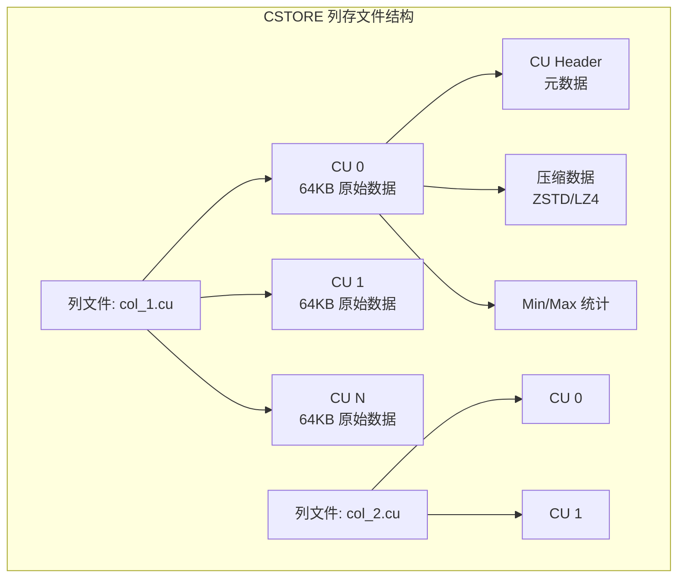
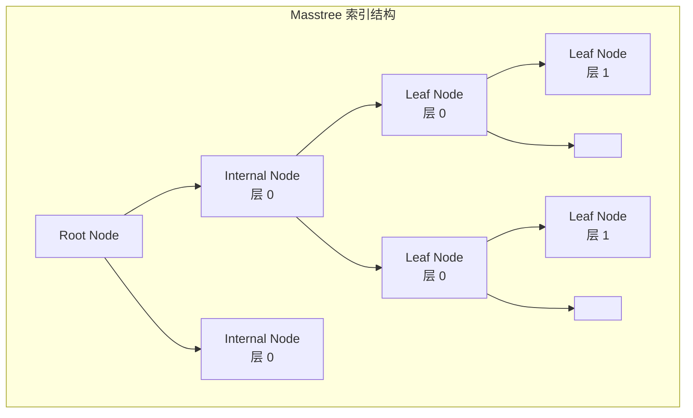

# openGauss 页面布局

## 学习目标

- 掌握 openGauss 三种存储引擎的页面/数据布局
- 理解 ASTORE 页、CSTORE CU、MOT 内存结构的差异
- 对比 openGauss 与 PostgreSQL 的页面布局

## ASTORE 页面布局

ASTORE 的页面布局继承自 PostgreSQL，采用标准的 8KB 页面结构。

### 页面结构


### 页面内部布局

```c
// 页面布局示意图
// Offset: 0x0000 - PageHeaderData (24 bytes)
// Offset: 0x0018 - ItemIdData[0] (4 bytes)
// Offset: 0x001C - ItemIdData[1] (4 bytes)
// ...
// Offset: pd_lower  - 空闲空间起始
// ...
// Offset: pd_upper  - 空闲空间结束
// ...
// Offset: 元组数据（从高地址向低地址增长）
// ...
// Offset: pd_special - 特殊空间起始（索引使用）
// Offset: 0x1FFF - 页面末尾

// 页面头结构
typedef struct PageHeaderData {
    uint32 pd_checksum;     // 校验和 (4B)
    uint32 pd_flags;        // 标志位 (4B)
    LocationIndex pd_lower; // 空闲空间起始 (2B)
    LocationIndex pd_upper; // 空闲空间结束 (2B)
    LocationIndex pd_special; // 特殊空间 (2B)
    uint16 pd_pagesize_version; // 页面大小+版本 (2B)
    TransactionId pd_prune_xid; // 可修剪事务 ID (4B)
    ItemIdData pd_linp[1];  // 行指针 (4B/项)
} PageHeaderData;

#define PageGetItemId(page, offsetNumber) \
    ((ItemIdData *) ((char *) (page) + PageHeaderDataSize \
        + ((offsetNumber - 1) * sizeof(ItemIdData))))
```

### 行指针 (ItemId)

```c
// 行指针结构
typedef struct ItemIdData {
    unsigned lp_off:15;    // 元组在页内的偏移
    unsigned lp_flags:2;   // 标志位
    unsigned lp_len:15;    // 元组长度
} ItemIdData;

// 标志位定义
#define LP_UNUSED    0  // 未使用
#define LP_NORMAL    1  // 正常
#define LP_REDIRECT  2  // 重定向（用于 TOAST）
#define LP_DEAD      3  // 已死亡
```

### 空闲空间管理

```c
// 查找足够空闲空间的页面
Buffer RelationGetBufferForTuple(Relation relation, uint32 len,
                                 Buffer otherBuffer, uint32 options,
                                 BulkInsertState bistate) {
    uint32 page_size = BLCKSZ;
    uint32 needed = len + sizeof(ItemIdData);

    if (needed > page_size - SizeOfPageHeaderData) {
        // 元组过大，需要使用 TOAST
        return toast_insert(relation, len, otherBuffer, options, bistate);
    }

    // 查找 FSM（空闲空间映射）
    Buffer buffer = fsm_search(relation, needed);
    if (buffer == InvalidBuffer) {
        // 没有足够空间的页面，扩展新页面
        buffer = ExtendBuffer(relation, needed);
    }

    return buffer;
}
```

## CSTORE 数据布局

CSTORE 使用 CU（Compression Unit）作为基本存储单位，每列数据独立存储。

### CU 结构



### CU 格式

```c
// CU 头结构
typedef struct CUHeader_s {
    uint32    cu_id;              // CU ID
    uint32    row_count;          // 行数
    uint32    orig_size;          // 原始大小
    uint32    comp_size;          // 压缩后大小
    CompressType comp_type;       // 压缩算法
    uint64    min_value;          // 最小值（用于过滤）
    uint64    max_value;          // 最大值（用于过滤）
    bool      has_null;           // 是否有 NULL
    uint32    null_bitmap_size;   // NULL 位图大小
} CUHeader_t;

#define CU_ROW_COUNT 60000  // 默认每 CU 60000 行
#define CU_MAX_SIZE (64 * 1024)  // 默认 64KB
```

### 列存文件结构

```c
// 列文件结构
// 表目录：base/oid/
// 文件命名：relfilenode_cu_col_列号.cu
// 例如：16385_cu_col_0.cu, 16385_cu_col_1.cu

// 列存储元数据
typedef struct ColumnMeta_s {
    uint32    col_id;          // 列 ID
    DataType  data_type;       // 数据类型
    uint32    cu_count;        // CU 数量
    uint32    total_rows;      // 总行数
    uint64    *cu_offsets;     // CU 文件偏移数组
} ColumnMeta_t;
```

### CU 读取

```c
// 读取 CU 数据
char *cstore_read_cu(ColumnMeta *meta, uint32 cu_idx) {
    // 1. 检查 CU 缓存
    char *data = cucache_lookup(meta->col_id, cu_idx);
    if (data != NULL) {
        return data;
    }

    // 2. 从磁盘读取
    FILE *f = fopen(cu_filename(meta->col_id), "rb");
    fseek(f, meta->cu_offsets[cu_idx], SEEK_SET);

    CUHeader header;
    fread(&header, sizeof(CUHeader), 1, f);

    char *comp_data = malloc(header.comp_size);
    fread(comp_data, header.comp_size, 1, f);
    fclose(f);

    // 3. 解压
    char *raw_data = malloc(header.orig_size);
    decompress(comp_data, header.comp_size, raw_data, &header.orig_size,
               header.comp_type);
    free(comp_data);

    // 4. 加入缓存
    cucache_insert(meta->col_id, cu_idx, raw_data, header.orig_size);

    return raw_data;
}
```

## MOT 内存结构

MOT 表完全存储在内存中，使用 Masstree 索引组织数据。

### 内存行结构

```c
// MOT 内存行
typedef struct MOTRow_s {
    uint32     row_id;       // 行 ID
    uint32     version;      // 版本号（乐观锁）
    uint32     data_size;    // 数据大小
    char       data[0];      // 列数据（变长）
} MOTRow_t;

// MOT 表结构
typedef struct MOTTable_s {
    Masstree   *index;       // Masstree 主索引
    uint32      row_count;   // 行数
    uint32      col_count;   // 列数
    MOTAllocator *alloc;     // 内存分配器
    uint32      next_row_id; // 下一行 ID
} MOTTable_t;
```

### Masstree 索引结构



### 检查点持久化

```c
// MOT 检查点：将内存数据写入磁盘
void mot_checkpoint(MOTTable *table, const char *path) {
    FILE *f = fopen(path, "wb");

    // 1. 写入表元数据
    MOTCheckpointHeader header;
    header.row_count = table->row_count;
    header.col_count = table->col_count;
    fwrite(&header, sizeof(header), 1, f);

    // 2. 遍历 Masstree 写入所有行
    MasstreeIterator *iter = masstree_begin(table->index);
    while (masstree_is_valid(iter)) {
        uint64 key = masstree_key(iter);
        MOTRow *row = (MOTRow *) masstree_value(iter);

        fwrite(&key, sizeof(key), 1, f);
        fwrite(&row->data_size, sizeof(row->data_size), 1, f);
        fwrite(row->data, row->data_size, 1, f);

        masstree_next(iter);
    }
    masstree_end(iter);

    fclose(f);
}
```

## 布局对比

| 维度 | ASTORE（行存） | CSTORE（列存） | MOT（内存） |
|------|----------------|----------------|-------------|
| 页面大小 | 8KB | 64KB（CU） | 不适用 |
| 存储单元 | Page | CU | Masstree 节点 |
| 数据组织 | 行存 | 列存 | 行存 + 索引 |
| 压缩 | 无 | ZSTD/LZ4 | 无 |
| 空闲空间管理 | FSM | 无（追加写） | 无 |
| 索引 | BTree | 独立索引文件 | Masstree |

## 与 PostgreSQL 对比

| 维度 | openGauss ASTORE | PostgreSQL |
|------|------------------|------------|
| 页面结构 | 8KB，与 PG 一致 | 8KB |
| 空闲空间 | FSM（继承 PG） | FSM |
| 可见性映射 | VM（继承 PG） | VM |
| TOAST | 支持 | 支持 |
| 列存布局 | CSTORE（CU 格式） | 不支持 |
| 内存布局 | MOT（Masstree） | 不支持 |

## 要点总结

- ASTORE 页面布局与 PostgreSQL 一致：PageHeader + ItemId 数组 + 空闲空间 + 元组数据
- CSTORE 使用 CU（Compression Unit）组织列存数据，每 CU 约 60000 行、64KB
- MOT 使用 Masstree 索引 + 内存行结构，检查点持久化到磁盘
- 三种布局对应三种存储模型：行存、列存、内存
- 与 PG 相比：CU 列存布局和 Masstree 内存布局是独有设计

## 思考题

1. ASTORE 的页面布局如何支持高效的并发更新？
2. CSTORE 的 CU 大小（60000 行）如何影响查询性能和压缩率？
3. MOT 的 Masstree 索引相比 BTree，在内存场景下有何优势？