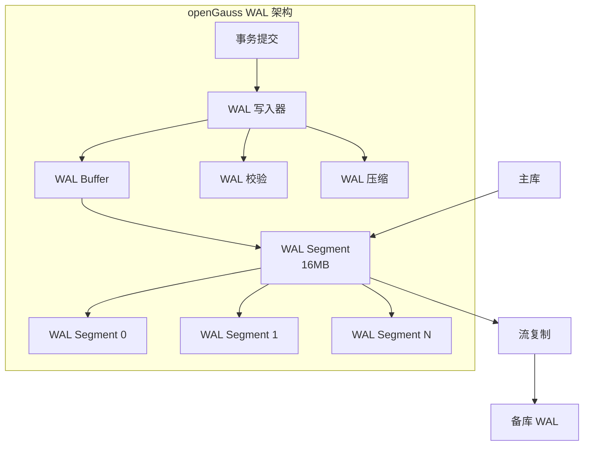
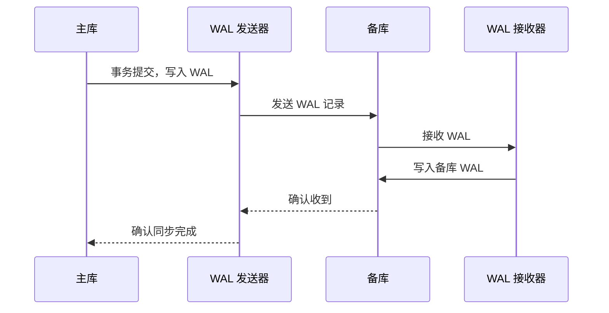

# openGauss WAL 机制

## 学习目标

- 掌握 openGauss WAL（Write-Ahead Log）的核心设计
- 理解 openGauss 对 PostgreSQL WAL 的增强
- 对比三种存储引擎的 WAL 使用差异

## WAL 架构



## WAL 记录格式

### 记录结构

```c
// WAL 记录头
typedef struct XLogRecord_s {
    uint32      xl_tot_len;      // 总长度（含头）
    TransactionId xl_xid;        // 事务 ID
    XLogRecPtr  xl_prev;         // 上一条记录 LSN
    uint8       xl_info;         // 信息标志位
    ResourceManager xl_rmid;     // 资源管理器 ID
    uint32      xl_crc;          // 校验和
    uint32      xl_len;          // 数据长度
    char        xl_data[0];      // 数据
} XLogRecord_t;

// WAL 页面结构
typedef struct XLogPageHeaderData_s {
    uint16      xlp_magic;       // 魔数
    uint16      xlp_info;        // 信息标志
    TimeLineID  xlp_tli;         // 时间线 ID
    XLogRecPtr  xlp_pageaddr;    // 页面地址
    uint32      xlp_rem_len;     // 上一条记录的剩余长度
} XLogPageHeaderData_t;

#define XLOG_BLCKSZ 8192  // WAL 页面大小
#define XLOG_SEG_SIZE (16 * 1024 * 1024)  // WAL 段大小 16MB
```

### 资源管理器

```c
// 资源管理器 ID
#define RM_XLOG_ID       0   // XLOG 自身
#define RM_XACT_ID       1   // 事务
#define RM_SMGR_ID       2   // 存储管理器
#define RM_HEAP_ID       3   // 堆表
#define RM_BTREE_ID      4   // BTree 索引
#define RM_HASH_ID       5   // Hash 索引
#define RM_GIN_ID        6   // GIN 索引
#define RM_GIST_ID       7   // GiST 索引
#define RM_SEQ_ID        8   // 序列
#define RM_CSTORE_ID     9   // 列存
#define RM_MOT_ID       10   // MOT 内存表
```

## 写入流程

### 事务提交时 WAL 写入

```c
// 事务提交 WAL 写入
XLogRecPtr XLogInsert(XLogRecord *record) {
    XLogRecPtr recptr;

    // 1. 加 WAL 插入锁
    LWLockAcquire(WALInsertLock, LW_EXCLUSIVE);

    // 2. 计算 WAL 记录在 Buffer 中的位置
    recptr = GetNextXLogPosition(record->xl_tot_len);

    // 3. 复制记录到 WAL Buffer
    memcpy(GetXLogBuffer(recptr), record, record->xl_tot_len);

    // 4. 更新 WAL Buffer 状态
    XLogCtl->Insert->CurrBytePos = recptr + record->xl_tot_len;

    // 5. 释放 WAL 插入锁
    LWLockRelease(WALInsertLock);

    return recptr;
}
```

### WAL 刷盘

```c
// 将 WAL Buffer 刷入磁盘
void XLogFlush(XLogRecPtr record) {
    XLogRecPtr write_upto = record;

    // 1. 计算需要刷盘的 WAL 段
    uint32 seg_no = write_upto / XLOG_SEG_SIZE;

    // 2. 计算需要刷盘的 WAL 页面
    uint32 page_no = (write_upto % XLOG_SEG_SIZE) / XLOG_BLCKSZ;

    // 3. 获取 WAL 文件句柄
    int fd = OpenWALFile(seg_no);

    // 4. 计算要刷盘的偏移
    off_t offset = page_no * XLOG_BLCKSZ;

    // 5. 刷盘
    pg_flush(fd, offset, XLOG_BLCKSZ);

    // 6. 等待 IO 完成
    wait_sync();

    // 7. 更新刷盘位置
    XLogCtl->LogwrtResult.Flush = record;
}
```

### 检查点

```c
// 检查点处理
void CreateCheckPoint(int flags) {
    CheckPoint checkpoint;

    // 1. 记录当前 WAL 位置
    checkpoint.redo = GetXLogInsertRecPtr();

    // 2. 生成检查点 WAL 记录
    XLogRecord *record = XLogRecordAssemble(RM_XLOG_ID, XLOG_CHECKPOINT_SHUTDOWN,
                                            &checkpoint, sizeof(checkpoint));
    XLogInsert(record);

    // 3. 强制刷盘 WAL
    XLogFlush(checkpoint.redo);

    // 4. 更新控制文件中的检查点位置
    UpdateControlFile(checkpoint.redo);

    // 5. 清理过期的 WAL 段
    CleanupOldWALFiles(checkpoint.redo);
}
```

## 三种存储引擎的 WAL 使用

### ASTORE WAL

```c
// 堆表插入的 WAL 日志
typedef struct xl_heap_insert_s {
    OffsetNumber offnum;   // 行号
    uint16       flag;     // 标志位
    uint16       tuple_len;// 元组长度
    char         tuple[0]; // 元组数据
} xl_heap_insert_t;

// 堆表更新的 WAL 日志
typedef struct xl_heap_update_s {
    OffsetNumber old_offnum;  // 旧行号
    uint16       old_flag;    // 旧标志位
    uint16       old_tuple_len; // 旧元组长度
    char         old_tuple[0]; // 旧元组数据
    OffsetNumber new_offnum;  // 新行号
    uint16       new_flag;    // 新标志位
    uint16       new_tuple_len; // 新元组长度
    char         new_tuple[0]; // 新元组数据
} xl_heap_update_t;
```

### CSTORE WAL

```c
// 列存插入的 WAL 日志
typedef struct xl_cstore_insert_s {
    uint32     cu_id;          // CU ID
    uint32     row_count;      // 行数
    uint32     col_count;      // 列数
    uint32     data_size;      // 数据大小
    char       data[0];        // CU 数据
} xl_cstore_insert_t;

// 列存对 WAL 的优化：批量写入
// 每 CU 60000 行，因此 WAL 日志也是批量的
// 减少了 WAL 写入次数，提高了 OLAP 场景的写入性能
```

### MOT WAL

```c
// MOT 插入的 WAL 日志
typedef struct xl_mot_insert_s {
    uint64     key;            // Masstree 键
    uint32     row_size;       // 行大小
    char       row_data[0];    // 行数据
} xl_mot_insert_t;

// MOT 对 WAL 的优化：异步 WAL 写入
// 1. 事务在内存中完成，立即返回客户端
// 2. WAL 日志异步写入，不阻塞事务
// 3. 检查点定期持久化内存数据
```

## 流复制增强



### openGauss 对 WAL 的增强

| 特性 | PostgreSQL 9.2 | openGauss |
|------|---------------|-----------|
| 压缩 | 不支持 | 支持 WAL 压缩（ZSTD） |
| 异步提交 | 支持 | 支持（增强） |
| 并行 WAL 写入 | 单线程 | 多线程并行写入 |
| 流复制 | 支持 | 支持（增强） |
| 级联复制 | 支持 | 支持 |
| 逻辑复制 | 不支持 | 支持 |
| 异地容灾 | 不支持 | 支持 |

## 与 PostgreSQL 对比

| 维度 | openGauss | PostgreSQL |
|------|-----------|------------|
| WAL 格式 | 兼容 PG | XLogRecord |
| WAL 段大小 | 16MB | 16MB |
| 资源管理器 | 11 个（含 CSTORE/MOT） | 9 个 |
| 检查点 | 一致 | 一致 |
| 归档 | 支持 | 支持 |
| 流复制 | 增强 | 支持 |
| 缓冲区管理 | 异步刷盘 | 同步刷盘 |

## 要点总结

- openGauss 的 WAL 机制继承自 PostgreSQL，但增加了对 CSTORE 和 MOT 引擎的支持
- WAL 记录格式与 PostgreSQL 兼容：XLogRecord 头 + 资源管理器特定数据
- 三种存储引擎使用不同的 WAL 记录格式：ASTORE 按行、CSTORE 按 CU、MOT 按行 + 异步
- 增强特性：WAL 压缩、多线程并行写入、逻辑复制、异地容灾
- 与 PG 相比：WAL 压缩、并行写入、多引擎支持是主要差异

## 思考题

1. MOT 的异步 WAL 写入在宕机时可能丢失多少数据？如何平衡性能与可靠性？
2. CSTORE 的 CU 批量 WAL 写入相比 ASTORE 的行级 WAL 写入，对恢复速度有何影响？
3. openGauss 的 WAL 压缩（ZSTD）对 CPU 和磁盘 IO 的权衡如何？