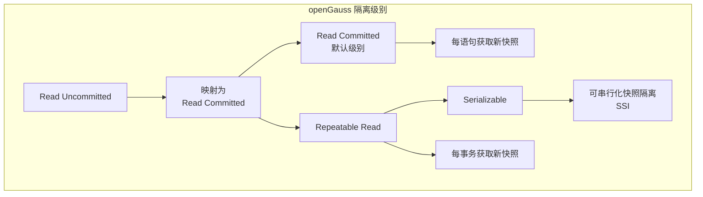
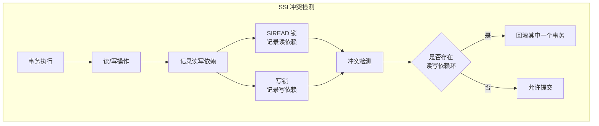

# openGauss 事务隔离级别

## 学习目标

- 掌握 openGauss 支持的隔离级别和实现机制
- 理解 openGauss 对 PostgreSQL 隔离级别的增强
- 对比三种存储引擎的隔离级别支持差异

## 隔离级别概述



## Read Committed（默认）

openGauss 的默认隔离级别，与 PostgreSQL 一致。

### 实现机制

```c
// Read Committed 快照获取
Snapshot GetSnapshotData(Snapshot snapshot) {
    // 每语句获取新快照，保证语句级一致性

    // 1. 获取当前事务 ID
    snapshot->xmin = ShmemVariableCache->latestCompletedXid + 1;

    // 2. 获取最大已分配事务 ID
    snapshot->xmax = ShmemVariableCache->nextXid;

    // 3. 收集活跃事务
    snapshot->xcnt = 0;
    for (int i = 0; i < PROC_ARRAY_SIZE; i++) {
        PGPROC *proc = &ProcArray[i];
        if (proc->xid != InvalidTransactionId) {
            snapshot->xip[snapshot->xcnt++] = proc->xid;
        }
    }

    return snapshot;
}
```

### 行为示例

```sql
-- 事务 A
BEGIN;
SELECT * FROM accounts WHERE id = 1;  -- 读取余额 100
-- 事务 B 更新并提交
UPDATE accounts SET balance = 200 WHERE id = 1;
COMMIT;
-- 事务 A 再次读取
SELECT * FROM accounts WHERE id = 1;  -- 读取余额 200（新快照）
-- 不可重复读（Non-Repeatable Read）
COMMIT;
```

## Repeatable Read

openGauss 的 Repeatable Read 实际上提供快照隔离（Snapshot Isolation），防止不可重复读，但允许幻读（与 PostgreSQL 一致）。

### 实现机制

```c
// Repeatable Read 快照：事务开始时获取，整个事务使用同一快照
void RepeatableReadBegin(Snapshot snapshot) {
    // 1. 在事务开始时获取快照
    snapshot->xmin = ShmemVariableCache->latestCompletedXid + 1;
    snapshot->xmax = ShmemVariableCache->nextXid;

    // 2. 在事务中固定该快照
    // 后续所有语句都使用这个快照，不再更新
    CurrentSnapshot = snapshot;
    SetSnapshotUsed(snapshot);
}
```

### 写入冲突检测

```c
// 快照隔离的写入冲突检测
// 当两个并发事务修改同一行时，后提交者回滚

bool CheckSerializableConflict(Relation relation, ItemPointer tid) {
    // 1. 读取元组
    Buffer buffer = ReadBuffer(relation, ItemPointerGetBlockNumber(tid));
    Page page = BufferGetPage(buffer);
    ItemId lp = PageGetItemId(page, ItemPointerGetOffsetNumber(tid));
    HeapTuple tup = (HeapTuple) PageGetItem(page, lp);

    // 2. 检查是否有其他并发事务修改了该行
    // 如果 t_xmin 不是当前事务，且 t_xmin 在当前事务的快照之后提交
    // 则发生写入冲突

    if (tup->t_xmin != GetCurrentTransactionId() &&
        TransactionIdIsInProgress(tup->t_xmin)) {
        // 写入冲突（First-committer-wins）
        return false;
    }

    return true;
}
```

## Serializable（SSI）

openGauss 支持可串行化快照隔离（Serializable Snapshot Isolation, SSI），与 PostgreSQL 9.2+ 一致。

### SSI 实现



### SIREAD 锁

```c
// SIREAD 锁：记录读依赖
typedef struct SIReadLock_s {
    TaggedItemPtr  tag;       // 数据项标识
    PGPROC        *proc;      // 事务
    uint32         flags;     // 标志位
} SIReadLock_t;

// SIREAD 锁管理
typedef struct SIReadLockTable_s {
    SIReadLock_t  *locks;     // 锁数组
    uint32         count;     // 锁数量
    uint32         capacity;  // 容量
    HTAB          *hash;      // 哈希索引
} SIReadLockTable_t;
```

### 冲突检测

```c
// rw-conflict 检测
// 当以下情况发生时，检测到读写冲突：
// T1 读取了某行，T2 随后写入该行并提交
// 此时 T1 和 T2 之间存在 rw-conflict

bool CheckRWConflict(SIReadLock *lock) {
    // 1. 查找所有写入该行的事务
    List *writers = FindWriters(lock->tag);

    // 2. 检查是否有环
    foreach(writer, writers) {
        if (HasCycle(lock->proc, writer)) {
            // 发现冲突环，需要回滚
            return true;
        }
    }

    return false;
}
```

## MOT 隔离级别

MOT 默认提供 Read Committed 和 Repeatable Read 隔离级别。

### MOT 快照隔离

```c
// MOT 快照隔离的实现
// MOT 使用全局版本号，每事务开始时获取版本号

typedef struct MOTSnapshot_s {
    uint64        version;       // 全局版本号
    TransactionId snapshot_xid;  // 快照事务 ID
    bool          is_repeatable; // 是否可重复读
} MOTSnapshot_t;

// MOT 事务读取
MOTRow *mot_read_with_snapshot(MOTTable *table, uint64 key,
                                MOTSnapshot *snapshot) {
    MOTRow *row = masstree_search(table->index, key);

    // 可见性判断
    if (row->version > snapshot->version) {
        // 该行在当前事务之后修改，不可见
        return NULL;
    }

    if (row->xmin == snapshot->snapshot_xid) {
        // 当前事务修改的行，可见
        return row;
    }

    // 快照隔离：返回版本号 <= snapshot->version 的行
    return row;
}
```

## 隔离级别对比

| 维度 | Read Committed | Repeatable Read | Serializable |
|------|----------------|-----------------|--------------|
| 脏读 | 防止 | 防止 | 防止 |
| 不可重复读 | 允许 | 防止 | 防止 |
| 幻读 | 允许 | 允许（PG 行为） | 防止 |
| 序列化异常 | 允许 | 允许 | 防止 |
| 实现机制 | 语句级快照 | 事务级快照 | SSI |
| 性能 | 高 | 中 | 低 |
| 写入冲突 | 无 | 可能 | 频繁 |

## 三种引擎隔离级别支持

| 隔离级别 | ASTORE | CSTORE | MOT |
|----------|--------|--------|-----|
| Read Uncommitted | 映射为 RC | 映射为 RC | 映射为 RC |
| Read Committed | 支持（默认） | 支持 | 支持（默认） |
| Repeatable Read | 支持 | 支持 | 支持 |
| Serializable | 支持（SSI） | 不支持 | 不支持 |

## 与 PostgreSQL 对比

| 维度 | openGauss | PostgreSQL |
|------|-----------|------------|
| 默认级别 | Read Committed | Read Committed |
| Read Uncommitted | 映射为 RC | 映射为 RC |
| Repeatable Read | 快照隔离 | 快照隔离 |
| Serializable | SSI | SSI |
| 幻读 | 允许（RR 级别） | 允许（RR 级别） |
| MOT 隔离 | MOT 快照隔离 | 不支持 |

## 要点总结

- openGauss 支持四种隔离级别，Read Uncommitted 映射为 Read Committed
- 默认隔离级别为 Read Committed，使用语句级快照
- Repeatable Read 提供快照隔离，防止不可重复读
- Serializable 使用 SSI（可串行化快照隔离），检测 rw-conflict
- MOT 使用全局版本号实现快照隔离，不支持 SSI
- 与 PG 相比：隔离级别体系一致，MOT 的版本号隔离是增强

## 思考题

1. openGauss 的 SSI 相比 PG 的 SSI 实现有何差异？是否做了性能优化？
2. MOT 为什么不支持 SSI？如果业务需要可串行化隔离，如何结合 MOT 和 ASTORE 使用？
3. 快照隔离（SI）与可串行化（SSI）在性能上的差异有多大？什么场景下需要 SSI？