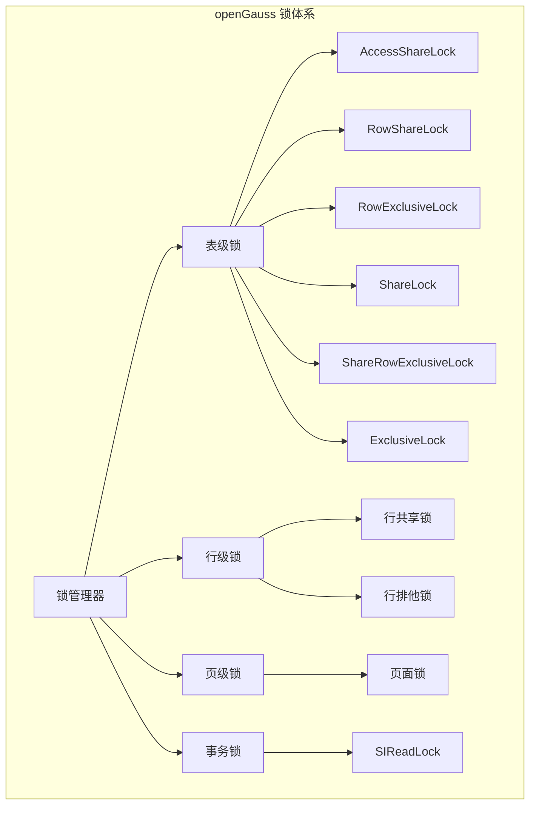

# openGauss 锁机制

## 学习目标

- 掌握 openGauss 的锁体系结构
- 理解 openGauss 对 PostgreSQL 锁机制的增强
- 对比三种存储引擎的锁策略差异

## 锁体系架构



## 表级锁

openGauss 继承 PostgreSQL 的 8 级表锁，锁强度递增。

### 锁模式

```c
// 表级锁模式
typedef enum LOCKMODE_s {
    AccessShareLock        = 1,  // SELECT 读取
    RowShareLock           = 2,  // SELECT FOR UPDATE
    RowExclusiveLock       = 3,  // INSERT/UPDATE/DELETE
    ShareUpdateExclusiveLock = 4,// VACUUM（不阻塞读取）
    ShareLock              = 5,  // CREATE INDEX（并发）
    ShareRowExclusiveLock  = 6,  // 排他共享锁
    ExclusiveLock          = 7,  // REFRESH MATERIALIZED VIEW
    AccessExclusiveLock    = 8   // DROP TABLE/TRUNCATE
} LOCKMODE_t;
```

### 锁冲突矩阵

| 锁模式 | ASL | RSL | REL | SUEL | SL | SREL | EL | AEL |
|--------|-----|-----|-----|------|----|------|----|-----|
| AccessShareLock | - | - | - | - | - | - | - | X |
| RowShareLock | - | - | - | - | - | - | X | X |
| RowExclusiveLock | - | - | - | - | X | X | X | X |
| ShareUpdateExclusiveLock | - | - | - | X | X | X | X | X |
| ShareLock | - | - | X | X | - | X | X | X |
| ShareRowExclusiveLock | - | - | X | X | X | X | X | X |
| ExclusiveLock | - | X | X | X | X | X | X | X |
| AccessExclusiveLock | X | X | X | X | X | X | X | X |

### 锁请求流程

```c
// 表级锁请求
bool LockRelationOid(Oid relid, LOCKMODE lockmode) {
    // 1. 查找或创建锁对象
    LOCk *lock = LockHashFind(relid);
    if (lock == NULL) {
        lock = LockHashCreate(relid);
    }

    // 2. 检查锁冲突
    if (LockConflict(lock, lockmode)) {
        // 有冲突，等待
        LockWait(lock, lockmode);
        return false;
    }

    // 3. 授予锁
    LockGrant(lock, lockmode);

    return true;
}
```

## 行级锁

### 行锁实现

openGauss 通过元组头的 xmax 字段实现行级锁，与 PostgreSQL 一致。

```c
// 行锁（通过元组头的 xmax 实现）
// SELECT FOR UPDATE 时：
// 1. 将元组的 xmax 设置为当前事务 ID
// 2. 设置 HEAP_XMAX_EXCL_LOCK 标志
// 3. 其他事务尝试修改该元组时，发现 xmax 活跃则等待

// 行锁标记
#define HEAP_XMAX_EXCL_LOCK    (1 << 1)  // 排他行锁
#define HEAP_XMAX_KEYSHR_LOCK  (1 << 2)  // 键共享锁
#define HEAP_XMAX_SHR_LOCK     (1 << 3)  // 共享行锁
```

### MultiXactId

```c
// MultiXactId：当多个事务同时锁同一行时使用
// 例如：事务 A 和 B 同时 SELECT FOR UPDATE 同一行

typedef struct MultiXactMember_s {
    TransactionId xid;           // 事务 ID
    uint8         status;        // 锁类型（共享/排他）
} MultiXactMember_t;

typedef struct MultiXact_s {
    uint32            nmembers;   // 成员数
    MultiXactMember   members[1]; // 成员数组
} MultiXact_t;
```

## 页面锁（LWLock）

### LWLock 结构

```c
// 轻量级锁
typedef struct LWLock_s {
    slock_t     mutex;           // 自旋锁保护状态
    uint16      nwaiters;        // 等待者数量
    uint16      exclusive;       // 排他锁持有者
    uint16      shared;          // 共享锁持有者数
    PGPROC      *waiters_head;   // 等待队列头
    PGPROC      *waiters_tail;   // 等待队列尾
} LWLock_t;

// LWLock 模式
#define LW_EXCLUSIVE   0  // 排他模式
#define LW_SHARED      1  // 共享模式
```

### LWLock 获取

```c
// 获取 LWLock（排他模式）
void LWLockAcquire(LWLock *lock, LWLockMode mode) {
    // 1. 尝试快速获取
    if (LWLockAttemptLock(lock, mode)) {
        return;  // 获取成功
    }

    // 2. 加入等待队列
    LWLockQueue(lock, MyProc);

    // 3. 自旋等待
    while (!LWLockAttemptLock(lock, mode)) {
        s_lock(100);  // 自旋 100 次
    }

    // 4. 出队
    LWLockDequeue(lock, MyProc);
}
```

## MOT 无锁并发

MOT 使用乐观并发控制，不依赖传统锁机制。

```c
// MOT 事务执行流程（无锁）
// 1. 读取阶段：直接读取内存行，记录版本号
// 2. 验证阶段：检查版本号是否变化
// 3. 写入阶段：CAS 更新行版本号

// CAS 操作（无锁）
bool mot_cas_update(MOTRow *row, uint64 old_version, uint64 new_version) {
    // 原子比较并交换
    return atomic_compare_exchange(&row->version, old_version, new_version);
}

// MOT 行更新（无锁）
bool mot_update_row(MOTTable *table, uint64 key, void *new_data) {
    MOTRow *row = masstree_search(table->index, key);

    while (true) {
        uint64 old_ver = row->version;
        uint64 new_ver = old_ver + 1;

        // CAS 更新版本号
        if (mot_cas_update(row, old_ver, new_ver)) {
            // 更新成功，写入数据
            memcpy(row->row_data, new_data, row->data_size);
            return true;
        }
        // CAS 失败，重试
    }
}
```

## 死锁检测

```c
// 死锁检测
bool DeadLockCheck(void) {
    // 1. 构建等待图
    WaitGraph graph;
    BuildWaitGraph(&graph);

    // 2. 检测环
    for (int i = 0; i < graph.node_count; i++) {
        if (FindCycle(&graph, i)) {
            // 发现死锁
            PGPROC *victim = ChooseVictim(&graph);

            // 终止受害者事务
            CancelTransaction(victim);

            return true;
        }
    }

    return false;
}
```

## 三种引擎锁策略对比

| 维度 | ASTORE | CSTORE | MOT |
|------|--------|--------|-----|
| 表级锁 | 8 级锁 | 8 级锁 | 无 |
| 行级锁 | xmax 行锁 | DELTA 行锁 | 版本号 CAS |
| 页面锁 | LWLock | LWLock | 无 |
| 死锁检测 | 超时 + 等待图 | 超时 + 等待图 | 无死锁（乐观） |
| 并发控制 | 2PL | 2PL | OCC |
| 热点性能 | 行锁竞争 | 列级锁 | CAS 重试 |

## 与 PostgreSQL 对比

| 维度 | openGauss | PostgreSQL |
|------|-----------|------------|
| 表级锁 | 8 级锁，兼容 PG | 8 级锁 |
| 行级锁 | xmax 实现 | xmax 实现 |
| LWLock | 相同设计 | LWLock |
| 死锁检测 | 超时 + 等待图 | 超时 + 等待图 |
| MOT 无锁 | 独有 | 不支持 |
| NUMA 感知锁 | 支持 | 有限支持 |

## 要点总结

- openGauss 继承 PostgreSQL 的 8 级表锁和 xmax 行锁
- LWLock 用于保护共享数据结构（缓冲区、WAL 等）
- MOT 使用乐观并发控制（版本号 CAS），无锁设计
- 死锁检测通过等待图分析 + 超时机制实现
- 与 PG 相比：MOT 无锁并发、NUMA 感知锁是独有增强

## 思考题

1. MOT 的无锁并发在写入冲突率超过 10% 时，性能下降多少？如何优化？
2. 如果在一个事务中同时使用 ASTORE 表锁和 MOT 乐观锁，如何避免死锁？
3. openGauss 的 NUMA 感知锁分配策略对多路服务器性能有何提升？