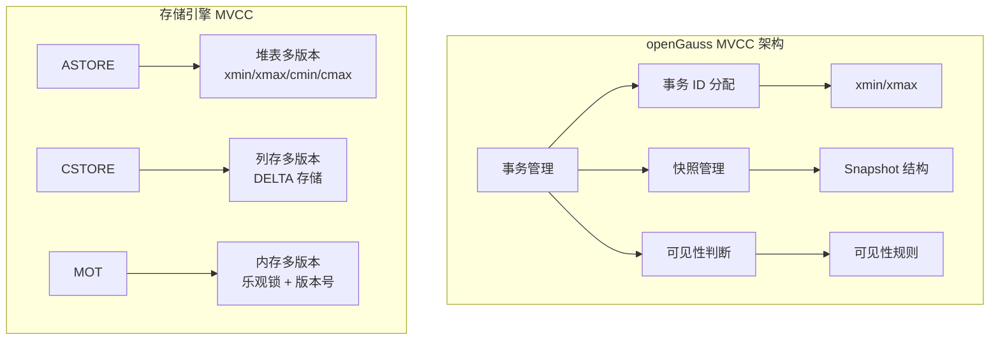
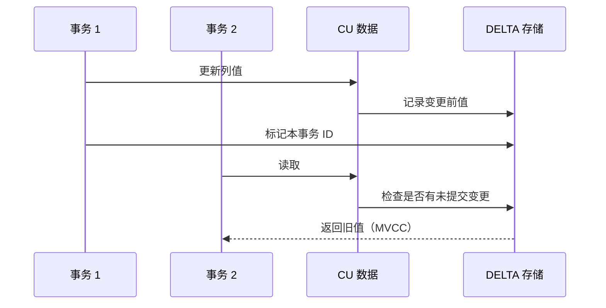

# openGauss MVCC 机制

## 学习目标

- 掌握 openGauss 多版本并发控制（MVCC）的核心设计
- 理解 openGauss 对 PostgreSQL MVCC 的增强
- 对比三种存储引擎的 MVCC 实现差异

## MVCC 架构



## ASTORE MVCC

ASTORE 继承 PostgreSQL 的 MVCC 机制，通过元组头中的 xmin/xmax 字段实现多版本。

### 元组头中的版本信息

```c
// 元组头中的事务信息
typedef struct HeapTupleFields_s {
    TransactionId t_xmin;       // 创建该版本的事务 ID
    TransactionId t_xmax;       // 删除/锁定该版本的事务 ID
    CommandId     t_cid;        // 命令 ID（同一事务内的命令序号）
    uint16        t_infomask2;  // 信息标志 2
    uint16        t_infomask;   // 信息标志
    uint8         t_hoff;       // 头大小
} HeapTupleFields_t;

// 事务相关标志位
#define HEAP_XMIN_COMMITTED     (1 << 8)   // t_xmin 已提交
#define HEAP_XMIN_INVALID       (1 << 9)   // t_xmin 无效
#define HEAP_XMIN_FROZEN        (1 << 10)  // t_xmin 已冻结
#define HEAP_XMAX_COMMITTED     (1 << 11)  // t_xmax 已提交
#define HEAP_XMAX_INVALID       (1 << 12)  // t_xmax 无效
#define HEAP_XMAX_IS_MULTI      (1 << 13)  // t_xmax 是 MultiXactId
```

### 可见性判断

```c
// 快照结构
typedef struct SnapshotData_s {
    SnapshotType snapshot_type;    // 快照类型
    TransactionId xmin;            // 最小活跃事务
    TransactionId xmax;            // 最大已分配事务 + 1
    TransactionId *xip;            // 活跃事务数组
    uint32        xcnt;           // 活跃事务数
    TransactionId *subxip;        // 子事务数组
    uint32        subxcnt;        // 子事务数
    bool          taken_during_recovery; // 恢复中获取
} SnapshotData_t;

// 可见性判断
bool HeapTupleSatisfiesVisibility(HeapTuple tup, Snapshot snapshot) {
    // 1. 检查 t_xmin
    if (!TransactionIdIsValid(tup->t_xmin))
        return false;  // 无效 xmin，不可见

    if (TransactionIdIsInProgress(tup->t_xmin)) {
        // 创建者还在运行中，对当前事务可见
        if (tup->t_xmin == GetCurrentTransactionId())
            return true;
        return false;  // 其他事务创建，不可见
    }

    if (!TransactionIdDidCommit(tup->t_xmin))
        return false;  // 创建者未提交，不可见

    // 2. 检查 t_xmax
    if (!TransactionIdIsValid(tup->t_xmax))
        return true;   // 未被删除

    if (TransactionIdIsInProgress(tup->t_xmax)) {
        // 删除者还在运行
        if (tup->t_xmax == GetCurrentTransactionId())
            return false;  // 被当前事务删除
        return true;   // 被其他事务删除，尚未提交
    }

    if (!TransactionIdDidCommit(tup->t_xmax))
        return true;   // 删除者未提交

    // 3. 检查快照中的事务可见性
    if (tup->t_xmax < snapshot->xmin)
        return false;  // 已提交的删除，不可见

    // 4. 检查 t_cid（同一事务内的可见性）
    if (tup->t_cid > snapshot->curcid)
        return false;

    return true;
}
```

### 事务提交

```c
// 事务提交时设置标志位
void CommitTransaction(void) {
    // 1. 提交事务
    TransactionId xid = GetCurrentTransactionId();

    // 2. 记录事务提交日志
    TransactionLogCommit(xid);

    // 3. 设置 CLOG（Commit Log）
    SetTransactionIdStatus(xid, TRANSACTION_STATUS_COMMITTED);

    // 4. 清理子事务
    CleanupSubTransactions();

    // 5. 释放锁
    ReleaseAllLocks();
}
```

## CSTORE MVCC

CSTORE 使用 DELTA 存储实现多版本。

### DELTA 机制



```c
// DELTA 存储结构
typedef struct CStoreDelta_s {
    uint32       row_id;         // 行号
    uint32       col_id;         // 列号
    TransactionId xmin;          // 创建事务
    TransactionId xmax;          // 删除事务
    uint32       old_len;        // 旧值长度
    char         *old_value;     // 旧值
    uint32       new_len;        // 新值长度
    char         *new_value;     // 新值
} CStoreDelta_t;
```

### 列存可见性

```c
// 列存可见性判断
bool CStoreSatisfiesVisibility(CStoreDelta *delta, Snapshot snapshot) {
    // DELTA 记录可见性规则
    // 1. 如果 xmin 已提交且 xmax 无效 → 可见（最新值）
    // 2. 如果 xmin 已提交且 xmax 已提交 → 不可见（已删除/更新）
    // 3. 如果 xmin 是当前事务 → 可见（本事务修改）

    if (delta->xmin == GetCurrentTransactionId())
        return true;

    if (!TransactionIdDidCommit(delta->xmin))
        return false;

    if (!TransactionIdIsValid(delta->xmax))
        return true;

    if (TransactionIdDidCommit(delta->xmax))
        return false;

    return true;
}
```

## MOT MVCC

MOT 使用乐观锁和版本号实现 MVCC。

### 版本号机制

```c
// MOT 行版本
typedef struct MOTRowVersion_s {
    uint64        version;       // 版本号（单调递增）
    TransactionId xmin;          // 创建事务
    TransactionId xmax;          // 删除事务
    char          *row_data;     // 行数据
    uint32        data_size;     // 数据大小
} MOTRowVersion_t;

// MOT 事务读取
MOTRow *mot_read_row(MOTTable *table, uint64 key, Snapshot snapshot) {
    // 1. 从 Masstree 查找
    MOTRow *row = (MOTRow *) masstree_search(table->index, key);
    if (row == NULL)
        return NULL;

    // 2. 记录当前版本号
    uint64 version = row->version;

    // 3. 可见性检查
    if (!mot_satisfies_snapshot(row, snapshot))
        return NULL;

    // 4. 读取行数据（带版本校验）
    // 如果事务提交前版本发生变化，则重新读取
    MOTRow *result = mot_copy_row(row);
    if (result->version != version) {
        mot_free_row(result);
        goto retry;
    }

    return result;
}
```

### 乐观并发控制

```c
// MOT 乐观锁提交
bool mot_commit_transaction(MOTTransaction *txn) {
    // 1. 验证阶段：检查所有读取的行版本是否变化
    for (int i = 0; i < txn->read_set.count; i++) {
        MOTRow *row = txn->read_set.rows[i];
        if (row->version != txn->read_set.versions[i]) {
            // 版本冲突，回滚
            return false;
        }
    }

    // 2. 写入阶段：更新所有修改的行
    for (int i = 0; i < txn->write_set.count; i++) {
        MOTRow *row = txn->write_set.rows[i];
        row->version++;           // 递增版本号
        row->xmin = txn->xid;    // 设置创建事务
        memcpy(row->row_data, txn->write_set.data[i], row->data_size);
    }

    // 3. 写 WAL（异步）
    mot_write_wal(txn);

    return true;
}
```

## 三种引擎 MVCC 对比

| 维度 | ASTORE | CSTORE | MOT |
|------|--------|--------|-----|
| 版本机制 | xmin/xmax 字段 | DELTA 存储 | 版本号 + 乐观锁 |
| 存储开销 | 元组头增加 24B | DELTA 表额外存储 | 版本号 8B/行 |
| 清理机制 | VACUUM | DELTA 合并 | 版本号回收 |
| 并发控制 | 2PL + MVCC | 2PL + MVCC | 乐观并发控制 |
| 热点更新 | 行锁竞争 | 列级锁 | 版本冲突回滚 |
| 快照 | Snapshot 结构 | 快照隔离 | 快照隔离 |

## 与 PostgreSQL 对比

| 维度 | openGauss | PostgreSQL |
|------|-----------|------------|
| ASTORE MVCC | 与 PG 一致 | xmin/xmax |
| 冻结机制 | 支持 | 支持 |
| CLOG | 一致 | CLOG |
| 快照 | 一致 | SnapshotData |
| VACUUM | 支持（增强） | 支持 |
| 列存 MVCC | CSTORE DELTA | 不支持 |
| 内存表 MVCC | MOT 乐观锁 | 不支持 |

## 要点总结

- ASTORE 使用 PostgreSQL 风格的 MVCC：xmin/xmax + Snapshot + CLOG
- CSTORE 使用 DELTA 存储实现 MVCC，修改记录在 DELTA 表中
- MOT 使用版本号 + 乐观并发控制，适合高并发无锁场景
- 三种引擎的 MVCC 策略不同：ASTORE 行级、CSTORE 列级、MOT 版本级
- 与 PG 相比：CSTORE 和 MOT 的 MVCC 是 openGauss 独有设计

## 思考题

1. MOT 的乐观并发控制在写入冲突率较高时，性能退化有多严重？
2. CSTORE 的 DELTA 存储何时合并到主 CU？合并策略如何设计？
3. 如果在一个事务中同时操作 ASTORE 表和 MOT 表，MVCC 如何保持一致？