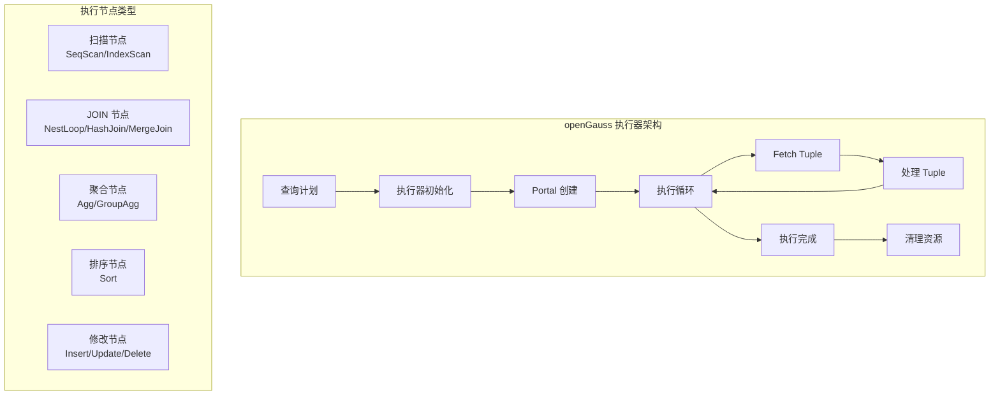

# openGauss 查询执行器

## 学习目标

- 掌握 openGauss 查询执行器的核心架构
- 理解 openGauss 对 PostgreSQL 执行器的增强
- 对比三种存储引擎的执行器实现差异

## 执行器架构



## 执行器状态机

```c
// 执行器状态
typedef enum EstateState_e {
    ESTATE_INIT,      // 初始化
    ESTATE_RUN,       // 运行中
    ESTATE_DONE,      // 完成
    ESTATE_ERROR,     // 错误
} EstateState_t;

// 执行器状态
typedef struct EState_s {
    NodeTag         type;           // 节点类型
    EstateState     es_state;       // 执行器状态
    Snapshot        es_snapshot;    // 快照
    List            *es_range_table;// 范围表

    // 增强：存储引擎信息
    char            *orientation;   // 存储引擎类型
    bool            is_mot;         // 是否 MOT 执行

    // JIT 编译上下文
    JITContext      *es_jit;        // JIT 上下文
} EState_t;
```

## 执行节点

### 扫描节点

```c
// 顺序扫描节点
typedef struct SeqScanState_s {
    ScanState   ss;             // 扫描状态基类
    HeapScan    scan;           // 堆扫描描述符

    // 增强：存储引擎
    ScanType    scan_type;      // ASTORE/CSTORE/MOT

    // CSTORE 扫描
    CStoreScan  cscan;          // 列存扫描

    // MOT 扫描
    MOTScan     mscan;          // MOT 扫描
} SeqScanState_t;

// 执行顺序扫描
TupleTableSlot *ExecSeqScan(SeqScanState *node) {
    switch (node->scan_type) {
        case SCAN_ASTORE:
            // ASTORE 扫描：从 Buffer Pool 读取
            return exec_astore_scan(node);

        case SCAN_CSTORE:
            // CSTORE 扫描：从 CU 缓存读取
            return exec_cstore_scan(node);

        case SCAN_MOT:
            // MOT 扫描：从内存读取
            return exec_mot_scan(node);
    }
}

// ASTORE 扫描
TupleTableSlot *exec_astore_scan(SeqScanState *node) {
    HeapTuple tup = heap_getnext(node->scan, ForwardScanDirection);
    if (tup == NULL)
        return NULL;

    // 填充 slot
    ExecStoreTuple(tup, node->ss.ss_ScanTupleSlot, InvalidBuffer, false);
    return node->ss.ss_ScanTupleSlot;
}

// CSTORE 扫描
TupleTableSlot *exec_cstore_scan(SeqScanState *node) {
    // 从 CU 缓存读取列数据
    char *col_data = cstore_read_cu(node->cscan, node->cu_idx);

    // 重组行（根据需要的列）
    TupleTableSlot *slot = MakeTupleTableSlot();
    for (int i = 0; i < node->natts; i++) {
        slot->tts_values[i] = cstore_get_value(col_data, i);
    }

    return slot;
}

// MOT 扫描
TupleTableSlot *exec_mot_scan(SeqScanState *node) {
    // 从 Masstree 索引读取
    MOTRow *row = mot_scan_next(node->mscan);
    if (row == NULL)
        return NULL;

    // 填充 slot
    TupleTableSlot *slot = MakeTupleTableSlot();
    memcpy(slot->tts_values, row->row_data, row->data_size);

    return slot;
}
```

### JOIN 节点

```c
// Hash Join 节点
typedef struct HashJoinState_s {
    JoinState       js;             // JOIN 状态基类
    HashState      *hash_outer;     // 外表哈希
    HashState      *hash_inner;     // 内表哈希
    List           *hash_qual;      // 哈希条件
    List           *hash_qual2;     // 第二组条件

    // 增强：MOT Hash Join
    MOTHashJoin   *mot_hash;        // MOT 无锁哈希
} HashJoinState_t;

// 执行 Hash Join
TupleTableSlot *ExecHashJoin(HashJoinState *node) {
    // 标准 Hash Join 流程
    // 1. 构建阶段：扫描内表，构建哈希表
    if (node->hash_inner == NULL) {
        node->hash_inner = build_hash_table(node);
    }

    // 2. 探测阶段：扫描外表，在哈希表中查找匹配
    while (true) {
        TupleTableSlot *outer = ExecProcNode(node->js.outerplan);
        if (outer == NULL)
            return NULL;

        // 在哈希表中查找
        TupleTableSlot *inner = hash_lookup(node->hash_inner, outer);
        if (inner != NULL) {
            // 返回匹配的行
            ExecStoreTuple(inner, node->js.ps_ResultTupleSlot, InvalidBuffer, false);
            return node->js.ps_ResultTupleSlot;
        }
    }
}

// MOT Hash Join（无锁）
TupleTableSlot *ExecMOTHashJoin(HashJoinState *node) {
    // MOT 的 Hash Join 使用无锁哈希表
    // 不需要传统的锁竞争，性能更高

    while (true) {
        MOTRow *outer = mot_scan_next(node->mscan_outer);
        if (outer == NULL)
            return NULL;

        // 无锁查找
        MOTRow *inner = mot_hash_lookup(node->mot_hash, outer);
        if (inner != NULL) {
            // 返回匹配的行
            return make_tuple_slot(outer, inner);
        }
    }
}
```

### 聚合节点

```c
// Agg 节点
typedef struct AggState_s {
    ScanState       ss;             // 扫描状态基类
    List           *aggs;           // 聚合函数列表
    AggStrategy     aggstrategy;    // 聚合策略
    HashTable      *hashtable;      // 哈希表

    // 增强：并行聚合
    uint32          nworkers;       // 工作线程数
    AggState       *partial_agg;    // 部分聚合结果
} AggState_t;

// 执行聚合
TupleTableSlot *ExecAgg(AggState *node) {
    switch (node->aggstrategy) {
        case AGG_PLAIN:
            // 简单聚合：所有行聚合成一行
            return exec_agg_plain(node);

        case AGG_SORTED:
            // 排序聚合：输入已按 GROUP BY 排序
            return exec_agg_sorted(node);

        case AGG_HASHED:
            // 哈希聚合：构建哈希表
            return exec_agg_hashed(node);
    }
}

// 哈希聚合
TupleTableSlot *exec_agg_hashed(AggState *node) {
    // 1. 扫描输入，构建哈希表
    while (true) {
        TupleTableSlot *slot = ExecProcNode(node->ss.lefttree);
        if (slot == NULL)
            break;

        // 计算分组键
        Datum *group_keys = compute_group_keys(node, slot);

        // 插入哈希表
        HashAggEntry *entry = hash_agg_lookup(node->hashtable, group_keys);
        if (entry == NULL) {
            entry = hash_agg_insert(node->hashtable, group_keys);
        }

        // 更新聚合值
        update_agg_values(entry, slot);
    }

    // 2. 输出结果
    return fetch_next_agg_entry(node);
}
```

### JIT 执行

```c
// JIT 编译执行
TupleTableSlot *ExecJitExpr(JITContext *ctx, Expr *expr) {
    // 1. 如果未编译，先编译
    if (ctx->compiled_fn == NULL) {
        ctx->compiled_fn = jit_compile_expr(expr);
    }

    // 2. 直接调用编译后的机器码
    void *result = ((JitExprFn) ctx->compiled_fn)(expr);

    return (TupleTableSlot *) result;
}
```

## 并行执行

```c
// 并行执行上下文
typedef struct ParallelExecutorInfo_s {
    PlanState      *planstate;      // 计划状态
    int             nworkers;       // 工作线程数
    ParallelContext *pcxt;          // 并行上下文
    BufferUsage     buffer_usage;   // 缓冲区使用
    WALUsage        wal_usage;      // WAL 使用
} ParallelExecutorInfo_t;

// 并行执行
TupleTableSlot *ExecParallelSeqScan(SeqScanState *node) {
    // 1. 分配工作线程
    ParallelExecutorInfo *pei = node->parallel_info;

    // 2. 每个工作线程扫描一部分页面
    uint32 start_page = pei->worker_id * (node->pages / pei->nworkers);
    uint32 end_page = start_page + (node->pages / pei->nworkers);

    // 3. 扫描
    for (uint32 page = start_page; page < end_page; page++) {
        Buffer buffer = ReadBuffer(node->ss.ss_currentRelation, page);
        // 处理页面...
    }

    // 4. 收集结果
    return collect_parallel_results(pei);
}
```

## 向量化执行

openGauss 针对列存（CSTORE）支持向量化执行。

```c
// 向量化执行
typedef struct VectorBatch_s {
    uint32   rows;          // 行数
    uint32   capacity;      // 容量
    ScalarValue *values;    // 值数组
    bool     *nulls;        // NULL 数组
} VectorBatch_t;

// 向量化聚合
VectorBatch *ExecVectorAgg(AggState *node) {
    // 批量处理，而不是逐行处理
    VectorBatch *batch = fetch_vector_batch(node);

    // 向量化计算
    for (int i = 0; i < batch->rows; i++) {
        // SIMD 优化聚合计算
        update_agg_simd(node, batch, i);
    }

    return batch;
}
```

## 与 PostgreSQL 对比

| 维度 | openGauss | PostgreSQL |
|------|-----------|------------|
| 执行器模型 | Volcano 模型 | Volcano 模型 |
| 扫描节点 | 多引擎支持 | 单一 Heap |
| JOIN 节点 | NL/Hash/Merge/MOT | NL/Hash/Merge |
| 聚合节点 | 标准 + 并行 + 向量化 | 标准 + 并行 |
| JIT 执行 | LLVM JIT 增强 | LLVM JIT（PG 11+） |
| 并行执行 | 增强 | 支持（PG 9.6+） |
| 向量化执行 | CSTORE 支持 | 不支持 |

## 要点总结

- openGauss 执行器继承 PostgreSQL 的 Volcano 模型
- 扫描节点支持 ASTORE/CSTORE/MOT 三种存储引擎
- JOIN 节点增加 MOT Hash Join（无锁并发）
- 聚合节点支持并行聚合和向量化执行
- JIT 编译和向量化执行提升 CPU 密集型查询性能
- 与 PG 相比：多引擎执行器、MOT 无锁 JOIN、向量化执行是主要差异

## 思考题

1. openGauss 的向量化执行器如何处理行存表？是否需要转换？
2. MOT 的无锁 Hash Join 在高并发场景下，如何避免热点冲突？
3. JIT 编译的开销与执行加速如何平衡？何时使用 JIT 执行？