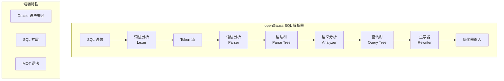

# openGauss SQL 解析器

## 学习目标

- 掌握 openGauss SQL 解析器的核心架构
- 理解 openGauss 对 PostgreSQL 解析器的增强
- 对比 openGauss 与 PostgreSQL 的解析器差异

## 解析器架构



## 词法分析

openGauss 的词法分析器基于 PostgreSQL 的 Scan 实现，但增加了新的关键字和语法支持。

### 核心结构

```c
// 核心词法分析器
typedef struct core_yy_extra_type_s {
    int         num_buffers;           // 缓冲区数量
    int         current_buffer;        // 当前缓冲区
    YYLTYPE     yylloc;                // 当前 token 位置
    int         lookahead_num;         // lookahead 数量
    bool        have_lookahead;        // 是否已 lookahead
    bool        have_lookahead2;       // 是否已 lookahead2

    // 增强：多语法支持
    bool        oracle_compat;         // Oracle 兼容模式
    bool        mot_syntax;            // MOT 语法模式
} core_yy_extra_type_t;

// 关键字表
// openGauss 新增的关键字
// - MOT: SERVER, FOREIGN, MOT_SERVER
// - CSTORE: COLUMN, ORIENTATION, COMPRESS
// - Oracle 兼容: PACKAGE, BODY, PROCEDURE
```

### 新增 Token

```c
// openGauss 新增 Token
// 存储引擎相关
#define COLUMN       500  // 列存关键字
#define ORIENTATION  501  // 存储方向
#define COMPRESS     502  // 压缩
#define MOT_SERVER   503  // MOT 服务器
#define FOREIGN      504  // 外表

// Oracle 兼容
#define PACKAGE      600  // 包
#define BODY         601  // 包体
#define PROCEDURE    602  // 存储过程
#define FUNCTION     603  // 函数

// 安全增强
#define ENCRYPTED    700  // 加密关键字
#define MASKING      701  // 脱敏
#define AUDIT        702  // 审计
```

## 语法分析

openGauss 的语法分析器基于 PostgreSQL 的 gram.y，但增加了大量扩展。

### 核心结构

```c
// 语法树节点
typedef struct CreateStmt_s {
    NodeTag     type;            // 节点类型
    RangeVar    *relation;       // 表名
    List        *tableElts;      // 列定义
    List        *inhRelations;   // 继承表
    bool        hasoids;         // 是否有 OID
    OnCommit    oncommit;        // 提交时行为

    // 增强：存储引擎选项
    char        *orientation;    // ASTORE/CSTORE
    char        *compress;       // 压缩算法
    bool        is_mot;          // 是否 MOT 表
    List        *mot_options;    // MOT 选项
} CreateStmt_t;

// 列定义
typedef struct ColumnDef_s {
    NodeTag     type;            // 节点类型
    char        *colname;        // 列名
    TypeName    *typeName;       // 类型名
    int         inhcount;        // 继承计数
    bool        is_local;        // 本地列
    bool        is_not_null;     // NOT NULL

    // 增强：安全属性
    bool        is_encrypted;    // 是否加密
    char        *masking_func;   // 脱敏函数
} ColumnDef_t;
```

### 语法规则扩展

```c
// 创建表语法（增强）
// PostgreSQL 语法：
//   CREATE TABLE t (id INT, name TEXT);

// openGauss 扩展语法：
//   列存表：
//   CREATE TABLE t (id INT, name TEXT) WITH (ORIENTATION = COLUMN);
//
//   MOT 表：
//   CREATE FOREIGN TABLE t (id INT PRIMARY KEY, name TEXT)
//   SERVER mot_server OPTIONS (orientation 'row');
//
//   加密列：
//   CREATE TABLE t (id INT ENCRYPTED WITH (algorithm = 'AES'));

// 语法规则示例
// CreateStmt:
//     CREATE TABLE qualified_name '(' opt_table_element_list ')'
//         opt_inherit opt_with opt_on_commit opt_tablespace
//         opt_orientation opt_compress
//     ;
//
// opt_orientation:
//     /* empty */                      { $$ = NIL; }
//     | WITH '(' ORIENTATION '=' COLUMN ')'  { $$ = "COLUMN"; }
//     | WITH '(' ORIENTATION '=' ROW ')'     { $$ = "ROW"; }
//     ;
```

## 语义分析

### 查询树结构

```c
// 查询树
typedef struct Query_s {
    NodeTag     type;            // 节点类型
    CmdType     commandType;     // 命令类型
    QuerySource querySource;     // 查询来源
    uint32      queryId;         // 查询 ID
    bool        canSetTag;       // 是否能设置标签

    List        *rtable;         // 范围表
    List        *jointree;       // JOIN 树
    List        *targetList;     // 目标列表
    List        *qual;           // 条件表达式
    List        *groupClause;    // GROUP BY
    List        *havingQual;     // HAVING
    List        *sortClause;     // ORDER BY
    List        *limitOffset;    // LIMIT OFFSET
    List        *limitCount;     // LIMIT COUNT

    // 增强：存储引擎信息
    char        *orientation;    // 存储引擎类型
    bool        is_mot;          // 是否 MOT
} Query_t;
```

### 语义分析流程

```c
// 语义分析
Query *parse_analyze(Node *parseTree, const char *sourceText) {
    ParseState *pstate = make_parse_state();

    // 1. 创建分析状态
    pstate->p_sourcetext = sourceText;
    pstate->p_rtable = NIL;
    pstate->p_joinlist = NIL;

    // 2. 转换定义
    Query *query = transform_optional_def(pstate, parseTree);

    // 3. 转换语句
    switch (nodeTag(parseTree)) {
        case T_InsertStmt:
            query = transform_InsertStmt(pstate, (InsertStmt *) parseTree);
            break;
        case T_SelectStmt:
            query = transform_SelectStmt(pstate, (SelectStmt *) parseTree);
            break;
        // ... 更多语句类型

        // 增强：MOT 语法
        case T_CreateForeignTableStmt:
            query = transform_CreateForeignTableStmt(pstate,
                        (CreateForeignTableStmt *) parseTree);
            break;
    }

    // 4. 解析存储引擎
    if (query->orientation != NULL) {
        query->is_mot = (strcmp(query->orientation, "MOT") == 0);
    }

    return query;
}
```

## 查询重写

### 重写规则

```c
// 查询重写
List *QueryRewrite(Query *query) {
    List *rewritten = NIL;

    // 1. 视图展开
    rewritten = view_rewrite(query);

    // 2. 规则重写（CREATE RULE）
    rewritten = rule_rewrite(rewritten);

    // 3. MOT 重写
    // 如果是 MOT 表，调整查询计划
    if (query->is_mot) {
        rewritten = mot_rewrite(rewritten);
    }

    return rewritten;
}
```

## 与 PostgreSQL 对比

| 维度 | openGauss | PostgreSQL |
|------|-----------|------------|
| 词法分析 | Scan + 增强关键字 | Scan |
| 语法分析 | gram.y + 扩展语法 | gram.y |
| 语义分析 | 标准 + 引擎信息 | 标准 |
| 查询重写 | 标准 + MOT 重写 | 标准 |
| Oracle 兼容 | 部分语法支持 | 不支持 |
| MOT 语法 | FOREIGN TABLE 语法 | 不支持 |
| 加密语法 | ENCRYPTED WITH | 不支持 |

## 要点总结

- openGauss 解析器基于 PostgreSQL 9.2，增加了大量扩展语法
- 词法分析新增存储引擎关键字（COLUMN、ORIENTATION、MOT_SERVER）
- 语法分析扩展了 CREATE TABLE 规则，支持 ASTORE/CSTORE/MOT
- 语义分析在查询树中增加存储引擎信息，指导后续优化器选择
- 与 PG 相比：Oracle 语法兼容、MOT 语法、加密语法是主要差异

## 思考题

1. openGauss 的 Oracle 语法兼容在解析器层面如何实现？内部如何映射到 PG 语法树？
2. 解析器如何区分 MOT 的外表和普通外表（FDW）？
3. 如果需要在解析器中增加新的存储引擎语法，需要修改哪些模块？