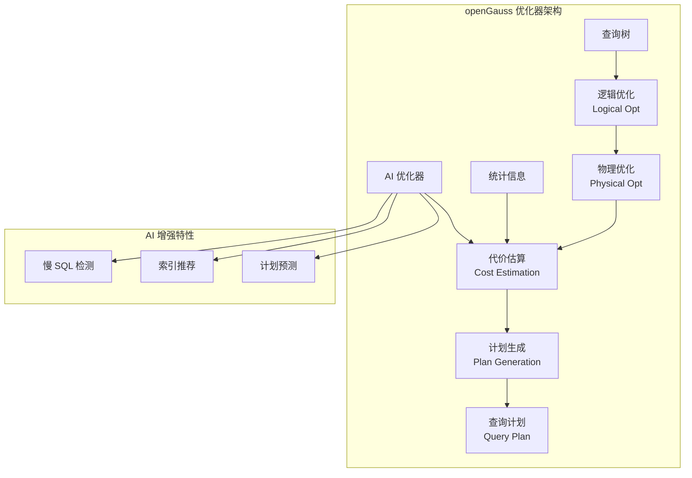

# openGauss 查询优化器

## 学习目标

- 掌握 openGauss 查询优化器的核心架构
- 理解 openGauss 对 PostgreSQL 优化器的增强
- 对比 openGauss AI 优化器与传统优化器的差异

## 优化器架构



## 逻辑优化

逻辑优化基于规则（Rule-based），对查询树进行等价变换。

### 优化规则

```c
// 逻辑优化规则
// 1. WHERE 条件化简
//    WHERE a = 1 AND a = 1 → WHERE a = 1

// 2. 常量折叠
//    WHERE 1 + 1 > 0 → WHERE true

// 3. 子查询提升（Subquery Pull-up）
//    SELECT * FROM t WHERE id IN (SELECT id FROM t2)
//    → SELECT * FROM t SEMI JOIN t2 ON t.id = t2.id

// 4. JOIN 顺序优化（Join Ordering）
//    使用动态规划或遗传算法选择最优 JOIN 顺序

// 5. 谓词下推（Predicate Pushdown）
//    SELECT * FROM t1 JOIN t2 ON t1.id = t2.id WHERE t1.x = 1
//    → SELECT * FROM (SELECT * FROM t1 WHERE x = 1) t1 JOIN t2 ON t1.id = t2.id

// 6. 列裁剪（Column Pruning）
//    SELECT id FROM t WHERE name = 'test'
//    → 只扫描 id 列，不读取 name 列
```

### 实现

```c
// 逻辑优化
PlannedStmt *planner(Query *query, int cursorOptions) {
    // 1. 逻辑优化
    Query *optimized = logical_optimize(query);

    // 2. 物理优化
    Plan *plan = physical_optimize(optimized);

    // 3. 生成计划
    PlannedStmt *result = makeNode(PlannedStmt);
    result->commandType = query->commandType;
    result->rtable = query->rtable;
    result->planTree = plan;

    return result;
}

Query *logical_optimize(Query *query) {
    Query *result = query;

    // 1. WHERE 条件化简
    result = simplify_where_clause(result);

    // 2. 常量折叠
    result = constant_folding(result);

    // 3. 子查询提升
    result = pull_up_subqueries(result);

    // 4. JOIN 顺序优化
    result = optimize_join_order(result);

    // 5. 谓词下推
    result = push_down_predicates(result);

    // 6. 列裁剪
    result = prune_columns(result);

    return result;
}
```

## 物理优化

物理优化基于代价，选择访问路径和 JOIN 方法。

### 访问路径

```c
// 访问路径类型
typedef struct Path_s {
    NodeTag     type;            // 节点类型
    PathKind    pathtype;        // 路径类型
    RelOptInfo *parent;          // 父关系
    double      rows;            // 估计行数
    Cost        startup_cost;    // 启动代价
    Cost        total_cost;      // 总代价
    List        *pathkeys;       // 排序键

    // 增强：存储引擎信息
    char        *orientation;    // ASTORE/CSTORE/MOT
} Path_t;

// 路径类型
typedef enum PathKind_e {
    T_SeqScan,          // 顺序扫描
    T_IndexScan,        // 索引扫描
    T_BitmapScan,       // 位图扫描
    T_TidScan,          // TID 扫描
    T_SubqueryScan,     // 子查询扫描
    T_FunctionScan,     // 函数扫描

    // 增强：MOT 路径
    T_MOTScan,          // MOT 扫描

    // 增强：CSTORE 路径
    T_CStoreScan,       // CSTORE 扫描
} PathKind_t;
```

### JOIN 方法

```c
// JOIN 方法
typedef enum JoinMethod_e {
    JOIN_NESTLOOP,      // 嵌套循环
    JOIN_HASH,          // 哈希连接
    JOIN_MERGE,         // 归并连接

    // 增强：MOT JOIN
    JOIN_MOT_HASH,      // MOT 哈希连接（无锁）
} JoinMethod_t;

// JOIN 代价估算
Cost estimate_join_cost(JoinMethod method, double outer_rows, double inner_rows) {
    switch (method) {
        case JOIN_NESTLOOP:
            return outer_rows * inner_rows * cpu_tuple_cost;

        case JOIN_HASH:
            return (outer_rows + inner_rows) * cpu_tuple_cost;

        case JOIN_MERGE:
            return outer_rows * log(inner_rows) * cpu_tuple_cost;

        case JOIN_MOT_HASH:
            // MOT 的无锁哈希 JOIN 代价更低
            return (outer_rows + inner_rows) * cpu_tuple_cost * 0.5;
    }
}
```

### 代价估算

```c
// 代价估算模型
Cost cost_seqscan(RelOptInfo *rel) {
    // 顺序扫描代价 = IO 代价 + CPU 代价

    // 1. IO 代价：扫描页面数 × seq_page_cost
    double pages = rel->pages;
    Cost io_cost = pages * seq_page_cost;

    // 2. CPU 代价：处理元组数 × cpu_tuple_cost
    double tuples = rel->tuples;
    Cost cpu_cost = tuples * cpu_tuple_cost;

    // 3. 存储引擎调整
    if (rel->orientation == ORIENTATION_CSTORE) {
        // CSTORE 列存扫描：IO 代价更低（只读需要的列）
        io_cost *= 0.5;

        // CPU 代价：解压开销
        cpu_cost *= 1.2;
    } else if (rel->orientation == ORIENTATION_MOT) {
        // MOT 内存扫描：无 IO 代价
        io_cost = 0;

        // CPU 代价：无锁查找
        cpu_cost *= 0.8;
    }

    return io_cost + cpu_cost;
}
```

## AI 优化器

openGauss 引入 AI 优化器，提供智能优化建议。

### 慢 SQL 检测

```c
// 慢 SQL 检测
bool detect_slow_sql(Query *query) {
    // 1. 提取查询特征
    QueryFeature feature;
    feature.table_count = list_length(query->rtable);
    feature.join_count = count_joins(query->jointree);
    feature.filter_count = count_filters(query->qual);
    feature.aggregation_count = list_length(query->groupClause);

    // 2. 输入到模型
    float prediction = ml_model_predict(&feature);

    // 3. 如果预测为慢 SQL，记录日志
    if (prediction > THRESHOLD) {
        log_slow_sql(query, prediction);
        return true;
    }

    return false;
}
```

### 智能索引推荐

```c
// 索引推荐
List *recommend_indexes(Query *query, Relation relation) {
    List *indexes = NIL;

    // 1. 分析查询中的过滤条件
    List *filters = extract_filters(query->qual);

    // 2. 分析 JOIN 条件
    List *join_cols = extract_join_columns(query->jointree);

    // 3. 分析 ORDER BY
    List *order_cols = extract_order_columns(query->sortClause);

    // 4. 使用机器学习模型推荐
    foreach(col, filters) {
        IndexRecommendation *rec = ml_recommend_index(relation, col);
        if (rec != NULL) {
            indexes = lappend(indexes, rec);
        }
    }

    return indexes;
}
```

### 执行计划预测

```c
// 执行计划预测
Plan *predict_best_plan(Query *query) {
    // 1. 生成多个候选计划
    List *candidates = generate_candidate_plans(query);

    // 2. 使用机器学习模型预测每个计划的执行时间
    Plan *best = NULL;
    float min_time = FLT_MAX;

    foreach(plan, candidates) {
        float predicted_time = ml_predict_execution_time(plan);
        if (predicted_time < min_time) {
            min_time = predicted_time;
            best = plan;
        }
    }

    return best;
}
```

## LLVM JIT 编译

openGauss 使用 LLVM JIT 编译执行器，提升 CPU 密集型查询性能。

```c
// JIT 编译
typedef struct JITContext_s {
    LLVMModuleRef   module;        // LLVM 模块
    LLVMValueRef    function;      // 生成的函数
    void            *compiled_fn;  // 编译后的机器码
} JITContext_t;

// JIT 编译表达式
void *jit_compile_expr(Expr *expr) {
    JITContext *ctx = create_jit_context();

    // 1. 创建函数
    LLVMValueRef func = LLVMAddFunction(ctx->module, "eval_expr",
                                         LLVMFunctionType(LLVMVoidType(), ...));

    // 2. 编译表达式
    compile_expr_node(ctx, expr);

    // 3. 生成机器码
    void *code = LLVMGetPointerToGlobal(ctx->engine, func);

    return code;
}
```

## 与 PostgreSQL 对比

| 维度 | openGauss | PostgreSQL |
|------|-----------|------------|
| 逻辑优化 | 规则优化 + 增强 | 规则优化 |
| 物理优化 | 代价模型 + 引擎调整 | 代价模型 |
| JOIN 方法 | NL/Hash/Merge/MOT | NL/Hash/Merge |
| 代价估算 | 标准 + 存储引擎调整 | 标准 |
| AI 优化器 | 支持（慢 SQL、索引推荐） | 不支持 |
| JIT 编译 | LLVM JIT 增强 | LLVM JIT（PG 11+） |
| 并行查询 | 增强 | 支持（PG 9.6+） |

## 要点总结

- openGauss 优化器继承 PostgreSQL 的逻辑优化和物理优化框架
- 物理优化增加了对 ASTORE/CSTORE/MOT 三种引擎的代价调整
- AI 优化器提供慢 SQL 检测、智能索引推荐、执行计划预测
- LLVM JIT 编译提升 CPU 密集型查询性能
- 与 PG 相比：AI 优化器、多引擎代价模型、增强 JIT 是主要差异

## 思考题

1. openGauss 的 AI 优化器如何收集训练数据？是否需要用户授权？
2. 如果 AI 优化器推荐的索引与人工设计的冲突，如何决策？
3. LLVM JIT 编译对哪类查询性能提升最大？编译开销如何平衡？