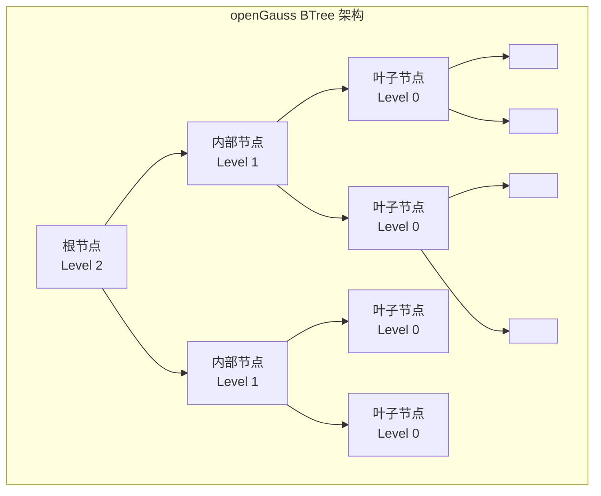

# openGauss BTree 索引

## 学习目标

- 掌握 openGauss BTree 索引的核心设计
- 理解 openGauss 对 PostgreSQL BTree 的增强
- 对比 ASTORE/CSTORE/MOT 三种引擎的 BTree 实现

## BTree 架构



## BTree 页面结构

openGauss 的 BTree 页面结构继承自 PostgreSQL，每个页面 8KB。

### 页面布局

```c
// BTree 页面头
typedef struct BTPageOpaqueData_s {
    BlockNumber btpo_prev;       // 左兄弟页面
    BlockNumber btpo_next;       // 右兄弟页面
    uint32      btpo_level;      // 层级（0 = 叶子）
    uint16      btpo_flags;      // 标志位
    BTCycleId   btpo_cycleid;    // VACUUM 周期 ID
} BTPageOpaqueData_t;

// 标志位
#define BTP_LEAF        (1 << 0)  // 叶子节点
#define BTP_ROOT        (1 << 1)  // 根节点
#define BTP_DELETED     (1 << 2)  // 已删除
#define BTP_META        (1 << 3)  // 元数据页
#define BTP_HALF_DEAD   (1 << 4)  // 半死
#define BTP_SPLIT_END   (1 << 5)  // 分裂结束
```

### 元组结构

```c
// BTree 索引元组
typedef struct IndexTupleData_s {
    ItemPointerData t_tid;       // 块号 + 行号（ctid）
    uint16          t_info;      // 信息位
    char            t_data[0];   // 键值数据
} IndexTupleData_t;

// BTree 元组插入
bool _bt_doinsert(Relation rel, IndexTuple itup, bool checkUnique) {
    // 1. 查找插入位置
    BTStack stack = _bt_search(rel, itup, &buffer, BT_WRITE);

    // 2. 检查唯一性
    if (checkUnique) {
        if (_bt_check_unique(rel, itup, buffer)) {
            // 唯一性冲突
            return false;
        }
    }

    // 3. 检查页面空间
    Page page = BufferGetPage(buffer);
    if (PageGetFreeSpace(page) < MAXALIGN(itup->t_len)) {
        // 页面空间不足，分裂
        _bt_split(rel, buffer, itup);
    } else {
        // 插入元组
        _bt_insertonpg(rel, buffer, itup);
    }

    return true;
}
```

## 页面分裂

```c
// BTree 页面分裂
void _bt_split(Relation rel, Buffer buf, IndexTuple new_itup) {
    Page        page = BufferGetPage(buf);
    BTPageOpaque opaque = (BTPageOpaque) PageGetSpecialSection(page);

    // 1. 分配新页面
    Buffer      newbuf = _bt_getbuf(rel, P_NEW, BT_WRITE);
    Page        newpage = BufferGetPage(newbuf);

    // 2. 复制一半元组到新页面
    OffsetNumber split_offset = PageGetMaxOffsetNumber(page) / 2;
    for (OffsetNumber off = split_offset; off <= PageGetMaxOffsetNumber(page); off++) {
        ItemId      iid = PageGetItemId(page, off);
        IndexTuple  itup = (IndexTuple) PageGetItem(page, iid);
        PageAddItem(newpage, (Item) itup, itup->t_len, InvalidOffsetNumber, false, false);
    }

    // 3. 更新兄弟指针
    BTPageOpaque newopaque = (BTPageOpaque) PageGetSpecialSection(newpage);
    newopaque->btpo_next = opaque->btpo_next;
    opaque->btpo_next = BufferGetBlockNumber(newbuf);

    // 4. 插入新元组到父节点
    IndexTuple  trunctuple = _bt_mktrunctuple(page, split_offset);
    _bt_insert_parent(rel, buf, newbuf, trunctuple);
}
```

## 唯一索引

```c
// 唯一索引检查
bool _bt_check_unique(Relation rel, IndexTuple itup, Buffer buf) {
    Page        page = BufferGetPage(buf);
    BTPageOpaque opaque = (BTPageOpaque) PageGetSpecialSection(page);

    // 1. 查找相同键的元组
    OffsetNumber off = _bt_binsrch(rel, page, itup);

    // 2. 遍历相同键的元组
    while (off <= PageGetMaxOffsetNumber(page)) {
        ItemId      iid = PageGetItemId(page, off);
        IndexTuple  cur_itup = (IndexTuple) PageGetItem(page, iid);

        // 比较键
        if (_bt_compare(rel, itup, cur_itup) != 0)
            break;

        // 3. 检查元组是否存活
        ItemPointerData tid = cur_itup->t_tid;
        HeapTupleData  tup;
        if (heap_fetch(rel, &tid, &tup, NULL)) {
            // 找到存活的元组，唯一性冲突
            return false;
        }

        // 4. 元组已死，可以重用
        off++;
    }

    return true;
}
```

## VACUUM

```c
// BTree VACUUM
void btvacuumscan(Relation rel) {
    BlockNumber num_pages = RelationGetNumberOfBlocks(rel);

    // 1. 扫描所有页面
    for (BlockNumber blkno = 0; blkno < num_pages; blkno++) {
        Buffer      buffer = ReadBuffer(rel, blkno);
        Page        page = BufferGetPage(buffer);
        BTPageOpaque opaque = (BTPageOpaque) PageGetSpecialSection(page);

        // 2. 删除死元组
        for (OffsetNumber off = FirstOffsetNumber; off <= PageGetMaxOffsetNumber(page); off++) {
            ItemId      iid = PageGetItemId(page, off);
            IndexTuple  itup = (IndexTuple) PageGetItem(page, iid);

            // 检查元组是否存活
            if (!_bt_item_is_live(itup)) {
                // 标记删除
                iid->lp_flags = LP_DEAD;
            }
        }

        // 3. 压缩页面
        if (opaque->btpo_flags & BTP_LEAF) {
            _bt_delitems_delete(rel, buffer);
        }

        ReleaseBuffer(buffer);
    }
}
```

## CSTORE BTree

CSTORE 列存引擎使用独立的 BTree 索引实现。

```c
// CSTORE BTree 索引
typedef struct CStoreBTreeIndex_s {
    uint32    col_id;          // 列 ID
    uint32    root_block;      // 根页面
    uint32    levels;          // 层级数
} CStoreBTreeIndex_t;

// CSTORE BTree 插入
bool cstore_btinsert(CStoreBTreeIndex *idx, ScalarValue key, uint32 cu_id, uint32 row_id) {
    // 1. 查找叶子节点
    uint32 leaf_block = cstore_bt_search(idx, key);

    // 2. 插入键值对
    // CSTORE BTree 的值是 (cu_id, row_id)，而不是 ctid
    CStoreBTItem item;
    item.key = key;
    item.cu_id = cu_id;
    item.row_id = row_id;

    // 3. 写入页面
    Buffer buffer = ReadBuffer(idx->relation, leaf_block);
    Page page = BufferGetPage(buffer);

    if (PageGetFreeSpace(page) < sizeof(CStoreBTItem)) {
        // 分裂页面
        cstore_bt_split(idx, buffer, &item);
    } else {
        PageAddItem(page, (Item) &item, sizeof(CStoreBTItem), InvalidOffsetNumber, false, false);
    }

    ReleaseBuffer(buffer);
    return true;
}
```

## MOT BTree（Masstree）

MOT 使用 Masstree 索引，而不是传统的 BTree。

```c
// Masstree 是 B+Tree 的变种，专为内存优化
// 特点：
// 1. 每个节点可以包含多个键（256 个）
// 2. 使用 CAS（Compare-And-Swap）实现无锁并发
// 3. 支持高效的范围查询

// Masstree 节点
typedef struct MasstreeNode_s {
    uint32      key_count;          // 键数量
    uint64      keys[256];          // 键数组
    void        *values[256];       // 值数组（指向 MOTRow）
    MasstreeNode *children[257];    // 子节点数组
    uint32      version;            // 版本号（CAS 用）
} MasstreeNode_t;

// Masstree 查找（无锁）
MOTRow *masstree_search(MasstreeNode *root, uint64 key) {
    MasstreeNode *node = root;

    while (node != NULL) {
        // 二分查找
        int idx = binary_search(node->keys, node->key_count, key);

        if (idx < node->key_count && node->keys[idx] == key) {
            // 找到键
            return (MOTRow *) node->values[idx];
        }

        // 进入子节点
        node = node->children[idx];
    }

    return NULL;
}

// Masstree 插入（无锁 CAS）
bool masstree_insert(MasstreeNode *root, uint64 key, void *value) {
    MasstreeNode *node = root;

    while (true) {
        int idx = binary_search(node->keys, node->key_count, key);

        if (idx < node->key_count && node->keys[idx] == key) {
            // 键已存在，更新值（CAS）
            return atomic_compare_exchange(&node->values[idx], NULL, value);
        }

        // 插入新键
        if (node->key_count < 256) {
            // 节点有空位，插入
            uint32 old_version = node->version;
            if (atomic_compare_exchange(&node->version, old_version, old_version + 1)) {
                // CAS 成功，插入键
                node->keys[node->key_count] = key;
                node->values[node->key_count] = value;
                node->key_count++;
                return true;
            }
            // CAS 失败，重试
            continue;
        }

        // 节点已满，分裂
        masstree_split(node);
    }
}
```

## 三种引擎 BTree 对比

| 维度 | ASTORE BTree | CSTORE BTree | MOT Masstree |
|------|--------------|--------------|--------------|
| 存储介质 | 磁盘 | 磁盘 | 内存 |
| 页面大小 | 8KB | 8KB | 不适用（节点 256 键） |
| 并发控制 | 锁 | 锁 | CAS（无锁） |
| 分裂策略 | 标准 BTree 分裂 | 标准 BTree 分裂 | Masstree 分裂 |
| 值类型 | ctid（块号+行号） | (cu_id, row_id) | 指向 MOTRow |
| VACUUM | 需要 | 需要 | 不需要 |
| 范围查询 | 支持 | 支持 | 支持 |

## 与 PostgreSQL 对比

| 维度 | openGauss | PostgreSQL |
|------|-----------|------------|
| BTree 格式 | 兼容 PG | 标准 B+Tree |
| 页面大小 | 8KB | 8KB |
| 唯一索引 | 一致 | 一致 |
| VACUUM | 一致 | 一致 |
| CSTORE BTree | 支持（独立实现） | 不支持 |
| MOT Masstree | 支持（内存优化） | 不支持 |

## 要点总结

- openGauss 的 BTree 索引继承 PostgreSQL 的设计，格式兼容
- 页面结构：BTPageOpaque + IndexTuple，支持唯一索引和 VACUUM
- CSTORE 使用独立的 BTree 实现，值类型为 (cu_id, row_id)
- MOT 使用 Masstree（B+Tree 的内存优化变种），支持无锁并发
- 三种引擎的 BTree 分别针对磁盘行存、磁盘列存、内存场景优化
- 与 PG 相比：CSTORE BTree 和 MOT Masstree 是独有增强

## 思考题

1. MOT 的 Masstree 相比传统 BTree，在高并发场景下性能提升多少？
2. CSTORE BTree 的值类型（cu_id, row_id）相比 ASTORE 的 ctid，如何影响索引查找性能？
3. 如果一个表同时有 ASTORE 和 CSTORE 索引，查询优化器如何选择？