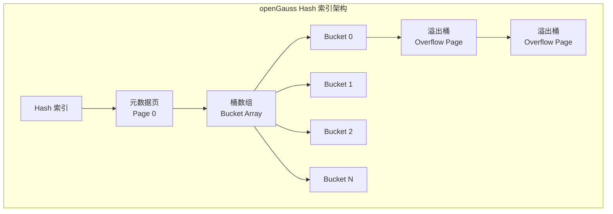

# openGauss Hash 索引

## 学习目标

- 掌握 openGauss Hash 索引的核心设计
- 理解 openGauss 对 PostgreSQL Hash 索引的增强
- 对比三种存储引擎的 Hash 索引实现差异

## Hash 索引架构



## 页面结构

openGauss 的 Hash 索引继承自 PostgreSQL，使用线性哈希（Linear Hashing）算法。

### 页面类型

```c
// Hash 索引页面类型
// 1. 元数据页（Page 0）：存储索引元数据
// 2. 主桶页面：存储哈希值映射
// 3. 溢出页面：存储哈希冲突的数据

// 元数据页结构
typedef struct HashMetaPageData_s {
    uint32      num_buckets;       // 桶数
    uint32      num_overflow;      // 溢出页数
    uint32      high_mask;         // 高位掩码
    uint32      low_mask;          // 低位掩码
    uint32      splitpoint;        // 分裂点
    uint32      max_buckets;       // 最大桶数
    uint32      bshift;            // 桶移位
    uint32      ffactor;           // 填充因子
    Bucket      first_free;        // 第一个空闲桶
} HashMetaPageData_t;

// 桶页面
typedef struct HashPageOpaqueData_s {
    BlockNumber hasho_prevblkno;   // 前一个桶
    BlockNumber hasho_nextblkno;   // 下一个桶
    Bucket      hasho_bucket;      // 桶号
    uint32      hasho_flag;        // 标志位
} HashPageOpaqueData_t;

// 标志位
#define LH_PAGE_HASH_ORDERED  (1 << 0)  // 有序桶
#define LH_PAGE_HASH_SPLIT    (1 << 1)  // 分裂中
#define LH_PAGE_HASH_OVERFLOW (1 << 2)  // 溢出页
```

### 哈希函数

```c
// 哈希函数
uint32 hash_any(const unsigned char *k, int keylen) {
    // 使用 MurmurHash3 算法
    uint32 c1 = 0xcc9e2d51;
    uint32 c2 = 0x1b873593;
    uint32 h1 = 0xabcdef12;

    int len = keylen;
    const uint32 *blocks = (const uint32 *) k;

    for (int i = 0; i < len / 4; i++) {
        uint32 k1 = blocks[i];

        k1 *= c1;
        k1 = rotl32(k1, 15);
        k1 *= c2;

        h1 ^= k1;
        h1 = rotl32(h1, 13);
        h1 = h1 * 5 + 0xe6546b64;
    }

    // 处理剩余字节
    // ...

    h1 ^= keylen;
    h1 = fmix32(h1);

    return h1;
}
```

## 插入操作

```c
// Hash 索引插入
bool hash_insert(Relation rel, IndexTuple itup) {
    // 1. 计算哈希值
    uint32 hash_value = _hash_hashkey(rel, itup);

    // 2. 计算桶号
    Bucket bucket = _hash_get_bucket(rel, hash_value);

    // 3. 查找桶页面
    Buffer buffer = _hash_get_bucket_page(rel, bucket);
    Page page = BufferGetPage(buffer);

    // 4. 检查页面空间
    if (PageGetFreeSpace(page) < MAXALIGN(itup->t_len)) {
        // 空间不足，创建溢出页面
        Buffer overflow_buf = _hash_add_overflow_page(rel, buffer);
        buffer = overflow_buf;
        page = BufferGetPage(buffer);
    }

    // 5. 插入元组
    _hash_insert_tuple(rel, buffer, itup);

    // 6. 检查是否需要分裂
    if (_hash_need_split(rel, bucket)) {
        _hash_split(rel, bucket);
    }

    return true;
}
```

## 查找操作

```c
// Hash 索引查找
bool hash_gettuple(IndexScanDesc scan, ScanDirection dir) {
    // 1. 获取扫描键
    ScanKey key = scan->keyData;
    Datum value = key->sk_argument;

    // 2. 计算哈希值
    uint32 hash_value = _hash_hashkey(scan->indexRelation, value);

    // 3. 计算桶号
    Bucket bucket = _hash_get_bucket(scan->indexRelation, hash_value);

    // 4. 遍历桶页面
    Buffer buffer = _hash_get_bucket_page(scan->indexRelation, bucket);
    while (buffer != InvalidBuffer) {
        Page page = BufferGetPage(buffer);

        // 遍历页面中的元组
        for (OffsetNumber off = FirstOffsetNumber; off <= PageGetMaxOffsetNumber(page); off++) {
            ItemId      iid = PageGetItemId(page, off);
            IndexTuple  itup = (IndexTuple) PageGetItem(page, iid);

            // 比较哈希值
            if (itup->t_info & INDEX_HASH_VALID) {
                // 找到匹配的元组
                scan->xs_ctup.t_self = itup->t_tid;
                return true;
            }
        }

        // 进入溢出页面
        HashPageOpaque opaque = (HashPageOpaque) PageGetSpecialSection(page);
        buffer = ReadBuffer(scan->indexRelation, opaque->hasho_nextblkno);
    }

    return false;
}
```

## 页面分裂

```c
// Hash 索引页面分裂
void _hash_split(Relation rel, Bucket old_bucket) {
    // 1. 分配新桶
    Bucket new_bucket = _hash_get_new_bucket(rel);
    Buffer new_buf = _hash_get_bucket_page(rel, new_bucket);

    // 2. 获取旧桶页面
    Buffer old_buf = _hash_get_bucket_page(rel, old_bucket);
    Page old_page = BufferGetPage(old_buf);
    Page new_page = BufferGetPage(new_buf);

    // 3. 重新分布元组
    for (OffsetNumber off = FirstOffsetNumber; off <= PageGetMaxOffsetNumber(old_page); off++) {
        ItemId      iid = PageGetItemId(old_page, off);
        IndexTuple  itup = (IndexTuple) PageGetItem(old_page, iid);

        // 计算新哈希值，决定分配到旧桶还是新桶
        uint32 new_hash = _hash_hashkey(rel, itup);
        if (new_hash & (1 << _hash_get_splitpoint(rel))) {
            // 分配到新桶
            _hash_insert_tuple(rel, new_buf, itup);
            // 标记旧桶已删除
            iid->lp_flags = LP_DEAD;
        }
    }

    // 4. 更新元数据
    HashMetaPageData *meta = _hash_get_meta(rel);
    meta->num_buckets++;
    meta->splitpoint++;
}
```

## CSTORE Hash 索引

```c
// CSTORE Hash 索引
typedef struct CStoreHashIndex_s {
    uint32    col_id;          // 列 ID
    uint32    bucket_count;    // 桶数
    CStoreHashBucket *buckets; // 桶数组
} CStoreHashIndex_t;

// CSTORE Hash 桶
typedef struct CStoreHashBucket_s {
    uint32   count;           // 元素数
    uint32   capacity;        // 容量
    uint64   *keys;           // 键数组
    uint32   *cu_ids;         // CU ID 数组
    uint32   *row_ids;        // 行号数组
} CStoreHashBucket_t;

// CSTORE Hash 索引查找
uint32 *cstore_hash_search(CStoreHashIndex *idx, uint64 key) {
    uint32 bucket_idx = key % idx->bucket_count;
    CStoreHashBucket *bucket = &idx->buckets[bucket_idx];

    // 二分查找
    for (int i = 0; i < bucket->count; i++) {
        if (bucket->keys[i] == key) {
            // 返回 (cu_id, row_id) 对
            uint32 *result = malloc(2 * sizeof(uint32));
            result[0] = bucket->cu_ids[i];
            result[1] = bucket->row_ids[i];
            return result;
        }
    }

    return NULL;
}
```

## MOT Hash 索引

MOT 使用 Masstree 作为主索引，但在某些场景也支持 Hash 索引。

```c
// MOT Hash 索引（辅助索引）
typedef struct MOTHashIndex_s {
    uint32       bucket_count;    // 桶数
    MOTHashEntry **buckets;       // 桶数组
    pthread_mutex_t *bucket_locks;// 桶锁
} MOTHashIndex_t;

// MOT Hash 条目
typedef struct MOTHashEntry_s {
    uint64          key;          // 键
    MOTRow          *row;         // 指向 MOTRow
    MOTHashEntry    *next;        // 链式解决冲突
} MOTHashEntry_t;

// MOT Hash 索引查找
MOTRow *mot_hash_lookup(MOTHashIndex *idx, uint64 key) {
    uint32 bucket_idx = key % idx->bucket_count;
    MOTHashEntry *entry = idx->buckets[bucket_idx];

    // 遍历链表
    while (entry != NULL) {
        if (entry->key == key) {
            return entry->row;
        }
        entry = entry->next;
    }

    return NULL;
}
```

## 三种引擎 Hash 索引对比

| 维度 | ASTORE Hash | CSTORE Hash | MOT Hash |
|------|-------------|-------------|----------|
| 算法 | 线性哈希 | 链式哈希 | 链式哈希 |
| 存储 | 磁盘（8KB 页） | 磁盘（连续内存） | 内存 |
| 冲突解决 | 溢出页 | 链式 | 链式 |
| 并发控制 | 页面锁 | 桶锁 | 桶锁 |
| 分裂 | 动态分裂 | 静态 | 静态 |
| 适用场景 | 等值查询 | 等值查询 | 等值查询 |

## 与 PostgreSQL 对比

| 维度 | openGauss | PostgreSQL |
|------|-----------|------------|
| 算法 | 线性哈希 | 线性哈希 |
| 页面结构 | 兼容 PG | 标准 |
| 溢出页 | 支持 | 支持 |
| 动态分裂 | 支持 | 支持 |
| CSTORE Hash | 支持 | 不支持 |
| MOT Hash | 支持 | 不支持 |

## 要点总结

- openGauss Hash 索引继承 PostgreSQL 的线性哈希算法
- 核心结构：元数据页 + 桶页面 + 溢出页面
- 哈希函数使用 MurmurHash3，支持动态分裂扩展
- CSTORE 和 MOT 各有独立的 Hash 索引实现
- 与 PG 相比：CSTORE/MOT Hash 索引是独有增强

## 思考题

1. Hash 索引在 openGauss 的三种引擎中，分别适合哪些查询场景？
2. 线性哈希的动态分裂在高并发写入时，是否会影响查询性能？
3. 对于等值查询，Hash 索引和 BTree 索引在性能上有何差异？