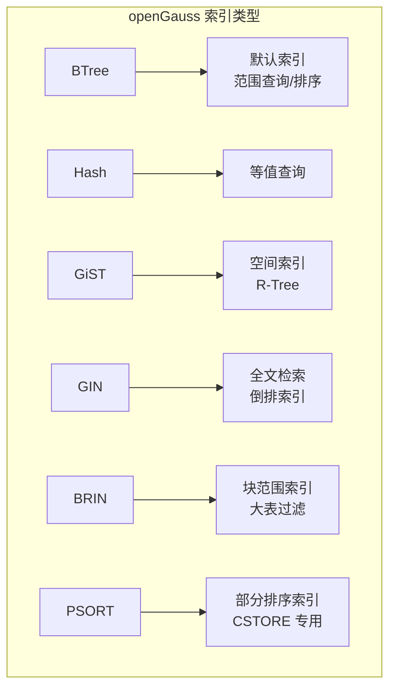

# openGauss 其他索引类型

## 学习目标

- 掌握 openGauss 除 BTree/Hash 外的其他索引类型
- 理解 openGauss 对 PostgreSQL 索引框架的扩展
- 对比三种存储引擎的索引支持差异

## 索引类型概览



## GiST 索引

openGauss 的 GiST（Generalized Search Tree）继承自 PostgreSQL，提供通用搜索树框架。

### 核心结构

```c
// GiST 索引页面
typedef struct GISTPageOpaqueData_s {
    uint32      gist_page_id;      // 页面 ID
    uint32      gist_vecoff;       // 向量偏移
    uint32      gist_npage;        // 页数
    uint32      gist_leaf;         // 是否叶子
    uint32      gist_rightlink;    // 右链接
    uint32      gist_nsort;        // 排序数
} GISTPageOpaqueData_t;

// GiST 节点
typedef struct GISTNode_s {
    GISTENTRY   entry;             // 索引项
    uint32      level;             // 层级
    BlockNumber blkno;             // 页面号
} GISTNode_t;

// GiST 索引项
typedef struct GISTENTRY_s {
    bytea      *key;               // 键值
    bool        leafkey;           // 是否是叶子键
    bool        isnull;            // 是否 NULL
    Oid         keytype;           // 键类型
} GISTENTRY_t;
```

### 空间索引（R-Tree over GiST）

```c
// 空间数据类型
typedef struct Box_s {
    double      x1, y1;            // 左上角
    double      x2, y2;            // 右下角
} Box_t;

// GiST 空间索引回调
// 一致性检查：bounding box 是否包含查询点
bool gist_box_consistent(GISTENTRY *entry, const Box_t *query) {
    Box_t *box = (Box_t *) entry->key;
    return box_contains(box, query);
}

// 惩罚函数：两个 bounding box 合并后的面积增长
double gist_box_penalty(GISTENTRY *orig, GISTENTRY *new) {
    Box_t *orig_box = (Box_t *) orig->key;
    Box_t *new_box = (Box_t *) new->key;
    Box_t union_box;

    box_union(&union_box, orig_box, new_box);
    double orig_area = box_area(orig_box);
    double union_area = box_area(&union_box);

    return union_area - orig_area;
}

// 分裂函数
void gist_box_picksplit(GISTENTRY *entries, int nentries,
                         GIST_SPLITVEC *split) {
    // 使用 Green's 算法或二分法选择最佳分裂
    // 最小化两个分组的覆盖面积之和
    split_best(entries, nentries, split);
}

// 合并函数
Box_t *gist_box_union(GISTENTRY *entries, int nentries) {
    Box_t *result = (Box_t *) palloc(sizeof(Box_t));
    *result = *(Box_t *) entries[0].key;

    for (int i = 1; i < nentries; i++) {
        box_union(result, result, (Box_t *) entries[i].key);
    }

    return result;
}
```

## GIN 索引

GIN（Generalized Inverted Index）支持全文检索和数组索引。

### 核心结构

```c
// GIN 索引结构
// 倒排索引：键 -> 行号列表

typedef struct GinEntry_s {
    Datum       key;               // 键值（例如：分词后的单词）
    ItemPointerData *list;         // 行号列表
    uint32      nlist;             // 列表长度
    uint32      list_capacity;     // 列表容量
} GinEntry_t;

// GIN 索引页面
typedef struct GinPageOpaqueData_s {
    uint32      flags;             // 标志位
    uint32      maxoff;            // 最大偏移
    BlockNumber rightlink;         // 右链接
} GinPageOpaqueData_t;

// GIN 索引结构（整体）
typedef struct GinIndex_s {
    Relation    relation;          // 关系
    GinEntry    *entries;          // 倒排条目
    uint32      nentries;          // 条目数
    bool        fast_update;       // 快速更新（延迟合并）
    bool        use_pending_list;  // 使用待处理列表
} GinIndex_t;
```

### 全文检索

```c
// 全文检索
// GIN 索引用于 tsvector 类型的全文搜索

// 创建全文索引
// CREATE INDEX idx_fts ON documents USING gin(to_tsvector('english', content));

// 查询：包含 "database" 和 "openGauss" 的文档
// SELECT * FROM documents
// WHERE to_tsvector('english', content) @@ to_tsquery('database & opengauss');

// GIN 扫描
void gin_scan(IndexScanDesc scan, ScanKey key) {
    // 1. 解析查询
    QueryItem *query_items = parse_tsquery(key->sk_argument);

    // 2. 查找每个查询词
    for (int i = 0; i < query_items->nitems; i++) {
        Datum word = query_items->items[i].word;

        // 3. 在 GIN 索引中查找
        GinEntry *entry = gin_find_entry(scan->indexRelation, word);
        if (entry == NULL)
            continue;

        // 4. 收集行号
        for (int j = 0; j < entry->nlist; j++) {
            // 记录匹配的行
            gin_record_match(scan, entry->list[j]);
        }
    }

    // 5. 排序结果（按 ts_rank）
    gin_sort_results(scan);
}
```

### 数组索引

```c
// 数组索引（GIN 也支持数组）
// CREATE INDEX idx_tags ON articles USING gin(tags);

// 查询：包含 "database" 标签的文章
// SELECT * FROM articles WHERE tags @> ARRAY['database'];

// GIN 数组扫描
void gin_array_scan(IndexScanDesc scan, ScanKey key) {
    ArrayType *array = DatumGetArrayTypeP(key->sk_argument);
    Datum *elements;
    int nelements;

    // 1. 展开数组
    deconstruct_array(array, &elements, NULL, &nelements);

    // 2. 对每个数组元素查找 GIN 索引
    for (int i = 0; i < nelements; i++) {
        GinEntry *entry = gin_find_entry(scan->indexRelation, elements[i]);
        if (entry != NULL) {
            // 3. 收集行号
            for (int j = 0; j < entry->nlist; j++) {
                gin_record_match(scan, entry->list[j]);
            }
        }
    }
}
```

## BRIN 索引

BRIN（Block Range Index）适合大表的顺序数据。

```c
// BRIN 索引结构
// 对连续的页面块（Block Range）存储最小值和最大值
// 用于大表的快速过滤

typedef struct BrinIndex_s {
    uint32    blk_range;           // 块范围大小（默认 128 页）
    BrinRange *ranges;             // 范围数组
    uint32    n_ranges;            // 范围数
} BrinIndex_t;

typedef struct BrinRange_s {
    BlockNumber start_blkno;       // 起始块号
    BlockNumber end_blkno;         // 结束块号
    Datum       min_value;         // 最小值
    Datum       max_value;         // 最大值
    bool        has_nulls;         // 是否有 NULL
} BrinRange_t;

// BRIN 扫描
bool brin_scan(BrinIndex *idx, ScanKey key) {
    for (int i = 0; i < idx->n_ranges; i++) {
        BrinRange *range = &idx->ranges[i];

        // 检查查询值是否在范围内
        if (key->sk_strategy == BTLessStrategyNumber) {
            if (range->min_value < key->sk_argument)
                return true;  // 可能存在，需要扫描
        } else if (key->sk_strategy == BTEqualStrategyNumber) {
            if (range->min_value <= key->sk_argument &&
                range->max_value >= key->sk_argument)
                return true;  // 可能存在，需要扫描
        }
    }

    return false;  // 范围外，不需要扫描
}
```

## CSTORE 专用索引

CSTORE 引擎支持部分排序索引（PSORT）。

```c
// CSTORE 部分排序索引
// 用于列存表，对每个 CU 内的数据排序
// 提升范围查询的过滤效率

typedef struct CStorePsortIndex_s {
    uint32    col_id;              // 列 ID
    uint32    cu_count;            // CU 数量
    CStorePsortEntry *entries;     // 排序条目
} CStorePsortIndex_t;

typedef struct CStorePsortEntry_s {
    uint32    cu_id;               // CU ID
    ScalarValue min_val;           // CU 内的最小值
    ScalarValue max_val;           // CU 内的最大值
} CStorePsortEntry_t;

// PSORT 索引过滤
uint32 *cstore_psort_filter(CStorePsortIndex *idx, ScalarValue query, uint32 op) {
    // 只扫描可能包含目标值的 CU
    List *candidate_cus = NIL;

    for (int i = 0; i < idx->cu_count; i++) {
        CStorePsortEntry *entry = &idx->entries[i];

        switch (op) {
            case BTEqualStrategyNumber:
                if (query >= entry->min_val && query <= entry->max_val)
                    candidate_cus = lappend_int(candidate_cus, entry->cu_id);
                break;

            case BTLessStrategyNumber:
                if (entry->min_val < query)
                    candidate_cus = lappend_int(candidate_cus, entry->cu_id);
                break;

            case BTGreaterStrategyNumber:
                if (entry->max_val > query)
                    candidate_cus = lappend_int(candidate_cus, entry->cu_id);
                break;
        }
    }

    return (uint32 *) candidate_cus;
}
```

## 索引类型对比

| 类型 | 适用场景 | 存储引擎 | 特点 |
|------|---------|----------|------|
| BTree | 范围查询、排序 | ASTORE/CSTORE/MOT | 默认索引，支持多种查询 |
| Hash | 等值查询 | ASTORE/CSTORE/MOT | 等值查询最快 |
| GiST | 空间数据 | ASTORE | 支持 R-Tree |
| GIN | 全文检索、数组 | ASTORE | 倒排索引 |
| BRIN | 大表顺序数据 | ASTORE | 空间效率高 |
| PSORT | 列存过滤 | CSTORE | 专用索引 |

## 与 PostgreSQL 对比

| 维度 | openGauss | PostgreSQL |
|------|-----------|------------|
| BTree | 兼容 PG | 支持 |
| Hash | 兼容 PG | 支持 |
| GiST | 兼容 PG | 支持 |
| GIN | 兼容 PG | 支持 |
| BRIN | 兼容 PG | 支持（PG 9.5+） |
| PSORT | CSTORE 专用 | 不支持 |
| 表达式索引 | 支持 | 支持 |
| 部分索引 | 支持 | 支持 |
| 唯一索引 | 支持 | 支持 |

## 要点总结

- openGauss 继承 PostgreSQL 的多种索引类型：BTree、Hash、GiST、GIN、BRIN
- GiST 支持空间索引（R-Tree），GIN 支持全文检索和数组索引
- BRIN 适合大表的顺序数据，空间效率高
- CSTORE 支持 PSORT（部分排序索引），优化列存过滤
- 与 PG 相比：PSORT 是 CSTORE 专用增强，其他索引类型兼容

## 思考题

1. 在 openGauss 中，GiST 索引能否用于 MOT 内存表？如果不能，为什么？
2. GIN 索引的 fast_update 模式（待处理列表）如何平衡插入性能和查询性能？
3. BRIN 索引的 blk_range 参数（默认 128 页）如何影响过滤精度和空间占用？