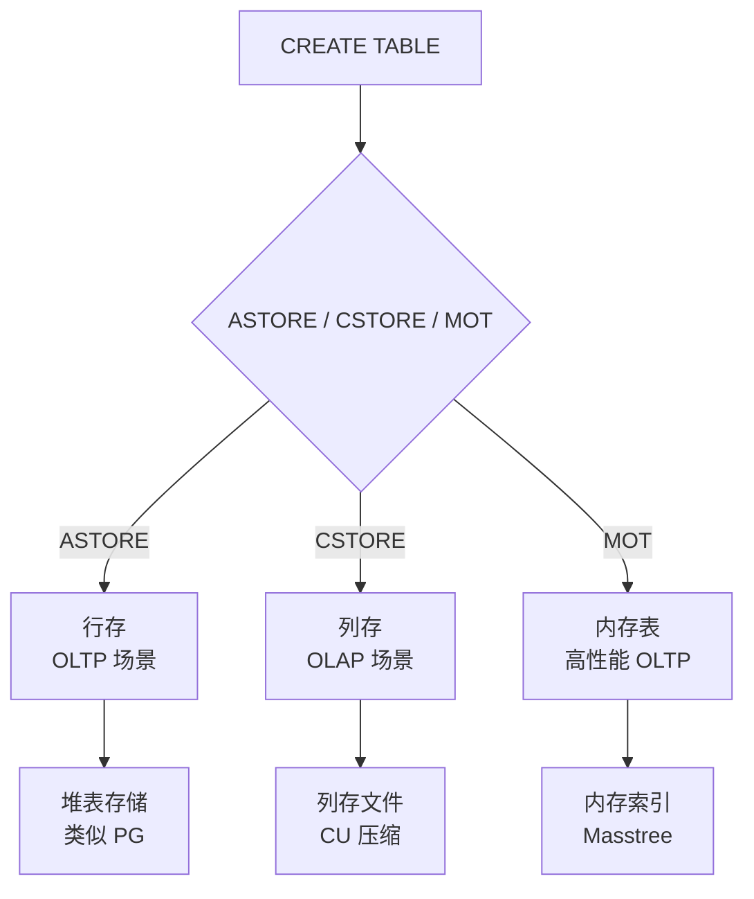
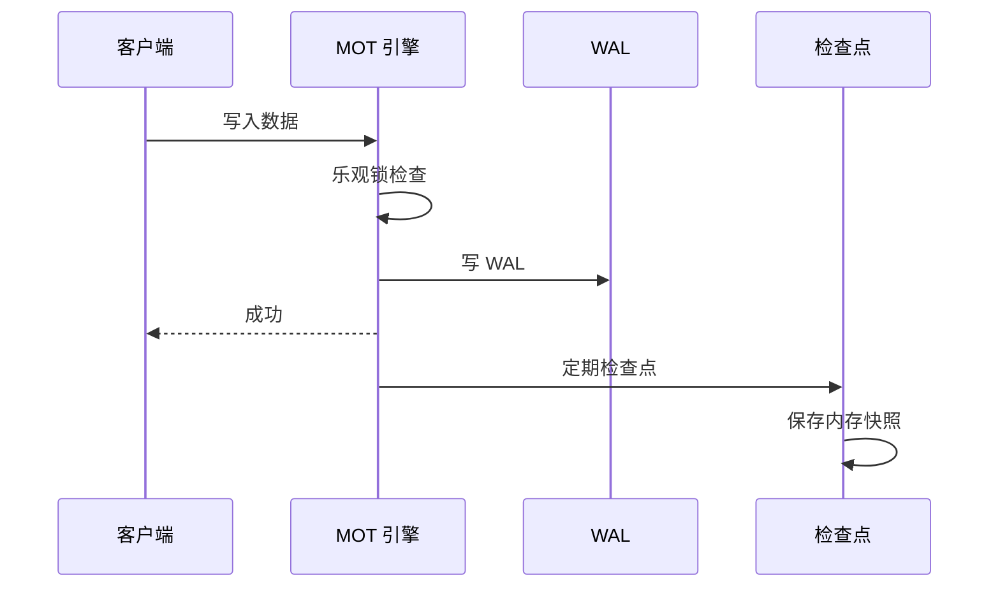
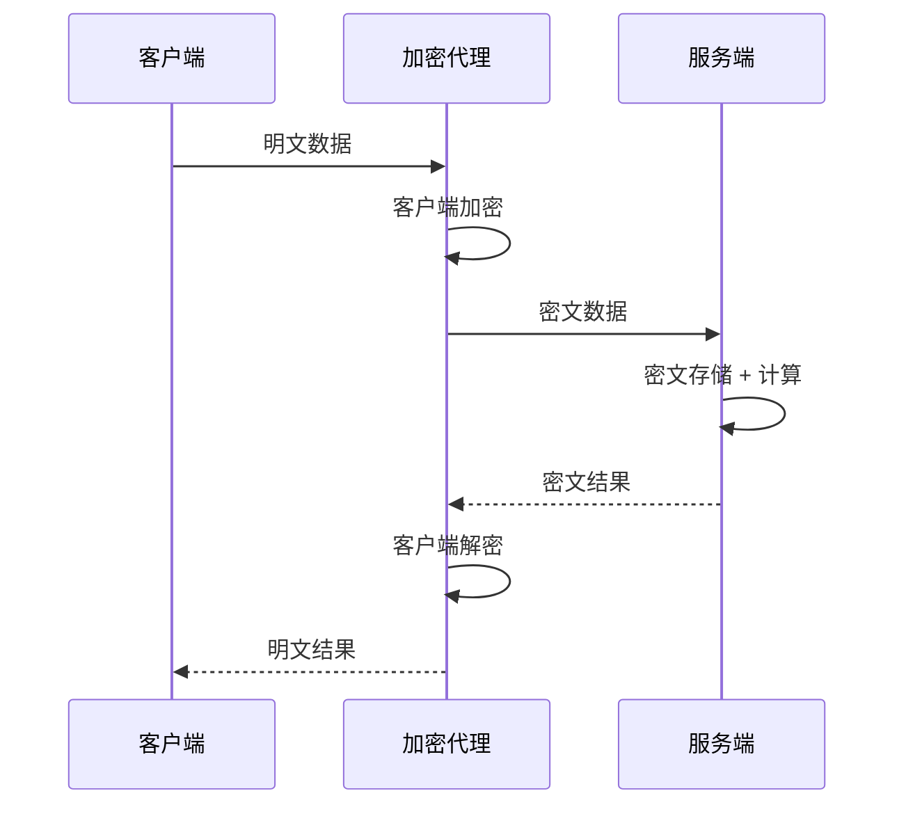
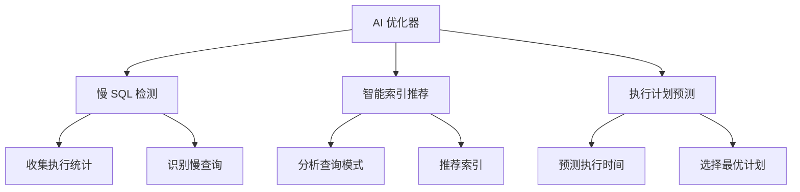

# openGauss 核心特性

## 学习目标

- 掌握 openGauss 的核心特性
- 理解 openGauss 的企业级增强
- 对比 openGauss 与 PostgreSQL 的特性差异

## 核心特性

### 1. 三存储引擎



```sql
-- ASTORE（默认）
CREATE TABLE t1 (id INT, name TEXT);

-- CSTORE（列存）
CREATE TABLE t2 (id INT, name TEXT) WITH (ORIENTATION = COLUMN);

-- MOT（内存表）
CREATE FOREIGN TABLE t3 (id INT, name TEXT)
SERVER mot_server OPTIONS (orientation 'row');
```

### 2. MOT 内存表



### 3. 全密态数据库



### 4. AI 优化器



## 特性对比

| 特性 | openGauss | PostgreSQL |
|------|-----------|------------|
| 存储引擎 | ASTORE + CSTORE + MOT | Heap |
| 内存表 | MOT | 不支持 |
| 列存 | CSTORE | 不支持（需扩展） |
| 全密态 | 支持 | 不支持 |
| AI 优化器 | 支持 | 不支持 |
| LLVM JIT | 支持（增强） | 支持（PG 11+） |
| SMP 并行 | 支持 | 支持 |
| Oracle 兼容 | 部分支持 | 不支持 |

## 安全特性

| 特性 | openGauss | PostgreSQL |
|------|-----------|------------|
| 全密态查询 | 支持 | 不支持 |
| 动态脱敏 | 支持 | 不支持 |
| 审计日志 | 支持 | 支持 |
| 行级安全 | 支持 | 支持 |
| SSL/TLS | 支持 | 支持 |

## 高可用特性

| 特性 | openGauss | PostgreSQL |
|------|-----------|------------|
| 主备复制 | 同步/异步 | 流复制 |
| 级联备库 | 支持 | 支持 |
| 逻辑复制 | 支持 | 支持 |
| 自动故障切换 | 支持（DCF） | 需第三方工具 |
| 分布式一致性 | DCF（Paxos） | 不支持 |

## 要点总结

- openGauss 核心差异：三存储引擎、MOT 内存表、全密态数据库
- AI 优化器提供慢 SQL 检测和智能索引推荐
- 安全增强：全密态、动态脱敏、审计日志
- 高可用增强：DCF 分布式一致性框架
- 与 PG 相比：功能丰富、性能优化、安全增强

## 思考题

1. openGauss 的 MOT 内存表相比 Redis 等内存数据库，在事务支持和数据持久化上有何优势？
2. openGauss 的全密态数据库对查询性能的影响有多大？哪些场景适合使用全密态？
3. openGauss 的 AI 优化器如何与传统的代价优化器协同工作？