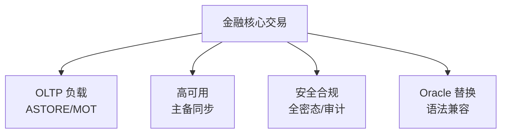
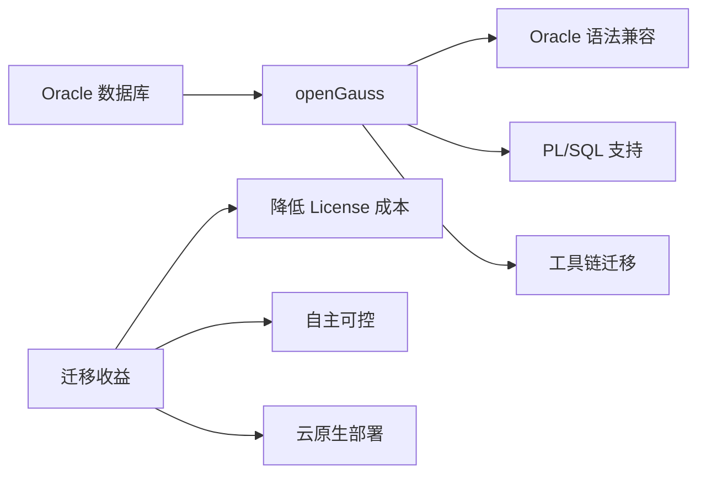
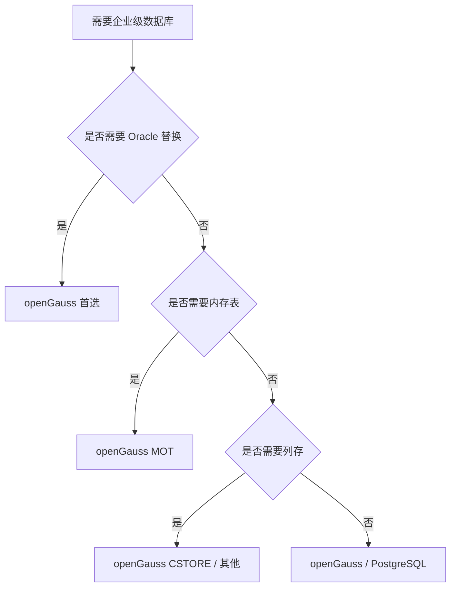

# openGauss 应用场景

## 学习目标

- 掌握 openGauss 的典型应用场景
- 理解 openGauss 的场景选择依据
- 对比 openGauss 与 PostgreSQL 的场景差异

## 典型应用场景

### 1. 金融核心交易

openGauss 适合金融级 OLTP 场景。



**典型客户**：银行、保险、证券

### 2. Oracle 替换

openGauss 支持部分 Oracle 语法，降低迁移成本。



### 3. 混合负载（HTAP）

```sql
-- OLTP：行存（ASTORE）
SELECT * FROM orders WHERE id = 123;

-- OLAP：列存（CSTORE）
SELECT user_id, SUM(amount) FROM orders
WHERE order_date >= '2024-01-01'
GROUP BY user_id;
```

### 4. 政府/央企

- **自主可控**：开源，国产化
- **安全合规**：全密态、审计日志
- **高可用**：主备同步 + DCF

## 场景选择决策树



## 场景对比

| 场景 | openGauss | PostgreSQL |
|------|-----------|------------|
| 金融核心交易 | 首选（MOT） | 次选 |
| Oracle 替换 | 首选 | 不适用 |
| 政府/央企 | 首选 | 次选 |
| HTAP 混合负载 | 支持 | 不支持 |
| 内存表场景 | MOT | 不支持 |
| 列存场景 | CSTORE | 需扩展 |
| 地理空间 | 不支持 | 原生支持 |

## 性能对比

| 基准 | openGauss | PostgreSQL |
|------|-----------|------------|
| TPC-C（行存） | 高（MOT 更高） | 中 |
| TPC-H（列存） | 高（CSTORE） | 低 |
| 高并发写入 | 高（MOT） | 中 |
| 复杂查询 | 高（AI 优化器） | 中 |

## 要点总结

- openGauss 最适合金融核心交易和 Oracle 替换场景
- 三存储引擎覆盖不同业务场景
- 安全增强适合政府/央企
- 与 PG 相比：Oracle 替换、内存表、列存、AI 优化器是差异化优势

## 思考题

1. openGauss 的 Oracle 兼容性在实际迁移中，最常遇到的兼容性问题是什么？
2. openGauss 的 MOT 内存表在金融核心交易场景中，相比 PostgreSQL 的堆表性能提升多少？
3. 如果业务已经使用 PostgreSQL，迁移到 openGauss 的收益和风险是什么？