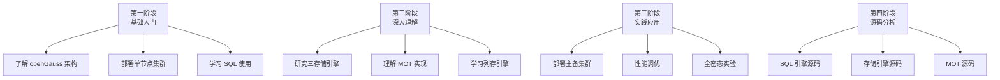

# openGauss 学习资源

## 学习目标

- 掌握 openGauss 的学习资源体系
- 了解 openGauss 的核心论文和源码
- 制定 openGauss 学习路线

## 官方文档

| 资源 | 地址 | 说明 |
|------|------|------|
| 官方文档 | https://opengauss.org/zh/docs/ | 完整的产品文档 |
| 社区官网 | https://opengauss.org | 社区资源 |
| 源码仓库 | https://gitee.com/opengauss/openGauss-server | 开源仓库 |
| 博客 | https://mp.weixin.qq.com | 技术博客 |

## 核心论文

| 论文 | 作者 | 说明 |
|------|------|------|
| openGauss：An Enterprise-Level Database System | 华为 | openGauss 总体设计 |
| MOT：Memory-Optimized Table | 华为 | MOT 内存表实现 |
| CSTORE：Column Store Engine | 华为 | 列存引擎实现 |
| 全密态数据库技术 | 华为 | 全密态查询实现 |

## 源码阅读

### 源码仓库

```
openGauss-server/
├── src/                    # 源码
│   ├── common/            # 共享模块
│   ├── gausskernel/       # 核心引擎
│   ├── lib/               # 库文件
│   └── tools/             # 工具
├── contrib/               # 扩展模块
└── doc/                   # 文档
```

### 关键模块

| 模块 | 路径 | 说明 |
|------|------|------|
| SQL 解析器 | `src/gausskernel/optimizer/` | SQL 解析和优化 |
| 执行器 | `src/gausskernel/executor/` | 查询执行 |
| ASTORE | `src/gausskernel/storage/` | 行存引擎 |
| CSTORE | `src/gausskernel/cstore/` | 列存引擎 |
| MOT | `src/gausskernel/mot/` | 内存表引擎 |
| WAL | `src/gausskernel/access/transam/` | 事务和 WAL |

## 学习路线



## 推荐书籍

| 书名 | 作者 | 说明 |
|------|------|------|
| openGauss 数据库核心 | 华为 | 核心原理 |
| PostgreSQL 指南 | 周彦伟 | PG 基础（openGauss 基于 PG） |
| 数据库系统概论 | 王珊 | 数据库理论 |

## 社区资源

| 资源 | 说明 |
|------|------|
| openGauss 社区 | 技术问答和交流 |
| Gitee Issues | 问题反馈 |
| 微信公众号 | 技术文章 |
| Bilibili | 视频教程 |

## 要点总结

- openGauss 提供完整的官方文档和社区资源
- 核心论文覆盖 MOT、CSTORE、全密态等技术
- 源码仓库包含完整的 SQL 引擎、存储引擎、MOT 引擎
- 学习路线从基础入门到源码分析分四阶段
- 与 PG 相比：基于 PG 9.2，大量企业级增强

## 思考题

1. openGauss 的 C++ 源码与 PostgreSQL 的 C 源码相比，在阅读难度和性能优化空间上有何差异？
2. openGauss 的 MOT 引擎源码相比传统内存数据库（如 Redis），有哪些独特设计？
3. 从源码角度，openGauss 的列存引擎与 PostgreSQL 的 cstore_fdw 扩展有何本质差异？