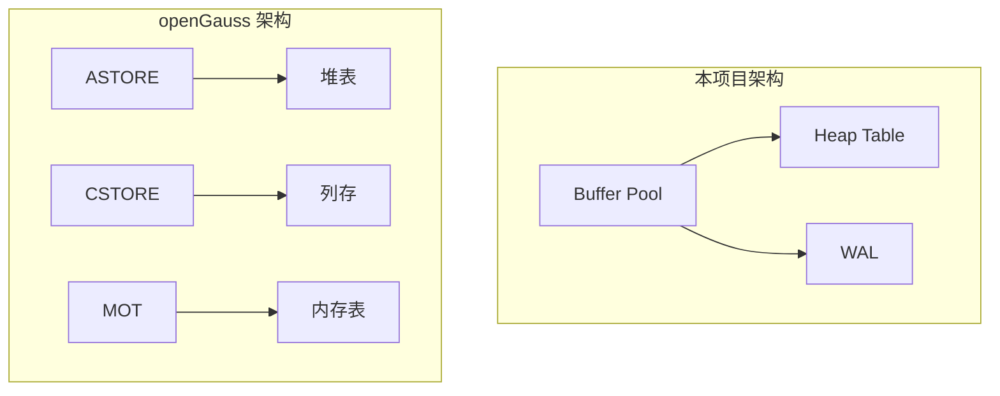

# openGauss 与项目连接的桥梁

## 学习目标

- 理解 openGauss 中哪些设计可以借鉴到本项目
- 掌握 openGauss 设计的简化思路
- 对比 openGauss 与项目存储引擎的差异

## 可借鉴的设计

### 1. 三存储引擎模型

openGauss 的三存储引擎设计值得借鉴。

**项目中的实现**：

```c
// 当前：单一 Buffer Pool + Heap 表
// 借鉴：多引擎支持
typedef enum storage_engine_e {
    ENGINE_HEAP,      // 行存（类似 ASTORE）
    ENGINE_COLUMN,    // 列存（类似 CSTORE）
    ENGINE_MEMORY,    // 内存表（类似 MOT）
} storage_engine_t;
```

### 2. MOT 内存表

**项目中借鉴**：

```c
// 内存表结构
typedef struct mot_table_s {
    masstree_t *index;       // Masstree 索引
    void *rows;              // 行数据
    int row_count;           // 行数
    pthread_mutex_t lock;    // 锁
} mot_table_t;
```

### 3. 列存引擎

**项目中借鉴**：

```c
// 列存格式
typedef struct column_store_s {
    int column_id;           // 列 ID
    char *data;              // 列数据
    int row_count;           // 行数
    compress_type_t compress;// 压缩类型
} column_store_t;
```

## 简化设计

### 1. 简化 MOT

```c
// 简化版内存表
typedef struct simple_mot_s {
    hash_table_t *index;     // 哈希索引
    void *rows;              // 行数据
    int capacity;            // 容量
    int size;                // 当前大小
} simple_mot_t;
```

### 2. 简化列存

```c
// 简化版列存
typedef struct simple_cstore_s {
    char *columns[10];       // 最多 10 列
    int row_count;           // 行数
    int col_count;           // 列数
} simple_cstore_t;
```

### 3. 简化全密态

```c
// 简化版加密
typedef struct encrypted_value_s {
    char *ciphertext;        // 密文
    int len;                 // 长度
    char *iv;                // 初始向量
} encrypted_value_t;
```

## 存储引擎对比

| 维度 | 本项目 | openGauss |
|------|--------|-----------|
| 存储引擎 | Buffer Pool + Heap | ASTORE + CSTORE + MOT |
| 内存表 | 不支持 | MOT（无锁并发控制） |
| 列存 | 不支持 | CSTORE（CU 压缩） |
| JIT 编译 | 不支持 | LLVM JIT |
| AI 优化 | 不支持 | AI 优化器 |

## 借鉴清单

| 层级 | 可借鉴 | 简化程度 | 优先级 |
|------|--------|----------|--------|
| 存储引擎 | 多引擎支持 | 简化 | 高 |
| 内存表 | MOT 无锁并发 | 简化 | 中 |
| 列存 | CSTORE 压缩 | 简化 | 中 |
| JIT 编译 | LLVM JIT | 简化 | 低 |
| 全密态 | 客户端加密 | 简化 | 低 |

## 与项目架构的差异



## 要点总结

- openGauss 的三存储引擎设计值得借鉴
- MOT 内存表提供无锁并发控制思路
- 列存引擎提供压缩存储方案
- 与项目相比：多引擎 vs 单一引擎
- 借鉴优先级：存储引擎 > 内存表 > 列存 > JIT

## 思考题

1. 如果在本项目中实现多存储引擎支持，需要修改哪些现有模块？
2. openGauss 的 MOT 内存表相比 Redis 等内存数据库，在事务支持上有何优势？
3. 本项目的 Buffer Pool 能否与内存表共存？如何设计一个混合存储引擎？