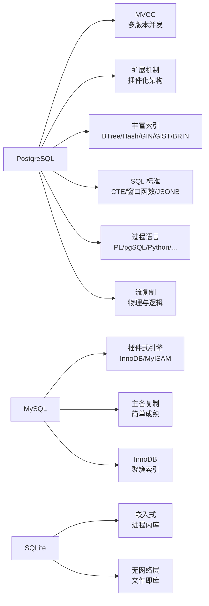
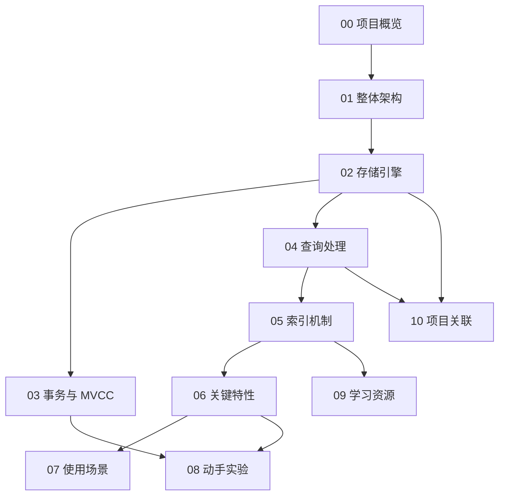

# PostgreSQL 项目概览

## 学习目标

- 了解 PostgreSQL 的项目定位、历史脉络与社区生态
- 掌握 PostgreSQL 的核心设计理念与适用场景
- 建立对 PostgreSQL 全栈模块的整体认知框架

## 项目定位

> PostgreSQL（俗称 Postgres）是一个以"对象-关系"为核心、强调 SQL 标准兼容与可扩展性的开源数据库。

**基本信息**：

- 开发方：PostgreSQL Global Development Group（全球开发者社区，源自加州大学伯克利分校 Michael Stonebraker 教授领导的 Postgres 项目）
- 首次发布：1996 年（Postgres95 是首个以"PostgreSQL"名义发布的版本）
- 开源协议：PostgreSQL License（类 BSD 的宽松许可证）
- 最新版本：17.x（截至 2026 年；PG 主版本每年发布一个大版本）
- GitHub Stars：约 17k（[postgres/postgres](https://github.com/postgres/postgres)）
- 官方网站：[https://www.postgresql.org](https://www.postgresql.org)

## 核心设计理念

PostgreSQL 的设计哲学可以概括为四点：**架构可扩展**、**事务严谨**、**标准 SQL 兼容**、**面向长期演进**。

第一，**可扩展性（Extensibility）**。PG 把"扩展点"当作一等公民。开发者可以通过 `CREATE EXTENSION` 机制加载自定义类型、索引方法、函数语言、钩子函数等。其底层的"访问方法抽象（Access Method API）"允许把 GIN、GiST、BRIN、pgvector 等不同索引算法都挂在同一套 planner/executor 上，这种"插件化架构"在三十年前就已经定型。

第二，**强事务与 MVCC**。PG 默认遵循完整的 ACID，隔离级别默认 Read Committed，但同时实现了真正的 MVCC —— 每次更新都生成新版本元组，垃圾回收由 VACUUM 后台进程统一清理，避免了回滚段膨胀的问题。

第三，**SQL 兼容性**。PG 是公认最接近 SQL 标准的关系数据库之一，CTE、窗口函数、聚合函数、递归查询、JSON/JSONB、XML、全文检索等都被原生支持。

第四，**面向长期演进的稳健性**。PostgreSQL 的版本号从 7.x 一路演进到 17.x，磁盘格式自 2005 年的 8.0 起基本保持向后兼容；版本升级几乎不会要求做 dump/restore。

## 核心优势与差异化特性

PG 与 MySQL 的关键差异：

- **架构**：PG 是单引擎深度优化；MySQL 是多引擎可插拔
- **MVCC**：PG 在 Heap Tuple 上携带 xmin/xmax；MySQL InnoDB 在聚簇索引里维护 undo log + read view
- **进程模型**：PG 一个连接一个进程（fork 自 postmaster）；MySQL 一个连接一个线程
- **JSON 支持**：PG 的 JSONB 是真正的二进制结构、可索引；MySQL 的 JSON 是文本层表达

## 适用场景

PostgreSQL 在以下场景中表现出色：

- **复杂 OLTP 系统**：需要严格事务、约束、外键、复杂 JOIN 的业务
- **地理信息系统**：通过 PostGIS 扩展获得工业级 GIS 能力
- **全文检索**：内置 tsvector/tsquery，配合 GIN 索引
- **时序/事件数据**：原生 BRIN + TimescaleDB 扩展提供时间分区
- **数据中台/数据仓库**：窗口函数、CTE、递归查询完善
- **需要长期稳定运行的核心系统**：License 友好、License 稳定、商业风险低

不擅长的场景：

- **极简单写高速**：Redis / KeyDB 这类纯 KV 更合适
- **嵌入式场景**：SQLite 体积更小、无外部进程
- **大规模分布式 OLTP**：需要更强的横向扩展能力时，CockroachDB / TiDB 更适合
- **超大规模列存分析**：ClickHouse / DuckDB 更专业

## 学习路线图

建议按以下顺序学习 PostgreSQL：

**推荐路径**：先读 `01_architecture.md` 建立分层认知；再到 `02_storage` 了解 Buffer Pool 与页面布局；接着 `03_transaction` 理解 MVCC 的实现；然后 `04_query` 看 SQL 从文本到执行的全过程；最后到 `05_index` 体会"扩展机制"在索引上的具体体现。

## 要点总结

- PostgreSQL 是以"可扩展架构 + 严谨事务 + SQL 兼容"为核心的开源关系数据库
- 它的差异化优势在于 MVCC 实现、插件化的访问方法框架、丰富的数据类型与索引
- 学习 PostgreSQL 应从"分层架构"切入，再到具体模块实现细节
- 与 MySQL/SQLite 等竞品相比，PG 在复杂 OLTP 与扩展性上具有显著优势

## 思考题

1. PostgreSQL 的"扩展机制（Access Method API）"为何被视为最重要的设计决策之一？
2. MVCC 选择在 Heap Tuple 上携带版本信息，相比 InnoDB 的 undo log 方案，有什么权衡？
3. 在你的项目（存储引擎学习项目）中，哪些模块可以借鉴 PG 的设计？