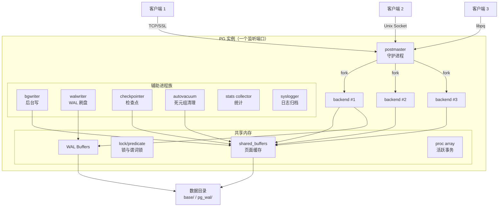
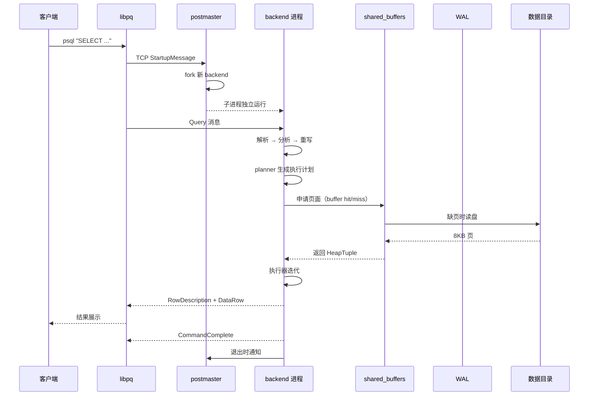

# PostgreSQL 架构设计

## 学习目标

- 理解 PostgreSQL 的整体分层架构与各层职责
- 掌握 PostgreSQL 的进程模型（postmaster / backend / auxiliary）
- 熟悉一次查询从客户端接入到结果返回的全链路

## 核心概念

- **postmaster**：常驻守护进程，负责监听端口、接受新连接并 fork 子进程
- **backend process**：每个客户端连接对应一个独立的后端进程，承担 SQL 解析、规划、执行
- **auxiliary process**：辅助进程族，包括 bgwriter、walwriter、autovacuum、checkpointer、stats collector 等
- **shared buffers**：所有进程共享的内存页面缓存，由 buffer manager 统一管理
- **WAL（Write-Ahead Logging）**：预写日志，事务提交前必须先刷盘

## 整体架构

PostgreSQL 采用经典的"客户端 / 守护进程 / 后端进程 / 存储引擎"四层架构。客户端通过 TCP/Unix Socket 接入，由 postmaster 接收后 fork 出独立的 backend 进程，每个 backend 自己跑完 SQL 全流程；后台的辅助进程负责刷新脏页、写 WAL、做检查点、清理死元组等。

## 各层职责

### 网络层与协议层

PostgreSQL 使用自定义的 **PostgreSQL Frontend/Backend Protocol**，由 libpq 客户端库实现。该协议基于消息流：

- `StartupMessage`：客户端发起连接时发送，包含 user/database 等参数
- `Query` / `Parse/Bind/Execute`：查询消息，简单查询走 `Query`，扩展查询走预解析模式
- `RowDescription` / `DataRow` / `CommandComplete`：服务器响应
- `CopyData`：COPY 流式导入/导出专用通道

整个协议层是**消息驱动**而非命令响应式的，这为 COPY 流、扩展查询等复杂场景提供了灵活性。

### 守护进程 postmaster

`postmaster` 是 PG 实例的"总管家"。它的核心职责是：

1. 读取 `postgresql.conf` 与 `pg_hba.conf`
2. 申请共享内存、创建共享缓冲区、信号量等
3. 启动所有辅助进程
4. 在端口 5432 上监听连接请求（实际行为由 listen_addresses 控制）
5. 每收到一个新连接就 fork 一个 backend 进程，自己回到监听循环

postmaster 还负责感知 backend 的退出、清理孤儿进程、在 SIGHUP 时重新加载配置等。

### Backend 进程

每个客户端连接对应一个独立的 backend 进程（进程模型，而非线程）。它运行以下阶段：

1. **解析**：通过 `parser.c` 把 SQL 文本转成抽象语法树（raw parse tree）
2. **分析**：通过 `analyze.c` 把语法树转成查询树（Query），并绑定类型/列引用
3. **重写**：通过 `rewriteRuleList` 应用规则系统（视图、规则）
4. **规划**：通过 `planner.c` 生成最优执行计划（Plan tree）
5. **执行**：通过 `executor` 迭代返回结果

每个 backend 都有自己的 `pg_stat_activity` 行，可以独立观察到状态。

### 辅助进程族

辅助进程由 postmaster 在启动阶段一并拉起，常驻运行：

- **bgwriter**：周期性把 shared_buffers 中的脏页异步刷盘，缩短 checkpoint 阻塞时间
- **walwriter**：把 WAL Buffers 中的记录刷到 `pg_wal/` 目录
- **checkpointer**：周期性触发 checkpoint，刷掉所有脏页并截断 WAL
- **autovacuum**：自动 VACUUM 与 ANALYZE，回收死元组、刷新统计信息
- **stats collector**：收集 SQL 执行统计、I/O 统计、对象访问统计
- **syslogger**：把 stderr/stdout 收集到日志文件（可选启动）

### 存储引擎层

存储引擎层在 backend 的执行器之下，主要子系统：

- **Access Methods**：Heap、BTree、Hash、GiST、GIN、BRIN、SP-GiST、pgvector 等
- **Buffer Manager**：维护 shared_buffers（默认 128MB），使用 Clock-Sweep 淘汰
- **WAL**：实现 write-ahead log 协议
- **Smgr（Storage Manager）**：抽象磁盘 I/O，屏蔽 mdf/fd 的细节
- **Free Space Map（FSM）** 与 **Visibility Map（VM）**：辅助追踪可用空间与可见性
- **Lock Manager**：表级 / 页级 / 元组级锁

### 共享内存

所有 backend 与辅助进程通过共享内存通信。关键结构：

- `shared_buffers`：默认 128MB，存放被缓存的数据页
- `WAL Insert Lock`：写 WAL 时的临界区
- `Proc Array`：所有活跃 backend 的 PGPROC 数组，用于快照取数
- `Lock Hash Table`：全局锁表
- `Predicate Lock Table**：用于可串行化隔离的谓词锁

## 关键数据流

下面这张时序图展示了一条 `SELECT` 语句的端到端流程：

## 进程模型分析

PG 选择"一连接一进程"的进程模型而非线程模型，带来的权衡如下：

| 维度 | 进程模型（PG） | 线程模型（MySQL/部分扩展） |
|------|---------------|---------------------------|
| 内存隔离 | 强：每个 backend 拥有独立地址空间 | 弱：共享堆，需更多锁 |
| 崩溃隔离 | 强：一个 backend 崩溃不影响全局 | 弱：线程崩溃常导致整个进程退出 |
| 创建开销 | 较高（fork + exec 或 copy-on-write） | 低（线程创建成本小） |
| 大连接数 | 受限于进程数（PG 13+ 引入了更轻量的 process model 优化） | 通常需要 thread pool 中间层 |
| 共享状态 | 必须显式 IPC（共享内存 + LWLock） | 通过共享堆同步 |

为了在大量短连接场景下减轻 fork 开销，PG 在 13+ 版本中引入了 `dynamic_shared_memory` 与 `ReserveBackend` 等优化，但仍保持进程隔离。

## 内部扩展点

PG 的"插件化架构"体现在大量 hook 与注册点：

- **Access Method API**（`amapi.h`）：允许注册自定义索引算法
- **Background Worker API**：可以拉起自定义后台进程
- **Process Utility Hook**：拦截 DDL 命令
- **Custom Plan Hook**：干预执行计划选择
- **Type Cache Callback / Tuple Desc Hook**：扩展类型系统

这套设计让 GIN、GiST、BRIN、pgvector、TimescaleDB、PostGIS 这些"非默认功能"都能以扩展形式存在，而不需要修改核心代码。

## 要点总结

- PG 是**进程模型**，由 postmaster 守护 + 多个 backend + 多个辅助进程组成
- 客户端通过 PostgreSQL Frontend/Backend 协议通信，backend 进程独立完成 解析 → 规划 → 执行
- 共享内存里承载 shared_buffers、WAL Buffers、锁表、proc array，是所有进程协作的中枢
- 存储引擎层使用 Buffer Manager + Access Method + WAL + FSM/VM 协同
- 插件化架构体现在 Access Method API、Background Worker、Process Utility Hook 等多个扩展点

## 思考题

1. 为什么 PG 选择进程模型而不是线程模型？这个选择在今天依然合理吗？
2. shared_buffers 的"全局单实例"模型与 MySQL InnoDB 的 buffer pool per-instance 模型各有什么优劣？
3. 如果让你重新设计 PG 的扩展机制，你会保留 Access Method API 还是改用更现代的插件模型？