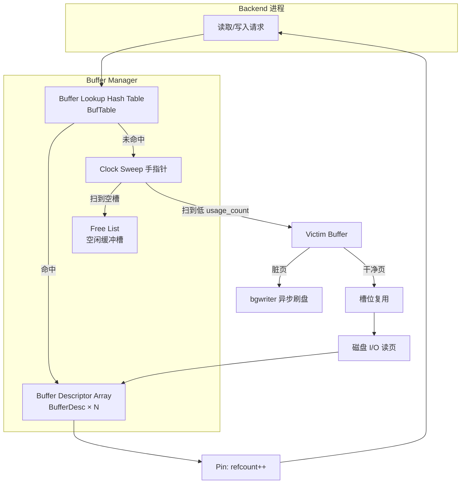
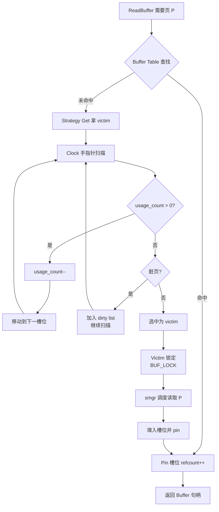
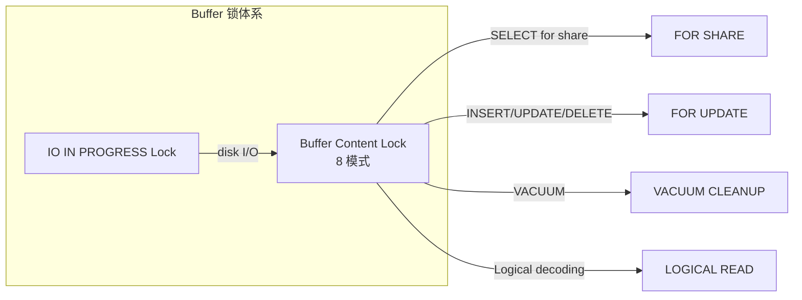
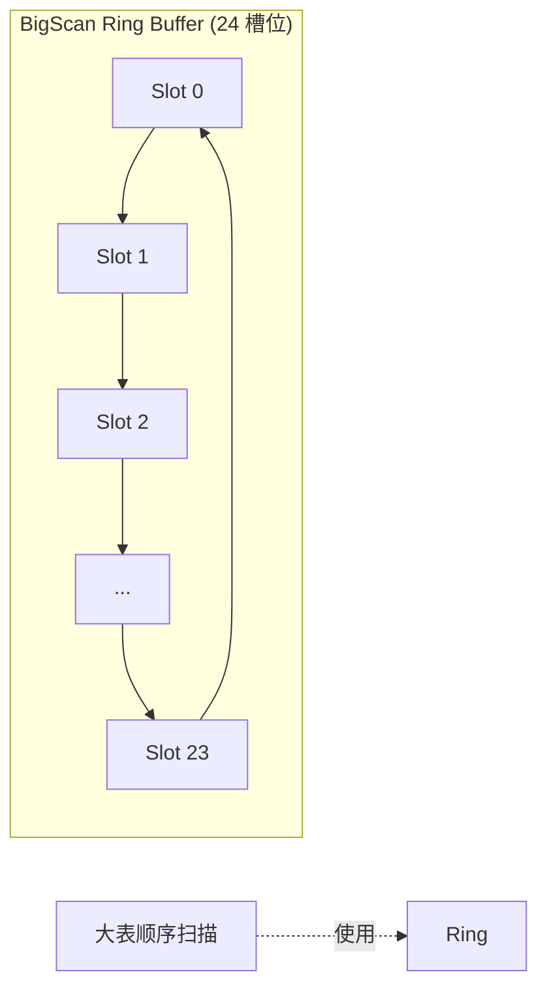

# Buffer Pool 实现

## 学习目标

- 理解 PostgreSQL Buffer Pool 在 shared_buffers 中的组织方式
- 掌握 Clock Sweep 淘汰算法与脏页刷盘策略
- 熟悉页面查找、加锁、pin/unpin 的完整路径

## 核心概念

- **shared_buffers**：所有 backend 进程共享的页面缓存，配置项 `shared_buffers` 控制大小（默认 128MB）
- **Buffer Tag**：`<tablespace, database, relfilenode, fork, blocknum>` 五元组，唯一标识一个磁盘页
- **Buffer Descriptor**：每个缓存槽位的元数据，含 refcount、usage_count、flags（脏位、valid 位、IO 锁等）
- **Clock Sweep**：PG 自研的近似 LRU 淘汰算法，使用 usage_count + 一个"指针"扫描缓存
- **Strategy Get** vs **Buffer Alloc**：从空闲列表取得 vs 从磁盘读入新页（可能驱逐旧页）
- **LWLock（Light-weight Lock）**：保护 Buffer Descriptor 数组的轻量级锁

## 架构设计

PostgreSQL 的 Buffer Pool 由共享内存中的固定大小数组实现，每个槽位是一个 `BufferDesc` 结构。访问路径分三层：

1. **Buffer Lookup（哈希表）**：用 Buffer Tag 哈希到 `BufTable`，命中直接返回槽位
2. **Strategy Get（淘汰）**：未命中时调用 Clock Sweep 选一个被驱逐的槽位
3. **Buffer Alloc（磁盘 I/O）**：从磁盘把目标页读入选中的槽位，期间持有 IO_IN_PROGRESS 锁

## Clock Sweep 淘汰算法

PG 没有使用经典的 LRU 链表，而是用 **Clock Sweep**（时钟扫描）算法。每个 Buffer Descriptor 维护一个 `usage_count`（范围 0-5），时钟手指针顺时针扫描所有槽位：

- **usage_count > 0**：递减 1，移交给下一个槽位
- **usage_count == 0 且不是脏页**：选为 victim
- **usage_count == 0 且是脏页**：跳过（让 bgwriter 处理），继续扫

## 关键细节

### Pin / Unpin

每个 backend 在读取 Buffer 后必须 Pin（`refcount++`），使用完毕调用 Unpin（`refcount--`）。Pin 之后即便 Clock Sweep 扫到这个槽位也无法驱逐它（因为 `refcount > 0`）。这是为什么即便 Clock Sweep 在跑，长事务也不会丢失页面。

### 脏页刷盘分工

PG 的脏页刷盘由三股力量分工：

1. **Backend 自身**：当 evict 时发现 victim 是脏页，必须先刷盘才能复用（同步刷）
2. **bgwriter**：周期性扫描共享缓冲，把脏页异步刷盘，降低 evict 时的同步阻塞
3. **checkpointer**：周期性触发 checkpoint，把所有脏页强制刷盘并创建一致性快照

### Buffer 锁

PG 在 Buffer 级别使用两种锁：

- **IO In Progress Lock**：用于保护磁盘 I/O 期间的状态
- **Content Lock**：八种粒度（共享/排他 × 4 类），保护页面内容并发读写

### 缓冲池配置建议

| 参数 | 默认值 | 推荐 | 说明 |
|------|--------|------|------|
| `shared_buffers` | 128MB | 物理内存 25% | 单实例总缓存 |
| `effective_cache_size` | 4GB | 物理内存 75% | Planner 估算 OS Cache 大小 |
| `work_mem` | 4MB | 32MB-256MB | 排序/哈希 join 内存 |
| `huge_pages` | try | try/enable | 大页减少 TLB miss |

### Ring Buffer 策略

对于大顺序扫描（Seq Scan、VACUUM、COPY、大型 ANALYZE），PG 不会污染整个 shared_buffers，而是使用 **ring buffer**（24 个 buffer 大小的循环环）：

这样即使有人跑 `SELECT * FROM huge_table`，也不会把热点页挤出缓存。

## 与其他数据库的对比

| 维度 | PostgreSQL Clock Sweep | MySQL InnoDB LRU | Oracle Buffer Cache |
|------|-----------------------|------------------|---------------------|
| 算法 | 时钟扫描 + usage_count | 链表 + midpoint | Touch-Count + 热端/冷端 |
| 脏页异步 | bgwriter 周期刷 | page cleaner thread | DBWR 多线程 |
| 大扫描保护 | ring buffer | old block 链表隔离 | touch-count 阈值 |
| 槽位级锁 | LWLock + IO Lock | mutex + rwlock | Cache Buffers Chains Latch |

## 要点总结

- PG 的 Buffer Pool 通过 **Clock Sweep** 算法管理，基于 usage_count 实现近似 LRU
- 脏页刷盘由 backend 同步路径 + bgwriter 异步 + checkpointer 三股力量分工
- Buffer Tag + Hash 表提供 O(1) 查找，IO_IN_PROGRESS 锁保护 I/O
- ring buffer 保护 shared_buffers 不被大顺序扫描污染
- 与 MySQL 的 LRU 链表相比，Clock Sweep 的常数项更小、扫描开销可控

## 思考题

1. 为什么 PG 选择 Clock Sweep 而非 LRU 链表？两者的实现复杂度与缓存命中率有何差异？
2. usage_count 上限是 5，意味着一个热页最多累积 5 次访问。这个值是怎么来的？
3. 如果让大顺序扫描也走 shared_buffers 主池，会发生什么？为什么必须用 ring buffer 隔离？