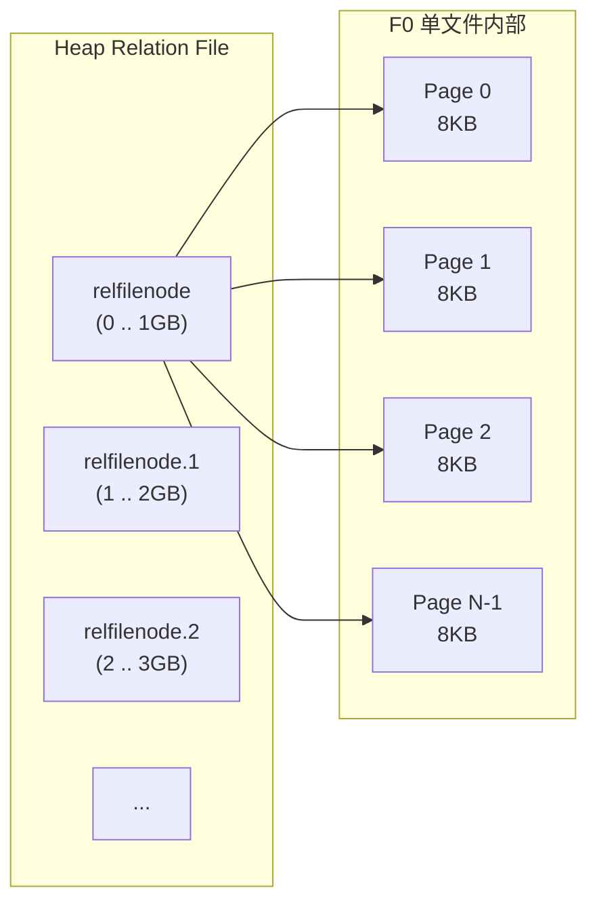
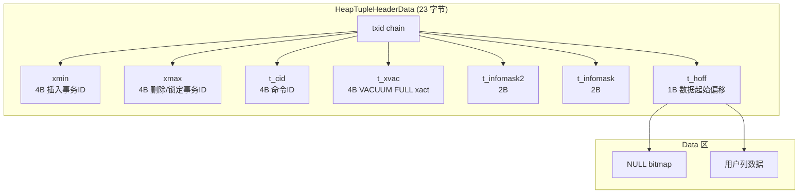
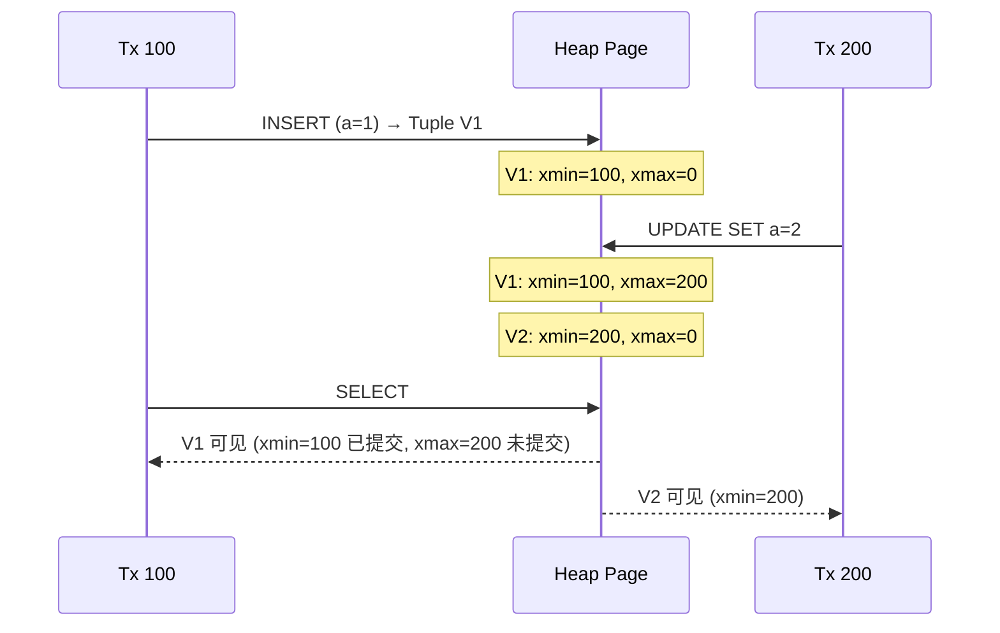
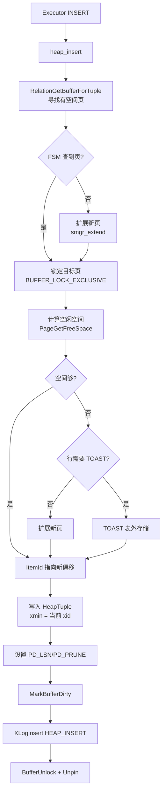
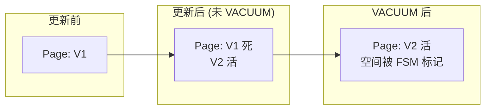
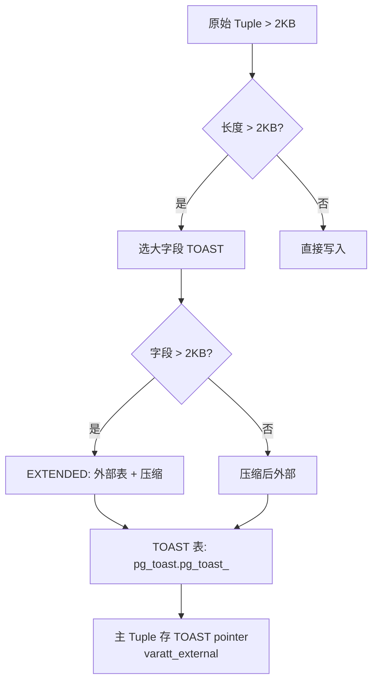
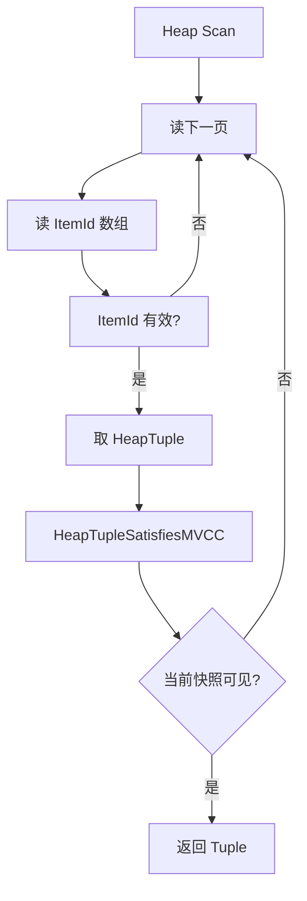

# Heap Table 堆表存储

## 学习目标

- 理解 PostgreSQL Heap 表的物理存储结构与文件组织
- 掌握 Tuple 的版本机制（xmin/xmax/xvac）与行可见性
- 了解 Heap Tuple 的写入、删除、更新在页面内的具体行为

## 核心概念

- **Relation**：一张表或索引的逻辑抽象，由 relfilenode 标识
- **Heap Relation File**：1GB 一个文件（`base/<db>/<relfilenode>` + `.1`、`.2` 等），内部分 8KB 页
- **Tuple**：一行数据的物理表示，含 HeapTupleHeaderData
- **xmin / xmax**：Tuple 头部的两个关键字段，标记创建/删除该版本的事务 ID
- **ItemIdData (Line Pointer)**：指向 Tuple 在页内的物理位置
- **ctid**：Tuple 在表内的物理位置 `(block, item)`
- **TOAST**：超长字段（>2KB）的行外存储机制

## 整体文件布局

PG 把一张 Heap 表切分为多个 1GB 大小的物理文件，文件名形如 `<relfilenode>`、`<relfilenode>.1`、`<relfilenode>.2` 等。每个文件内部是连续的 8KB 页（Page），编号从 0 开始。

每个 Relation 在 Page 0 中持有元数据（`pg_class.relpages`、`relpages`）。PG 也支持 FSM（Free Space Map）和 VM（Visibility Map）作为单独文件存在。

## Tuple 结构

Heap Tuple 在 Page 内由 Header + Data 两段构成：

**关键字段含义**：

| 字段 | 含义 |
|------|------|
| `xmin` | 插入此 Tuple 版本的事务 ID |
| `xmax` | 删除/锁定此 Tuple 的事务 ID（0 表示有效） |
| `t_cid` | 在该事务内的命令 ID（同一事务内的多次更新编号） |
| `t_infomask` | 16 个标志位：HEAP_HASNULL / HEAP_HASVARWIDTH / HEAP_XMIN_COMMITTED / HEAP_XMAX_INVALID 等 |
| `t_hoff` | 头部到数据起始的偏移（保证字段对齐） |

## MVCC 下的行版本

PG 不修改原 Tuple 实现更新，而是写入**新版本**，老版本在 VACUUM 清理：

**核心规则**（详见 `03_transaction/mvcc.md`）：

- Tuple 对当前事务可见 ⟺ `xmin` 已提交 且 `xmax` 未提交或为 0
- `xmax` 删除时不仅记录事务 ID，还配合 `t_infomask` 的 `HEAP_MARKED_FOR_UPDATE` 等标志

## 写入路径

Backend 执行 INSERT 时经过以下步骤：

## 删除与更新

**DELETE** 流程：
1. 找到目标 Tuple，置 `xmax = current_xid`
2. 设置 `t_infomask |= HEAP_MARKED_FOR_UPDATE`（如果是 `SELECT FOR UPDATE`）或 `HEAP_XMAX_EXCL_LOCK`
3. 写入 WAL 记录 `XLOG_HEAP_DELETE`
4. Tuple 物理仍在页面，直到 VACUUM 回收

**UPDATE** 流程：
1. 同 DELETE 的版本：原 Tuple 的 `xmax = current_xid`
2. 调 `heap_insert` 写入新版本（`xmin = current_xid, xmax = 0`）
3. WAL 记录 `XLOG_HEAP_UPDATE` 含新旧 Tuple
4. 老版本在 VACUUM 时被清理

> **关键点**：UPDATE 不修改原数据，而是"原版本+新版本"共存；这就是 PG 没有"update-in-place"的原因。

## 死元组与 VACUUM

MVCC 带来的副作用是**死元组膨胀**：

VACUUM 流程：
1. 扫描找出 `xmin` 已提交、`xmax` 已提交且事务可被回收的 Tuple
2. 标记 FSM 可用空间
3. 更新 VM（visibility map）用于 Index Only Scan

HOT（Heap-Only Tuples）优化：当更新不修改索引列时，新版本与老版本可以放在同一页，省去索引维护开销。

## TOAST（大字段存储）

当 Tuple 总长 > 2KB（实际阈值约 `TOAST_TUPLE_THRESHOLD = 2KB`）时，PG 自动触发 TOAST：

TOAST 有四种策略：
- **PLAIN**：不压缩、不外存（默认）
- **EXTENDED**：先压缩再外存
- **EXTERNAL**：只外存不压缩（适合 F.EXT）
- **MAIN**：压缩不外存（保证主表紧凑）

## 物理扫描与可见性

Heap Scan 需要按 `ctid` 顺序遍历页面，且每个 Tuple 都要做**可见性判断**：

`HeapTupleSatisfiesMVCC` 是性能热点，PG 用 visibility map 缓存页面级可见性，避免逐行判断。

## 与 MySQL InnoDB 的对比

| 维度 | PostgreSQL Heap | InnoDB Clustered Index |
|------|-----------------|------------------------|
| 数据组织 | 堆（无序）+ 索引指向 ctid | 主键聚簇，索引即数据 |
| 顺序性 | 按插入时间聚集（除非 VACUUM FULL） | 按主键排序 |
| 二级索引 | 索引项存 ctid | 索引项存主键值 |
| 行版本 | Heap 多版本 | undo log + read view |
| UPDATE 代价 | 写入新版本 + 老版本待回收 | undo log + 二级索引更新 |
| 主键要求 | 可选 | 强烈推荐（无显式主键时隐式 rowid） |

## 要点总结

- PG 的 Heap 表是**无序堆**，每行带 xmin/xmax 实现多版本
- UPDATE 写入新版本，老版本由 VACUUM 回收（不是覆盖写）
- TOAST 把 >2KB 的字段外存到 pg_toast 表
- 物理扫描 + MVCC 可见性判断是主要性能开销，靠 visibility map 缓存优化
- 与 InnoDB 聚簇索引相比，PG 的设计对**范围扫描 + 高并发更新**更友好

## 思考题

1. PG 的"堆表 + 版本链"和 InnoDB 的"聚簇索引 + undo log"在哪些场景下表现差异最大？
2. 为什么不直接覆盖更新原 Tuple，而要保留多版本？这与"读不阻塞写"的权衡有什么关系？
3. 如果表上有一个频繁更新的字段，会发生什么？如何优化？